# البحث العلمي كممارسة فعالة

## مقدمة

بسم الله والصلاة والسلام على معلم الناس الخير
أما بعد

يُعد البحث العلمي أحد الركائز الأساسية لتقدم المعرفة الإنسانية. ولكن كيف نحول البحث العلمي من مجرد نشاط أكاديمي إلى **ممارسة فعالة** تؤثر في الواقع وتساهم في حل المشكلات؟

**هل الرفاه هو المطلوب أم الحاجة والرغبة في إيجاد حل !!؟**
<!-- more -->

# البحث العلمي: ليس مجرد نشر أوراق

في عالمنا البحثي  والأكاديمي اليوم، غالباً ما يُقاس النجاح البحثي بعدد الأوراق المنشورة ومعامل التأثير، وهذا القياس سطحي وغير معبر. ولكن **البحث الفعال** يتجاوز هذه المقاييس إلى:

- **النية**: كمسلم يجب أن يكون مرجع كل شيء للنيّة؟
- **الأثر الحقيقي**: هل يحل البحث مشكلة واقعية؟
- **القابلية للتطبيق**: هل يمكن استخدام النتائج في الممارسة العملية؟
- **الاستدامة**: هل يبني البحث على معرفة سابقة بشكل تراكمي؟
- **المشاركة**: هل يُشارك الباحثون معرفتهم مع المجتمع العلمي؟

**و العنصر الممكن لها بشكل غريب هو النيّة.**  

## عناصر الممارسة البحثية الفعالة

### 1. التوثيق الدقيق

!!! tip "أفضل الممارسات"
    - **سجل البحث اليومي**:أو كما يسمى كشكول. احتفظ بملاحظات واضحة عن التجارب والنتائج، واقرأها على نفسك و غيرك.
    - **إعادة الإنتاج (Reproducibility)**: وثق كل خطوة بحيث يمكن لآخرين إعادة العمل، و اعتمد على أنك ستعود لما كتبت، فاحرص على الفهم.
    - **الشفافية والصدق**: شارك البيانات والشفرة البرمجية (عندما يكون ممكناً)، ولا تفكر أن تمنع علمك.

### 2. المنهجية المنظمة

البحث الفعال يتطلب:

```mermaid
graph RL
    A[التخطيط<br/>تصميم] --> B[التنفيذ<br/>تجربة]
    B --> C[التحليل<br/>نتائج]
    C --> D[التوثيق<br/>كتابة]
    D --> E[المشاركة<br/>نشر]

    style A fill:#009688
    style B fill:#00BCD4
    style C fill:#009688
    style D fill:#00BCD4
    style E fill:#FF9800
```



### 3. الأدوات الحديثة

نحن في زمن المعلومة في طرف الاصبع. فليس من بعيد كان البحث عن المراجع عملية مضنية و شاقة.
ففي مجال الأحياء المحوسبة و تقنيات المعلومات الحيوية الأدوات الممكنة مهمة مثل

!!! example "أدوات البحث الحديث"
    - **إدارة المراجع**: Zotero, Mendeley
    - **إدارة البيانات**: Git, DVC (Data Version Control)
    - **الحوسبة العلمية**: Jupyter Notebooks, R Markdown
    - **المشاركة**: GitHub, OSF (Open Science Framework)

و بالطبع في كل مجال وحقل علمي ما يهمه والعلم متشعب بشكل كبير.

## التحديات الشائعة

### ❌ الأخطاء الشائعة

1. **عدم التخطيط المسبق** - البدء بالتجارب دون تصميم واضح..ولعل السبب القاتل هنا هو المعرفة السطحية. أو بشكل آخر الفهم الجزئي للمشكلة و حلها. فلا يمكن للباحث التخطيط بشكل جيّد بدون إحاطة مبدئية بالموضوع محل التجربة، وهنا يكمن موضع من مواضع ضعف النفس البشرية و الاستعجال والذي لايزول إلّا بالممارسة والتدريب.  
2. **إهمال التوثيق** - الاعتماد على الذاكرة بدلاً من التوثيق، فالكثير من النتائج تُهمل أو تصبح هامشية لعدم الثقة فيما تم عمله، فالذاكرة لا تخدم الباحث في كثير من الأحيان، خاصة في الزمن الحالي، حيث المشتتات أكثر من أي وقت مضى. 
3. **العزلة البحثية** - العمل منفرداً دون تعاون أو مشاركة، ففي مجال تقنيات المعلومات الحيوية التعاون البحثي أساس لابد منه. فلا يمكن لنا العمل بشكل منفرد عن التخصصات التي نتكامل معها.
4. **تجاهل إعادة الإنتاج** - أن يكون العمل البحثي لايمكن إعادة انتاجه أو لايمكن تكرار النتائج. وهذا من الخلل الكبير في تصميم التجربة أساساً فالعمل البحثي الذي لا يمكن إعادته ليس علمياً.   

### ✅ الحلول المقترحة
يمكن لك كباحث على الأقل أن تتمعن في النقاط التالية التي قد تساعد في جعل الرحلة البحثية أكثر متعة وإنتاجية.


- **ابدأ بسؤال بحثي واضح ومحدد** هذا السؤال يجب أن يكون ناتج عن اطّلاع أو مجموعة بحثية تعمل على ما يثير الفضول وحب الاستزادة في العلم.
- **استخدم أدوات إدارة المشاريع** قد تكون هذه النقطة من أهم الأساسات، فيجب أن يكون لك طريقة بسيطة لترتيب المهام والأسئلة البحثية ، يمكن استخدام دفتر أو ملف أكسل أو الأدوات الحديثة مثل (Notion, Obsidian, Trello)
- **شارك عملك مبكراً وبانتظام** في كل أسبوع أو بجدول منتظم شارك النتائج مع الفريق البحثي شفهيا أو كتابياً.
- **اطلب مراجعة الأقران (Peer Review)**  وهذه الخطوة تؤخذ بحذر وتجرّد فليس الكل يفهم، وليس الكل على وفاق. حاول أن تجعل نصب عينيك العلم والفائدة ولا غير ذلك. 

## الأمور تتضح بالأمثلة: مشروع بحثي في المعلوماتية الحيوية
في مجال الأحياء الحاسوبية،لنفترض أنك تعمل على تحليل بيانات RNA-seq:
   الهدف معرفة كم التعبير الجيني  
=== "❌ الطريقة غير الفعالة"
    ```bash
    # تشغيل الأوامر مباشرة دون توثيق
    fastqc sample1.fastq
    hisat2 -x genome -U sample1.fastq > aligned.sam
    # نسيان التعديلات و المعاملات أو القيود المستخدمة
    # عدم حفظ إصدارات البرمجيات
    ```

=== "✅ الطريقة الفعالة"
    ```bash
    # استخدام سير عمل موثق (Workflow)
    # مثلاً: Snakemake أو Nextflow

    # ملف: workflow/Snakefile
    rule fastqc:
        input: "data/{sample}.fastq"
        output: "results/qc/{sample}_fastqc.html"
        log: "logs/fastqc/{sample}.log"
        conda: "envs/qc.yaml"
        shell:
            "fastqc {input} -o results/qc/ 2> {log}"

    # كل شيء موثق: الإدخال، الإخراج، البيئة، السجلات
    ```

## الخلاصة
  
البحث العلمي الفعال يتطلب:


1. **النيّة** - قبل قبل البدء
2.  **التخطيط** - قبل البدء
3.  **التوثيق** - أثناء العمل
4.  **التحليل الدقيق** - عند معالجة النتائج
5.  **المشاركة** - بعد الانتهاء
6.  **التعلم المستمر** - طوال الرحلة

---

## للمزيد من القراءة

- [Ten Simple Rules for Reproducible Computational Research](https://journals.plos.org/ploscompbiol/)
- [The Turing Way: A Handbook for Reproducible Research](https://the-turing-way.netlify.app/)
- [Open Science Framework](https://osf.io/)

---

**ملاحظة**: هذا المنشور في مرحلة المسودة. سيتم تحديثه بمزيد من التفاصيل والأمثلة العملية.

---

[🌐 Read in English](/en/blog/) | [← العودة إلى المدونة](/ar/blog/)
