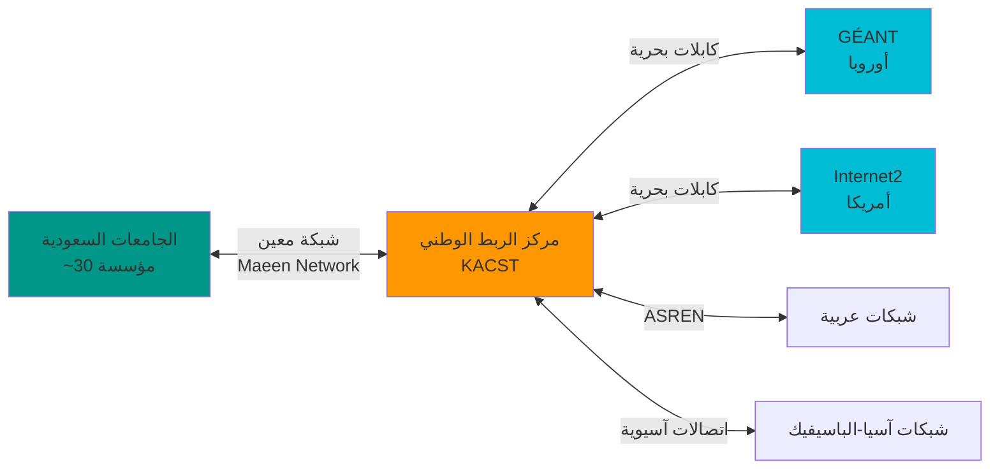
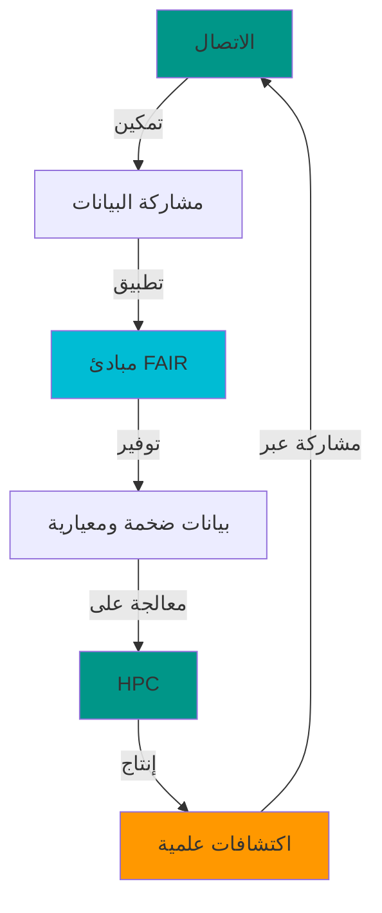
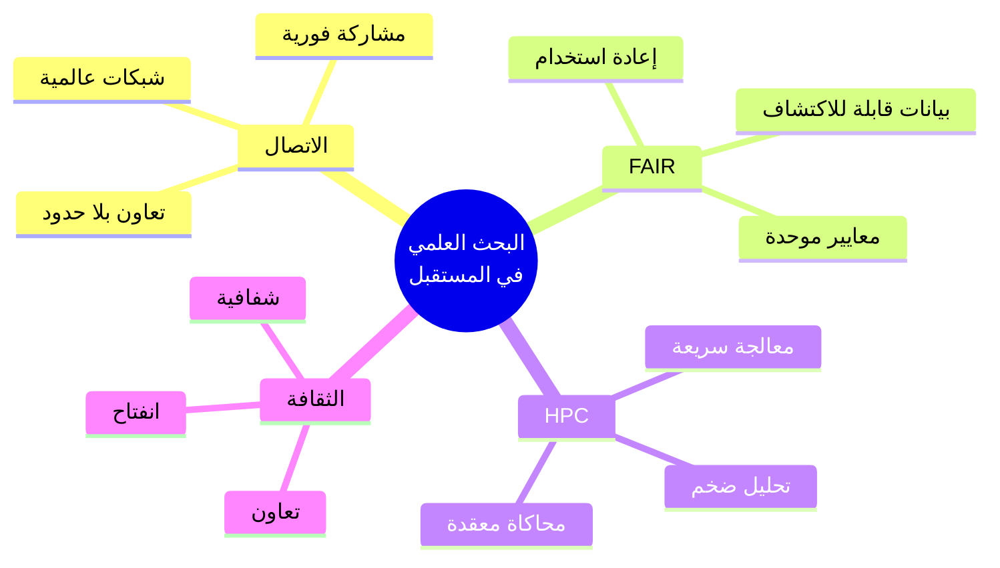

# الاتصال والبيانات المفتوحة والحوسبة الفائقة: قوى البحث في العصر الحديث

## مقدمة: أهمية الاتصال ومشاركة البيانات كمحرك للبحث والتطوير 

بسم الله والصلاة والسلام على معلم الناس الخير

أما بعد

في عصرنا الحالي، نشهد تحولاً جذرياً في طبيعة البحث العلمي والوصول للموارد البحثية. لم يعد البحث نشاطاً منعزلاً يقوم به فرد في معمله المنفرد، أو في معزل عن العالم، بل أصبح نظاماً بيئياً متكاملاً يعتمد على ثلاث ركائز أساسية خصوصا بما يتعلق بالعلوم التطبقية والطبية:
**الاتصال (Connectivity)**، **البيانات المفتوحة والقابلة للتشغيل البيني أو الفهم و التأويل والأتمة (FAIR Data)**، و**الحوسبة الفائقة الأداء (HPC)**.

لكن هذا التحول يطرح أسئلة جوهرية:

- **لماذا أصبحت هذه العناصر الثلاثة ضرورية؟**
- **كيف تدفعنا نحو المستقبل؟**
- **ما هي التحديات الثقافية الجديدة التي نواجهها؟**

في هذا المقال، نستقصي علمياً هذه الأسئلة ونحاول فهم القوى الدافعة للبحث العلمي في العصر الحديث.

<!-- more -->

## الركيزة الأولى: الاتصال - شبكات البيانات والباحثين

### لماذا الاتصال؟

في الماضي، كان العلماء يعملون في عزلة نسبية فلم تكن القدرة على التواصل سريعة أو آنية، كانت تأخذ وقتا أطول من اليوم وتفتقر لمثريات كثيرة متواجدة اليوم في عصرنا. قد يستغرق نشر اكتشاف علمي سنوات، ومشاركة البيانات كانت محدودة بالقيود المادية (الأوراق، الأشرطة المغناطيسية، الأقراص).

**اليوم، الاتصال غيّر كل شيء:**


!!! note "الاتصالية في الأرقام"
    - **GenBank**: تحوي كم هائل من تسلسلات الحمض النووي وغيره من البيانات الحيوية
    - **Protein Data Bank (PDB)**: أكثر من 200,000 بنية ثلاثية الأبعاد للبروتينات
    - **NCBI**: أكثر من 3 مليون مقال علمي متاح عبر PubMed Central
    - **كل هذه البيانات متاحة عبر الإنترنت فوراً**

### الاتصال يمكّن التعاون الحقيقي

!!! example "مثال واقعي: مشروع الجينوم البشري"
    **مشروع الجينوم البشري (1990-2003)**:

    - شارك فيه **20 مركزاً بحثياً** من 6 دول
    - تم **مشاركة البيانات يومياً** عبر الإنترنت
    - النتيجة: فك شفرة 3 مليارات زوج قاعدي في 13 سنة

    **اليوم** (بفضل الاتصال + HPC):

    - يمكن قراءة جينوم بشري كامل في **أقل من يوم**
    - التكلفة انخفضت من **3 مليارات دولار** إلى **أقل من 1000 دولار**
    - البيانات تُشارك فوراً عبر منصات مثل **ENA** و **SRA**

### الشبكات العلمية: من الاتصال إلى التعاون

الاتصال لا بعني فقط الإنترنت السريع، بل يعني:

=== "شبكات البيانات"
    - **قواعد البيانات الموزعة**: UniProt, Ensembl, NCBI
    - **واجهات برمجية (APIs)**: REST APIs للوصول الآلي
    - **بروتوكولات موحدة**: HTTP, FTP, rsync
    - **تكامل البيانات**: Linked Data, Knowledge Graphs

=== "شبكات الباحثين"
    - **منصات التعاون**: GitHub, GitLab, OSF
    - **المنشورات المفتوحة**: bioRxiv, arXiv
    - **المجتمعات العلمية**: Stack Overflow, ResearchGate
    - **المؤتمرات الافتراضية**: Zoom, Teams, Webinars

=== "شبكات الحوسبة"
    - **الحوسبة السحابية**: AWS, Google Cloud, Azure
    - **الحوسبة الموزعة**: Galaxy, Terra.bio
    - **الشبكات الأكاديمية**: GÉANT, Internet2
    - **نقل البيانات عالي السرعة**: GridFTP, Aspera

و هنا أطرح سؤال بسيط: **ما هو موقعنا البحثي من هذا الزخم البياناتي ونحن نشهد أفضل ثورة رقمية وبياناتية في المملكة**
---

## الركيزة الثانية: البيانات المفتوحة والقابلة للتشغيل البيني (FAIR)

### ما هي مبادئ FAIR؟

في عام 2016، نُشرت **مبادئ FAIR** في مجلة Nature Scientific Data. هذه المبادئ تحدد كيف يجب أن تكون البيانات العلمية:

!!! info "مبادئ FAIR الأربعة"
    **F**indable (قابلة للاكتشاف)

    - لكل مجموعة بيانات معرف فريد دائم (DOI, URI)
    - البيانات موصوفة بميتاداتا غنية (بيانات وصفية)
    - الميتاداتا مسجلة في فهارس قابلة للبحث

    **A**ccessible (قابلة للوصول)

    - يمكن استرجاع البيانات عبر بروتوكولات معيارية ومفتوحة
    - الميتاداتا متاحة حتى لو كانت البيانات محمية
    - الوصول موثق بوضوح (مفتوح، محمي، سري)

    **I**nteroperable (قابلة للتشغيل البيني)

    - البيانات تستخدم لغات ومعايير رسمية
    - الميتاداتا تحتوي على مراجع لمجموعات بيانات أخرى
    - استخدام مفردات محكومة (Controlled Vocabularies)

    **R**eusable (قابلة لإعادة الاستخدام)

    - البيانات موصوفة بدقة
    - ترخيص واضح للاستخدام
    - مصدر البيانات موثق
    - تتوافق مع معايير المجال العلمي

### لماذا FAIR ضرورية؟

!!! warning "مشكلة البيانات غير القابلة لإعادة الاستخدام"
    دراسة في 2018 قدّرت أن:

    - **80% من البيانات العلمية المنشورة لا يمكن إعادة استخدامها**
    - **الخسارة السنوية**: أكثر من **10 مليارات دولار** من التمويل البحثي المهدور
    - **السبب**: بيانات غير موثقة، غير موحدة، غير متاحة

    **FAIR تحل هذه المشكلة**

### مثال عملي: من البيانات "المخفية" إلى FAIR

=== "❌ قبل FAIR"
    ```
    # بيانات مخزنة في ملف Excel على جهاز الباحث
    sample1.xlsx
    - لا يوجد معرف فريد
    - لا توجد ميتاداتا
    - لا يمكن الوصول إليها بعد انتهاء المشروع
    - تنسيق خاص (Excel 2003)
    - لا يوجد ترخيص واضح

    النتيجة: بيانات "ميتة" بعد النشر
    ```

=== "✅ بعد FAIR"
    ```yaml
    # بيانات منشورة في مستودع FAIR (مثل Zenodo)
    dataset:
      doi: 10.5281/zenodo.1234567  # معرف دائم
      title: "RNA-seq data for Arabidopsis under drought stress"
      creators:
        - name: "Mohammed Salem"
          orcid: "0000-0002-1234-5678"
      description: |
        RNA-seq data from Arabidopsis thaliana exposed to
        drought stress for 24h, 48h, 72h.
      keywords: [RNA-seq, Arabidopsis, drought, stress]
      format: FASTQ (gzipped)
      license: CC-BY-4.0
      related_publications:
        - doi: 10.1234/journal.2024.001
      metadata_standard: ISA-Tab
      repository: European Nucleotide Archive
      accession: PRJEB12345

    النتيجة: بيانات قابلة للاكتشاف والاستخدام إلى الأبد
    ```

### FAIR في المعلوماتية الحيوية

في مجال المعلوماتية الحيوية، FAIR أصبحت المعيار:

| المورد | كيف يطبق FAIR |
|---------|---------------|
| **GenBank/ENA** | معرفات فريدة (Accession)، API للوصول، تنسيق معياري (FASTA, GenBank) |
| **UniProt** | معرفات UniProt، Linked Data (RDF)، مفردات محكومة (GO, EC) |
| **PDB** | PDB IDs، تنسيق معياري (mmCIF)، ميتاداتا غنية |
| **ArrayExpress** | MIAME-compliant، ISA-Tab، ترخيص مفتوح |
| **Zenodo** | DOIs، ميتاداتا Dublin Core، تنسيقات مفتوحة |

---
**السؤال الثاني، هل يوجد حراك علمي سعودي لانشاء مستودع بحثي ينهج منهجية البيانات العادلة FAIR بحيث يصبح معين للباحثين، ويرفع من قيمة الاستثمار الأولى في البحث؟**

## الركيزة الثالثة: الحوسبة الفائقة الأداء (HPC)

### لماذا نحتاج HPC؟

تخيل أنك تريد تحليل جينوم بكتيريا واحدة:

```python
# جينوم E. coli: ~4.6 مليون زوج قاعدي
genome_size = 4_600_000

# مقارنة بجميع البروتينات المعروفة (UniProt: ~230 مليون تسلسل)
num_proteins = 230_000_000

# باستخدام BLAST
# تقريباً: 10^15 عملية مقارنة (petaflops)

# على جهاز شخصي (100 GFLOPS): ~115 يوم
# على HPC (10 PFLOPS): ~1.7 دقيقة
```

!!! success "HPC تجعل المستحيل ممكناً" الحوسبة فائقة الأداء ليس ترفا في هذا السياق.
    **بدون HPC**: تحليل جينوم واحد يستغرق أشهر

    **مع HPC**: تحليل آلاف الجينومات في ساعات

### ما هي الحوسبة الفائقة؟

الحوسبة فائقة الأداء

High Performance Computing

HPC تعني:
بعض الترجمات تستخدم مصطلح الحوسبة العنقودية للاستزادة من ويكي بيديا.
[[https://ar.wikipedia.org/wiki/%D8%B9%D9%86%D9%82%D9%88%D8%AF_(%D8%AD%D9%88%D8%B3%D8%A8%D8%A9)]]
=== "العتاد (Hardware)" الخادم أو عقدة في عنقود node in a cluster 
    - **آلاف المعالجات** تعمل بالتوازي
    - **ذاكرة ضخمة**: تيرابايتات من RAM للوصول العشوائي
    - **تخزين سريع**: Petabytes مع I/O عالي السرعة - وهي مهمة في مجال الأحياء
    - **شبكات عالية السرعة**: InfiniBand (100+ Gbps)


=== "البرمجيات (Software)"
    - **أنظمة تشغيل متخصصة**: Linux clusters
    - **جدولة المهام**: SLURM, PBS, SGE
    - **مكتبات متوازية**: MPI, OpenMP, CUDA
    - **إدارة البيئات**: Conda, Singularity, Docker

=== "الخوارزميات (Algorithms)"
    - **خوارزميات متوازية**: تقسيم المهام
    - **تحسين الأداء**: Profiling, Benchmarking
    - **معالجة البيانات الضخمة**: MapReduce, Spark
    - **التعلم العميق**: GPU acceleration


### مثال واقعي: دراسة جينومية لـ 10,000 مشارك - التكلفة والخصوصية

**مثال مشروع الجينوم البشري**

!!! example "مشروع دراسة الأمراض الوراثية في مجموعة بشرية كبيرة"
    **السيناريو**: دراسة جينومية لـ **10,000 شخص** لفهم الأمراض الوراثية النادرة في مجتمع معين

    **البيانات**:

    - **حجم البيانات الخام**: ~300 TB (30 GB لكل جينوم × 10,000)
    - **البيانات المعالجة**: ~50 TB (ملفات VCF، BAM)
    - **الميتاداتا**: معلومات سريرية، تاريخ عائلي، أنماط ظاهرية

    **التكلفة الحوسبية للتحليل الأولي**:


    === "بدون HPC (مستحيل عملياً)"
        ```yaml
        السيناريو الافتراضي:
          - جهاز واحد: 32 cores، 256 GB RAM
          - وقت معالجة جينوم واحد: ~48 ساعة
          - إجمالي الوقت: 10,000 × 48 ساعة = 480,000 ساعة
          - بالأيام: ~55 سنة (متواصلة!)

        المشكلة: غير عملي تماماً
        ```

    === "مع HPC"
        ```yaml
        الحل الواقعي:
          - نظام HPC: 1,000 cores متوازية
          - وقت تحليل البيانات : ~3 أسابيع
          - التكلفة: ~190,000-380,000 ريال (استخدام HPC + تخزين)

        الفائدة: نتائج في أسابيع بدلاً من عقود
        ```

    **تكلفة إعادة الحوسبة - لماذا نتجنبها؟**:

    !!! warning "السيناريوهات التي تتطلب إعادة الحوسبة"
        **1. خطأ في سير العمل (Workflow Error)**
        ```
        مثال: اكتشاف خطأ في التحليل بعد شهر 
        خطأ في جودة الفلترة:
        gatk VariantFiltration --filter "QD < 2.0"  # يجب أن يكون 5.0!

        النتيجة:
        - إعادة تحليل كامل: 3 أسابيع إضافية
        - تكلفة إضافية: 150 الف ريال 
        - تأخير النشر: شهور
        ```

        **2. تحديث البرمجيات أو قواعد البيانات**
        ```yaml
        السيناريو:
          - تم التحليل باستخدام GRCh37 (الجينوم المرجعي القديم)
          - الآن GRCh38 هو المعيار
          - إعادة المحاذاة واستدعاء المتغيرات ضرورية Variants calling

        التكلفة:
          - حوسبة: 150,000-100,000
          - وقت الفريق البحثي: 2-3 أشهر
          - تكلفة الفرصة البديلة: تأخير مشاريع أخرى
        ```

        **3. اكتشاف عينات ملوثة أو منخفضة الجودة**
        ```yaml
        المشكلة:
          - بعد 6 أشهر، اكتشاف أن 500 عينة ملوثة
          - يجب إزالتها وإعادة التحليل الإحصائي

        التكلفة:
          - ليس إعادة التسلسل، لكن إعادة التحليل البيوإحصائي
          - وقت: 2-4 أسابيع
          - تكلفة: 90,000-20,000
        ```

    **قيمة الحوسبة الصحيحة من المرة الأولى**:

    === "التخطيط المسبق"
        - **توثيق سير العمل** (Workflow documentation)
        - **اختبار على عينة صغيرة** (n=100) قبل المعالجة الكاملة
        - **مراجعة للمنشور علميا** للبرمجيات والمعاملات
        - **نقاط ضبط جودة (Checkpoints)** في سير العمل

    === "الحوسبة القابلة لإعادة الإنتاج"
        ```bash
        # استخدام أدوات سير العمل (Workflow managers)
        # مثال: Snakemake

        rule all:
            input:
                "results/final_variants.vcf.gz"

        rule align_reads:
            input:
                fastq="data/{sample}.fastq.gz"
            output:
                bam="aligned/{sample}.bam"
            conda: "envs/alignment.yaml"  # بيئة محددة
            params:
                ref="GRCh38"  # موثق
            shell:
                "bwa mem {params.ref} {input.fastq} | "
                "samtools sort -o {output.bam}"

        # الفائدة:
        # - كل خطوة موثقة
        # - يمكن إعادة التشغيل من أي نقطة
        # - بيئات محددة (إصدارات البرمجيات)
        # - توفير 80% من وقت إعادة الحوسبة
        ```

    **خصوصية البيانات - التحدي الأكبر**:

    !!! danger "مخاطر البيانات الجينومية البشرية"
        **لماذا الخصوصية حاسمة؟**

        - **تعريف شخصي**: الجينوم يحدد هويتك بدقة 100%
        - **معلومات عائلية**: تكشف عن أقاربك (آباء، أبناء، أخوة)
        - **أمراض وراثية**: قد تؤثر على التأمين أو التوظيف
        - **لا يمكن تغييره**: كلمة مرور يمكن تغييرها، جينومك لا!

    **استراتيجيات حماية الخصوصية في HPC**:

    === "التشفير والتحكم بالوصول"
        ```yaml
        مستويات الأمان:

          1. التشفير أثناء النقل:
             - TLS/SSL لنقل البيانات
             - SSH للوصول الآمن
             - VPN للشبكات الخاصة

          2. التشفير أثناء التخزين:
             - تشفير الأقراص (LUKS، BitLocker)
             - تشفير قواعد البيانات
             - مفاتيح التشفير منفصلة

          3. التحكم بالوصول:
             - مصادقة متعددة العوامل (MFA)
             - صلاحيات محدودة (Least Privilege)
             - تسجيل جميع الوصولات (Audit Logs)

          4. المناطق الآمنة (Secure Enclaves):
             - بيانات حساسة في أنظمة معزولة
             - لا اتصال بالإنترنت
             - نقل البيانات يدوياً بعد الموافقة
             
          5. الحوسبة الآمنة (Secure compute):
             - بيئة حوسبية سحابية آمنة لايمكن فيها نقل أو الوصول للبيانات الحساسة
             - لا اتصال بالإنترنت
             - البيانات و العمليات تخضع لسجل توثيق للعمليات
        ```

    === "إخفاء الهوية (De-identification)"
        ```python
        # إزالة المعلومات الشخصية المباشرة

        # ❌ بيانات قبل إخفاء الهوية (خطر!)
        sample_data = {
            'name': 'أحمد محمد علي',
            'national_id': '1234567890',
            'birthdate': '1990-05-15',
            'address': 'الرياض، حي النخيل',
            'genome_file': 'ahmad_genome.vcf'
        }

        # ✅ بيانات بعد إخفاء الهوية
        anonymized_data = {
            'sample_id': 'SA-COHORT-10234',  # معرف عشوائي
            'age_range': '30-35',  # بدلاً من تاريخ الميلاد
            'region': 'Central',  # بدلاً من العنوان الدقيق
            'genome_file': '10234_genome.vcf'
        }

        # الربط بين المعرف والهوية الحقيقية
        # يُحفظ في نظام منفصل، مشفر، مع وصول محدود جداً
        ```

    === "الحوسبة الفدرالية (Federated Computing)"
        ```mermaid
        graph TB
            A[مركز الرياض<br/>2000 عينة] --> D[النتائج المجمعة<br/>إحصائيات فقط]
            B[مركز جدة<br/>3000 عينة] --> D
            C[مركز الدمام<br/>5000 عينة] --> D

            D --> E[النشر العلمي<br/>بدون بيانات خام]

            style A fill:#009688
            style B fill:#009688
            style C fill:#009688
            style D fill:#FF9800
            style E fill:#00BCD4
        ```

        **المفهوم**:
        - البيانات الخام لا تغادر المركز الأصلي
        - يتم حساب الإحصائيات محلياً
        - فقط النتائج المُجمعة تُشارك
        - **الخصوصية محفوظة** + **التعاون ممكّن**

    === "الموافقة المستنيرة والحوكمة"
        !!! success "أفضل الممارسات"
            **1. الموافقة المستنيرة**:
            - شرح واضح للمشاركين عن استخدام بياناتهم
            - حق الانسحاب في أي وقت
            - شفافية في من يصل للبيانات

            **2. لجان الأخلاقيات**:
            - موافقة مسبقة على استخدام البيانات
            - مراجعة دورية
            - عقوبات على سوء الاستخدام

            **3. السياسات الوطنية**:
            - قوانين حماية البيانات الوراثية
            - تنظيم مشاركة البيانات الدولية
            - حقوق الملكية الفكرية

    **القيمة العلمية والطبية**:

    !!! success "الفوائد التي تبرر التكلفة والمخاطر"
        **ماذا نكتسب من هذا المشروع؟**

        1. **اكتشاف متغيرات جينية جديدة**:
           - متغيرات نادرة مرتبطة بأمراض محلية
           - فهم الأساس الجيني للأمراض المعقدة

        2. **الطب الشخصي**:
           - جرعات أدوية مخصصة بناءً على الجينوم
           - تجنب الأدوية التي قد تسبب آثار جانبية

        3. **الوقاية المبكرة**:
           - تحديد الأفراد عالي الخطورة
           - برامج فحص مستهدفة

        4. **تطوير أدوية جديدة**:
           - أهداف دوائية جديدة (Drug targets)
           - تجارب سريرية أكثر فعالية

        **التكلفة-الفائدة**:
        ```yaml
        الاستثمار المتوقع:
          - التحليل الجينومي: 1-2 مليون ريال
          - البنية التحتية: 2-3 مليون ريال
          - الفريق البحثي (3 سنوات): 3-5 مليون ريال
          - الإجمالي: 6-10 مليون ريال تقريباً

        الفوائد المحتملة:
          - علاج أفضل لـ 10,000 مريض: لا يُقدر بثمن
          - توفير في تكاليف الرعاية الصحية: عشرات الملايين
          - تطوير دواء واحد: مليارات الريالات محتملة
          - معرفة علمية: تفيد الأجيال القادمة
        ```

    **الدروس المستفادة**:

    1. ✅ **HPC ضرورية** - لا يمكن إجراء دراسات جينومية كبيرة بدونها ، فهذا المورد ممكن و جوهري
    2. ✅ **التخطيط يوفر المال** - التكلفة الأولى أقل من تكلفة إعادة الحوسبة.
    3. ✅ **الخصوصية أولوية** - البيانات الجينومية تتطلب حماية قصوى، ولا يمكن التهاون فيها
    4. ✅ **التعاون ممكن بأمان** - الحوسبة الفدرالية تحل معضلة المشاركة و التعاون المؤتمت.
    5. ✅ **القيمة طويلة المدى** - الاستثمار في البنية التحتية يفيد لعقود، فالمستقبل للبيانات.

---


### HPC في المعلوماتية الحيوية

| التطبيق | متطلبات HPC | الفائدة |
|---------|-------------|---------|
| **تسلسل الجينوم** | 100+ cores، 500GB RAM | تجميع الجينوم في ساعات بدلاً من أسابيع |
| **محاذاة التسلسلات** | 1000+ cores | مقارنة ملايين التسلسلات بالتوازي |
| **التحليل الفيلوجيني** | 500+ cores | بناء أشجار لآلاف الأنواع |
| **التنبؤ ببنية البروتين** | GPUs (V100/A100) | AlphaFold، RoseTTAFold |
| **التعلم الآلي** | Multi-GPU | تدريب نماذج على ملايين البيانات |
| **المحاكاة الجزيئية** | 1000+ cores | محاكاة ميكروثانية من ديناميكا البروتين |

---

## السياق الوطني: الاتصال والبنية التحتية البحثية في المملكة العربية السعودية

### رؤية 2030 والتحول الرقمي

المملكة العربية السعودية تسير بخطى واثقة نحو بناء بنية تحتية بحثية عالمية المستوى، متماشية مع **رؤية 2030** وأهدافها في التحول الرقمي واقتصاد المعرفة. بدون هذه الأسس تعتبر الممارسات البحثية طاقة مشتته. فلابد من ترجمة المجهودات البحثية واستيعابها في قواعد بيانات وأرشيف بحثي وطني، خصوصا تلك البيانات التي لايمكن إعادتها أو توليدها من جديد، على سبيل المثال بعيدا عن الأحياء والمعلوماتية الحيوية، فالتلوث البيئي في فترة حرب الخليج وكل الدراسات التي تمت عليه لايمكن إعادتها بأي حال فالضرر حصل، ويبقى السؤال كيف كان الحال وأين صار؟! 

وهنالك الكثير من البيانات الثمينة التي لا يمكن إعادتها. 

مثال آخر، الممرضات و تسلسل المورثات لها اليوم مهم للمستقبل و فهم التنوع و التفشي. في نفس الوقت يمكن القطاعات الأخرى عند مشاركة البيانات في فهم الصورة الأكبر. 

**أسس النجاح**

!!! info "الركائز الأساسية للبنية التحتية البحثية السعودية"
    **1. شبكة معين للبحث والابتكار (Maeen Network)**
    
    
    - **التأسيس**: أطلقها مدينة الملك عبدالعزيز للعلوم والتقنية (KACST) في ديسمبر 2017
    - **السرعة**: شبكة ألياف بصرية فائقة السرعة (حتى 100 Gbps)
    - **التغطية**: تربط **~30 جامعة ومركز بحثي** سعودي
    - **الاتصال العالمي**: متصلة بأكثر من **90,000 مؤسسة بحثية** عالمية
    - **الشبكات الدولية**: اتصال مباشر بـ GÉANT (أوروبا) و Internet2 (أمريكا)
    - **الشبكة العربية**: عضو في شبكة الدول العربية للبحث والتعليم (ASREN)
    - **الخدمات**: نقل البيانات الضخمة، محاكاة قطاع الطاقة، التعاون البحثي الدولي
    - **الموقع الرسمي**: [www.maeen.sa](https://www.maeen.sa/en/)


    **2. الحوسبة الفائقة الوطنية**


    - **شاهين (Shaheen)** في جامعة الملك عبدالله (KAUST)
    - **عزيز** في جامعة الملك عبدالعزيز بجدة
    - مجموعة حواسيب أرامكو السعودية (اعتقد مغلقة) و اكبرهم عددا و عدة
    - مراكز بيانات حديثة في الجامعات الكبرى

    **3. مبادرات البيانات المفتوحة**

    - **الهيئة السعودية للبيانات والذكاء الاصطناعي (SDAIA)**
    - **المنصة الوطنية الموحدة للبيانات المفتوحة**
    - مبادرات مشاركة البيانات البحثية في الجامعات

### حاسوب شاهين (Shaheen): قوة حوسبة عالمية

!!! example "شاهين - واحد من أقوى الحواسيب الفائقة في العالم"
    **المواصفات التقنية** (Shaheen III - 2023):

    ```yaml
    الأداء:
      - المُصنّع: HPE (Hewlett Packard Enterprise)
      - المعالجات: AMD EPYC 9654 (96 نواة @ 2.4 GHz)
      - عدد الأنوية الإجمالية: 877,824 core
      - قدرة حوسبية (Rmax): 35.66 Petaflops
      - القدرة النظرية (Rpeak): 39.61 Petaflops
      - استهلاك الطاقة: 5,301 كيلووات
      - الشبكة الداخلية: HPE Slingshot-11
      - نظام التشغيل: HPE Cray OS

    الترتيب العالمي:
      - المرتبة #52 عالمياً (TOP500 - نوفمبر 2025)
      - الأول في الشرق الأوسط وشمال أفريقيا
      - يخدم أكثر من 300 باحث سنوياً

    التطبيقات:
      - المعلوماتية الحيوية: تحليل الجينوم، AlphaFold
      - النمذجة المناخية: محاكاة الطقس والمناخ الإقليمي
      - علوم المواد: تصميم مواد جديدة
      - الطاقة: محاكاة المكامن النفطية
      - الذكاء الاصطناعي: تدريب النماذج الكبيرة

    المصدر: https://top500.org/system/180179/
    ```

    **التأثير البحثي**:
    - **أكثر من 500 ورقة علمية** منشورة باستخدام شاهين
    - **تعاونات دولية** مع مؤسسات بحثية عالمية
    - **تدريب الباحثين** السعوديين على HPC
    - **مشاريع وطنية** في الصحة والطاقة والبيئة

### الاتصال الإقليمي والدولي

السعودية تلعب دوراً محورياً في ربط المنطقة بالشبكات البحثية العالمية  :
ولا يمكن إغفال دور الاتصال البيني البحثي في رفع الكفاءة البحثية. فكما ذكرت سابقا يعلب الاتصال أهم دور فبدونه ليس للحوسبة أثر. وعلى الرغم من وجود شبكة معين ودورها المهم إلا أن الوصول العلمي يجب أن ينهج اسلوب التحالفات البحثية لتقليل تكلفة الربط، فما تزال التكلفة لبعض الجامعات الناشئة أو الصغيرة عبء مالي. 




لم أعرض الربط والاتصال في جامعة الملك عبدالله للعلوم والتقنية فالجامعة لها اتصال دولي لطبيعة المهام البحثية فيها بشكل مستقل. 


!!! success "فوائد الاتصالية الوطنية"
    ✅ **سرعة نقل البيانات**: تبادل مجموعات بيانات ضخمة (تيرابايتات) في ساعات

    ✅ **التعاون الدولي**: مشاركة في مشاريع عالمية (Human Cell Atlas، 1000 Genomes)

    ✅ **الوصول للموارد**: استخدام قواعد البيانات العالمية بسرعات عالية

    ✅ **المؤتمرات الافتراضية**: استضافة وحضور مؤتمرات بجودة عالية


### مبادرات FAIR في السعودية

الجامعات والمراكز البحثية السعودية بدأت في تبني مبادئ FAIR:

=== "التحديات المحلية"
    ️ **ثقافة المشاركة**:
    - لا تزال ثقافة مشاركة البيانات البحثية في مراحلها الأولى
    - حاجة لحوافز مؤسسية للباحثين

    ️ **البنية التحتية**:
    - ليس لكل الجامعات مستودعات بيانات FAIR
    - حاجة للتدريب على معايير البيانات

    ️ **السياسات**:
    - حاجة لسياسات وطنية موحدة لإدارة البيانات البحثية
    - وضوح أكبر في قضايا الخصوصية والملكية الفكرية

### الفرص المستقبلية

!!! tip "كيف يمكن تعزيز البنية التحتية البحثية في السعودية؟"
    **1. توسيع الاتصال**:
    - توسيع تغطية شبكة معين لتشمل جميع الجامعات والمراكز البحثية
    - زيادة السرعة للمؤسسات الكبرى (200-400 Gbps)
    - ربط مباشر بمراكز بيانات عالمية (EMBL-EBI، NCBI)

    **2. تعزيز HPC**:
    - بناء مراكز HPC إقليمية (شمال، جنوب، شرق، غرب)
    - حوسبة سحابية للباحثين (Cloud credits)
    - GPUs للذكاء الاصطناعي والتعلم العميق

    **3. تطبيق FAIR بشكل شامل**:
    - مستودع بيانات وطني موحد
    - سياسة إلزامية للبيانات المفتوحة (للأبحاث الممولة حكومياً)
    - تدريب الباحثين على إدارة البيانات البحثية
    - حوافز للباحثين الذين يشاركون بياناتهم

    **4. بناء القدرات**:
    - برامج تدريبية على HPC
    - دورات في علم البيانات والمعلوماتية الحيوية
    - منح دراسية لتخصصات البيانات الضخمة

    **5. التعاون الإقليمي**:
    - شبكة خليجية للبحث والتعليم
    - مشاريع بحثية مشتركة عربية
    - مشاركة موارد HPC بين الدول العربية

---

## كيف تدفعنا هذه القوى نحو المستقبل؟

### التكامل بين الاتصال، البيانات الممكنة ، و الحوسبة فائقة الأداء

هذه القوى الثلاث لا تعمل منفردة، بل **تتكامل**:



!!! success "دورة الابتكار العلمي"
    1. **الاتصال** تمكن مشاركة البيانات عالمياً
    2. **FAIR** تضمن أن البيانات قابلة للاستخدام والتشغيل البيني
    3. **HPC** تعالج هذه البيانات الضخمة بسرعة
    4. **النتائج** تُشارك مرة أخرى عبر الشبكات
    5. **الدورة تتكرر** - تسارع الاكتشافات

### أمثلة واقعية على التكامل

#### مثال 1: مشروع COVID-19 Genomics

```yaml
التحدي: تتبع تطور فيروس SARS-CoV-2 عالمياً

الحل المتكامل:
  - الاتصالية:
      - تسلسلات الجينوم تُرفع يومياً من مئات الدول
      - مشاركة فورية عبر GISAID و GenBank
      - تحديثات في الوقت الحقيقي

  - FAIR:
      - كل تسلسل له معرف فريد (Accession)
      - ميتاداتا موحدة (التاريخ، الموقع، السلالة)
      - تنسيق معياري (FASTA)
      - ترخيص واضح (CC-BY)

  - HPC:
      - محاذاة ملايين التسلسلات بالتوازي
      - بناء أشجار فيلوجينية ضخمة
      - تحليل الطفرات والمتحورات
      - نمذجة الانتشار

النتيجة:
  - تحديد متحورات جديدة في أيام بدلاً من أشهر
  - فهم انتشار الفيروس عالمياً
  - توجيه تطوير اللقاحات
  - إنقاذ ملايين الأرواح
```

#### مثال 2: Human Cell Atlas

!!! example "خريطة جميع خلايا الجسم البشري"
    **الهدف**: رسم خريطة تفصيلية لجميع أنواع الخلايا في الجسم البشري

    **حجم المشروع**:

    - **~37 تريليون خلية** في جسم الإنسان
    - **تسلسل RNA أحادي الخلية** لملايين الخلايا
    - **بيانات**: عشرات الـ petabytes
    - **باحثون**: آلاف من أكثر من 70 دولة

    **كيف يعمل التكامل**:

    === "الاتصالية"
        - **شبكة عالمية** من المختبرات
        - **بوابة موحدة** للبيانات (data.humancellatlas.org)
        - **تحديثات مستمرة** للبيانات الجديدة

    === "FAIR"
        - **معايير موحدة** للميتاداتا
        - **DOIs** لكل مجموعة بيانات
        - **تنسيقات معيارية** (h5ad, Zarr)
        - **مفردات محكومة** لأنواع الخلايا

    === "HPC"
        - **تحليل ملايين الخلايا** بالتوازي
        - **خوارزميات تجميع** (Clustering) على GPUs
        - **تصور البيانات** في أبعاد عالية
        - **تكامل البيانات** من مصادر متعددة

---

## التحديات الثقافية الجديدة

### من الانغلاق إلى الانفتاح

التكنولوجيا وحدها لا تكفي. نحتاج إلى **تحول ثقافي** في كيفية ممارسة البحث، يوجد مقال لهذا.

!!! warning "العقبات الثقافية الحالية"
     **ثقافة "انشر أو اختفي"** (Publish or Perish)

    - التركيز على **عدد الأوراق** بدلاً من **جودة البحث**
    - **حجب البيانات** حتى النشر لتجنب المنافسة
    - **عدم مشاركة الفشل** - فقط النجاحات تُنشر

     **الانعزالية البحثية**

    - **التنافس بدلاً من التعاون**
    - **عدم الثقة** في مشاركة البيانات المبكرة
    - **الخوف من السرقة الأكاديمية**

     **نقص الحوافز**

    - **مشاركة البيانات لا تُكافأ** في الترقيات
    - **التوثيق الجيد يستغرق وقتاً** بدون مقابل
    - **المراجعات الأكاديمية** لا تقيّم جودة البيانات

### نحو ثقافة المشاركة والتمكين

!!! success "الثقافة المطلوبة للمستقبل"
    ✅ **العلم المفتوح (Open Science)**

    - **مشاركة البيانات فوراً** (preprints, data repositories)
    - **الشفافية الكاملة** في المنهجيات
    - **نشر الفشل** للتعلم منه
    - **المراجعة المفتوحة** (Open Peer Review)

    ✅ **التعاون فوق التنافس**

    - **مشاريع تعاونية ضخمة** (Human Cell Atlas, 1000 Genomes)
    - **مشاركة الأدوات والبرمجيات** (GitHub, Bioconda)
    - **الاعتراف بالمساهمات** (CRediT taxonomy)

    ✅ **حوافز جديدة**

    - **تقييم جودة البيانات** في الترقيات
    - **DOIs للبيانات والبرمجيات** (citable outputs)
    - **جوائز للعلم المفتوح**
    - **سياسات الممولين** (NIH, Wellcome Trust) تطلب FAIR أيضا المفروض هيئة البحث والتطوير والابتكار

### كيف نبني هذه الثقافة؟

=== "على مستوى الأفراد"
    ```markdown
    - شارك بياناتك مبكراً وبانتظام
    - وثق عملك بدقة (Lab notebooks, GitHub)
    - استخدم معايير FAIR في كل مشروع
    - ساهم في المجتمع العلمي (Stack Overflow, GitHub Issues)
    - انشر preprints قبل المجلات
    ```

=== "على مستوى المؤسسات"
    ```markdown
    - وفر بنية تحتية لـ FAIR (repositories, metadata tools)
    - دعم الحوسبة عالية الأداء (HPC clusters, cloud credits)
    - تدريب الباحثين على مهارات البيانات
    - كافئ المشاركة والشفافية في التقييمات
    - سياسات واضحة لإدارة البيانات البحثية
    ```

=== "على مستوى الممولين"
    ```markdown
    - اشتراط خطط إدارة البيانات (Data Management Plans)
    - طلب الإيداع في مستودعات FAIR
    - تمويل البنية التحتية (databases, HPC)
    - دعم العلم المفتوح (OA publishing, preprints)
    - تقييم التأثير المجتمعي، ليس فقط عدد الأوراق
    ```

---

## الخلاصة: المستقبل يُبنى الآن

### القوى الثلاث في خدمة الإنسانية



### الرسالة الأساسية

!!! quote "الرؤية المستقبلية"
    > "في العصر الحديث، **الاتصال** يربطنا، **البيانات المفتوحة** توحدنا، و**الحوسبة الفائقة** تمكننا.
    >
    > لكن **الثقافة** هي التي تحدد نجاحنا - ثقافة **المشاركة**، **الشفافية**، و**التكامل**.
    >
    > المستقبل ليس في يد من يملك أكثر البيانات، بل في يد من **يشاركها بأفضل طريقة**."

### خطوات عملية للباحثين

!!! tip "ابدأ اليوم"
    **1. تبنّى FAIR في مشاريعك**

    - احفظ بياناتك في مستودعات مفتوحة (Zenodo, Figshare)
    - استخدم معرفات فريدة (DOIs, ORCIDs)
    - وثق بيانات وصفية غنية

    **2. تعلم استخدام HPC**

    - ابحث عن موارد HPC في الجامعة أو الجهة
    - تعلم أساسيات Linux وSLURM
    - ابدأ بمشاريع صغيرة واحتفظ بسجلات بحثية

    **3. شارك في المجتمع العلمي**

    - ضع برمجياتك على GitHub
    - انشر preprints على bioRxiv/arXiv
    - ساهم في مشاريع مفتوحة المصدر
    - شارك تجاربك (المدونات، Twitter/X)

    **4. اطلب التغيير**

    - ادعم سياسات العلم المفتوح في مؤسستك
    - كافئ الزملاء الذين يشاركون بياناتهم
    - انضم إلى مبادرات العلم المفتوح

---

## للقراءة المعمقة

### حول FAIR

- [FAIR Principles](https://www.go-fair.org/fair-principles/) - المصدر الرسمي
- [FAIRsharing](https://fairsharing.org/) - قاعدة بيانات للمعايير والمستودعات
- [RDMkit](https://rdmkit.elixir-europe.org/) - أدوات إدارة البيانات البحثية

### حول HPC في المعلوماتية الحيوية

- [XSEDE](https://www.xsede.org/) - موارد حوسبة للباحثين الأمريكيين
- [EuroHPC](https://eurohpc-ju.europa.eu/) - الحوسبة الفائقة الأوروبية
- [Galaxy Project](https://galaxyproject.org/) - منصة تحليل بيانات مفتوحة

### حول العلم المفتوح

- [Center for Open Science](https://www.cos.io/)
- [Open Science Framework](https://osf.io/)
- [The Turing Way](https://the-turing-way.netlify.app/)

### أوراق علمية مؤثرة

1. Wilkinson et al. (2016). "The FAIR Guiding Principles for scientific data management and reuse". *Scientific Data*. DOI: 10.1038/sdata.2016.18

2. Jumper et al. (2021). "Highly accurate protein structure prediction with AlphaFold". *Nature*. DOI: 10.1038/s41586-021-03819-2

3. Regev et al. (2017). "The Human Cell Atlas". *eLife*. DOI: 10.7554/eLife.27041

---

## خاتمة: دعوة للتأمل

!!! question "أسئلة للتفكير"
    - كيف يمكن لبحثك الحالي الاستفادة من **الاتصال**؟
    - هل بياناتك **FAIR**؟ إذا لا، ما الذي يمنعك؟
    - هل تستخدم **HPC** بكفاءة؟ أم يمكن تحسين سير عملك؟
    - ما هي **ثقافة البحث** في مختبرك/قسمك؟ هل تشجع المشاركة؟
    - كيف يمكنك **المساهمة** في بناء ثقافة التعاون؟

**البحث العلمي في العصر الحديث ليس مجرد تقنيات وأدوات - إنه فلسفة جديدة تقوم على الانفتاح والمشاركة والتعاون.**

**نحن لا نبني معرفة فقط - نحن نبني مستقبلاً.**

---

*هل لديك تجارب أو أسئلة حول FAIR أو HPC أو ثقافة البحث العلمي؟** 

---

[🌐 Read in English](/en/blog/) | [← العودة إلى المدونة](/blog/)
