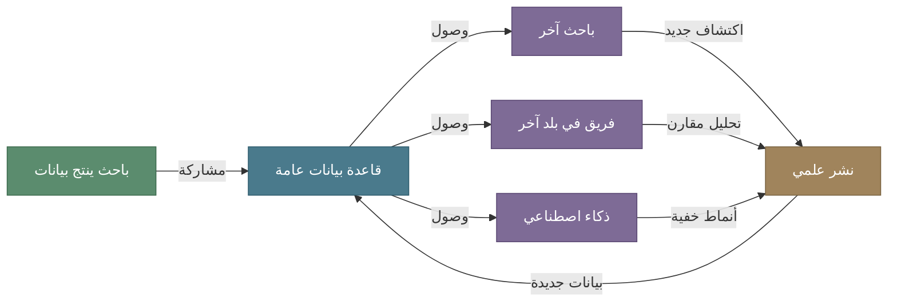
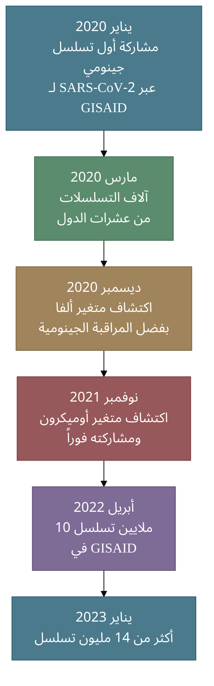
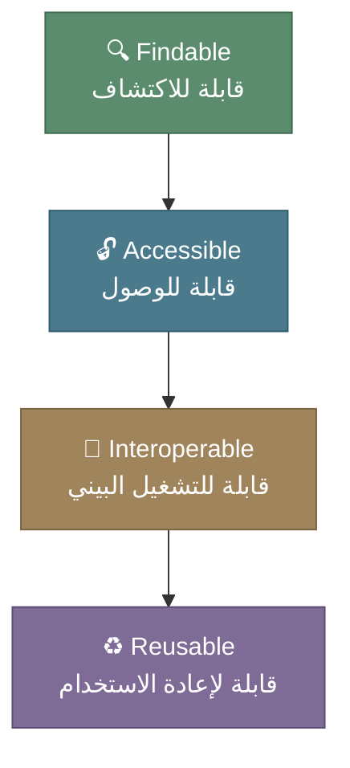

# مشاركة البيانات في البحث العلمي: ضرورة وليست خياراً

## لماذا نتحدث عن مشاركة البيانات؟

بسم الله والصلاة والسلام على معلم الناس الخير

أما بعد

في عالم يتسارع فيه إنتاج البيانات البيولوجية بشكل غير مسبوق، يبرز سؤال جوهري ومهم في التحول البحثي في المملكة: **هل يكفي أن تُنتج البيانات، أم أن قيمتها الحقيقية تكمن في مشاركتها؟ وإعادة استخدامها؟**

الإجابة التي يؤكدها التاريخ العلمي الحديث واضحة — البيانات المحتجزة بيانات ميتة. والعلم لا يتقدم بالاحتكار، بل بالتراكم والبناء على عمل الآخرين. ومن منظور اسلامي زكاة العلم نشره، وشكر العلم بذله. 

في هذه المقالة، نناقش الدور الحاسم لمشاركة البيانات في البحث العلمي عموماً، وفي المعلوماتية الحيوية خصوصاً — المجال الذي يُعد نموذجاً فريداً لكيف يمكن لمشاركة البيانات أن تغير مسار البحث العلمي بأكمله، والنهضة البحثية في المملكة بشكل أدق.

<!-- more -->

---

## الواقع: حجم البيانات البيولوجية اليوم

 الحكم على الشيء فرع عن تصوّره، فلنضع الأمور في سياقها. حجم البيانات البيولوجية التي تنتج اليوم يفوق قدرة أي مختبر أو مؤسسة على تحليلها بمفردها ناهيك عن الموارد الحاسوبية:

!!! info "أرقام تستحق التأمل"
    - **GenBank** يحتوي على مليارات التسلسلات النيوكليوتيدية من كائنات حية متنوعة
    - **GISAID** جمع أكثر من **15.5 مليون** تسلسل جينومي لفيروس SARS-CoV-2 خلال الجائحة
    - **Protein Data Bank** يضم أكثر من **200,000** بنية ثلاثية الأبعاد للبروتينات
    - **Sequence Read Archive** يخزن **بيتابايتات** من بيانات التسلسل الخام
    - تكلفة تسلسل الجينوم البشري انخفضت من **3 مليارات دولار** إلى **أقل من 1000 دولار**

هذا الكم الهائل من البيانات لا قيمة حقيقية له إن بقي حبيس الأقراص الصلبة في مختبرات منعزلة وبدون وسيلة للوصول إليه. قس على ذلك ما يوجد لدينا في المملكة من حراك بحثي قابل وغير قابل للوصول إليه. 

---

## السؤال المهم، لماذا مشاركة البيانات ضرورة وليست ترفاً؟

### 1. تسريع الاكتشافات العلمية 



عندما يشارك باحث بياناته، فإنه يضاعف القيمة المستخرجة منها أضعافا مضاعفة فكل ريال تم انفاقه تزيد قيمته مع كل إعادة استخدام. بيانات جُمعت لدراسة سرطان الثدي قد تكشف عن علاقات جينية مع أمراض أخرى لم تكن في الحسبان — لكن فقط إذا وصل إليها باحثون آخرون بأسئلة مختلفة.

### 2. إعادة الإنتاج: حجر الزاوية في المنهج العلمي

!!! warning "أزمة إعادة الإنتاج"
    تشير دراسات متعددة إلى أن نسبة كبيرة من الدراسات المنشورة لا يمكن إعادة إنتاج نتائجها. أحد أهم الأسباب؟ **عدم توفر البيانات الأصلية والشفرة البرمجية المستخدمة في التحليل.**

    بدون مشاركة البيانات، يصبح "التحقق العلمي" مجرد ثقة عمياء بالنتائج المنشورة. بشكل أبسط الممارسة العلمية النقدية تقل ويصبح (من كيسي) هو الممارسة الدارجة

مشاركة البيانات تعني أن أي باحث يستطيع:

- التحقق من النتائج بنفسه و إعادة البحث
- اكتشاف أخطاء التحليل إن وُجدت
- البناء على العمل السابق بثقة

### 3. العدالة العلمية

ليس كل مختبر في العالم يملك الموارد لإنتاج بيانات ضخمة. مشاركة البيانات تعني أن باحثاً في جامعة ذات موارد محدودة يستطيع الوصول إلى نفس البيانات التي ينتجها مركز بحثي عملاق — **فالعبرة بالسؤال البحثي والتحليل، لا بمن يملك أغلى جهاز تسلسل.** وهذا منطبق بشكل أساسي في المملكة، فلا تملك الجامعات الناشئة وصولا لأجهزة تسلسل دنا ضخمة أو حوسبة فائقة الأداء فلذلك المشاركة للنهضة البحثية حتمية وضرورة.
---

## المعلوماتية الحيوية: نموذج فريد في مشاركة البيانات

المعلوماتية الحيوية (Bioinformatics) ليست مجرد مجال يستفيد من مشاركة البيانات — بل هي مجال **بُني أساساً على هذا المبدأ**. منذ نشأته، اعتمد على قواعد بيانات عامة مشتركة:

=== "قواعد البيانات التسلسلية"
    - **GenBank / ENA / DDBJ**: التحالف الثلاثي الدولي لتسلسلات النيوكليوتيدات
    - **UniProt**: قاعدة بيانات البروتينات الشاملة
    - **Ensembl**: التعليقات التوضيحية للجينومات
    - كل هذه مفتوحة ومجانية بالكامل

=== "قواعد البيانات البنيوية"
    - **Protein Data Bank (PDB)**: البنى ثلاثية الأبعاد للبروتينات.
    - **AlphaFold DB**: تنبؤات بنية أكثر من 200 مليون بروتين
    - **SCOP / CATH**: تصنيف البنى البروتينية

=== "قواعد بيانات الأمراض"
    - **ClinVar**: المتغيرات الجينية وعلاقتها بالأمراض
    - **OMIM**: قاعدة الوراثة المندلية
    - **COSMIC**: كتالوج الطفرات السرطانية
    - **GWAS Catalog**: دراسات الارتباط على مستوى الجينوم

وغيرها الكثير.

### لماذا نجح هذا النموذج؟

لأن المجلات العلمية الكبرى في المعلوماتية الحيوية **تشترط** إيداع البيانات في قواعد البيانات العامة كشرط للنشر. لا يمكنك نشر تسلسل جيني جديد في مجلة محكمة دون إيداعه في GenBank أو ما يعادلها. هذه السياسة حولت المشاركة من **خيار أخلاقي** إلى **متطلب مؤسسي**.
ويجب علينا في المملكة تحويل هذا النموذج إلى ممارسة فعلية لكل المنح البحثية. 

---

## دروس من الجائحة: GISAID والاستجابة لكوفيد-19

لعل أوضح مثال على قوة مشاركة البيانات في المعلوماتية الحيوية هو ما حدث خلال جائحة كوفيد-19:



!!! example "قصة نجاح: اكتشاف متغير أوميكرون"
    عندما اكتشف **المعهد الوطني للأمراض المعدية في جنوب أفريقيا** متغير أوميكرون، رفعوا التسلسل الجينومي فوراً إلى GISAID. خلال ساعات، اكتشف باحثون أن بتسوانا وهونغ كونغ أبلغتا عن حالات بنفس التسلسل الجيني.

    **النتيجة:** استجابة عالمية سريعة بدلاً من أسابيع من الانتظار.

    هذا لم يكن ممكناً لولا:

    1. منصة مشاركة مركزية (GISAID)
    2. ثقافة مشاركة البيانات في مجتمع الجينوميات
    3. أدوات تحليل مفتوحة المصدر (Nextstrain وغيرها)

!!! tip "تجربة محلية: تتبع طفرات SARS-CoV-2 في المملكة"
    أذكر أني قمت بالعمل وقتها على تحالف بهذا الصدد في المملكة ولكن لم ينجح لأسباب شتى لعل أهمها غياب الإطار التنظيمي، والبنية التحتية نسبياً (وقتها تم بناء منصة مشاركة في أقل من شهر). كما عملت مع فريق بحثي باستخدام قاعدة بيانات GISAID وتم نشر البحث في مجلة The Lancet Infectious Diseases:

    - **المنصة:** [CovMT — متتبع طفرات SARS-CoV-2 التفاعلي](https://covmtdev.kaust.edu.sa/)
    - **البحث:** [CovMT: an interactive SARS-CoV-2 mutation tracker, with a focus on critical variants — *The Lancet Infectious Diseases*, 2021](https://www.thelancet.com/journals/laninf/article/PIIS1473-3099(21)00078-5/fulltext)

---

## التحديات الحقيقية: لماذا لا يشارك الجميع؟

رغم الفوائد الواضحة، تظل مشاركة البيانات محدودة في كثير من المجالات. الأسباب متعددة ومتشابكة:

### الحواجز الشخصية والمهنية

| الحاجز              | التفسير                        | الحل المقترح                            |
|---------------------|--------------------------------|-----------------------------------------|
| **الخوف من المنافسة** | "سيسبقني أحد في النشر"         | فترات حماية مؤقتة + ثقافة الإنصاف في الاستشهاد |
| **غياب الحوافز**    | لا تُحتسب مشاركة البيانات في الترقيات | اعتماد مقاييس جديدة تُقدّر المشاركة       |
| **الجهد الإضافي**   | تنظيف البيانات وتوثيقها يستغرق وقتاً | أدوات وبنية تحتية تُسهّل العملية          |
| **المخاوف الأخلاقية** | خصوصية المرضى والعينات البشرية | بروتوكولات وصول مُحكمة + إخفاء الهوية    |

### الحواجز المؤسسية

!!! note "الفجوة بين السياسة والتطبيق"
    كثير من الجامعات ومراكز الأبحاث تمتلك سياسات تدعم البيانات المفتوحة **نظرياً**، لكن التطبيق الفعلي يصطدم بـ:

    - غياب البنية التحتية الرقمية المناسبة
    - عدم تدريب الباحثين على أدوات المشاركة
    - بيروقراطية في الموافقات الأخلاقية
    - عدم وضوح ملكية البيانات

---

## مبادئ FAIR: خارطة الطريق

تحدثنا في [مقال سابق](/blog/connectivity-fair-hpc-future/) عن مبادئ FAIR بالتفصيل. لكن يجدر التذكير بأن المشاركة الفعالة ليست مجرد "رفع الملفات على الإنترنت" — بل تتطلب أن تكون البيانات:



بيانات بلا وصف كاف (metadata) أو بتنسيقات غير معيارية هي بيانات يصعب استخدامها حتى لو كانت "مفتوحة". **الجودة في المشاركة لا تقل أهمية عن المشاركة ذاتها.** 

---

## ماذا يعني هذا لنا في المملكة؟

نعيش في المملكة العربية السعودية مرحلة تحول رقمي طموحة ضمن رؤية 2030. في مجال البيانات والمعلوماتية الحيوية بالتحديد خصوصا مع استراتيجية التقنية الحيوية المعتمدة حديثاً:

- **هيئة البيانات والذكاء الاصطناعي (SDAIA)** تعمل على بناء منظومة بيانات وطنية
- **جامعة الملك عبدالله للعلوم والتقنية (KAUST)** تقود مشاريع بحثية في المعلوماتية الحيوية والذكاء الاصطناعي

!!! question "السؤال الذي يجب أن نطرحه"
    هل نحن نبني ثقافة مشاركة البيانات بالتوازي مع بناء البنية التحتية؟ أم أننا نستثمر في إنتاج البيانات دون التفكير الكافي في كيفية مشاركتها واستثمارها؟

    **البنية التحتية وحدها لا تكفي — نحتاج ثقافة علمية تُقدّر المشاركة وتُكافئها.**

---

## كيف تبدأ بمشاركة بياناتك؟

إذا كنت باحثاً وتريد أن تبدأ، إليك خطوات عملية:

### 1. اختر المستودع المناسب

| نوع البيانات    | المستودع المقترح              |
|-----------------|-------------------------------|
| تسلسلات DNA/RNA | GenBank / ENA / DDBJ          |
| بيانات تسلسل خام | Sequence Read Archive (SRA)   |
| بنى بروتينية    | Protein Data Bank (PDB)       |
| بيانات تعبير جيني | Gene Expression Omnibus (GEO) |
| بيانات متنوعة   | Zenodo / Figshare / Dryad     |
| شفرة برمجية     | GitHub / GitLab               |
| بيانات سعودية   | المنصة البحثية الوطنية (مستقبلاً)        |


### 2. وثّق بياناتك جيداً

```python
# مثال: ملف وصفي لمجموعة بيانات تسلسل
metadata = {
    "project": "تحليل الميكروبيوم المعوي",
    "organism": "Homo sapiens",
    "samples": 150,
    "sequencing_platform": "Illumina NovaSeq 6000",
    "read_length": "150bp paired-end",
    "reference_genome": "GRCh38",
    "pipeline": "QIIME2 v2024.5",
    "contact": "researcher@university.edu.sa",
    "license": "CC-BY-4.0"
}
```

### 3. استخدم تراخيص واضحة

!!! tip "التراخيص الشائعة للبيانات العلمية"
    - **CC0 (Public Domain)**: بدون قيود — الأنسب للبيانات الخام
    - **CC-BY**: مشاركة حرة مع نسب العمل للمصدر — الأكثر شيوعاً
    - **CC-BY-SA**: مشاركة بنفس الترخيص — للمشاريع التعاونية

### 4. شارك الشفرة البرمجية أيضاً

البيانات بدون الشفرة البرمجية التي حللتها نصف القصة فقط، يجب أن تشارك شفرتك البرمجية في مستودع عام مع توثيق كافٍ لإعادة تشغيلها. استخدام مستودعات github إو مثيلها يسهل على الباحثين المهمة. 

---

## خاتمة: من ثقافة الاحتكار إلى ثقافة البناء المشترك

مشاركة البيانات ليست تنازلاً عن حقوقك كباحث — بل هي **استثمار في مجتمع علمي أقوى** ينتفع منه الجميع، بمن فيهم أنت. وزكاة علم و شكر لما أنعم الله به عليك. 

المعلوماتية الحيوية أثبتت أن نموذج البيانات المفتوحة يعمل. مشروع الجينوم البشري، واستجابة كوفيد-19، واكتشاف بنى البروتينات بالذكاء الاصطناعي — كل هذه الإنجازات بُنيت على أساس واحد: **بيانات مشتركة، يصل إليها الجميع.** ولكي نساعد في الحراك البحثي في المملكة ورفع الأثر المعنوي والمادي للبحث العلمي، **يجب أن نشارك**

السؤال ليس "هل نشارك؟" بل "كيف نشارك بشكل أفضل؟"


---

## مصادر ومراجع

- [Making genomic data FAIR through effective Data Portals — Nature Scientific Data](https://www.nature.com/articles/s41597-025-06142-x)
- [Communicating clearly about data sharing in genomics — Human Genomics](https://humgenomics.biomedcentral.com/articles/10.1186/s40246-025-00784-z)
- [Can open science advance health justice? — PMC](https://pmc.ncbi.nlm.nih.gov/articles/PMC12320189/)
- [Evaluating Data Sharing of SARS-CoV-2 Genomes — PMC](https://pmc.ncbi.nlm.nih.gov/articles/PMC9959893/)
- [We Can Do Better: Lessons Learned on Data Sharing in COVID-19 — Science & Diplomacy](https://www.sciencediplomacy.org/article/2020/we-can-do-better-lessons-learned-data-sharing-in-covid-19-pandemic-can-inform-future)
- [Advancing biotechnology & genomics in Saudi Arabia — Arthur D. Little](https://www.adlittle.com/in-en/insights/report/advancing-biotechnology-genomics-saudi-arabia)
- [GenBank 2025 update — Nucleic Acids Research](https://academic.oup.com/nar/article/53/D1/D56/7903376)
