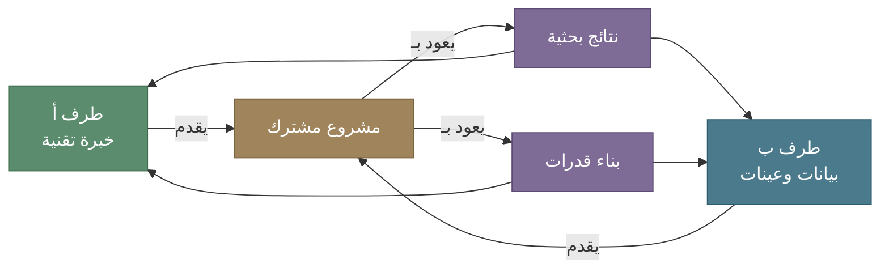
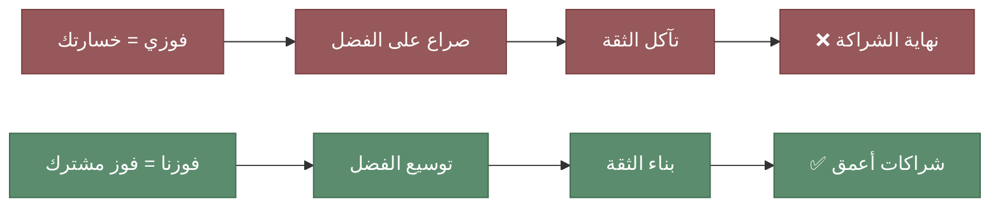
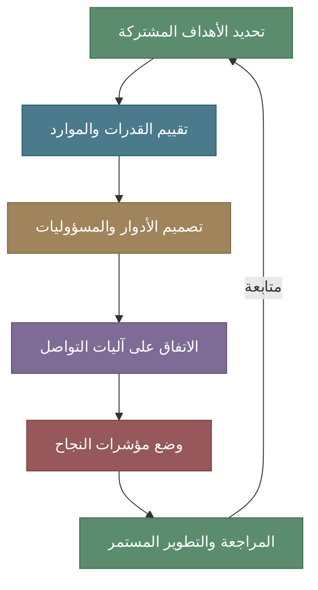
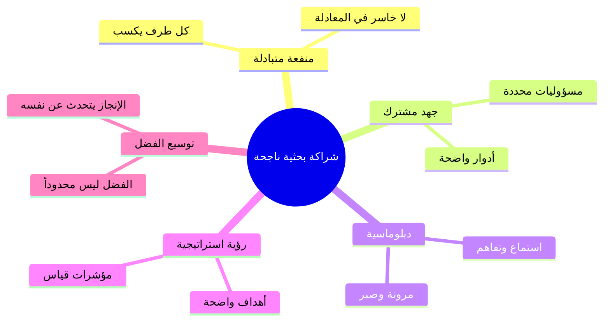

# الوجيز في فن بناء الشراكات في المؤسسات البحثية

## لماذا الشراكة وليس المنافسة؟

بسم الله والصلاة والسلام على معلم الناس الخير

أما بعد

في المؤسسات البحثية، كثيراً ما يختزل النجاح في عدد الأوراق المنشورة أو المنح البحثية، أو الإطراء. لكن هنالك سؤال أعمق وأهم وهو: **هل يمكنك بناء شيء يدوم بمفردك؟** الإجابة في الغالب — لا. الإنجازات البحثية الكبرى لم تكن يوماً نتاج جهد فردي منعزل، بل كانت ثمرة شراكات مدروسة قائمة على المنفعة المتبادلة والرؤية المشتركة.

في هذه المقالة، أشارك نموذجاً عملياً في بناء الشراكات البحثية — نموذج لا يقوم على المنافسة والاستحواذ، بل على **الجهد المشترك، والمكسب المتبادل، والدبلوماسية في التعامل.**

<!-- more -->

---

## الركيزة الأولى: المنفعة المتبادلة هي الأساس

أي شراكة لا تحقق منفعة حقيقية للطرفين محكومة بالفشل. ليس المطلوب أن يتنازل طرف لصالح الآخر، بل أن يجد كل طرف في الشراكة ما يخدم أهدافه البحثية والمؤسسية.

!!! tip "المعيار البسيط"
    قبل الدخول في أي شراكة، اسأل نفسك: **ما الذي يكسبه الطرف الآخر؟** إذا لم تستطع الإجابة بوضوح، فالشراكة لن تصمد. الشراكة الناجحة هي التي يشعر فيها كل طرف أنه حصل على أكثر مما قدّم. وأي شراكه لا تستطيع قول **لا** فيها قد تكون باب للضغط والتسويف. إنتبه منها.

---

## الركيزة الثانية: الفوز ليس أن يخسر الآخر هنالك مساحة للكل.

هنا تكمن نقطة جوهرية يغفل عنها كثيرون في البيئة البحثية: **النجاح ليس لعبة صفرية.** فوزك لا يستلزم خسارة شريكك. بل العكس — كلما نجح شريكك، زادت قيمة الشراكة وتعاظم أثرها.

!!! warning "الفخ الشائع"
    بعض الباحثين يتعاملون مع الشراكات بعقلية "أنا أو هو" — من يحصل على الاسم الأول في الورقة؟ من يُنسب إليه المشروع؟ من يظهر في المؤتمر؟ هذه العقلية تقتل الشراكات قبل أن تبدأ، وتحول التعاون إلى صراع بلا صراحة واقتناع.

المقاربة الأنضج هي أن تسأل: **كيف نوسّع دائرة الفضل لتشمل الجميع؟** الفضل ليس كعكة تنقص كلما أخذ منها أحد — بل هو استثمار يتضاعف بالمشاركة. حين تمنح شريكك التقدير الذي يستحقه، فإنك تبني ثقة تفتح أبواباً لمشاريع أكبر وأعمق.

وهنا سؤال جوهري كباحث مسلم، هل الهدف من العمل الثناء أم العمل المفيد؟ 

---

## الركيزة الثالثة: اعرف أسلوبك في التعامل و شخصيتك الفريدة.

ليس كل شخص يبني الشراكات بنفس الطريقة، وليست كل مؤسسة تتفاعل بنفس الأسلوب. معرفة أسلوبك في التعامل — ومعرفة أسلوب الطرف الآخر — عنصر حاسم في نجاح أي تعاون.
هنا أقصد الذكاء العاطفي والقدرة على فهم الطرف الآخر و المحرّك له know the pain. وهذه المهارة ليس أن تستغل الطرف الآخر بل أن تفهم ما تقدم بما تستطيع.

!!! info "أنماط التعامل في الشراكات البحثية"

    | النمط | الوصف | نقطة القوة | نقطة الضعف |
    |-------|-------|------------|------------|
    | **البنّاء** | يركز على المخرجات المشتركة والبناء التدريجي | استدامة الشراكة | قد يكون بطيئاً في البداية |
    | **الاستراتيجي** | يربط كل شراكة بأهداف مؤسسية واضحة | وضوح الرؤية | قد يبدو حسابياً أكثر من اللازم |
    | **الدبلوماسي** | يُجيد التوفيق بين المصالح المتعارضة | حل النزاعات | قد يتجنب القرارات الحاسمة |
    | **المبادر** | يطرح الأفكار ويحرّك المشاريع | الطاقة والحماس | قد يفقد الاهتمام بعد الانطلاقة |

    الأهم ليس أن تكون نمطاً واحداً، بل أن **تعرف متى تستخدم كل نمط.** الشراكة الناضجة تتطلب مرونة في التنقل بين هذه الأنماط حسب المرحلة والسياق.

---

## الركيزة الرابعة: الهدف هو الإنجاز لا الاستعراض انتبه من فخ الاحتفال قبل الأوان
لا تسعتجل الحصاد

!!! quote "قاعدة ذهبية"
    **السعي وراء الفضل وحده لا يثمر. تحقيق الأهداف هو المفتاح.**

من أكثر ما يُضعف الشراكات البحثية أن يتحول التركيز من "ماذا نريد أن نحقق؟" إلى "من يحصل على الفضل و بالعامية (الكريدت)؟". حين يصبح الظهور والاستعراض هو الغاية، تتحول الشراكة إلى مسرح بدلاً من مختبر.

الباحث الفعال يعرف أن:

- **الإنجاز الحقيقي يصنع سمعته** — لا العكس إنما العكس يدمّر السمعة.
- **النتائج تتحدث** — أعلى وأوضح من أي ترويج ذاتي، مستمرة وليس لحظية.
- **شبكة الشراكات القوية** — هي أفضل استثمار مهني على المدى الطويل، فالكل يحترم مبادئك ورسوخها وليس تلوّنك.

!!! example "مثال عملي"
    حين تنجح في بناء منصة بحثية مشتركة بين مؤسستين، الأثر لا ينسب لشخص واحد — بل ينسب للشراكة ذاتها. وهذا أقوى وأبقى من أي إنجاز فردي. الفضل الموزع بعدالة يولد ولاءً مهنياً يدوم سنوات.

---

## الركيزة الخامسة: الدبلوماسية والرؤية الاستراتيجية

بناء الشراكات ليس مجرد اتفاق على ورقة بحثية مشتركة — بل هو **مشروع استراتيجي** يتطلب:

### التخطيط المسبق

### الدبلوماسية في الممارسة

!!! tip "مهارات دبلوماسية أساسية للباحثين"

    1. **الاستماع أولاً** — افهم ما يحتاجه شريكك قبل أن تعرض ما تريده أنت، من يصمت يفهم ومن يقاطع يندم.
    2. **المرونة في التفاصيل، الثبات في المبادئ** — تنازل في الأمور الصغيرة، لكن لا تتنازل عن جودة البحث أو أخلاقياته والقيم العليا للعمل.
    3. **التوثيق** — كل اتفاق شفهي يجب أن يتحول إلى مكتوب. ليس من باب انعدام الثقة، بل من باب الوضوح والحماية للجميع
    4. **إدارة التوقعات** — كن صريحاً بشأن ما تستطيع تقديمه وما لا تستطيع. الوعود الكاذبة أقصر الطرق لتدمير الشراكة والضغط النفسي.
    5. **الصبر** — الشراكات الحقيقية تُبنى على مدى سنوات، لا أسابيع، وليس كما تريد وتشتهي. 

---

## ماذا يعنى لنا هذا في سياق البحث في المملكة؟

نعيش في مرحلة تحول بحثي غير مسبوقة في المملكة. المؤسسات البحثية تتوسع، والمنح تتزايد، والطموح عال والتوقعات والآمال أعلى وأغلى. لكن هذا التوسع يحتاج إلى **بنية تعاونية** لا تقل أهمية عن البنية التحتية والتخصصية البحثية.

!!! question "تساؤلات للتأمل"
    - كم مشروع بحثي سعودي يقوم على شراكة حقيقية بين مؤسسات محلية — لا مجرد أسماء على ورقة؟
    - هل تُكافئ مؤسساتنا التعاون بنفس القدر الذي تكافئ به الإنجاز الفردي؟
    - هل نملك آليات واضحة لإدارة الشراكات البحثية بين الجامعات والمراكز البحثية والقطاع الخاص؟
    - هل تمنح الترقيات والمميزات للشركات البحثية الناجحة؟ والمجتمعات البحثية الفعّالة؟

الشراكات البحثية الفعالة بين المؤسسات السعودية ليست ترفا أو استعراضاً — بل هي **ضرورة لتحقيق أهداف رؤية 2030 البحثية.** لا يمكن لمؤسسة واحدة، مهما بلغت إمكانياتها، أن تغطي كل التخصصات والاحتياجات فالتكامل هو المتطلب الأساسي والقمة والنجاح يسع الكل.

---

## خلاصة: نموذج الشراكة الناجحة

بناء الشراكات في المؤسسات البحثية فن يجمع بين العلم والدبلوماسية، بين الطموح والواقعية، بين الثقة والتوثيق. ليس المطلوب أن تكون مثالياً — بل أن تكون **صادقاً ومهنياً ومرناً.**

**الفضل المشترك لا ينقص — بل يتضاعف. والإنجاز الحقيقي لا يحتاج لمن يروّج له — بل يفرض نفسه.**

---

## ملخص للنشر على LinkedIn

!!! note "نسخة مختصرة للنشر على LinkedIn"

    **فن بناء الشراكات في المؤسسات البحثية**

    بعد سنوات من العمل في بيئات بحثية متنوعة، توصلت إلى قناعة: الإنجازات الكبرى لا تُبنى بالجهد الفردي.

    نموذجي في بناء الشراكات يقوم على خمسة مبادئ:

    🔹 **المنفعة المتبادلة** — أي شراكة لا تخدم الطرفين لن تصمد
    🔹 **الفوز ليس أن يخسر الآخر** — النجاح ليس لعبة صفرية
    🔹 **اعرف أسلوبك** — المرونة في التعامل مفتاح التعاون
    🔹 **الإنجاز لا الاستعراض** — السعي وراء الفضل وحده لا يثمر
    🔹 **الدبلوماسية والرؤية** — الشراكات مشاريع استراتيجية لا اتفاقات عابرة

    الفضل المشترك لا ينقص — بل يتضاعف. والإنجاز الحقيقي يفرض نفسه.

    📖 المقال الكامل: malarawi.sa/blog/building-research-partnerships/

    #بحث_علمي #شراكات_بحثية #رؤية_2030 #تعاون #قيادة_بحثية
