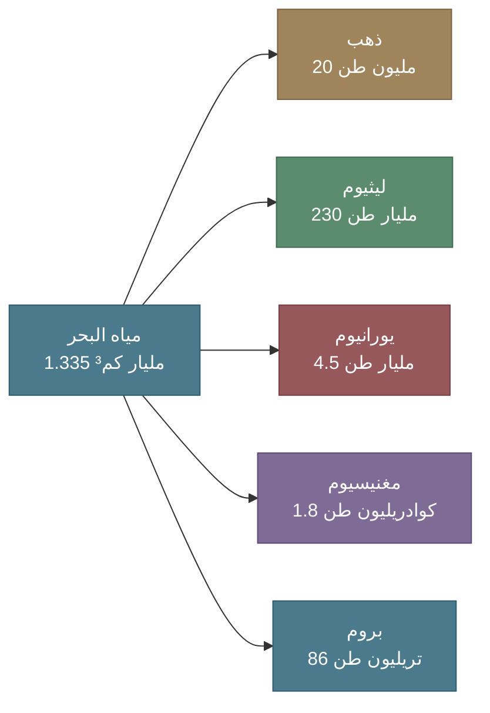
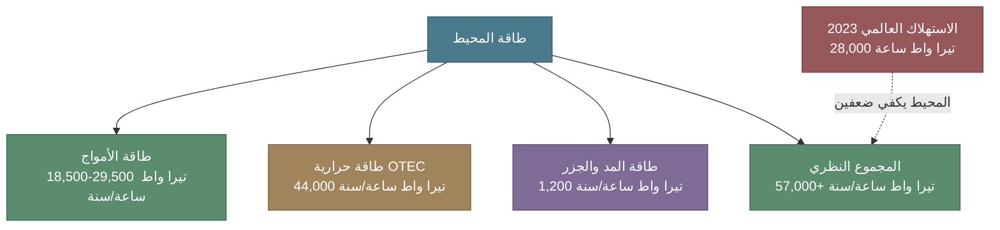
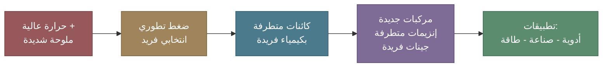
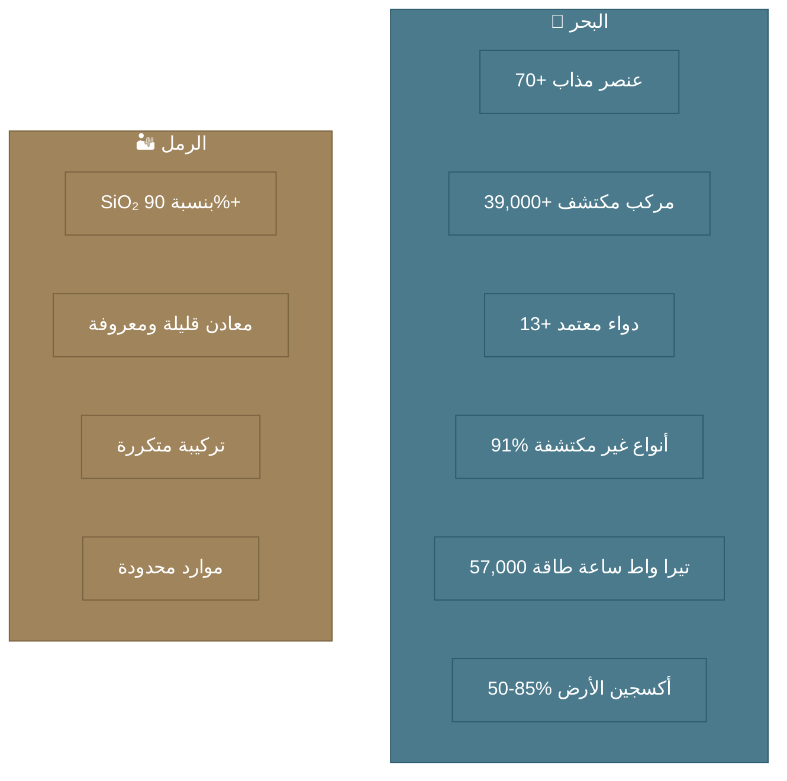

# الاقتصاد الأزرق: البحر المنجم السائل لكل الخيرات، لحما طرياً و حلية و اكتشافات !

## الكنز أمامنا و ليس تحت أقدامنا؟

بسم الله والصلاة والسلام على معلم الناس الخير و على آله و الصحابة الكرام

أما بعد

نعيش في منطقة ارتبط اقتصادها تاريخيا بما تحت الرمال — النفط والمعادن و بما يمشي
على رمالها من الأنعام، وبما تجلبه التجارة على درب الحرير. ولكن ماذا لو أخبرتك أن
البحار تحوي ثروات أكبر من التي تحت أقدامنا، ليس مجازاً، بل بالأرقام والحقائق
العلمية.

المحيطات تغطي ثلثي كوكبنا وتمثل أكثر من 90% من نطاق الحياة على كوكبنا. ومع ذلك،
لا نعرف إلا أقل من **5% من تنوعها الميكروبي**، و**91% من أنواعها الحية** لم توصف
علميا بعد (Carroll et al., 2024). نحن حرفياً نقف على حافة محيط من المجهول.

في هذه المقالة، نقارن بين حبة الرمل وقطرة الماء — ونكتشف لماذا يعتبر البحر أغنى
مختبر طبيعي على وجه الأرض، ولماذا يجب أن يكون البحر الأحمر في قلب الاقتصاد
الأزرق السعودي.

<!-- more -->

---

## المقارنة التي لا تتوقعها

### ما في حبة الرمل؟

حبة الرمل العادية تتكون أساساً من **السيليكا (SiO₂)** بنسبة تتجاوز 90%، مع كميات
ضئيلة من الفلسبار والميكا وبعض المعادن الثقيلة. كيميائيا — تركيبة بسيطة ومتكررة.

لكن الجانب الأكثر إثارة؟ حبة الرمل الواحدة تحمل على سطحها ما بين **10,000 إلى
100,000 كائن مجهري** (Max Planck Institute, 2017). حتى الرمل ليس خاملاً كما نظن.
وتخيل معي هذا الرمل الموجود تحت الأقدام، وفي كل مكان، ويتحرك من مكان لمكان!!
(العواصف الغبارية) فقط فكر فيها لوهلة!!

### العواصف الرملية: حين يطير الرمل ويغزو البحر

الرمل لا يبقى ساكناً. العواصف الرملية والغبارية تنقل **ملايين الأطنان** من الغبار
عبر الغلاف الجوي سنوياً — ومعها تنتقل كائنات دقيقة حيّة. منطقتنا تقع في قلب ما
يُسمى **حزام الغبار العالمي** (Global Dust Belt) الممتد من غرب أفريقيا إلى وسط
آسيا، وهو أعلى مناطق العالم في تدفق الغبار.

!!! warning "ماذا تحمل العاصفة الرملية؟"
    دراسة من كاوست حللت الميكروبيوم للغبار فوق البحر الأحمر، وأظهرت أن الغبار المحمول جوا يحتوي على **محتوى جيني ضخم** يضم أكثر من **2.3 مليون تسلسل ** غير متكرر. والمثير أن الميكروبيوم الهوائي في حزام الغبار غني بالجينات حقيقية النواة (eukaryotic) بأكثر من **10 أضعاف** مقارنة بالميكروبيوم البحري تحته (Aalismail et al., 2019).

!!! danger "تأثير العواصف على الحياة البحرية"
    في دراسة تحذيرية من كاوست، تبيّن أن عاصفتين رمليتين شديدتين — إحداهما من الصحراء النوبية صيف 2016 — أحدثتا **تغييرات ملموسة في تركيبة الميكروبيوم البحري** للبحر الأحمر. الغبار المتساقط لم يكن مجرد رمل — بل حمل معه ميكروبات غريبة عن البيئة البحرية، مما قد يخل بالتوازن الدقيق للنظام البيئي البحري (Behzad et al., 2022).

    **الخلاصة:** مع تسارع التصحر وتغير المناخ، ستزداد العواصف الغبارية — وستزداد معها الضغوط على الأنظمة البيئية البحرية. فهم هذه العلاقة بين الرمل والبحر ليس ترفاً أكاديمياً — بل ضرورة لحماية ثرواتنا البحرية.

### ما في قطرة ماء البحر؟

قطرة واحدة من ماء البحر (1 مل) تحتوي على:

- **مليون إلى 10 ملايين خلية بكتيرية** (Paoli et al., 2022)
- **أكثر من 70 عنصراً كيميائياً** مذاباً
- بروتينات وببتيدات وأحماض أمينية ومركبات عضوية
- فيروسات بحرية بأعداد تفوق البكتيريا بعشرة أضعاف

!!! info "مقارنة: حبة الرمل مقابل ماء البحر"

    | المعيار | حبة الرمل | 1 مل ماء بحر |
    |---------|----------|--------------|
    | **التنوع الكيميائي** | SiO₂ + معادن قليلة | 70+ عنصر مذاب |
    | **الكائنات الدقيقة** | 10,000-100,000 ميكروب | 1-10 ملايين خلية |
    | **المركبات العضوية** | شبه معدومة | آلاف المركبات |
    | **إمكانية الاكتشاف** | محدودة جداً | شبه لا نهائية |
    | **التنوع الجيني** | محدود | ملايين الجينات الفريدة |

---

## ما يوجد في مياه البحر، ثروة لا تُرى بالعين

مياه البحر ليست مجرد "ماء مالح". هي محلول كيميائي معقد يحوي ثروات مذهلة:

### المعادن المذابة

!!! warning "أرقام تستحق التوقف"
    - **الليثيوم** في المحيطات (230 مليار طن) يتجاوز جميع احتياطيات الليثيوم الأرضية المعروفة (~22 مليون طن) بأكثر من **10,000 مرة**
    - **اليورانيوم** المذاب (4.5 مليار طن) يعادل **1000 ضعف** الاحتياطيات الأرضية المعروفة (~6 ملايين طن)
    - **الذهب** المذاب (~20 مليون طن) — لكن بتركيز ضئيل جداً (13 جزء من التريليون) لا يسمح بالاستخراج التجاري حالياً

    المصادر: NOAA; ACS Environmental Science & Technology; Nature npj Clean Water

### تركيب مياه البحر

مياه البحر تتكون من 96.5% ماء و~3.5% أملاح ومواد مذابة. الأيونات الـ 11 الرئيسية
تشكل 99.9% من المواد المذابة:

| الأيون | التركيز (غ/كغ) | النسبة من الأملاح |
|--------|----------------|-------------------|
| كلوريد (Cl⁻) | 19.35 | 55.0% |
| صوديوم (Na⁺) | 10.76 | 30.6% |
| كبريتات (SO₄²⁻) | 2.71 | 7.7% |
| مغنيسيوم (Mg²⁺) | 1.29 | 3.7% |
| كالسيوم (Ca²⁺) | 0.41 | 1.2% |
| بوتاسيوم (K⁺) | 0.40 | 1.1% |

بالإضافة إلى عناصر نادرة لكنها حيوية: الحديد، الزنك، النحاس، المنغنيز، الكوبالت،
الموليبدينوم، السيلينيوم، واليود.

---

## المركبات البحرية، صيدلية المحيط

### أرقام مذهلة

إذا كانت الأرقام السابقة عن المعادن مثيرة، فإن عالم **المركبات الطبيعية
البحرية** أكثر إثارة:

!!! success "إحصائيات المركبات البحرية الطبيعية"
    - تم اكتشاف أكثر من **39,000 مركب طبيعي بحري** فريد حتى الآن (Carroll et al., 2024)
    - يُكتشف أكثر من **1,400 مركب جديد سنوياً** منذ 2008
    - في عقد واحد (2011-2020)، اكتُشف **13,492 مركباً** من الإسفنج البحري وحده
    - أكثر من **33 مركباً** في مراحل التجارب السريرية حالياً

### أدوية من البحر: معتمدة وتستخدم اليوم

البحر ليس مصدراً نظرياً — بل أنتج أدوية حقيقية تُنقذ أرواحاً:

| الدواء                                  | الكائن البحري          | يُعالج                    | سنة الاعتماد | المرجع                                                                      |
|-----------------------------------------|------------------------|--------------------------|-----------|-----------------------------------------------------------------------------|
| **سيتارابين** (Cytarabine)              | إسفنج بحري كاريبي      | سرطان الدم               | 1969      | [Bergmann & Feeney, 1951](https://pubs.acs.org/doi/10.1021/jo01146a023)     |
| **زيكونوتايد** (Ziconotide)             | حلزون مخروطي بحري      | الألم المزمن الشديد      | 2004      | [Olivera et al., 1985](https://www.science.org/doi/10.1126/science.4071055) |
| **إريبولين** (Eribulin)                 | إسفنج ياباني           | سرطان الثدي المنتشر      | 2010      | [Hirata & Uemura, 1986](https://doi.org/10.1351/pac198658050701)            |
| **ترابيكتيدين** (Trabectedin)           | حيوان الزق البحري      | سرطان المبيض والأنسجة الرخوة | 2015      | [Rinehart et al., 1990](https://pubs.acs.org/doi/10.1021/jo00302a007)       |
| **لوربينيكتيدين** (Lurbinectedin)       | مشتق صناعي من /Ecteinascidia turbinata/ | سرطان الرئة صغير الخلايا | 2020      | [Trigo et al., 2020](https://pubmed.ncbi.nlm.nih.gov/32224306/)             |
| **إنفورتوماب فيدوتين** (Enfortumab vedotin) | أرنب البحر             | سرطان المثانة            | 2019      | [Rosenberg et al., 2019](https://ascopubs.org/doi/10.1200/JCO.19.01140)     |

للمراجعة الشاملة لجميع الأدوية البحرية المعتمدة والتي في التجارب السريرية: [Cappello & Nieri, 2021](https://pmc.ncbi.nlm.nih.gov/articles/PMC8704254/)

!!! tip "لماذا البحر غني بالمركبات الفريدة؟"
    الكائنات البحرية — خاصة الإسفنج والمرجان والكائنات الدقيقة — تعيش في بيئة **تنافس كيميائي شرس**. لا تستطيع الهرب من المفترسات بالركض، فتلجأ إلى **الأسلحة الكيميائية**: مركبات سامة ومضادة للميكروبات ومثبطة للنمو. هذا "سباق التسلح الكيميائي" أنتج تنوعا في المركبات الجزيئية لا مثيل له في البيئات الأرضية.

---

## البروتينات والإنزيمات البحرية: كنوز صناعية

### الإنزيمات المتطرفة (أو الغير عادية) (Extremozymes)

الكائنات البحرية التي تعيش في ظروف قاسية — حرارة عالية، ضغط هائل، ملوحة شديدة —
تنتج إنزيمات بخصائص استثنائية:

=== "إنزيمات البرد (Psychrozymes)"
    - تعمل عند 0-15 درجة مئوية حيث تفشل الإنزيمات العادية
    - تطبيقات: صناعة الغذاء، المنظفات، المعالجة البيولوجية
    - تقلل استهلاك الطاقة بإلغاء الحاجة للتسخين

=== "إنزيمات الحرارة (Thermozymes)"
    - من بكتيريا الفتحات الحرارية المائية
    - مستقرة عند درجات حرارة تتجاوز 80°م
    - تطبيقات: صناعة الجلود، الغذاء، المنظفات الصناعية

=== "إنزيمات الملوحة (Halophilic enzymes)"
    - من بيئات بحرية شديدة الملوحة
    - مستقرة في العمليات الصناعية ذات الأملاح العالية
    - مثالية لتطبيقات تحلية المياه والصناعات المرتبطة بها

### الببتيدات النشطة حيوياً

الكائنات البحرية مصدر غني بالببتيدات ذات الأنشطة المتعددة:

- **مضادات ارتفاع ضغط الدم**: من كولاجين الأسماك ومحللات المحار
- **مضادات الميكروبات**: فعالة ضد البكتيريا المقاومة للمضادات الحيوية المتعددة
- **مضادات السرطان**: كالاهالايد F ودولاستاتين 10 و15
- **مضادات الالتهاب ومضادات الأكسدة**: تُستخدم في مستحضرات التجميل والمكملات
الغذائية

---

## طاقة المحيط: محطة كهرباء لا تنضب
ومن بعد آخر فيزيائي فالمحيط ليس مصدراً للمركبات الكيميائية فحسب — بل هو **مصدر طاقة هائل**:

!!! info "حقيقة مذهلة"
    العوالق النباتية (Phytoplankton) تشكل فقط **1% من الكتلة الحيوية النباتية** على الأرض، لكنها تنتج **50-85% من الأكسجين** الذي نتنفسه (NOAA). بحر صغير بحجم البحر الأحمر يُسهم في تنفسنا أكثر مما نتخيل.

---

## الاقتصاد الأزرق: أرقام عالمية

الاقتصاد الأزرق ليس مفهوماً نظرياً — بل هو قطاع اقتصادي ضخم ومتنامٍ:

| المؤشر                 | القيمة            | المصدر     |
|------------------------|-------------------|------------|
| قيمة الاقتصاد البحري (2010) | 1.5 تريليون دولار | OECD       |
| القيمة المتوقعة 2030   | 3+ تريليون دولار  | OECD       |
| السياحة البحرية والساحلية | 4.6 تريليون دولار/سنة | World Bank |
| الوظائف المباشرة (2010) | 31 مليون وظيفة    | OECD       |
| الوظائف المتوقعة 2030  | 40+ مليون وظيفة   | OECD       |

القطاعات الرئيسية: النفط والغاز البحري (33% حالياً، يتقلص)، السياحة البحرية،
الاستزراع المائي، الطاقة البحرية المتجددة (الأسرع نمواً)، والتقنية الحيوية
البحرية.

---

## البحر الأحمر: مختبر طبيعي لا مثيل له

### لماذا البحر الأحمر فريد؟

البحر الأحمر ليس مجرد بحر — بل هو **مختبر طبيعي بطابع فريد** بخصائص لا تتكرر في أي
مكان آخر:

| المعيار             | البحر الأحمر     | المتوسط العالمي |
|---------------------|------------------|--------------|
| **الملوحة السطحية** | 40-41 جزء بالألف | 35 جزء بالألف |
| **حرارة السطح صيفاً** | 32-34°م          | 17°م         |
| **حرارة الأعماق**   | 22°م             | 2-4°م        |
| **ملوحة البرك الملحية** | حتى 257 جزء بالألف | لا يوجد      |
| **حرارة البرك الملحية** | حتى 68°م         | لا يوجد      |
| **نسبة التوطّن**     | ~14.7%           | ~9%          |

### التنوع البيولوجي

- أكثر من **1,200 نوع سمكي** موثق، 12.9% منها متوطنة (لا توجد إلا في البحر
الأحمر)
- حوالي **346 نوعاً من المرجان الصلب** و~300 نوع من المرجان الرخو
- **40% من أنواع المرجان الرخو** في العالم أصلها البحر الأحمر
- الشعاب المرجانية تمتد لأكثر من **2,000 كم** على طول الساحلين

المصدر: DiBattista et al., 2016 — On the origin of endemic species in the Red Sea,
*Journal of Biogeography*

### البرك الملحية العميقة: عالم تحت العالم

في أعماق البحر الأحمر تقع **برك ملحية** (Brine Pools) تُعد من أكثر البيئات تطرفاً
على وجه الأرض:

!!! example "بركة أتلانتس II (Atlantis II Deep)"
    - **العمق**: 1,900-2,200 متر
    - **الحرارة**: تصل إلى 68°م (نشاط حراري مائي)
    - **الملوحة**: تصل إلى 257 جزء بالألف (7 أضعاف ماء البحر العادي)
    - **الأس الهيدروجيني**: 5.3 (حمضي)
    - **المعادن الثقيلة**: تركيزات عالية من الزنك والحديد والنحاس
    - **الحجم**: ~17 كم³

!!! example "برك نيوم (اكتُشفت 2022)"
    - اكتُشفت في خليج العقبة على عمق **1,770 متر**
    - البركة الرئيسية: 260 متر طولاً و70 متر عرضاً
    - على بعد **2 كم فقط** من الشاطئ
    - تحتفظ بسجلات رسوبية لأحداث تسونامي وزلازل وفيضانات تاريخية

    المصدر: Purkis et al., 2022 — Discovery of the deep-sea NEOM Brine Pools, *Communications Earth & Environment* (Nature)

وطبعا لجامعة الملك عبدالله للعلوم والتقنية (كاوست) والمختبرات البحثية التمكين للوصول لهذه البيئات الفريدة و العمل عليها (عملت على دراسة عليها شخصياً). 

### مركبات مكتشفة من البحر الأحمر

البحر الأحمر أنتج بالفعل خط إنتاج من المركبات النشطة حيوياً:

- **12 إنزيماً للبيئات الصعبة Extreme** من ميكروبات البرك الملحية — ذات تطبيقات صناعية وصيدلانية
- **2,751 مجموعة جينية** للأيض المتخصص اكتُشفت في البرك الملحية الثلاث (أتلانتس
II، ديسكفري، كبريت)
- **120 مركباً** حُددت في وقت واحد من مرجان *Sarcophyton* الرخو (65 ديتربين، 18
ستيرول، 15 أوكسيليبيد)
- مركبات **لينجبيابيلين** (Lyngbyabellin) و**دولاستاتين 16** من البكتيريا
الزرقاء على ساحل جدة — بنشاط مضاد للحشف البحري

المصادر: Frontiers in Microbiology, 2021; PMC, 2020 — Natural Products
Repertoire of the Red Sea

### المرجان الخارق: مقاوم للحرارة بالطبيعة

!!! success "اكتشاف كاوست: مرجان البحر الأحمر يقاوم الاحترار"
    اكتشف مركز أبحاث البحر الأحمر في كاوست أن مرجان شمال البحر الأحمر ينجو عند درجات حرارة تصل إلى **32°م بدون تبييض** — محمي بهامش **4-7 درجات** فوق عتبة التبييض. هذه المرجانيات عبرت "بوابة حرارية" عند مضيق باب المندب قبل ~7,000 سنة، مما انتخب طبيعياً أقوى السلالات.

    **النتيجة:** مرجان البحر الأحمر الشمالي قد يكون **آخر شعاب مرجانية تصمد** أمام الاحترار العالمي بنهاية القرن.

**تخيل معي أن نجاة مرجان العالم في البحر الأحمر!!**
---

## رؤية 2030 والاقتصاد الأزرق السعودي

المملكة تتحرك بجدية نحو استثمار البحر الأحمر:

### الأهداف الوطنية

- حماية **30% من المناطق البحرية** بحلول 2030
- إنتاج سمكي محلي: **600,000 طن/سنة** بحلول 2030
- استراتيجية وطنية لاستدامة البحر الأحمر ضمن رؤية 2030

المصادر: WEF, 2024; Vision 2030 — National Red Sea Sustainability Strategy;
Global Seafood Advocate

---

## المقارنة الختامية: لماذا البحر وليس الرمل؟

---

## خاتمة: البحر هو المستقبل

الاقتصاد الأزرق ليس بديلاً عن اقتصاد الأرض — بل هو **امتداد طبيعي** وضرورة
استراتيجية. البحر الأحمر بخصائصه الفريدة — ملوحته وحرارته وبركه الملحية وشعابه
المرجانية المقاومة — يقدم **منصة طبيعية** لا مثيل لها لبناء اقتصاد أزرق سعودي
رائد عالمياً.

لا نحتاج إلى النظر بعيداً. الكنز ليس تحت الرمل فقط — **بل في الماء الذي نطل عليه
كل يوم.**

!!! quote "خلاصة"
    **حبة الرمل تحكي قصة واحدة. قطرة الماء تحكي ملايين القصص التي لم تُروَ بعد.**

---

## مصادر ومراجع

1. Carroll, A.R., Copp, B.R., Grkovic, T., Keyzers, R.A., Prinsep, M.R. (2024).
Marine natural products. *Natural Product Reports*, 41(1), 162-207. [DOI:
10.1039/D3NP00061C](https://pubs.rsc.org/en/content/articlelanding/2024/np/d3np00061c)
2. Paoli, L., et al. (2022). Biosynthetic potential of the global ocean
microbiome. *Nature*, 607, 111-118. [DOI:
10.1038/s41586-022-04862-3](https://www.nature.com/articles/s41586-022-04862-3)
3. Voser, T.M., Campbell, M.D., Carroll, A.R. (2022). How different are marine
microbial natural products compared to their terrestrial counterparts? *Natural
Product Reports*, 39(1), 7-19. [DOI:
10.1039/D1NP00051A](https://pubs.rsc.org/en/content/articlelanding/2022/np/d1np00051a)
4. Cappello, E., Nieri, P. (2021). From Life in the Sea to the Clinic: The Marine
Drugs Approved and under Clinical Trial. *Life*, 11(12), 1390.
[PMC8704254](https://pmc.ncbi.nlm.nih.gov/articles/PMC8704254/)
5. Purkis, S.J., et al. (2022). Discovery of the deep-sea NEOM Brine Pools in
the Gulf of Aqaba, Red Sea. *Communications Earth & Environment*. [DOI:
10.1038/s43247-022-00482-x](https://www.nature.com/articles/s43247-022-00482-x)
6. Novel Enzymes From the Red Sea Brine Pools: Current State and Potential
(2021). *Frontiers in Microbiology*.
[PMC8578733](https://pmc.ncbi.nlm.nih.gov/articles/PMC8578733/)
7. Natural Products Repertoire of the Red Sea (2020). *Marine Drugs*.
[PMC7551641](https://pmc.ncbi.nlm.nih.gov/articles/PMC7551641/)
8. DiBattista, J.D., et al. (2016). On the origin of endemic species in the Red Sea.
*Journal of Biogeography*, 43(1), 13-30. [DOI:
10.1111/jbi.12631](https://onlinelibrary.wiley.com/doi/10.1111/jbi.12631)
9. Investing in Blue Natural Capital to Secure a Future for the Red Sea
Ecosystems (2020). *Frontiers in Marine Science*. [DOI:
10.3389/fmars.2020.603722](https://www.frontiersin.org/journals/marine-science/articles/10.3389/fmars.2020.603722/full)
10. Science, Diplomacy, and the Red Sea's Unique Coral Reef (2020). *Frontiers
in Marine Science*. [DOI:
10.3389/fmars.2020.00090](https://www.frontiersin.org/journals/marine-science/articles/10.3389/fmars.2020.00090/full)
11. Global marine microbial diversity and its potential in bioprospecting
(2024). *Nature*, 633. [DOI:
10.1038/s41586-024-07891-2](https://www.nature.com/articles/s41586-024-07891-2)
12. OECD (2016). The Ocean Economy in 2030. [OECD
Publishing](https://www.oecd.org/environment/the-ocean-economy-in-2030-9789264251724-en.htm)
13. Bioprospecting the microbiome of Red Sea Atlantis II brine pool (2022).
*Microbial Cell Factories*, 21, 109. [PMC9161539](https://pmc.ncbi.nlm.nih.gov/articles/PMC9161539/)
14. Behzad, H., Ohyanagi, H., Alharbi, B., et al. (2022). A cautionary signal
from the Red Sea on the impact of increased dust activity on marine microbiota.
*BMC Genomics*, 23, 277. [DOI:
10.1186/s12864-022-08485-w](https://bmcgenomics.biomedcentral.com/articles/10.1186/s12864-022-08485-w)
15. Aalismail, N., Ngugi, D.K., Diaz-Rua, R., Alam, I., Cusack, M., Duarte, C.M.
(2019). Functional metagenomic analysis of dust-associated microbiomes above the
Red Sea. *Scientific Reports*, 9, 13741. [DOI:
10.1038/s41598-019-50194-0](https://www.nature.com/articles/s41598-019-50194-0)
16. Aalismail, N.A., et al. (2021). Diversity and Sources of Airborne Eukaryotic
Communities (AEC) in the Global Dust Belt over the Red Sea. *Earth Systems and
Environment*, 5, 459-471. [DOI:
10.1007/s41748-021-00219-4](https://link.springer.com/article/10.1007/s41748-021-00219-4)
