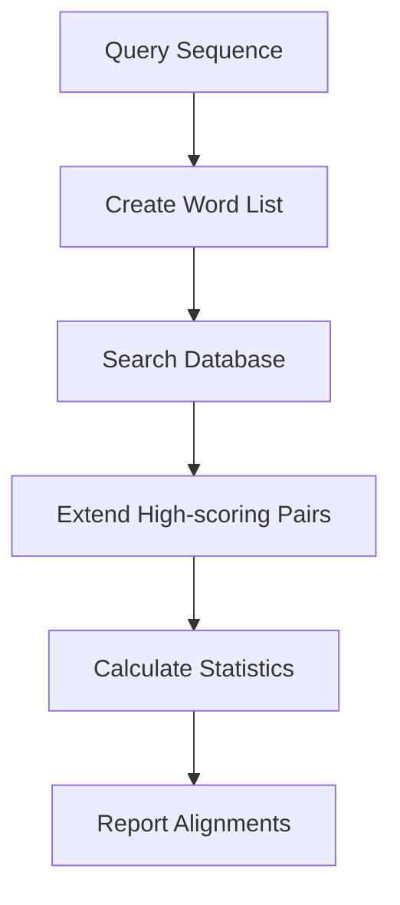

# Module Example: BLAST Algorithm with Citations

This example module demonstrates proper citation practices in a bioinformatics course.

---

## Introduction to BLAST

The Basic Local Alignment Search Tool (BLAST) is one of the most widely used bioinformatics tools for comparing biological sequences[^blast1990]. Since its introduction in 1990, BLAST has been cited over 100,000 times, making it one of the most influential algorithms in computational biology[^altschul2013].

## How BLAST Works

BLAST uses a heuristic approach to find local alignments between sequences[^blast1990]. Unlike the Smith-Waterman algorithm[^smith1981], which guarantees optimal alignments through dynamic programming, BLAST trades some sensitivity for dramatically improved speed.

### The BLAST Algorithm Steps



The algorithm consists of three main phases as described in the original publication[^blast1990]:

1. **Seeding**: Identify short matches (words) between query and database
2. **Extension**: Extend these matches in both directions
3. **Evaluation**: Calculate statistical significance using Karlin-Altschul statistics[^karlin1990]

!!! cite "Foundational Paper"
    **Altschul, S.F., Gish, W., Miller, W., Myers, E.W., & Lipman, D.J.** (1990).
    Basic local alignment search tool. *Journal of Molecular Biology*, 215(3), 403-410.

    DOI: [10.1016/S0022-2836(05)80360-2](https://doi.org/10.1016/S0022-2836(05)80360-2)

    This seminal paper introduced BLAST and revolutionized sequence database searching.

## BLAST Variants

Over the years, several BLAST variants have been developed:

| Program | Purpose | Reference |
|---------|---------|-----------|
| **BLASTN** | Nucleotide vs nucleotide | Altschul et al., 1990[^blast1990] |
| **BLASTP** | Protein vs protein | Altschul et al., 1990[^blast1990] |
| **BLASTX** | Nucleotide vs protein | Gish & States, 1993[^gish1993] |
| **PSI-BLAST** | Position-specific iterative | Altschul et al., 1997[^psiblast] |
| **DELTA-BLAST** | Domain-enhanced lookup | Boratyn et al., 2012[^deltablast] |

### PSI-BLAST: Iterative Searching

PSI-BLAST (Position-Specific Iterative BLAST) uses position-specific scoring matrices to detect distant evolutionary relationships[^psiblast]. This approach is particularly effective for identifying remote homologs in protein families.

!!! tip "When to Use PSI-BLAST"
    Use PSI-BLAST when searching for distant homologs or when initial BLASTP searches return few significant hits. The iterative approach can reveal relationships not detected by standard BLAST.

## Statistical Significance

BLAST uses E-values (Expect values) to assess statistical significance[^karlin1990]. The E-value represents the number of alignments with a given score expected by chance in a database of a particular size.

**E-value interpretation:**
- E < 0.001: Highly significant
- 0.001 < E < 0.01: Significant
- 0.01 < E < 1: Marginally significant
- E > 1: Not significant

$$
E = Kmn \cdot e^{-\lambda S}
$$

where:
- $K$ and $\lambda$ are database-dependent constants
- $m$ and $n$ are sequence lengths
- $S$ is the alignment score

## Using BLAST: Practical Examples

### Online BLAST at NCBI

The NCBI provides a web interface for BLAST searches[^ncbi-blast]:

1. Navigate to [https://blast.ncbi.nlm.nih.gov/](https://blast.ncbi.nlm.nih.gov/)
2. Select the appropriate BLAST program
3. Enter your query sequence
4. Choose the target database
5. Adjust parameters if needed
6. Click "BLAST"

!!! info "NCBI BLAST Resources"
    **NCBI Resource Coordinators.** (2023). Database resources of the National Center
    for Biotechnology Information. *Nucleic Acids Research*.

    - Main portal: [https://blast.ncbi.nlm.nih.gov/](https://blast.ncbi.nlm.nih.gov/)
    - Documentation: [https://www.ncbi.nlm.nih.gov/books/NBK279690/](https://www.ncbi.nlm.nih.gov/books/NBK279690/)
    - Accessed: January 20, 2026

### Command-Line BLAST+

For high-throughput analysis, use BLAST+ command-line tools[^camacho2009]:

```bash
# Create BLAST database
makeblastdb -in database.fasta -dbtype nucl -out mydb

# Run BLASTN search
blastn -query query.fasta -db mydb -out results.txt \
       -evalue 1e-5 -outfmt 6

# BLASTP with custom output format
blastp -query proteins.fasta -db nr -remote \
       -outfmt "7 qseqid sseqid pident length evalue bitscore"
```

!!! example "Installing BLAST+"
    **Camacho, C., et al.** (2009). BLAST+: architecture and applications.
    *BMC Bioinformatics*, 10, 421.

    Download: [https://ftp.ncbi.nlm.nih.gov/blast/executables/blast+/](https://ftp.ncbi.nlm.nih.gov/blast/executables/blast+/)

    Installation guide: [https://www.ncbi.nlm.nih.gov/books/NBK52640/](https://www.ncbi.nlm.nih.gov/books/NBK52640/)

## BLAST Alternatives

Modern alternatives offer improvements in speed and sensitivity:

### DIAMOND

DIAMOND is 500-20,000× faster than BLAST while maintaining similar sensitivity[^diamond]:

```bash
# Build DIAMOND database
diamond makedb --in reference.fasta -d reference

# Run DIAMOND search
diamond blastp -d reference -q queries.fasta -o results.tsv \
               --sensitive -f 6
```

### MMseqs2

MMseqs2 (Many-against-Many sequence searching) achieves similar sensitivity to BLAST with much greater speed[^mmseqs2]:

```bash
# Create database
mmseqs createdb sequences.fasta DB

# Search
mmseqs search queryDB targetDB resultDB tmp

# Convert to BLAST format
mmseqs convertalis queryDB targetDB resultDB result.m8
```

### Comparison Table

| Tool | Speed | Sensitivity | Best Use Case |
|------|-------|-------------|---------------|
| BLAST | Baseline | High | General purpose, well-documented |
| BLAST+ | 2-3× faster | High | Command-line workflows |
| DIAMOND | 100-20,000× | High | Large-scale protein searches |
| MMseqs2 | 100-1000× | Very high | Clustering, iterative searches |

## Exercise: BLAST Analysis

!!! question "Hands-On Exercise"
    **Task**: Use BLASTP to identify the function of an unknown protein sequence.

    **Query Sequence:**
    ```
    >Unknown_Protein
    MKTAYIAKQRQISFVKSHFSRQLEERLGLIEVQAPILSRVGDGTQDNLSGAEKAVQVKVKALPDAQFEVVHSLAKWKRQTLGQHDFSAGEGLYTHMKALRPDEDRLSPLHSVYVDQWDWERVMGDGERQFSTLKSTVEAIWAGIKATEAAVSEEFGLAPFLPDQIHFVHSQELLSRYPDLDAKGRERAIAKDLGAVFLVGIGGKLSDGHRHDVRAPDYDDWSTPSELGHAGLNGDILVWNPVLEDAFELSSMGIRVDADTLKHQLALTGDEDRLELEWHQALLRGEMPQTIGGGIGQSRLTMLLLQLPHIGQVQAGVWPAAVRESVPSLL
    ```

    **Steps:**
    1. Go to [NCBI BLASTP](https://blast.ncbi.nlm.nih.gov/Blast.cgi?PAGE=Proteins)
    2. Paste the sequence above
    3. Use default parameters with the "nr" database
    4. Analyze the results

??? success "Expected Results"
    This sequence is **heat shock protein 70 (HSP70)**, a molecular chaperone.

    - Top hits should be HSP70 homologs from various organisms
    - E-values should be extremely low (< 1e-100)
    - Percent identity should be > 40% for most organisms
    - Conserved domains: HSP70 family

    **Functional annotation**: Molecular chaperone involved in protein folding,
    preventing aggregation, and assisting in protein degradation.

## Further Reading

### Essential Reviews

- Comprehensive BLAST guide[^madden2013]
- Sequence similarity searching overview[^pearson2013]
- Modern developments in homology searching[^steinegger2018]

### Online Tutorials

- [NCBI BLAST Tutorial](https://www.ncbi.nlm.nih.gov/books/NBK52640/)
- [Galaxy BLAST Training](https://training.galaxyproject.org/)
- [EBI BLAST Help](https://www.ebi.ac.uk/Tools/sss/blast/)

---

## References

[^blast1990]: Altschul, S.F., Gish, W., Miller, W., Myers, E.W., & Lipman, D.J. (1990).
              Basic local alignment search tool. *Journal of Molecular Biology*, 215(3), 403-410.
              DOI: [10.1016/S0022-2836(05)80360-2](https://doi.org/10.1016/S0022-2836(05)80360-2)

[^smith1981]: Smith, T.F., & Waterman, M.S. (1981). Identification of common molecular
              subsequences. *Journal of Molecular Biology*, 147(1), 195-197.
              DOI: [10.1016/0022-2836(81)90087-5](https://doi.org/10.1016/0022-2836(81)90087-5)

[^karlin1990]: Karlin, S., & Altschul, S.F. (1990). Methods for assessing the statistical
               significance of molecular sequence features by using general scoring schemes.
               *Proceedings of the National Academy of Sciences*, 87(6), 2264-2268.
               DOI: [10.1073/pnas.87.6.2264](https://doi.org/10.1073/pnas.87.6.2264)

[^altschul2013]: Altschul, S.F. (2013). The origins of sequence alignment. *Nature Biotechnology*,
                 31(11), 1005-1007. DOI: [10.1038/nbt.2719](https://doi.org/10.1038/nbt.2719)

[^gish1993]: Gish, W., & States, D.J. (1993). Identification of protein coding regions by
             database similarity search. *Nature Genetics*, 3(3), 266-272.
             DOI: [10.1038/ng0393-266](https://doi.org/10.1038/ng0393-266)

[^psiblast]: Altschul, S.F., et al. (1997). Gapped BLAST and PSI-BLAST: a new generation of
             protein database search programs. *Nucleic Acids Research*, 25(17), 3389-3402.
             DOI: [10.1093/nar/25.17.3389](https://doi.org/10.1093/nar/25.17.3389)

[^deltablast]: Boratyn, G.M., et al. (2012). Domain enhanced lookup time accelerated BLAST.
               *Biology Direct*, 7, 12. DOI: [10.1186/1745-6150-7-12](https://doi.org/10.1186/1745-6150-7-12)

[^camacho2009]: Camacho, C., et al. (2009). BLAST+: architecture and applications.
                *BMC Bioinformatics*, 10, 421.
                DOI: [10.1186/1471-2105-10-421](https://doi.org/10.1186/1471-2105-10-421)

[^diamond]: Buchfink, B., Xie, C., & Huson, D.H. (2015). Fast and sensitive protein alignment
            using DIAMOND. *Nature Methods*, 12(1), 59-60.
            DOI: [10.1038/nmeth.3176](https://doi.org/10.1038/nmeth.3176)

[^mmseqs2]: Steinegger, M., & Söding, J. (2017). MMseqs2 enables sensitive protein sequence
            searching for the analysis of massive data sets. *Nature Biotechnology*, 35(11), 1026-1028.
            DOI: [10.1038/nbt.3988](https://doi.org/10.1038/nbt.3988)

[^madden2013]: Madden, T. (2013). The BLAST Sequence Analysis Tool. In *The NCBI Handbook* (2nd ed.).
               National Center for Biotechnology Information.
               Available: [https://www.ncbi.nlm.nih.gov/books/NBK153387/](https://www.ncbi.nlm.nih.gov/books/NBK153387/)

[^pearson2013]: Pearson, W.R. (2013). An introduction to sequence similarity ("homology") searching.
                *Current Protocols in Bioinformatics*, Chapter 3, Unit 3.1.
                DOI: [10.1002/0471250953.bi0301s42](https://doi.org/10.1002/0471250953.bi0301s42)

[^steinegger2018]: Steinegger, M., & Söding, J. (2018). Clustering huge protein sequence sets in
                   linear time. *Nature Communications*, 9, 2542.
                   DOI: [10.1038/s41467-018-04964-5](https://doi.org/10.1038/s41467-018-04964-5)

[^ncbi-blast]: NCBI. (2023). *BLAST: Basic Local Alignment Search Tool*.
               National Center for Biotechnology Information.
               Main portal: [https://blast.ncbi.nlm.nih.gov/](https://blast.ncbi.nlm.nih.gov/)
               Documentation: [https://www.ncbi.nlm.nih.gov/books/NBK279690/](https://www.ncbi.nlm.nih.gov/books/NBK279690/)
               Accessed January 20, 2026.

---

**Navigation:** [← Previous Module](index.md) | [↑ Course Index](index.md) | [Next Module →](module-2.md)
