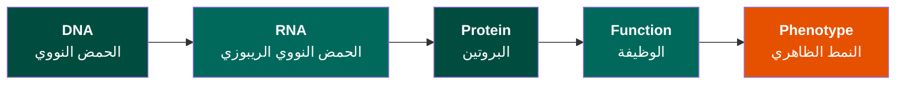

# الفصل الأول: البيانات الحيوية
**من الجزيئات إلى المعلومات**

> **المفهوم الأساسي**: قبل أن نتمكن من تحليل البيانات البيولوجية حاسوبياً، يجب أن نفهم كيف يصبح الواقع البيولوجي الفيزيائي معلومات رقمية—وما نكسبه وما نخسره في هذا التحول. فكل تغيير يجلب مع نوع من الفقد أو التشويش.

---

## نظرة عامة على الفصل

بشكل مبسط هذا جزء من تدريب للطلبة.

**المدة**: 2-3 أسابيع
**المتطلبات الأساسية**: علم الأحياء الجزيئي الأساسي
**مستوى البرمجة**: لا يلزم - أساس مفاهيمي

### أهداف التعلم

بنهاية هذا الفصل، ستكون قادراً على:

1. ✓ شرح كيفية تجريد الجزيئات البيولوجية إلى بيانات رقمية
2. ✓ التمييز بين أنواع بيانات التسلسل والبنية والتعبير والتفاعل
3. ✓ فهم كيف تنتج التقنيات التجريبية تمثيلات بيانات مختلفة
4. ✓ التعرف على المعلومات المحفوظة مقابل المفقودة في تمثيل البيانات
5. ✓ تقييم موثوقية وقيود مجموعات البيانات البيولوجية
6. ✓ ربط الأسئلة البيولوجية بالمناهج الحسابية المناسبة

---

## الموضوعات

###  بداية سريعة: مثال مبسط

**لنبدأ بشيء ملموس قبل النظرية.**

تخيل أن لديك قطرة دم. بالداخل ملايين الخلايا، كل منها تحتوي على DNA:

!!! example "من الواقع الفيزيائي إلى البيانات الرقمية"

    **الخطوة 1: الواقع الفيزيائي**

    ```mermaid
    graph TB
        DNA["<b>جزيء DNA في نواة خليتك</b>"]

        DNA --> View1["<b>من ناحية البنية</b>"]
        DNA --> View2["<b>من ناحية الكيمياء</b>"]
        DNA --> View3["<b>من ناحية الوظيفة</b>"]
        DNA --> View4["<b>من ناحية الموقع</b>"]

        View1 --> A["حلزون مزدوج ثلاثي الأبعاد<br/>ملفوف حول بروتينات الهيستون"]
        View2 --> B["مُعدَّل بعلامات الميثيلة<br/>تنظيم إبيجيني"]
        View3 --> C["يُقرأ باستمرار<br/>بواسطة الآلية الجزيئية"]
        View4 --> D["جزء من الكروموسوم 17<br/>موقع جين BRCA1"]

        style DNA fill:#004D40,color:#fff,font-size:18px
        style View1 fill:#00695C,color:#fff,font-size:16px
        style View2 fill:#00695C,color:#fff,font-size:16px
        style View3 fill:#00695C,color:#fff,font-size:16px
        style View4 fill:#00695C,color:#fff,font-size:16px
        style A fill:#00796B,color:#fff,font-size:15px
        style B fill:#00796B,color:#fff,font-size:15px
        style C fill:#00796B,color:#fff,font-size:15px
        style D fill:#00796B,color:#fff,font-size:15px
    ```

    **الخطوة 2: الرحلة**

    ```mermaid
    graph LR
        A["<b>عينة دم</b><br/>فيزيائي"] --> B["<b>استخلاص DNA</b><br/>كيميائي"]
        B --> C["<b>جهاز التسلسل</b><br/>إشارات بصرية"]
        C --> D["<b>الكمبيوتر</b><br/>ملف رقمي"]

        style A fill:#004D40,color:#fff,font-size:17px
        style B fill:#00695C,color:#fff,font-size:17px
        style C fill:#E65100,color:#fff,font-size:17px
        style D fill:#1B5E20,color:#fff,font-size:17px
    ```

    **الخطوة 3: ما تحصل عليه كبيانات**
    ```
    ملف نصي (تنسيق FASTQ):
    @ReadID_12345
    ATGGATTTATCTGCTCTTCGCGTTGAAGAAGTACAAAATGTCATTAATGC
    +
    IIIIIIIHHHHHHGGGGGFFFFFFFEEEEEDDDDDCCCCCBBBBBAAA@@
    ```

**ماذا حدث للتو؟**

-  **اكتُسِب**: سجل رقمي قابل للبحث والمشاركة والتحليل
-  **فُقِد**: البنية ثلاثية الأبعاد، سياق البروتين، التعديلات الكيميائية، الموقع الكروموسومي

**هذا هو السؤال الأساسي للفصل 1**: ماذا نكسب وماذا نخسر عندما تصبح البيولوجيا بيانات؟

---

### 1. البيولوجيا كمعلومات

#### 🧬 المبدأ الأساسي كتدفق للمعلومات



يمثل كل سهم:
- عملية فيزيائية/كيميائية
- تحويل معلومات
- نقطة قياس محتملة
- فرصة لتوليد البيانات

!!! question "سؤال للتأمل"
    إذا كنت تدرس مرضاً، في أي نقطة من هذا التدفق يجب أن تقيس؟

---

#### 📊 المعلومات مقابل البيانات

| المعلومات | البيانات |
|-----------|---------|
| "الحقيقة" البيولوجية | قياسنا للحقيقة |
| تسلسل DNA الفعلي | ملف FASTQ |
| مستوى التعبير الحقيقي | عدد قراءات RNA-seq |
| البنية ثلاثية الأبعاد الحقيقية | إحداثيات PDB |

!!! warning "نقطة أساسية"
    **البيانات ليست الحقيقة—إنها دليل مع عدم يقين**

---

### 2. مشكلة القياس

كل قياس بيولوجي يتضمن:

```
الواقع البيولوجي ← التقنية التجريبية ← الإشارة الخام ← المعالجة ← البيانات
   (مجهول)           (تُدخل التحيز)        (مشوشة)    (افتراضات)   (تمثيل)
```

#### مثال: تسلسل جزيء DNA

=== "الواقع"
    ```
    جزيء DNA مستمر فعلي
    ATGCGATCGTAGCTAGCT...
    ```
    - سياق الجزيء معروف
    - البنية ثلاثية الأبعاد محفوظة
    - التعديلات الإبيجينية موجودة

=== "التقنية"
    ```
    تسلسل Illumina
    ↓
    - تجزئة DNA
    - كشف بصري
    - قياسات فلورية
    ```

=== "البيانات"
    ```
    ملف FASTQ
    @read1
    ATGCGATCGTAGCTAGCT
    +
    IIIHHHHGGGGFFFFEEE
    ```
    - نص منفصل
    - درجات جودة
    - فقدان السياق

??? note "ما الذي فُقِد؟"
    - ❌ سياق الجزيء الأصلي (أين كان هذا في الجينوم؟)
    - ❌ البنية ثلاثية الأبعاد (أصبح الآن نصاً خطياً)
    - ❌ التعديلات الإبيجينية (الميثيلة لم تُلتقط)
    - ❌ الديناميكيات الزمنية (متى تم التعبير عن هذا؟)

??? success "ما الذي اكتُسِب؟"
    - ✓ القابلية للبحث (يمكن استخدام BLAST)
    - ✓ القابلية للمقارنة (يمكن المحاذاة مع المرجع)
    - ✓ القابلية لإعادة الإنتاج (يمكن المشاركة رقمياً)
    - ✓ القابلية للحساب (يمكن التحليل بالخوارزميات)

---

### 3. أنواع البيانات البيولوجية

#### أ. بيانات التسلسل

**التجريد الخطي لـ DNA/RNA/البروتين**

##### 🧬 تسلسلات DNA

**الواقع الفيزيائي:**
- حلزون مزدوج (بنية ثلاثية الأبعاد، ديناميكية)
- تنظيم الكروماتين (هيستونات، حلقات، أقاليم)
- تعديلات إبيجينية (ميثيلة، أسيتيلة)
- ارتباطات بروتينية

**تمثيل البيانات:**
```
ATGCGATCGTAGCTAGCTGATCGATCG
```

!!! example "مثال"
    === "الجينوم البشري"
        - 3.2 مليار زوج قاعدي
        - ~20,000 جين مشفر للبروتين
        - التنسيق: FASTA/FASTQ
        - الحجم: ~3 جيجابايت (غير مضغوط)

    === "جين واحد"
        ```
        >BRCA1 جين سرطان الثدي البشري 1
        ATGGATTTATCTGCTCTTCGCGTTGAAGAAGTACAAAATGTCATTAATGCTATGCAGAAAATC
        TTAGAGTGTCCCATCTGTCTGGAGTTGATCAAGGAACCTGTCTCCACAAAGTGTGACCACACAT
        ```

##### 🧪 تسلسلات RNA

**الفرق عن DNA:**
- T ← U (يوراسيل بدلاً من ثايمين)
- لا إنترونات بعد الربط
- تسلسل مشفر فقط

```
DNA الجينومي:  ATGCGT[----إنترون 2000bp----]TCGATC
mRNA:          AUGCGU UCGAUC
```

##### 🔬 تسلسلات البروتين

**أبجدية من 20 حرفاً:**
```
MKTAYIAKQRQISFVKSHFSRQLEERLGLIEVQAPILSRVGDGT
```

- مستوى تجريد إضافي
- كل 3 نيوكليوتيدات ← حمض أميني واحد
- البنية ثلاثية الأبعاد غير مرئية في التسلسل

---

#### ب. بيانات البنية

**تمثيل الجزيئات ثلاثية الأبعاد**

##### تنسيق PDB

```
ATOM      1  N   MET A   1      20.154  29.699   5.276  1.00 49.05           N
ATOM      2  CA  MET A   1      21.439  29.725   5.961  1.00 49.05           C
ATOM      3  C   MET A   1      21.441  28.969   7.279  1.00 49.05           C
```

يمثل كل سطر ذرة واحدة:
- رقم الذرة
- نوع الذرة (N = نيتروجين)
- البقايا (MET = ميثيونين)
- معرف السلسلة (A)
- إحداثيات X, Y, Z (أنجستروم)
- عامل B (مؤشر المرونة)

##### تقنيات تحديد البنية

| التقنية | الدقة | ملاحظات |
|---------|-------|---------|
| بلورية الأشعة السينية | 1-3 Å | يتطلب بلورة |
| Cryo-EM | 2-10 Å | لا يتطلب بلورة |
| NMR | منخفضة | محلول، ديناميكي |
| AlphaFold | متغيرة* | توقع حسابي (وليس تجريبي) |

*ثقة ودقة AlphaFold تختلف حسب منطقة البروتين

---

#### ج. بيانات التعبير

**قياس "كم؟"**

##### من البيولوجيا المستمرة إلى العد المنفصل

**مثال RNA-seq (سير عمل نموذجي):**

```
خلية ← استخراج RNA ← تحضير المكتبة ← التسلسل ← المحاذاة ← مصفوفة العد
(~10⁵ جزيء mRNA)  (~10⁶ في المكتبة)  (~10⁷ قراءة)  (~10⁶ محاذاة)
```

##### مصفوفة العد

```
         Sample1  Sample2  Sample3
Gene1       145      523      189
Gene2      2341     2156     2405
Gene3         0        1        0
Gene4       856      901      823
```

!!! warning "هذه ليست 'الحقيقة'"
    - قد يُعَبَّر عن Gene3 لكنه لم يُكتشف (حساسية منخفضة)
    - قد تكون أعداد Gene2 مضخمة بسبب قراءات متعددة الترسيم
    - التباين التقني مقابل البيولوجي
    - تأثيرات الدفعة (مختبرات، أيام، فنيون مختلفون)

##### أشكال تطبيع البيانات

=== "الأعداد الخام"
    ```
    الجين A: 1450
    الجين B: 234
    ```
    - بسيطة، قابلة للتفسير
    - لكن: غير قابلة للمقارنة بين العينات

=== "TPM (نسخ لكل مليون)"
    ```
    TPM = (القراءات/طول_الجين) × 10⁶ / (مجموع كل القراءات/الطول)

    الجين A: 145.3 TPM
    الجين B: 23.8 TPM
    ```
    - تطبيع داخل العينة
    - يأخذ في الاعتبار طول الجين وعمق التسلسل

=== "محول لوغاريتمياً"
    ```
    log₂(العدد + 1)

    الجين A: 10.5
    الجين B: 7.9
    ```
    - مناسب للتحليل الإحصائي
    - يغير التفسير: جمعي ← ضربي

---

#### د. بيانات التفاعل

**تمثيل العلاقات بين الكيانات البيولوجية**

##### تفاعلات البروتين-البروتين

**الواقع البيولوجي:**
- البروتينات تشكل معقدات عابرة
- توافقات الربط متباينة (nM إلى mM)
- معتمد على السياق (نوع الخلية، الظروف)
- ديناميكي (معدلات التشغيل/الإيقاف)

**تمثيل الشبكة:**

```
البروتين A -- البروتين B
البروتين A -- البروتين C
البروتين B -- البروتين D
```

يُمثَّل كـ:

=== "قائمة الجوار"
    ```
    البروتين A: [البروتين B، البروتين C، البروتين D]
    البروتين B: [البروتين A، البروتين E]
    البروتين C: [البروتين A]
    ```

=== "مصفوفة الجوار"
    ```
         A  B  C  D  E
    A    0  1  1  1  0
    B    1  0  0  0  1
    C    1  0  0  0  0
    ```

##### ما نحتفظ به

✓ أي البروتينات تتفاعل
✓ طوبولوجيا الشبكة (محاور، وحدات)
✓ اتصال المسارات

##### ما نفقده

❌ قوة/توافق الربط
❌ الديناميكيات الزمنية
❌ التنظيم المكاني
❌ الظروف التي يحدث فيها التفاعل

---

### 4. من البيانات إلى الرؤية البيولوجية

#### 🎯 مطابقة الأسئلة بأنواع البيانات

| السؤال البيولوجي | نوع البيانات المطلوب | السبب |
|-------------------|---------------------|-------|
| هل الجين X متحور في السرطان؟ | تسلسل DNA (ورم مقابل طبيعي) | للكشف عن تغييرات التسلسل |
| هل الجين X مفرط التعبير في الأورام؟ | RNA-seq أو microarray | للتعبير الجيني الكمي |
| ما البروتينات التي يتفاعل معها الجين X؟ | بيانات تفاعل بروتين-بروتين | لفهم السياق الوظيفي |
| أين يقع بروتين الجين X؟ | بيانات تصوير أو توطين | الوظيفة تعتمد على الموقع |
| كيف يختلف بروتين الجين X المتحور بنيوياً؟ | بنية البروتين (تجريبية/متوقعة) | للرؤية ثلاثية الأبعاد لتأثيرات الطفرة |

---

### 5. تقييم جودة البيانات

!!! danger "البيانات الحقيقية فوضوية"

#### مثال: مجموعة بيانات التعبير الجيني

```
الجين    عينة1   عينة2   عينة3   عينة4
الجين A    145      523    189000     189
الجين B   2341     2156     2405     2301
الجين C      0        1        0        0
الجين D    856      901      823      -99
```

**أسئلة:**

1. ما الخطأ في الجين A في العينة 3؟
   ← على الأرجح خطأ - قيمة شاذة

2. هل الجين C مُعَبَّر عنه؟
   ← أعداد صفرية - غير مكتشف أو غير مُعَبَّر؟

3. ماذا يعني -99 للجين D؟
   ← قيمة مفقودة؟ تحقق من البيانات الوصفية

4. هل يجب أن تثق بالعينة 1 إذا كانت مختلفة بشكل منهجي؟
   ← تأثير الدفعة؟

---

## 📝 التمارين

### التمرين 1: فهم التجريد

قارن هذه التمثيلات للجين نفسه:

1. **DNA الجينومي**: `ATGCGT[إنترون 2000bp]TCGATC`
2. **mRNA**: `AUGCGUUCGAUC`
3. **البروتين**: `MRKSD`

**أسئلة:**
- ما العمليات البيولوجية التي حدثت بين كل تمثيل؟
- متى تستخدم كل تمثيل؟
- ما المعلومات المفقودة في كل خطوة؟

### التمرين 2: اختيار أنواع البيانات

لكل سؤال، اختر نوع البيانات الأنسب:

1. تحديد مثبطات محتملة لإنزيم
2. العثور على جينات مُعَبَّر عنها تفاضلياً في المرض
3. فهم تطور عائلة بروتين
4. التنبؤ بتأثير طفرة مرض

??? success "حلول التمارين"

    ### التمرين 1: فهم التجريد

    **العمليات البيولوجية بين التمثيلات:**

    1. **DNA الجينومي ← mRNA**:
       - **النسخ (Transcription)**: RNA بوليميراز يقرأ قالب DNA
       - **الربط (Splicing)**: إزالة الإنترونات، ضم الإكسونات
       - **النتيجة**: تسلسل ترميزي مستمر (بدون إنترونات)

    2. **mRNA ← البروتين**:
       - **الترجمة (Translation)**: الريبوسوم يقرأ كودونات mRNA
       - **كل 3 نيوكليوتيدات (كودون) ← حمض أميني واحد**
       - **النتيجة**: تسلسل خطي من الأحماض الأمينية

    **متى تستخدم كل تمثيل:**

    | التمثيل | حالات الاستخدام الأفضل |
    |---------|------------------------|
    | **DNA الجينومي** | • دراسة الطفرات<br/>• العثور على العناصر التنظيمية<br/>• فهم بنية الجين |
    | **mRNA** | • قياس التعبير الجيني<br/>• دراسة الربط البديل<br/>• تحليل متغيرات النسخ |
    | **البروتين** | • فهم الوظيفة<br/>• تحليل البنية ثلاثية الأبعاد<br/>• تحديد أهداف الأدوية |

    **المعلومات المفقودة في كل خطوة:**

    - **DNA ← mRNA**:
      - ❌ الإنترونات والمناطق بين الجينات
      - ❌ العناصر التنظيمية (المحفزات، المعززات)
      - ❌ سياق الكروماتين
      - ❌ تعديلات DNA (الميثيلة)

    - **mRNA ← البروتين**:
      - ❌ المناطق غير المترجمة (UTRs)
      - ❌ معلومات استخدام الكودون
      - ❌ البنية الثانوية لـ RNA
      - ❌ التعديلات بعد النسخ

    ---

    ### التمرين 2: اختيار أنواع البيانات

    **1. تحديد مثبطات محتملة لإنزيم**

    **الإجابة**: **بيانات بنية البروتين** (PDB)

    **السبب**:
    - تحتاج إلى بنية ثلاثية الأبعاد لتحديد مواقع الربط
    - تصميم الأدوية المعتمد على البنية يتطلب إحداثيات ذرية
    - يمكن نمذجة رسو المثبط

    **2. العثور على جينات مُعَبَّر عنها تفاضلياً في المرض**

    **الإجابة**: **بيانات التعبير الجيني** (RNA-seq أو microarray)

    **السبب**:
    - تحتاج إلى قياسات تعبير كمية
    - مقارنة الأنسجة المريضة مقابل الصحية
    - التحليل الإحصائي لبيانات العد

    **3. فهم تطور عائلة بروتين**

    **الإجابة**: **بيانات تسلسل البروتين** (من أنواع متعددة)

    **السبب**:
    - تحتاج إلى تسلسلات من كائنات ذات صلة
    - المحاذاة المتعددة للتسلسل تكشف عن الحفظ
    - التحليل الوراثي يُظهر العلاقات التطورية

    **4. التنبؤ بتأثير طفرة مرض**

    **الإجابة**: **مزيج من**:
    - **بنية البروتين** (لرؤية موقع الطفرة)
    - **حفظ التسلسل** (عبر الأنواع)
    - **قواعد بيانات المتغيرات** (dbSNP، ClinVar للتأثيرات المعروفة)

    **السبب**:
    - البنية توضح إذا كانت الطفرة تعطل الموقع النشط
    - الحفظ يشير إلى الأهمية الوظيفية
    - البيانات السريرية توفر دليلاً على الإمراضية

---

## 📚 القراءات

### مطلوبة

1. **Noble (2009)**: "دليل سريع لتنظيم مشاريع البيولوجيا الحسابية"
   *التركيز*: كيفية تنظيم البيانات البيولوجية

2. **Markowetz (2017)**: "كل البيولوجيا هي بيولوجيا حسابية"
   *التركيز*: لماذا الحوسبة ضرورية

### إضافية

3. **Baggerly & Coombes (2009)**: جودة البيانات وقابلية إعادة الإنتاج (حكاية تحذيرية)

4. وثائق نموذج بيانات NCBI

---

## ✅ التقييم الذاتي

بعد إكمال هذا الفصل، يجب أن تكون قادراً على:

- [ ] شرح كيف يصبح جزيء DNA ملف FASTA
- [ ] تحديد ما يُفقد عند تمثيل بروتين كملف PDB
- [ ] التمييز بين بيانات التسلسل والبنية والتعبير
- [ ] شرح لماذا تنتج التقنيات التجريبية المختلفة تنسيقات بيانات مختلفة
- [ ] تقييم موثوقية وقيود مجموعة بيانات بيولوجية
- [ ] مطابقة الأسئلة البيولوجية بأنواع البيانات المناسبة
- [ ] فهم أن "البيانات" ليست "حقيقة" بل دليل مع عدم يقين

!!! tip "غير واثق؟"
    راجع المحاضرات ذات الصلة أو احضر ساعات المكتب

---

## 🔗 الارتباط بالفصول المستقبلية

!!! info "لماذا هذا الفصل مهم"
    قبل البرمجة (الفصل 2)، يجب أن تفهم:
    - ما تمثله البيانات البيولوجية
    - كيفية التفكير في تجريد البيانات
    - ما يمكن (ولا يمكن) أن تخبرك به أنواع البيانات المختلفة

    هذا الأساس المفاهيمي يمكّنك من:
    ✓ اختيار أساليب تحليل مناسبة
    ✓ تفسير النتائج بشكل صحيح
    ✓ التعرف على مشكلات جودة البيانات
    ✓ تصميم التجارب الحسابية بشكل صحيح

**الفصل التالي**: [الفصل 2: البرمجة](module-2.md) - الآن بعد أن فهمت *ما هي* البيانات البيولوجية، ستتعلم *كيفية* العمل معها حسابياً.

---

[↑ فهرس المقرر](index.md) | [التالي: الفصل 2 ←](module-2.md) | [🌐 عرض بالإنجليزية](/en/courses/foundation-of-bioinformatics/module-1/)
