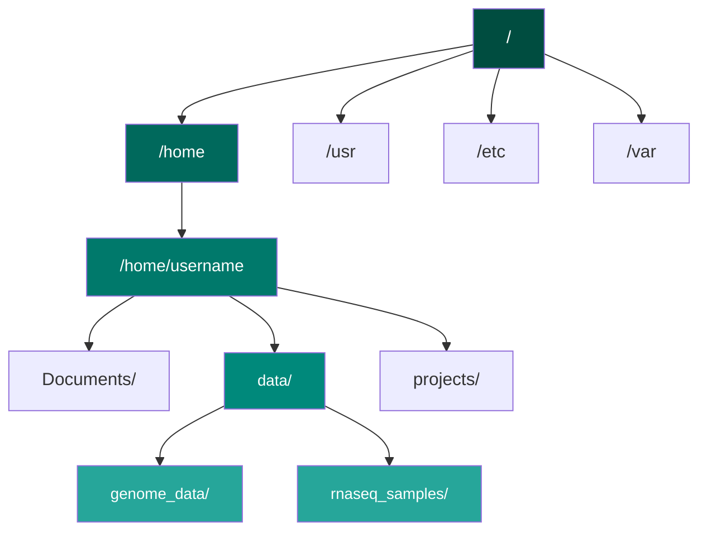

# الفصل الثاني: أساسيات Linux
**بيئة العمل الأساسية للمعلوماتية الحيوية**

> **المفهوم الأساسي**: معظم أدوات المعلوماتية الحيوية تعمل على Linux. قبل البرمجة، يجب أن تتقن التعامل مع سطر الأوامر والنظام البيئي لـ Linux.

---

## نظرة عامة على الفصل

**المدة**: 2-3 أسابيع
**المتطلبات الأساسية**: الفصل 1 (البيانات الحيوية)
**مستوى البرمجة**: لا يلزم - المهارات الأساسية

### أهداف التعلم

بنهاية هذا الفصل، ستكون قادراً على:

1. ✓ التنقل في نظام الملفات Linux باستخدام سطر الأوامر
2. ✓ إدارة الملفات والمجلدات (إنشاء، نقل، نسخ، حذف)
3. ✓ قراءة وتحرير الملفات النصية
4. ✓ البحث عن الملفات والنصوص داخلها
5. ✓ فهم الصلاحيات والملكية في Linux
6. ✓ تشغيل العمليات وإدارتها
7. ✓ كتابة سكريبتات Shell بسيطة للأتمتة
8. ✓ استخدام SSH للوصول إلى الخوادم البعيدة

---

## الموضوعات

### 1. لماذا Linux في المعلوماتية الحيوية؟

#### 🖥️ Linux هو المعيار


**لماذا؟**

- ✓ معظم أدوات المعلوماتية الحيوية مصممة لـ Linux
- ✓ الحوسبة عالية الأداء (HPC) تعمل على Linux
- ✓ قابلية الأتمتة - سكريبتات لمعالجة آلاف الملفات
- ✓ قوي وفعال لمعالجة البيانات الكبيرة
- ✓ مفتوح المصدر ومجاني

!!! example "مثال واقعي"
    تحليل بيانات RNA-seq لـ 100 عينة:

    - ❌ **بدون Linux**: نقر يدوي لكل عينة (أيام من العمل)
    - ✓ **مع Linux**: سكريبت واحد يعالج الكل (دقائق من كتابة الكود)

---

### 2. البداية: سطر الأوامر

#### 🔤 Shell - لغة الحوار مع النظام

**Shell** هو البرنامج الذي يفسر أوامرك ويحولها إلى إجراءات.

```bash
# هذا هو سطر الأوامر
user@computer:~$
```

**تشريح سطر الأوامر:**

<div dir="ltr">

```
user@computer:~/Documents$ pwd
│    │        │           │
│    │        │           └─> الأمر (طباعة المسار الحالي)
│    │        └─> المسار الحالي (~/ = المجلد الرئيسي)
│    └─> اسم الجهاز
└─> اسم المستخدم
```

</div>

#### أول أمر لك

=== "الأمر"
    ```bash
    pwd
    ```

=== "ماذا يعني؟"
    **P**rint **W**orking **D**irectory - اطبع المجلد الحالي

=== "النتيجة"
    ```
    /home/username
    ```

!!! tip "نصيحة ذهبية"
    **Tab للإكمال التلقائي** - أقوى ميزة في سطر الأوامر!

    اكتب بداية الاسم واضغط Tab:
    ```bash
    cd Docu[Tab]  →  cd Documents/
    ```

---

### 3. التنقل في نظام الملفات

#### 🗂️ بنية الملفات في Linux



#### الأوامر الأساسية للتنقل

| الأمر | الوظيفة | مثال |
|------|---------|------|
| `pwd` | طباعة المسار الحالي | `pwd` |
| `ls` | عرض محتويات المجلد | `ls -lh` |
| `cd` | الانتقال إلى مجلد | `cd /home/user/data` |
| `cd ..` | الرجوع مجلد للخلف | `cd ..` |
| `cd ~` | العودة للمجلد الرئيسي | `cd ~` |

#### رموز المسارات الخاصة

```bash
~     # المجلد الرئيسي  (/home/username)
.     # المجلد الحالي
..    # المجلد الأعلى
/     # الجذر (root)
-     # المجلد السابق
```

!!! example "تمرين عملي"
    ```bash
    # أين أنت الآن؟
    pwd

    # ماذا يوجد هنا؟
    ls

    # انتقل إلى مجلد Documents
    cd Documents

    # ارجع خطوة للخلف
    cd ..

    # اذهب مباشرة إلى المجلد الرئيسي
    cd ~
    ```

---

### 4. إدارة الملفات والمجلدات

#### 📁 إنشاء وحذف

=== "إنشاء"
    ```bash
    # إنشاء مجلد
    mkdir project_name

    # إنشاء عدة مجلدات
    mkdir -p data/raw data/processed results

    # إنشاء ملف فارغ
    touch analysis.txt
    ```

=== "نسخ"
    ```bash
    # نسخ ملف
    cp source.txt destination.txt

    # نسخ مجلد كامل
    cp -r folder1/ folder2/
    ```

=== "نقل/إعادة تسمية"
    ```bash
    # نقل ملف
    mv file.txt /path/to/destination/

    # إعادة تسمية
    mv old_name.txt new_name.txt
    ```

=== "حذف"
    ```bash
    # حذف ملف
    rm file.txt

    # حذف مجلد فارغ
    rmdir empty_folder/

    # حذف مجلد وكل محتوياته
    rm -r folder/

    # حذف بدون تأكيد (خطر!)
    rm -rf folder/
    ```

!!! danger "تحذير مهم"
    ```bash
    rm -rf /
    ```
    **لا تفعل هذا أبداً!** يحذف النظام بالكامل بلا رجعة.

---

### 5. قراءة الملفات النصية

#### 📄 عرض محتوى الملفات

| الأمر | الاستخدام | الأنسب لـ |
|------|----------|----------|
| `cat` | طباعة كل الملف | ملفات صغيرة |
| `less` | عرض تفاعلي | ملفات كبيرة |
| `head` | أول 10 أسطر | فحص سريع |
| `tail` | آخر 10 أسطر | ملفات السجل (logs) |
| `head -n 20` | أول 20 سطر | تخصيص العدد |

#### مثال على ملف بيانات حيوية

```bash
# عرض أول 10 أسطر من ملف FASTQ
head genome_reads.fastq
```

**النتيجة:**

<div dir="ltr">

```
@SRR001666.1
GGTGCTTCTGGGCATCCTTGAGTTCAAGTCC
+
IIIIIIIIIIIIIIIIIIIIIIIIIIIIIII
@SRR001666.2
ATCGATCGATCGATCGATCGATCGATCGATC
+
HHHHHHHHHHHHHHHHHHHHHHHHHHHHHH
```

</div>

#### عد الأسطر والكلمات

```bash
# عد الأسطر في ملف
wc -l genome.fasta

# عد الأحرف
wc -c genome.fasta

# عد الكلمات
wc -w genome.fasta
```

---

### 6. البحث والتصفية

#### 🔍 البحث عن ملفات - `find`

```bash
# البحث عن ملفات FASTA
find . -name "*.fasta"

# البحث عن ملفات أكبر من 1GB
find . -size +1G

# البحث عن ملفات مُعدلة آخر 7 أيام
find . -mtime -7
```

#### البحث داخل الملفات - `grep`

```bash
# البحث عن كلمة في ملف
grep "BRCA1" genes.txt

# البحث في عدة ملفات
grep "mutation" *.txt

# البحث مع تجاهل حالة الأحرف
grep -i "cancer" report.txt

# عرض رقم السطر
grep -n "gene" annotations.txt

# عد التطابقات فقط
grep -c ">" sequences.fasta
```

!!! example "مثال عملي"
    **كم عدد التسلسلات في ملف FASTA؟**

    ```bash
    # كل تسلسل يبدأ بـ >
    grep -c ">" genome.fasta
    ```

---

### 7. الأنابيب وإعادة التوجيه

#### 🔗 ربط الأوامر - Pipes

**الأنبوب `|`** يرسل مخرجات أمر كمدخلات لأمر آخر:

```bash
# عرض أول 100 سطر، ثم البحث عن "gene"
head -n 100 data.txt | grep "gene"

# عد الملفات في المجلد
ls | wc -l

# ترتيب النتائج وإزالة التكرار
cat genes.txt | sort | uniq
```

#### إعادة التوجيه - Redirection

```bash
# حفظ المخرجات في ملف (يستبدل المحتوى)
ls -l > files_list.txt

# الإضافة للملف (لا يستبدل)
echo "New line" >> log.txt

# إعادة توجيه الأخطاء
command 2> errors.txt

# إعادة توجيه كل شيء
command &> all_output.txt
```

!!! example "سير عمل حقيقي"
    **استخراج معرفات الجينات من ملف FASTA:**

    ```bash
    grep ">" sequences.fasta | \
        cut -d " " -f 1 | \
        sed 's/>//' \
        > gene_ids.txt
    ```

---

### 8. الصلاحيات في Linux

#### 🔒 فهم الصلاحيات

```bash
ls -l genome.fasta
```

**النتيجة:**

<div dir="ltr">

```
-rw-r--r-- 1 user group 3200000 Jan 15 10:30 genome.fasta
│││││││││
│││││││││
│││└└└└└└─ صلاحيات الآخرين (r--)
││└└└─ صلاحيات المجموعة (r--)
│└└└─ صلاحيات المالك (rw-)
└─ نوع الملف (- = ملف عادي، d = مجلد)
```

</div>

**الصلاحيات:**
- `r` = قراءة (read)
- `w` = كتابة (write)
- `x` = تنفيذ (execute)

#### تغيير الصلاحيات

```bash
# جعل الملف قابل للتنفيذ
chmod +x script.sh

# صلاحيات كاملة للمالك فقط
chmod 700 private_data.txt

# قراءة وتنفيذ للجميع
chmod 755 public_script.sh
```

---

### 9. سكريبتات Shell الأساسية

#### 📜 أول سكريبت لك

**إنشاء ملف `hello.sh`:**

```bash
#!/bin/bash
# هذا تعليق - يتم تجاهله

echo "مرحباً بك في المعلوماتية الحيوية!"
echo "اليوم: $(date)"
echo "المستخدم: $(whoami)"
```

**تشغيل السكريبت:**

```bash
# جعله قابل للتنفيذ
chmod +x hello.sh

# تشغيله
./hello.sh
```

#### المتغيرات في Shell

```bash
#!/bin/bash

# تعريف متغير
GENOME_FILE="human_genome.fasta"
OUTPUT_DIR="results"

# استخدام المتغير
echo "تحليل الملف: $GENOME_FILE"
mkdir -p $OUTPUT_DIR
cp $GENOME_FILE $OUTPUT_DIR/
```

#### الحلقات البسيطة

```bash
#!/bin/bash

# معالجة عدة ملفات
for file in *.fastq
do
    echo "معالجة: $file"
    # أوامر التحليل هنا
done
```

!!! example "سكريبت عملي"
    **تحويل جميع ملفات FASTQ إلى FASTA:**

    ```bash
    #!/bin/bash

    for fastq in *.fastq
    do
        # الحصول على اسم الملف بدون الامتداد
        base=$(basename $fastq .fastq)

        # التحويل
        seqtk seq -a $fastq > ${base}.fasta

        echo "تم: $base"
    done
    ```

---

### 10. الوصول البعيد - SSH

#### 🌐 الاتصال بالخوادم

```bash
# الاتصال بخادم
ssh username@server.university.edu

# الاتصال بمنفذ مخصص
ssh -p 2222 username@server.edu

# نسخ ملف إلى الخادم
scp local_file.txt username@server.edu:/path/on/server/

# نسخ ملف من الخادم
scp username@server.edu:/path/to/file.txt ./

# نسخ مجلد كامل
scp -r local_folder/ username@server.edu:/path/
```

#### استخدام HPC

```bash
# الاتصال بـ Shaheen
ssh username@shaheen.kaust.edu.sa

# عرض الوظائف الجارية
squeue -u username

# إرسال وظيفة
sbatch job_script.sh
```

---

## 📝 التمارين

### التمرين 1: التنقل الأساسي

1. اطبع المسار الحالي
2. أنشئ مجلد اسمه `bioinformatics_project`
3. داخله، أنشئ ثلاثة مجلدات: `data`, `scripts`, `results`
4. أنشئ ملف فارغ اسمه `README.md` في المجلد الرئيسي

### التمرين 2: معالجة ملفات FASTA

لديك ملف `sequences.fasta`:

```fasta
>gene1
ATGCGATCGATCG
>gene2
GCTAGCTAGCTAG
>gene3
TTAAGGCCTTAA
```

**المطلوب:**

1. كم عدد التسلسلات؟
2. استخرج فقط أسماء الجينات
3. احفظ الناتج في ملف `gene_names.txt`

### التمرين 3: سكريبت بسيط

اكتب سكريبت يأخذ اسم ملف كمدخل ويطبع:
- حجم الملف
- عدد الأسطر
- تاريخ آخر تعديل

??? success "حلول التمارين"

    ### التمرين 1: التنقل الأساسي

    ```bash
    # 1. اطبع المسار الحالي
    pwd

    # 2. أنشئ مجلد
    mkdir bioinformatics_project

    # 3. أنشئ المجلدات الفرعية
    cd bioinformatics_project
    mkdir data scripts results

    # 4. أنشئ ملف README
    touch README.md

    # تحقق من البنية
    ls -R
    ```

    ---

    ### التمرين 2: معالجة ملفات FASTA

    ```bash
    # 1. عد التسلسلات (كل تسلسل يبدأ بـ >)
    grep -c ">" sequences.fasta
    # النتيجة: 3

    # 2. استخراج أسماء الجينات
    grep ">" sequences.fasta
    # النتيجة:
    # >gene1
    # >gene2
    # >gene3

    # 3. حفظ الأسماء فقط (بدون >)
    grep ">" sequences.fasta | sed 's/>//' > gene_names.txt

    # أو باستخدام cut:
    grep ">" sequences.fasta | cut -d ">" -f 2 > gene_names.txt

    # التحقق من النتيجة
    cat gene_names.txt
    ```

    ---

    ### التمرين 3: سكريبت معلومات الملف

    **إنشاء `file_info.sh`:**

    ```bash
    #!/bin/bash

    # التحقق من وجود معامل
    if [ $# -eq 0 ]; then
        echo "الاستخدام: $0 <filename>"
        exit 1
    fi

    FILE=$1

    # التحقق من وجود الملف
    if [ ! -f "$FILE" ]; then
        echo "خطأ: الملف '$FILE' غير موجود"
        exit 1
    fi

    # طباعة المعلومات
    echo "معلومات الملف: $FILE"
    echo "===================="

    # الحجم
    echo "الحجم: $(du -h $FILE | cut -f1)"

    # عدد الأسطر
    echo "عدد الأسطر: $(wc -l < $FILE)"

    # تاريخ التعديل
    echo "آخر تعديل: $(stat -c %y $FILE | cut -d'.' -f1)"
    ```

    **الاستخدام:**

    ```bash
    # جعله قابل للتنفيذ
    chmod +x file_info.sh

    # تشغيله
    ./file_info.sh sequences.fasta
    ```

    **النتيجة:**

    <div dir="ltr">

    ```
    معلومات الملف: sequences.fasta
    ====================
    الحجم: 4.0K
    عدد الأسطر: 6
    آخر تعديل: 2026-02-01 14:30:25
    ```

    </div>

---

## 📚 القراءات

### مطلوبة

1. **The Linux Command Line** - William Shotts (الفصول 1-10)
2. **Unix for Biologists** - Ian Korf (مقدمة للمعلوماتيين الحيويين)

### إضافية

3. **Bash Guide for Beginners** - Machtelt Garrels
4. [explainshell.com](https://explainshell.com) - لشرح أي أمر Linux

---

## ✅ التقييم الذاتي

بعد إكمال هذا الفصل، يجب أن تكون قادراً على:

- [ ] التنقل في نظام الملفات بثقة
- [ ] إنشاء وإدارة الملفات والمجلدات
- [ ] البحث عن الملفات والنصوص
- [ ] فهم وتعديل صلاحيات الملفات
- [ ] استخدام الأنابيب وإعادة التوجيه
- [ ] كتابة سكريبتات Shell بسيطة
- [ ] الاتصال بالخوادم عبر SSH
- [ ] معالجة ملفات البيانات الحيوية باستخدام سطر الأوامر

!!! tip "غير واثق؟"
    - مارس يومياً لمدة 15 دقيقة
    - استخدم سطر الأوامر لمهامك اليومية
    - احضر ساعات المكتب للمساعدة

---

## 🔗 الارتباط بالفصول الأخرى

!!! info "لماذا هذا الفصل مهم"
    **من الفصل 1 (البيانات الحيوية):** تعلمت *ما هي* البيانات البيولوجية

    **في هذا الفصل:** تتعلم *كيف تدير* هذه البيانات على Linux

    **للفصل 3 (البرمجة):** ستحتاج Linux لتشغيل كود Python ومعالجة الملفات

    ✓ Linux هو الأساس لكل عمل المعلوماتية الحيوية

**الفصل التالي**: [الفصل 3: البرمجة بـ Python](module-3.md) - الآن بعد أن أتقنت بيئة العمل، ستتعلم البرمجة لتحليل البيانات.

---

[↑ فهرس المقرر](index.md) | [→ السابق: الفصل 1](module-1.md) | [التالي: الفصل 3 ←](module-3.md)
