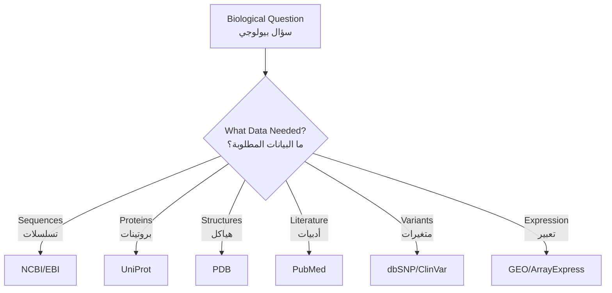

# الفصل الثالث: قواعد البيانات البيولوجية
**الوصول إلى المعرفة البيولوجية العالمية**

> **المفهوم الأساسي**: تبدأ معظم أبحاث المعلوماتية الحيوية باسترجاع البيانات. تحتوي قواعد البيانات البيولوجية العامة على معرفة متراكمة على مدى عقود—تعلم الوصول إليها برمجياً ضروري للأبحاث القابلة لإعادة الإنتاج.

---

## نظرة عامة على الفصل

**المدة**: أسبوعان
**المتطلبات الأساسية**: الفصل الثاني (Python وأساسيات Biopython)
**مستوى البرمجة**: Python متوسط مع استخدام واجهات برمجة التطبيقات

### أهداف التعلم

بإكمال هذا الفصل، ستكون قادراً على:

1. ✓ التنقل في قواعد البيانات البيولوجية الرئيسية وفهم أغراضها
2. ✓ استخدام استراتيجيات بحث متقدمة للعثور على البيانات ذات الصلة
3. ✓ استرجاع البيانات برمجياً باستخدام واجهات برمجة التطبيقات و Biopython
4. ✓ فهم مخططات قواعد البيانات والإحالات المرجعية المتبادلة
5. ✓ بناء خطوط أنابيب آلية لاسترجاع البيانات
6. ✓ التعامل مع حدود المعدل والأخطاء والتحقق من صحة البيانات
7. ✓ دمج البيانات من مصادر متعددة

---

## المواضيع

### 1. مشهد قواعد البيانات البيولوجية

#### 🌐 لماذا العديد من قواعد البيانات؟

علم الأحياء معقد ومتعدد الأوجه. قواعد البيانات المختلفة تخدم أغراضاً مختلفة:



!!! info "فئات قواعد البيانات"
    - **قواعد البيانات الأولية**: تخزن البيانات التجريبية الأصلية (GenBank، PDB)
    - **قواعد البيانات الثانوية**: بيانات مشتقة/منسقة (UniProt، Pfam)
    - **قواعد البيانات المتخصصة**: تركز على كائنات محددة أو أمراض أو أنواع بيانات

---

#### 📊 مزودو قواعد البيانات الرئيسيون

=== "NCBI (الولايات المتحدة)"
    **المركز الوطني لمعلومات التكنولوجيا الحيوية**

    **قواعد البيانات الرئيسية:**
    - GenBank: تسلسلات النيوكليوتيدات
    - Protein: تسلسلات البروتين
    - PubMed: الأدبيات الطبية الحيوية
    - Gene: معلومات محورية عن الجينات
    - GEO: بيانات تعبير الجينات
    - SRA: أرشيف قراءات التسلسل (التسلسل الأولي)
    - dbSNP: متعددات الأشكال النوكليوتيدية المفردة
    - ClinVar: تفسيرات المتغيرات السريرية

    **الوصول الموحد:** نظام Entrez يربط جميع قواعد البيانات

=== "EBI (أوروبا)"
    **المعهد الأوروبي للمعلوماتية الحيوية**

    **قواعد البيانات الرئيسية:**
    - ENA: الأرشيف الأوروبي للنيوكليوتيدات
    - UniProt: تسلسلات ووظائف البروتين
    - Ensembl: تعليقات الجينوم التوضيحية
    - ArrayExpress: تعبير الجينات
    - InterPro: عائلات ونطاقات البروتين
    - ChEMBL: الجزيئات النشطة بيولوجياً

    **واجهات برمجة REST**: وصول حديث قائم على JSON

=== "PDB (عالمي)"
    **بنك بيانات البروتين**

    **التركيز:** بيانات هيكلية ثلاثية الأبعاد

    **يحتوي على:**
    - هياكل بلورية بالأشعة السينية
    - هياكل Cryo-EM
    - هياكل NMR
    - هياكل متوقعة (AlphaFold DB)

    **الوصول:** RCSB PDB (الولايات المتحدة)، PDBe (أوروبا)، PDBj (اليابان)

---

### 2. نظام قواعد بيانات NCBI

#### 🔍 Entrez: نظام البحث الشامل

**Entrez** يربط جميع قواعد بيانات NCBI بلغة استعلام موحدة.

**أمثلة على صيغة البحث:**

```
# البحث في PubMed
CRISPR[Title] AND 2023[PDAT]

# البحث عن جين
BRCA1[Gene Name] AND "Homo sapiens"[Organism]

# البحث عن نيوكليوتيد
1000:2000[Sequence Length] AND genomic[Filter]

# البحث عن بروتين
hemoglobin[Protein Name] AND refseq[Filter]
```

!!! tip "علامات حقول البحث"
    - `[Title]` - البحث في العنوان فقط
    - `[Author]` - اسم المؤلف
    - `[PDAT]` - تاريخ النشر
    - `[Organism]` - الأنواع
    - `[Gene Name]` - رمز الجين
    - `[Filter]` - مرشحات خاصة بقاعدة البيانات

---

#### 📚 قواعد بيانات NCBI الرئيسية

##### GenBank (قاعدة بيانات النيوكليوتيدات)

**ما تحتويه:**
- جميع تسلسلات DNA/RNA المتاحة للعامة
- أكثر من 400 مليون تسلسل
- تحديثات يومية من الباحثين حول العالم

**مثال: استرجاع التسلسلات**

```python
from Bio import Entrez, SeqIO

Entrez.email = "your.email@example.com"

# البحث عن BRCA1 البشري mRNA
handle = Entrez.esearch(
    db="nucleotide",
    term="BRCA1[Gene] AND Homo sapiens[Organism] AND mRNA[Filter]",
    retmax=5
)
record = Entrez.read(handle)
handle.close()

print(f"Found {record['Count']} sequences")
print(f"IDs: {record['IdList']}")

# جلب التسلسل الأول
handle = Entrez.efetch(
    db="nucleotide",
    id=record['IdList'][0],
    rettype="gb",
    retmode="text"
)

seq_record = SeqIO.read(handle, "genbank")
handle.close()

print(f"Sequence ID: {seq_record.id}")
print(f"Description: {seq_record.description}")
print(f"Length: {len(seq_record.seq)} bp")
```

---

##### PubMed (قاعدة بيانات الأدبيات)

**ما تحتويه:**
- أكثر من 35 مليون اقتباس طبي حيوي
- ملخصات لمعظم المقالات
- روابط للنص الكامل (عند توفره)

**مثال: البحث في الأدبيات**

```python
from Bio import Entrez

Entrez.email = "your.email@example.com"

# البحث عن مقالات مراجعة CRISPR
handle = Entrez.esearch(
    db="pubmed",
    term="CRISPR[Title] AND Review[Publication Type] AND 2023[PDAT]",
    retmax=10,
    sort="relevance"
)
record = Entrez.read(handle)
handle.close()

pmids = record['IdList']
print(f"Found {len(pmids)} reviews")

# جلب تفاصيل المقالات
handle = Entrez.efetch(
    db="pubmed",
    id=pmids,
    rettype="medline",
    retmode="text"
)

articles = handle.read()
handle.close()
print(articles)
```

---

##### قاعدة بيانات الجينات

**ما تحتويه:**
- معلومات محورية عن الجينات
- رموز الجينات والأوصاف والمواقع
- روابط إلى التسلسلات والمنشورات والمسارات
- بيانات تعبير الجينات

**مثال: معلومات الجين**

```python
from Bio import Entrez

Entrez.email = "your.email@example.com"

# البحث عن جين BRCA1
handle = Entrez.esearch(
    db="gene",
    term="BRCA1[Gene Name] AND Homo sapiens[Organism]"
)
record = Entrez.read(handle)
handle.close()

gene_id = record['IdList'][0]

# جلب معلومات الجين التفصيلية
handle = Entrez.efetch(
    db="gene",
    id=gene_id,
    retmode="xml"
)

gene_data = Entrez.read(handle)
handle.close()

# استخراج المعلومات
gene = gene_data[0]
print(f"Gene Symbol: {gene['Entrezgene_gene']['Gene-ref']['Gene-ref_locus']}")
print(f"Description: {gene['Entrezgene_gene']['Gene-ref']['Gene-ref_desc']}")
print(f"Chromosome: {gene.get('Entrezgene_chromosome', 'N/A')}")
```

---

##### GEO (مخزن تعبير الجينات)

**ما يحتويه:**
- مجموعات بيانات تعبير الجينات
- بيانات المصفوفة الدقيقة
- بيانات RNA-seq
- بيانات ChIP-seq

**مثال: تصفح مجموعة بيانات GEO**

```python
from Bio import Entrez

Entrez.email = "your.email@example.com"

# البحث عن مجموعات بيانات RNA-seq لسرطان الثدي
handle = Entrez.esearch(
    db="gds",
    term="breast cancer[Title] AND RNA-seq[Filter]",
    retmax=5
)
record = Entrez.read(handle)
handle.close()

print(f"Found {record['Count']} datasets")
for gds_id in record['IdList']:
    print(f"GDS ID: {gds_id}")
```

!!! warning "مجموعات بيانات كبيرة"
    يمكن أن تكون مجموعات بيانات GEO ضخمة (جيجابايتات). استخدم واجهة الويب أولاً لفهم هيكل البيانات قبل التنزيل برمجياً.

---

### 3. UniProt: قاعدة معرفة البروتين

#### 🧬 تنظيم UniProt

UniProt مقسمة إلى قسمين:

```
UniProt
├── Swiss-Prot (منسق)
│   ├── مشروح يدوياً
│   ├── جودة عالية
│   └── ~570,000 إدخال
└── TrEMBL (آلي)
    ├── مشروح حاسوبياً
    ├── ثقة أقل
    └── ~240 مليون إدخال
```

---

#### 🔎 البحث والاسترجاع في UniProt

**ميزات واجهة الويب:**
- منشئ استعلامات متقدم
- التصفية حسب الكائن الحي والدليل ودرجة التعليق
- التنزيل بتنسيقات متعددة (FASTA، XML، TSV)

**مثال: الوصول البرمجي**

```python
import requests

def search_uniprot(query, format='fasta'):
    """
    البحث في UniProt واسترجاع النتائج.

    Args:
        query: سلسلة استعلام UniProt
        format: تنسيق الإخراج (fasta, tab, xml)

    Returns:
        نص الاستجابة
    """
    url = "https://rest.uniprot.org/uniprotkb/search"

    params = {
        'query': query,
        'format': format,
        'size': 10  # حد النتائج
    }

    response = requests.get(url, params=params)

    if response.ok:
        return response.text
    else:
        raise Exception(f"UniProt request failed: {response.status_code}")

# مثال: البحث عن كينازات بشرية
query = "organism_id:9606 AND (protein_name:kinase)"
results = search_uniprot(query, format='tab')
print(results)
```

---

#### 📋 هيكل إدخال UniProt

كل إدخال UniProt يحتوي على:

```
معلومات الإدخال:
├── التسلسل
├── الوظيفة (مصطلحات GO، الكلمات المفتاحية)
├── الموقع تحت الخلوي
├── التفاعلات بروتين-بروتين
├── التعديلات ما بعد الترجمة
├── ارتباطات الأمراض
├── المعلومات الهيكلية
├── الإحالات المرجعية المتبادلة (PDB، GenBank، إلخ)
└── الاقتباسات الأدبية
```

**مثال: جلب بروتين معين**

```python
import requests

def get_uniprot_entry(accession):
    """الحصول على إدخال UniProt بواسطة رقم الانضمام."""
    url = f"https://rest.uniprot.org/uniprotkb/{accession}.txt"

    response = requests.get(url)

    if response.ok:
        return response.text
    else:
        raise Exception(f"Entry {accession} not found")

# مثال: مثبط الورم البشري p53
p53_data = get_uniprot_entry("P04637")
print(p53_data[:500])  # طباعة أول 500 حرف
```

---

### 4. PDB: قاعدة بيانات هيكل البروتين

#### 🏗️ ما يحتويه PDB

**بيانات هيكلية:**
- أكثر من 200,000 هيكل تجريبي
- بلورة بالأشعة السينية (الأغلبية)
- Cryo-EM (تنمو بسرعة)
- هياكل NMR
- هياكل متوقعة من AlphaFold (قاعدة بيانات منفصلة)

---

#### 🔍 استراتيجيات البحث في PDB

=== "بواسطة اسم البروتين"
    ```python
    from Bio.PDB import PDBList

    pdbl = PDBList()

    # تنزيل الهيكل بواسطة المعرف
    pdbl.retrieve_pdb_file('1HHO', pdir='.', file_format='pdb')
    # 1HHO هو هيكل الهيموجلوبين
    ```

=== "بواسطة تشابه التسلسل"
    ```python
    import requests

    def search_pdb_by_sequence(sequence):
        """البحث في PDB باستخدام تشابه تسلسل BLAST."""
        url = "https://search.rcsb.org/rcsbsearch/v2/query"

        query = {
            "query": {
                "type": "terminal",
                "service": "sequence",
                "parameters": {
                    "evalue_cutoff": 0.1,
                    "identity_cutoff": 0.9,
                    "sequence_type": "protein",
                    "value": sequence
                }
            },
            "return_type": "entry"
        }

        response = requests.post(url, json=query)
        return response.json()

    # مثال البحث
    seq = "MVLSPADKTNVKAAWGKVGAHAGEYGAEALERMFLSFPTT"
    results = search_pdb_by_sequence(seq)
    ```

=== "بواسطة الدقة"
    ```python
    import requests

    def search_high_resolution_structures(max_resolution=2.0):
        """العثور على هياكل عالية الدقة."""
        url = "https://search.rcsb.org/rcsbsearch/v2/query"

        query = {
            "query": {
                "type": "terminal",
                "service": "text",
                "parameters": {
                    "attribute": "rcsb_entry_info.resolution_combined",
                    "operator": "less_or_equal",
                    "value": max_resolution
                }
            },
            "return_type": "entry"
        }

        response = requests.post(url, json=query)
        return response.json()
    ```

---

#### 📐 تحليل ملفات PDB

```python
from Bio.PDB import PDBParser, PDBIO

# تحليل ملف PDB
parser = PDBParser()
structure = parser.get_structure("protein", "1hho.pdb")

# استخراج المعلومات
for model in structure:
    for chain in model:
        print(f"Chain {chain.id}:")
        residues = list(chain.get_residues())
        print(f"  Residues: {len(residues)}")

        # عد أنواع الذرات
        atoms = list(chain.get_atoms())
        print(f"  Atoms: {len(atoms)}")

# حساب مركز الكتلة
def center_of_mass(structure):
    """حساب مركز الكتلة للهيكل."""
    coords = []
    for atom in structure.get_atoms():
        coords.append(atom.coord)

    import numpy as np
    coords = np.array(coords)
    return coords.mean(axis=0)

com = center_of_mass(structure)
print(f"Center of mass: {com}")
```

---

### 5. استراتيجيات دمج البيانات

#### 🔗 الربط بين قواعد البيانات

قواعد البيانات المختلفة تشير إلى بعضها البعض من خلال المعرفات:

```
معرف بروتين GenBank ─→ رقم انضمام UniProt ─→ معرف هيكل PDB
      ↓                      ↓                     ↓
   NP_000537              P04637                1TUP
   (p53 RefSeq)        (p53 Swiss-Prot)    (هيكل p53)
```

**مثال: خط أنابيب متعدد قواعد البيانات**

```python
from Bio import Entrez, SeqIO
import requests

Entrez.email = "your.email@example.com"

def gene_to_structure_pipeline(gene_name, organism):
    """
    استرجاع المعلومات من الجين إلى الهيكل.

    خط الأنابيب:
    1. العثور على الجين في قاعدة بيانات NCBI Gene
    2. الحصول على تسلسل البروتين من GenBank
    3. العثور على إدخال UniProt
    4. البحث عن هياكل PDB
    """
    results = {}

    # الخطوة 1: العثور على الجين
    print(f"1. البحث عن الجين: {gene_name}")
    handle = Entrez.esearch(
        db="gene",
        term=f"{gene_name}[Gene Name] AND {organism}[Organism]"
    )
    gene_record = Entrez.read(handle)
    handle.close()

    if gene_record['IdList']:
        gene_id = gene_record['IdList'][0]
        results['gene_id'] = gene_id
        print(f"   وجد معرف الجين: {gene_id}")
    else:
        print("   لم يتم العثور على الجين")
        return results

    # الخطوة 2: الحصول على تسلسل البروتين
    print("2. استرجاع تسلسل البروتين")
    handle = Entrez.elink(
        dbfrom="gene",
        db="protein",
        id=gene_id
    )
    link_record = Entrez.read(handle)
    handle.close()

    if link_record[0]['LinkSetDb']:
        protein_ids = [link['Id'] for link in link_record[0]['LinkSetDb'][0]['Link']]
        results['protein_ids'] = protein_ids[:3]  # أول 3
        print(f"   وجد {len(protein_ids)} تسلسلات بروتين")

    # الخطوة 3: البحث في UniProt (باستخدام اسم الجين)
    print("3. البحث في UniProt")
    query = f"gene:{gene_name} AND organism_name:{organism}"
    uniprot_url = "https://rest.uniprot.org/uniprotkb/search"

    response = requests.get(uniprot_url, params={'query': query, 'format': 'json', 'size': 1})

    if response.ok:
        data = response.json()
        if data['results']:
            uniprot_acc = data['results'][0]['primaryAccession']
            results['uniprot'] = uniprot_acc
            print(f"   وجد UniProt: {uniprot_acc}")

    # الخطوة 4: البحث في PDB
    print("4. البحث عن هياكل PDB")
    pdb_url = "https://search.rcsb.org/rcsbsearch/v2/query"

    pdb_query = {
        "query": {
            "type": "terminal",
            "service": "text",
            "parameters": {
                "attribute": "rcsb_entity_source_organism.rcsb_gene_name.value",
                "operator": "exact_match",
                "value": gene_name
            }
        },
        "return_type": "entry"
    }

    response = requests.post(pdb_url, json=pdb_query)
    if response.ok:
        pdb_data = response.json()
        if 'result_set' in pdb_data:
            pdb_ids = [hit['identifier'] for hit in pdb_data['result_set']]
            results['pdb_ids'] = pdb_ids[:5]  # أول 5
            print(f"   وجد {len(pdb_ids)} هياكل PDB")

    return results

# مثال الاستخدام
results = gene_to_structure_pipeline("TP53", "Homo sapiens")
print("\n=== نتائج خط الأنابيب ===")
for key, value in results.items():
    print(f"{key}: {value}")
```

---

### 6. أفضل الممارسات للوصول إلى قواعد البيانات

#### ⚡ تحديد المعدل والوصول الأخلاقي

!!! danger "قواعد حرجة"
    1. **اضبط بريدك الإلكتروني**: استخدم دائماً `Entrez.email = "your@email.com"`
    2. **احترم حدود المعدل**:
       - NCBI: 3 طلبات/ثانية (10/ثانية مع مفتاح API)
       - UniProt: لا يوجد حد صارم، لكن كن معقولاً
       - PDB: لا يوجد حد صارم
    3. **لا تطرق الخوادم**: أضف تأخيرات بين الطلبات
    4. **خزن النتائج**: لا تعيد تنزيل نفس البيانات

**مثال: استرجاع محدود المعدل**

```python
from Bio import Entrez
import time

Entrez.email = "your.email@example.com"

def fetch_sequences_safely(id_list, delay=0.34):
    """
    جلب التسلسلات مع تحديد المعدل.

    Args:
        id_list: قائمة معرفات GenBank
        delay: ثوان بين الطلبات (0.34 = ~3 طلب/ثانية)
    """
    sequences = []

    for i, seq_id in enumerate(id_list):
        print(f"جلب {i+1}/{len(id_list)}: {seq_id}")

        try:
            handle = Entrez.efetch(
                db="nucleotide",
                id=seq_id,
                rettype="fasta",
                retmode="text"
            )
            sequences.append(handle.read())
            handle.close()

            # تحديد المعدل
            time.sleep(delay)

        except Exception as e:
            print(f"خطأ في جلب {seq_id}: {e}")
            continue

    return sequences

# مثال
ids = ["NM_007294", "NM_000546", "NM_001904"]
seqs = fetch_sequences_safely(ids)
```

---

#### 💾 تخزين البيانات المنزلة مؤقتاً

**لا تعيد التنزيل دون داعٍ:**

```python
import os
import pickle
from datetime import datetime, timedelta

def cached_database_query(query_func, cache_file, max_age_days=7):
    """
    تخزين نتائج استعلام قاعدة البيانات مؤقتاً.

    Args:
        query_func: دالة تنفذ الاستعلام
        cache_file: مسار ملف التخزين المؤقت
        max_age_days: الحد الأقصى لعمر التخزين المؤقت بالأيام
    """
    # تحقق من وجود التخزين المؤقت وحداثته
    if os.path.exists(cache_file):
        cache_age = datetime.now() - datetime.fromtimestamp(
            os.path.getmtime(cache_file)
        )

        if cache_age < timedelta(days=max_age_days):
            print(f"استخدام البيانات المخزنة مؤقتاً (العمر: {cache_age.days} أيام)")
            with open(cache_file, 'rb') as f:
                return pickle.load(f)

    # فشل التخزين المؤقت أو انتهت صلاحيته - استعلام قاعدة البيانات
    print("الاستعلام عن قاعدة البيانات...")
    result = query_func()

    # حفظ في التخزين المؤقت
    with open(cache_file, 'wb') as f:
        pickle.dump(result, f)

    return result

# مثال الاستخدام
def query_brca1():
    """دالة استعلام مثالية."""
    from Bio import Entrez
    Entrez.email = "your.email@example.com"

    handle = Entrez.esearch(db="gene", term="BRCA1[Gene] AND human[Organism]")
    result = Entrez.read(handle)
    handle.close()
    return result

# استخدم النسخة المخزنة مؤقتاً
data = cached_database_query(query_brca1, "brca1_cache.pkl", max_age_days=7)
```

---

#### 🛡️ معالجة الأخطاء

**الشبكات تفشل. خطط لذلك:**

```python
from Bio import Entrez
import time

def robust_fetch(db, id, rettype, retmode, max_retries=3):
    """الجلب مع إعادة المحاولة التلقائية."""
    Entrez.email = "your.email@example.com"

    for attempt in range(max_retries):
        try:
            handle = Entrez.efetch(
                db=db,
                id=id,
                rettype=rettype,
                retmode=retmode
            )
            result = handle.read()
            handle.close()
            return result

        except Exception as e:
            print(f"المحاولة {attempt + 1} فشلت: {e}")

            if attempt < max_retries - 1:
                wait_time = 2 ** attempt  # تراجع أسي
                print(f"إعادة المحاولة في {wait_time} ثوان...")
                time.sleep(wait_time)
            else:
                print("تم الوصول إلى الحد الأقصى لإعادة المحاولة")
                raise

# مثال
try:
    data = robust_fetch("nucleotide", "NM_007294", "fasta", "text")
    print("نجح!")
except Exception as e:
    print(f"فشل استرجاع البيانات: {e}")
```

---

## 📝 التمارين

### التمرين 1: البحث في قواعد بيانات متعددة

اكتب دالة:
1. تأخذ رمز الجين كمدخل
2. تبحث في قاعدة بيانات NCBI Gene
3. تسترجع تسلسلات البروتين المرتبطة
4. تعثر على مقالات PubMed ذات الصلة
5. ترجع قاموس ملخص

### التمرين 2: خط أنابيب التنزيل الدفعي

أنشئ نصاً برمجياً:
1. يقرأ قائمة انضمام البروتين من ملف
2. ينزل كل تسلسل من UniProt
3. يحفظ في ملف FASTA واحد
4. ينفذ تحديد معدل مناسب
5. يتعامل مع الأخطاء بأمان

### التمرين 3: التحقق من الإحالات المرجعية المتبادلة

ابنِ أداة:
1. تأخذ رقم انضمام UniProt
2. تتحقق من الإحالات المرجعية المتبادلة إلى GenBank و PDB
3. تقرر عن قواعد البيانات التي لديها بيانات
4. تصدر جدول ملخص

---

## 📚 القراءات

### مطلوب

1. **موارد قواعد بيانات NCBI**
   *التركيز*: نظرة عامة على نظام NCBI

2. **UniProt: مركز عالمي لمعرفة البروتين** (2019)
   *التركيز*: تنظيم UniProt وجودة البيانات

### تكميلي

3. **أرشيف بيانات PDB** - فهم البيانات الهيكلية
4. **أفضل الممارسات لدمج قواعد البيانات** - مصدر البيانات

---

## ✅ التقييم الذاتي

بعد إكمال هذا الفصل، يجب أن تكون قادراً على:

- [ ] تحديد قاعدة البيانات المناسبة لنوع بيانات معين
- [ ] إنشاء استعلامات Entrez متقدمة
- [ ] كتابة نصوص Python لاسترجاع البيانات من NCBI و UniProt و PDB
- [ ] تنفيذ تحديد المعدل المناسب ومعالجة الأخطاء
- [ ] تخزين البيانات المنزلة مؤقتاً لتجنب الاستعلامات الزائدة
- [ ] بناء خطوط أنابيب تدمج قواعد بيانات متعددة
- [ ] التحقق من جودة البيانات والإحالات المرجعية المتبادلة
- [ ] فهم دورات تحديث قواعد البيانات والإصدارات

!!! tip "مشروع تدريبي"
    ابنِ أداة استعلام قاعدة بيانات شخصية تجمع عمليات البحث الأكثر استخداماً في دوال قابلة لإعادة الاستخدام.

---

## 🔗 الارتباط بالفصول المستقبلية

!!! info "لماذا قواعد البيانات مهمة"
    **الفصل الرابع** (محاذاة التسلسلات) يتطلب:
    - التسلسلات المسترجعة للمقارنة
    - تسلسلات متعددة متماثلة من قواعد البيانات
    - تسلسلات مرجعية للتحقق

    **الفصل الخامس** (الإحصاء) يتطلب:
    - بيانات التعبير من GEO
    - بيانات تعريف العينة
    - مجموعات بيانات كبيرة للتحليل

**الفصل التالي**: [الفصل الرابع: محاذاة التسلسلات](module-4.md) - الآن بعد أن أصبحت قادراً على استرجاع البيانات البيولوجية، ستتعلم مقارنة التسلسلات باستخدام الخوارزميات الحسابية.

---

[↑ فهرس المقرر](index.md) | [← الفصل الثاني](module-2.md) | [التالي: الفصل الرابع →](module-4.md) | [🌐 عرض بالإنجليزية](/en/courses/foundation-of-bioinformatics/module-3/)
