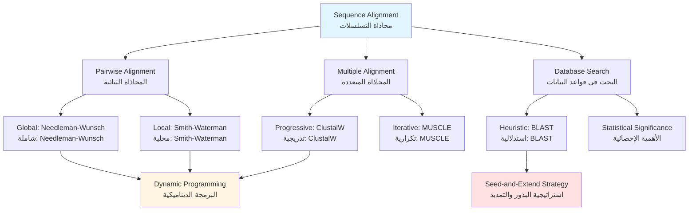
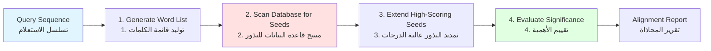
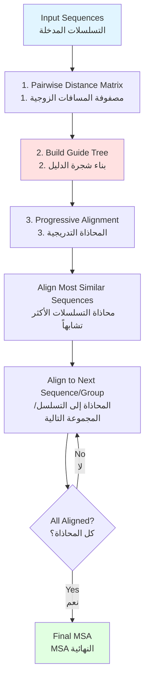

# الفصل الرابع: خوارزميات محاذاة التسلسلات
**إيجاد التشابه في التسلسلات البيولوجية**

> **المفهوم الأساسي**: محاذاة التسلسلات هي أساس علم الجينوم المقارن، مما يسمح لنا بتحديد العلاقات التطورية، والتنبؤ بوظائف البروتينات، وفهم الآليات البيولوجية من خلال تشابه التسلسلات.

## أهداف التعلم

بنهاية هذا الفصل، ستكون قادراً على:

1. **فهم خوارزميات المحاذاة** وأسسها النظرية
2. **تطبيق البرمجة الديناميكية** للمحاذاة الثنائية المثلى
3. **استخدام BLAST والطرق الاستدلالية** للبحث في قواعد البيانات
4. **إجراء محاذاة التسلسلات المتعددة** للتحليل التطوري
5. **بناء أشجار النشوء والتطور** من التسلسلات المحاذاة
6. **تحليل تعقيد الخوارزميات** واختيار الطرق المناسبة
7. **تفسير إحصائيات المحاذاة** ودرجات الأهمية

---

## المتطلبات الأساسية

!!! info "المعرفة المطلوبة"
    - **الفصل 1**: التسلسلات البيولوجية وخصائصها
    - **الفصل 2**: أساسيات البرمجة بلغة Python و Biopython
    - **الفصل 3**: الوصول إلى قواعد البيانات البيولوجية
    - **الرياضيات**: فهم أساسي للمصفوفات والتكرار

---

## نظرة عامة على الفصل



---

## 1. المحاذاة الثنائية للتسلسلات

### 1.1 مشكلة المحاذاة

**ما هي محاذاة التسلسلات؟**

المحاذاة تنظم التسلسلات لتحديد مناطق التشابه التي قد تشير إلى:
- **العلاقات التطورية** (التماثل)
- **العلاقات الوظيفية** (البروتينات المتشابهة غالباً لها وظائف متشابهة)
- **العلاقات البنيوية** (التسلسلات المحفوظة غالباً لها بنى محفوظة)

=== "مثال محاذاة DNA"
    ```
    Sequence 1: ACGTACGT
    Sequence 2: ACGTTCGT
                ||||*|||
                تطابق مع عدم تطابق واحد
    ```

=== "مثال محاذاة البروتينات"
    ```
    Sequence 1: MALWMRLLPL
    Sequence 2: MALW-RLLPL
                ****-*****
                تطابق مع فجوة واحدة
    ```

### 1.2 أنظمة التسجيل

**مكونات درجة المحاذاة:**

1. **درجات التطابق/عدم التطابق**
   - بسيطة: +1 للتطابق، -1 لعدم التطابق
   - مصفوفات الاستبدال: BLOSUM، PAM

2. **عقوبات الفجوات**
   - خطية: العقوبة = عقوبة_الفجوة × طول_الفجوة
   - تآلفية: العقوبة = فتح_الفجوة + تمديد_الفجوة × طول_الفجوة

!!! tip "عقوبات الفجوات التآلفية"
    العقوبات التآلفية واقعية بيولوجياً لأن:
    - فتح فجوة (حدث إدخال/حذف) نادر
    - تمديد فجوة موجودة أكثر احتمالاً
    - المعادلة: `العقوبة = -d - (k-1)×e` حيث d=الفتح، e=التمديد، k=طول الفجوة

### 1.3 مصفوفات الاستبدال

**BLOSUM (مصفوفة استبدال الكتل)**

```python
from Bio.SubsMat import MatrixInfo

# تحميل مصفوفة BLOSUM62
blosum62 = MatrixInfo.blosum62

# الحصول على درجة محاذاة الليوسين (L) مع الإيزوليوسين (I)
score = blosum62[('L', 'I')]
print(f"BLOSUM62 score for L-I: {score}")  # الناتج: 2

# الحصول على درجة محاذاة الليوسين (L) مع حمض الأسبارتيك (D)
score = blosum62.get(('L', 'D'), blosum62.get(('D', 'L')))
print(f"BLOSUM62 score for L-D: {score}")  # الناتج: -4
```

**فهم أرقام BLOSUM:**

- **BLOSUM62**: بناءً على محاذاة التسلسلات ذات تطابق ≥62%
- **BLOSUM80**: للتسلسلات الأكثر تشابهاً (التطور الحديث)
- **BLOSUM45**: للتسلسلات الأكثر بعداً (التطور القديم)

??? example "إنشاء دالة تسجيل بسيطة"
    ```python
    def score_match(char1, char2, match=1, mismatch=-1):
        """دالة تسجيل بسيطة للنيوكليوتيدات."""
        if char1 == char2:
            return match
        else:
            return mismatch

    def affine_gap_penalty(gap_length, gap_open=-5, gap_extend=-1):
        """حساب عقوبة الفجوة التآلفية."""
        if gap_length == 0:
            return 0
        return gap_open + (gap_length - 1) * gap_extend

    # مثال الاستخدام
    print(score_match('A', 'A'))  # 1
    print(score_match('A', 'T'))  # -1
    print(affine_gap_penalty(3))  # -5 + 2*(-1) = -7
    ```

---

## 2. خوارزميات البرمجة الديناميكية

### 2.1 Needleman-Wunsch: المحاذاة الشاملة

خوارزمية **Needleman-Wunsch** تجد المحاذاة الشاملة المثلى بين تسلسلين.

**خطوات الخوارزمية:**

1. **تهيئة** مصفوفة التسجيل
2. **ملء** المصفوفة باستخدام التكرار
3. **التتبع العكسي** لإيجاد المحاذاة المثلى

=== "الكود الكاذب للخوارزمية"
    ```
    1. تهيئة الصف والعمود الأول بعقوبات الفجوات
    2. لكل خلية (i,j):
       F(i,j) = max(
           F(i-1,j-1) + s(xi, yj),    # تطابق/عدم تطابق
           F(i-1,j) + gap_penalty,     # فجوة في التسلسل y
           F(i,j-1) + gap_penalty      # فجوة في التسلسل x
       )
    3. التتبع العكسي من F(m,n) إلى F(0,0)
    ```

=== "تنفيذ Python"
    ```python
    import numpy as np

    def needleman_wunsch(seq1, seq2, match=1, mismatch=-1, gap=-2):
        """
        خوارزمية Needleman-Wunsch للمحاذاة الشاملة.

        الإرجاع:
            score: درجة المحاذاة
            alignment1: التسلسل الأول المحاذى
            alignment2: التسلسل الثاني المحاذى
        """
        m, n = len(seq1), len(seq2)

        # تهيئة مصفوفة التسجيل
        score_matrix = np.zeros((m + 1, n + 1))

        # تهيئة الصف والعمود الأول
        for i in range(m + 1):
            score_matrix[i][0] = gap * i
        for j in range(n + 1):
            score_matrix[0][j] = gap * j

        # ملء مصفوفة التسجيل
        for i in range(1, m + 1):
            for j in range(1, n + 1):
                match_score = match if seq1[i-1] == seq2[j-1] else mismatch

                diagonal = score_matrix[i-1][j-1] + match_score
                up = score_matrix[i-1][j] + gap
                left = score_matrix[i][j-1] + gap

                score_matrix[i][j] = max(diagonal, up, left)

        # التتبع العكسي
        align1, align2 = '', ''
        i, j = m, n

        while i > 0 or j > 0:
            if i > 0 and j > 0:
                match_score = match if seq1[i-1] == seq2[j-1] else mismatch
                if score_matrix[i][j] == score_matrix[i-1][j-1] + match_score:
                    align1 = seq1[i-1] + align1
                    align2 = seq2[j-1] + align2
                    i -= 1
                    j -= 1
                    continue

            if i > 0 and score_matrix[i][j] == score_matrix[i-1][j] + gap:
                align1 = seq1[i-1] + align1
                align2 = '-' + align2
                i -= 1
            elif j > 0:
                align1 = '-' + align1
                align2 = seq2[j-1] + align2
                j -= 1

        return score_matrix[m][n], align1, align2

    # مثال الاستخدام
    seq1 = "ACGTACGT"
    seq2 = "ACGTTCGT"
    score, align1, align2 = needleman_wunsch(seq1, seq2)

    print(f"Alignment Score: {score}")
    print(f"Seq1: {align1}")
    print(f"Seq2: {align2}")
    ```

=== "استخدام Biopython"
    ```python
    from Bio import pairwise2
    from Bio.pairwise2 import format_alignment

    seq1 = "ACGTACGT"
    seq2 = "ACGTTCGT"

    # محاذاة شاملة بالتسجيل الافتراضي
    alignments = pairwise2.align.globalxx(seq1, seq2)

    # عرض أفضل محاذاة
    print(format_alignment(*alignments[0]))

    # محاذاة شاملة بتسجيل مخصص
    # المعاملات: تطابق، عدم تطابق، فتح_فجوة، تمديد_فجوة
    alignments = pairwise2.align.globalms(
        seq1, seq2,
        match=2,      # درجة التطابق
        mismatch=-1,  # عقوبة عدم التطابق
        open=-5,      # عقوبة فتح الفجوة
        extend=-1     # عقوبة تمديد الفجوة
    )

    for alignment in alignments[:3]:
        print(format_alignment(*alignment))
    ```

**تحليل التعقيد:**

- **تعقيد الوقت**: O(mn) حيث m, n أطوال التسلسلات
- **تعقيد المساحة**: O(mn) لمصفوفة التسجيل
- **مثالية**: تضمن إيجاد أفضل محاذاة شاملة

!!! warning "متطلبات الذاكرة"
    للتسلسلات الطويلة جداً (>10,000 bp)، قد تصبح الذاكرة محدودة:
    - تسلسلان بطول 10,000 bp يتطلبان ~100 ميجابايت
    - تسلسلان بطول 100,000 bp يتطلبان ~10 جيجابايت
    - ضع في اعتبارك متغيرات المساحة الخطية (خوارزمية Hirschberg) للتسلسلات الكبيرة

### 2.2 Smith-Waterman: المحاذاة المحلية

خوارزمية **Smith-Waterman** تجد المحاذاة المحلية المثلى (أفضل تسلسل فرعي متطابق).

**الاختلافات الرئيسية عن Needleman-Wunsch:**

1. **التهيئة**: الصف والعمود الأول أصفار
2. **التسجيل**: الدرجات السالبة تُضبط على صفر
3. **التتبع العكسي**: يبدأ من أعلى درجة، ينتهي عند الصفر

=== "تعديلات الخوارزمية"
    ```
    التغييرات الرئيسية:
    1. F(0,j) = 0 لكل j
       F(i,0) = 0 لكل i

    2. F(i,j) = max(
           0,                              # جديد: السماح بالصفر
           F(i-1,j-1) + s(xi, yj),
           F(i-1,j) + gap_penalty,
           F(i,j-1) + gap_penalty
       )

    3. التتبع العكسي من max(F) إلى أول صفر
    ```

=== "تنفيذ Python"
    ```python
    def smith_waterman(seq1, seq2, match=2, mismatch=-1, gap=-1):
        """
        خوارزمية Smith-Waterman للمحاذاة المحلية.

        الإرجاع:
            score: أفضل درجة محاذاة محلية
            alignment1: التسلسل الفرعي المحاذى 1
            alignment2: التسلسل الفرعي المحاذى 2
        """
        m, n = len(seq1), len(seq2)
        score_matrix = np.zeros((m + 1, n + 1))

        max_score = 0
        max_pos = (0, 0)

        # ملء مصفوفة التسجيل
        for i in range(1, m + 1):
            for j in range(1, n + 1):
                match_score = match if seq1[i-1] == seq2[j-1] else mismatch

                diagonal = score_matrix[i-1][j-1] + match_score
                up = score_matrix[i-1][j] + gap
                left = score_matrix[i][j-1] + gap

                score_matrix[i][j] = max(0, diagonal, up, left)

                # تتبع موقع أقصى درجة
                if score_matrix[i][j] > max_score:
                    max_score = score_matrix[i][j]
                    max_pos = (i, j)

        # التتبع العكسي من أقصى درجة
        align1, align2 = '', ''
        i, j = max_pos

        while i > 0 and j > 0 and score_matrix[i][j] > 0:
            if i > 0 and j > 0:
                match_score = match if seq1[i-1] == seq2[j-1] else mismatch
                if score_matrix[i][j] == score_matrix[i-1][j-1] + match_score:
                    align1 = seq1[i-1] + align1
                    align2 = seq2[j-1] + align2
                    i -= 1
                    j -= 1
                    continue

            if i > 0 and score_matrix[i][j] == score_matrix[i-1][j] + gap:
                align1 = seq1[i-1] + align1
                align2 = '-' + align2
                i -= 1
            elif j > 0 and score_matrix[i][j] == score_matrix[i][j-1] + gap:
                align1 = '-' + align1
                align2 = seq2[j-1] + align2
                j -= 1
            else:
                break

        return max_score, align1, align2

    # مثال: إيجاد نطاق محفوظ
    protein1 = "AACGTACGTWWWWDEFGHIKLMN"
    protein2 = "XXACGTACGTYYYYY"

    score, align1, align2 = smith_waterman(protein1, protein2)
    print(f"Local Alignment Score: {score}")
    print(f"Region 1: {align1}")
    print(f"Region 2: {align2}")
    ```

=== "استخدام Biopython"
    ```python
    from Bio import pairwise2

    protein1 = "AACGTACGTWWWWDEFGHIKLMN"
    protein2 = "XXACGTACGTYYYYY"

    # محاذاة محلية
    alignments = pairwise2.align.localms(
        protein1, protein2,
        match=2,
        mismatch=-1,
        open=-5,
        extend=-1
    )

    print("أفضل محاذاة محلية:")
    print(format_alignment(*alignments[0]))
    ```

**متى نستخدم أي خوارزمية:**

| حالة الاستخدام | الخوارزمية | السبب |
|----------|-----------|--------|
| مقارنة الجينات الكاملة | Needleman-Wunsch | نحتاج محاذاة كاملة الطول |
| إيجاد النطاقات المحفوظة | Smith-Waterman | نهتم فقط بالمناطق المتشابهة |
| محاذاة بروتينات متماثلة | Needleman-Wunsch | البروتينات بأطوال متشابهة |
| البحث عن الأنماط | Smith-Waterman | النمط هو تسلسل فرعي قصير |
| محاذاة تسلسلات الترميز | Needleman-Wunsch | مقارنة منطقة الترميز بأكملها |

---

## 3. الطرق الاستدلالية: BLAST

### 3.1 لماذا الاستدلال؟

**المشكلة مع البرمجة الديناميكية:**

للبحث في قواعد البيانات، البرمجة الديناميكية بطيئة جداً:
- GenBank يحتوي على >250 مليار نيوكليوتيد
- محاذاة استعلام 1kb ضد GenBank: ~250 مليار × 1,000 = 10^14 عملية
- حتى بمعدل مليار عملية/ثانية، يستغرق هذا >يوم واحد لكل استعلام

**الحل: BLAST** (أداة البحث عن المحاذاة المحلية الأساسية)

- **التضحيات**: الأمثلية المضمونة
- **المكاسب**: تحسين سرعة 50-100×
- **الاستراتيجية**: استدلال البذور والتمديد

### 3.2 نظرة عامة على خوارزمية BLAST



**خط أنابيب BLAST:**

1. **البذور**: تقسيم الاستعلام إلى كلمات (k-mers، عادة k=3 للبروتينات، k=11 لـ DNA)
2. **المسح**: إيجاد تطابقات دقيقة في قاعدة البيانات (بذور)
3. **التمديد**: تمديد البذور في كلا الاتجاهين
4. **التقييم**: حساب الأهمية الإحصائية (قيمة E)

=== "توليد الكلمات (البذور)"
    ```python
    def generate_seeds(sequence, word_size=3, threshold=11):
        """
        توليد بذور BLAST (الكلمات عالية الدرجات).

        للبروتينات:
        - word_size: عادة 3
        - threshold: الحد الأدنى للدرجة لكلمات الجوار
        """
        from Bio.SubsMat import MatrixInfo
        blosum62 = MatrixInfo.blosum62

        seeds = []

        # توليد كل k-mers من الاستعلام
        for i in range(len(sequence) - word_size + 1):
            word = sequence[i:i+word_size]

            # الكلمة الأصلية دائماً بذرة
            seeds.append(word)

            # لـ BLAST، تضمين أيضاً الجيران عاليي الدرجات
            # (نسخة مبسطة - BLAST الحقيقي أكثر تعقيداً)

        return seeds

    # مثال
    query = "ACDEFGHIKLMNPQRSTVWY"
    seeds = generate_seeds(query, word_size=3)
    print(f"Generated {len(seeds)} seeds")
    print(f"First 5 seeds: {seeds[:5]}")
    ```

=== "التمديد (مبسط)"
    ```python
    def extend_seed(seq1, seq2, seed_pos1, seed_pos2, threshold=30):
        """
        تمديد تطابق البذرة في كلا الاتجاهين.

        يستمر التمديد طالما بقيت الدرجة فوق العتبة.
        """
        from Bio.SubsMat import MatrixInfo
        blosum62 = MatrixInfo.blosum62

        # التمديد لليمين
        score = 0
        max_score = 0
        max_pos = 0

        i = seed_pos1
        j = seed_pos2

        while i < len(seq1) and j < len(seq2):
            pair = (seq1[i], seq2[j])
            score += blosum62.get(pair, blosum62.get(pair[::-1], -4))

            if score > max_score:
                max_score = score
                max_pos = i

            # التوقف إذا انخفضت الدرجة كثيراً تحت الحد الأقصى
            if score < max_score - threshold:
                break

            i += 1
            j += 1

        # منطق مماثل للتمديد لليسار (محذوف للإيجاز)

        return max_score, max_pos
    ```

=== "استخدام NCBI BLAST"
    ```python
    from Bio.Blast import NCBIWWW, NCBIXML
    from Bio import SeqIO

    # قراءة تسلسل الاستعلام
    query_seq = SeqIO.read("query.fasta", "fasta")

    # تشغيل بحث BLAST (يستغرق وقتاً - يُرسل إلى خادم NCBI)
    result_handle = NCBIWWW.qblast(
        program="blastp",      # BLAST للبروتينات
        database="nr",         # قاعدة بيانات البروتينات غير المتكررة
        sequence=query_seq.seq,
        expect=0.001,          # عتبة قيمة E
        hitlist_size=50        # الحد الأقصى للنتائج المرجعة
    )

    # حفظ النتائج
    with open("blast_results.xml", "w") as out:
        out.write(result_handle.read())
    result_handle.close()

    # تحليل النتائج
    with open("blast_results.xml") as result:
        blast_records = NCBIXML.parse(result)

        for blast_record in blast_records:
            print(f"Query: {blast_record.query}")
            print(f"Database: {blast_record.database}")
            print(f"Number of hits: {len(blast_record.alignments)}\n")

            for alignment in blast_record.alignments[:5]:
                for hsp in alignment.hsps:
                    if hsp.expect < 0.001:
                        print(f"Hit: {alignment.title}")
                        print(f"E-value: {hsp.expect}")
                        print(f"Score: {hsp.score}")
                        print(f"Identities: {hsp.identities}/{hsp.align_length}")
                        print(f"Query:  {hsp.query}")
                        print(f"Match:  {hsp.match}")
                        print(f"Subject: {hsp.sbjct}\n")
    ```

### 3.3 أنواع BLAST

| البرنامج | الاستعلام | قاعدة البيانات | حالة الاستخدام |
|---------|-------|----------|----------|
| **blastn** | نيوكليوتيد | نيوكليوتيد | DNA ضد DNA (إيجاد الجينات) |
| **blastp** | بروتين | بروتين | بروتين ضد بروتين (الوظيفة) |
| **blastx** | نيوكليوتيد (مترجم) | بروتين | استعلام DNA ضد قاعدة بيانات البروتينات |
| **tblastn** | بروتين | نيوكليوتيد (مترجم) | بروتين ضد قاعدة بيانات DNA |
| **tblastx** | نيوكليوتيد (مترجم) | نيوكليوتيد (مترجم) | DNA ضد DNA (6 إطارات) |

??? example "اختيار BLAST المناسب"
    **السيناريو 1**: لديك تسلسل بروتين جديد وتريد إيجاد بروتينات مماثلة
    - **استخدم**: `blastp` ضد `nr` (البروتينات غير المتكررة)

    **السيناريو 2**: لديك تسلسل DNA، تشك أنه يرمز لبروتين مشابه للبروتينات المعروفة
    - **استخدم**: `blastx` ضد `nr` (يترجم DNA الخاص بك في جميع الإطارات الستة)

    **السيناريو 3**: تريد إيجاد أين قد يكون بروتينك مرمزاً في جينوم
    - **استخدم**: `tblastn` ضد قاعدة بيانات الجينوم

    **السيناريو 4**: تريد إيجاد مناطق جينومية مشابهة
    - **استخدم**: `blastn` للعلاقات القريبة، `tblastx` للعلاقات البعيدة

### 3.4 فهم قيم E والدرجات البتية

**قيمة E (القيمة المتوقعة)**: عدد المحاذاة بهذه الدرجة المتوقعة بالصدفة

!!! tip "تفسير قيمة E"
    - **E < 10^-50**: تسلسلات متطابقة أو شبه متطابقة
    - **E < 10^-10**: متشابهة جداً، على الأرجح متماثلة
    - **E < 0.01**: تطابق جيد، ربما متماثلة
    - **E < 1**: تطابق محتمل، يحتاج تحقق
    - **E > 10**: على الأرجح تطابق عشوائي

**الدرجة البتية**: درجة موحدة مستقلة عن حجم قاعدة البيانات

```python
def calculate_bit_score(raw_score, lambda_param=0.267, K=0.0410):
    """
    تحويل الدرجة الخام إلى درجة بتية.

    الدرجة البتية = (λ × S - ln K) / ln 2

    حيث λ و K معاملات Karlin-Altschul
    """
    import math
    bit_score = (lambda_param * raw_score - math.log(K)) / math.log(2)
    return bit_score

def calculate_e_value(bit_score, query_length, db_size):
    """
    حساب قيمة E من الدرجة البتية.

    قيمة E = m × n × 2^(-S)

    حيث m = طول الاستعلام، n = حجم قاعدة البيانات، S = الدرجة البتية
    """
    e_value = query_length * db_size * (2 ** (-bit_score))
    return e_value

# مثال
raw_score = 150
query_len = 250
db_size = 10**9  # مليار بقايا

bit_score = calculate_bit_score(raw_score)
e_value = calculate_e_value(bit_score, query_len, db_size)

print(f"Raw Score: {raw_score}")
print(f"Bit Score: {bit_score:.1f}")
print(f"E-value: {e_value:.2e}")
```

---

## 4. محاذاة التسلسلات المتعددة (MSA)

### 4.1 لماذا المحاذاة المتعددة؟

**التطبيقات:**

1. **التحليل الفيلوجيني**: بناء أشجار التطور
2. **تحديد المناطق المحفوظة**: إيجاد النطاقات الوظيفية
3. **التنبؤ بالبنية**: المناطق المحفوظة غالباً لها بنية محفوظة
4. **اكتشاف الأنماط**: تحديد مواقع الارتباط أو المواقع النشطة

**التحدي**: MSA المثلى هي NP-complete

- **3 تسلسلات**: O(n³) - ممكن
- **k تسلسلات**: O(n^k) - غير قابل للحل لـ k > 10

**الحل**: استدلال المحاذاة التدريجية (ClustalW, MUSCLE, MAFFT)

### 4.2 استراتيجية المحاذاة التدريجية



=== "استخدام ClustalW"
    ```python
    from Bio.Align.Applications import ClustalwCommandline
    from Bio import AlignIO

    # إعداد ملف الإدخال بتسلسلات متعددة
    input_file = "sequences.fasta"
    output_file = "aligned.aln"

    # تشغيل ClustalW
    clustalw_cmd = ClustalwCommandline(
        "clustalw2",
        infile=input_file
    )

    stdout, stderr = clustalw_cmd()

    # قراءة المحاذاة
    alignment = AlignIO.read("sequences.aln", "clustal")

    print(f"Alignment length: {alignment.get_alignment_length()}")
    print(f"Number of sequences: {len(alignment)}")

    # عرض المحاذاة
    print(alignment)

    # حساب درجة الحفظ
    from Bio.Align import AlignInfo
    summary = AlignInfo.SummaryInfo(alignment)
    consensus = summary.dumb_consensus(threshold=0.7)
    print(f"Consensus: {consensus}")
    ```

=== "استخدام MUSCLE"
    ```python
    from Bio.Align.Applications import MuscleCommandline
    from Bio import AlignIO

    # MUSCLE أسرع وغالباً أكثر دقة من ClustalW
    muscle_cmd = MuscleCommandline(
        input="sequences.fasta",
        out="aligned_muscle.fasta"
    )

    stdout, stderr = muscle_cmd()

    # القراءة والعرض
    alignment = AlignIO.read("aligned_muscle.fasta", "fasta")
    print(alignment)
    ```

=== "استخدام MAFFT"
    ```python
    from Bio.Align.Applications import MafftCommandline

    # MAFFT سريع جداً للمحاذاة الكبيرة
    mafft_cmd = MafftCommandline(
        input="sequences.fasta"
    )

    stdout, stderr = mafft_cmd()

    # stdout يحتوي على المحاذاة
    with open("aligned_mafft.fasta", "w") as f:
        f.write(stdout)

    alignment = AlignIO.read("aligned_mafft.fasta", "fasta")
    print(alignment)
    ```

### 4.3 تقييم جودة المحاذاة

```python
def calculate_conservation_scores(alignment):
    """
    حساب درجة الحفظ لكل موضع.

    إرجاع قائمة الدرجات (0-1) حيث 1 = محفوظة تماماً
    """
    scores = []
    length = alignment.get_alignment_length()
    num_seqs = len(alignment)

    for i in range(length):
        column = alignment[:, i]

        # عد الحرف الأكثر تكراراً
        from collections import Counter
        counts = Counter(column)
        most_common_count = counts.most_common(1)[0][1]

        # الحفظ = تكرار الحرف الأكثر شيوعاً
        conservation = most_common_count / num_seqs
        scores.append(conservation)

    return scores

def identify_conserved_regions(alignment, threshold=0.8, min_length=5):
    """
    تحديد المناطق المحفوظة جداً في المحاذاة.
    """
    scores = calculate_conservation_scores(alignment)

    regions = []
    in_region = False
    start = 0

    for i, score in enumerate(scores):
        if score >= threshold and not in_region:
            start = i
            in_region = True
        elif score < threshold and in_region:
            if i - start >= min_length:
                regions.append((start, i, sum(scores[start:i])/(i-start)))
            in_region = False

    return regions

# مثال الاستخدام
alignment = AlignIO.read("aligned.fasta", "fasta")
conserved = identify_conserved_regions(alignment, threshold=0.8)

print("المناطق المحفوظة:")
for start, end, score in conserved:
    print(f"  الموضع {start}-{end}: {score:.2f} حفظ")
```

---

## 5. التحليل الفيلوجيني

### 5.1 من المحاذاة إلى النشوء والتطور

بمجرد محاذاة التسلسلات، يمكننا استنتاج العلاقات التطورية.

**الطرق القائمة على المسافة:**

1. **UPGMA** (طريقة المجموعات الزوجية غير الموزونة بالمتوسط الحسابي)
   - بسيطة، تفترض ساعة جزيئية
   - سريعة لكن أقل دقة

2. **Neighbor-Joining**
   - أكثر دقة من UPGMA
   - لا تفترض ساعة جزيئية
   - المعيار الصناعي لطرق المسافة

=== "حساب مصفوفة المسافات"
    ```python
    from Bio import Phylo
    from Bio.Phylo.TreeConstruction import DistanceCalculator, DistanceTreeConstructor
    from Bio import AlignIO

    # تحميل المحاذاة
    alignment = AlignIO.read("aligned_proteins.fasta", "fasta")

    # حساب مصفوفة المسافات
    calculator = DistanceCalculator('blosum62')
    distance_matrix = calculator.get_distance(alignment)

    print("مصفوفة المسافات:")
    print(distance_matrix)
    ```

=== "بناء شجرة Neighbor-Joining"
    ```python
    from Bio.Phylo.TreeConstruction import DistanceTreeConstructor

    # بناء شجرة باستخدام Neighbor-Joining
    constructor = DistanceTreeConstructor(calculator, 'nj')
    tree = constructor.build_tree(alignment)

    # عرض الشجرة في ASCII
    Phylo.draw_ascii(tree)

    # حفظ الشجرة بتنسيق Newick
    Phylo.write(tree, "tree.nwk", "newick")

    # تصور الشجرة (يتطلب matplotlib)
    import matplotlib.pyplot as plt
    fig = plt.figure(figsize=(10, 8))
    Phylo.draw(tree, do_show=False)
    plt.savefig("phylogenetic_tree.png", dpi=300, bbox_inches='tight')
    ```

=== "بناء شجرة UPGMA"
    ```python
    # بناء شجرة UPGMA
    constructor_upgma = DistanceTreeConstructor(calculator, 'upgma')
    tree_upgma = constructor_upgma.build_tree(alignment)

    print("شجرة UPGMA:")
    Phylo.draw_ascii(tree_upgma)
    ```

### 5.2 تحليل Bootstrap

**Bootstrap**: تقييم الثقة في طوبولوجيا الشجرة

```python
def bootstrap_trees(alignment, num_replicates=100):
    """
    توليد أشجار نسخ bootstrap.
    """
    from Bio.Phylo.TreeConstruction import DistanceCalculator, DistanceTreeConstructor
    import random

    calculator = DistanceCalculator('blosum62')
    constructor = DistanceTreeConstructor(calculator, 'nj')

    trees = []
    length = alignment.get_alignment_length()

    for _ in range(num_replicates):
        # إنشاء نسخة bootstrap بأخذ عينات من الأعمدة مع الاستبدال
        columns = [random.randint(0, length-1) for _ in range(length)]

        # إنشاء محاذاة جديدة من الأعمدة المأخوذة
        bootstrap_aln = alignment[:, columns[0]:columns[0]+1]
        for col in columns[1:]:
            bootstrap_aln += alignment[:, col:col+1]

        # بناء شجرة
        tree = constructor.build_tree(bootstrap_aln)
        trees.append(tree)

    return trees

# حساب دعم bootstrap
alignment = AlignIO.read("aligned.fasta", "fasta")
bootstrap_trees_list = bootstrap_trees(alignment, num_replicates=100)

# التنفيذ الحقيقي سيحسب قيم الدعم لكل فرع
print(f"Generated {len(bootstrap_trees_list)} bootstrap trees")
```

---

## 6. تعقيد الخوارزميات والاعتبارات العملية

### 6.1 ملخص التعقيد

| الخوارزمية | الوقت | المساحة | تضمن الأمثلية؟ | الحد العملي |
|-----------|------|-------|---------------------|-----------------|
| Needleman-Wunsch | O(mn) | O(mn) | نعم (شاملة) | ~10,000 bp |
| Smith-Waterman | O(mn) | O(mn) | نعم (محلية) | ~10,000 bp |
| BLAST | O(n) متوسط | O(n) | لا | قواعد بيانات كاملة |
| ClustalW | O(N²L²) | O(NL) | لا | ~100 تسلسل |
| MUSCLE | O(N²L) | O(NL) | لا | ~1,000 تسلسل |
| MAFFT | O(NL²) | O(NL) | لا | ~10,000 تسلسل |

*N = عدد التسلسلات، L = طول التسلسل، m,n = أطوال التسلسلين*

### 6.2 اختيار الأداة المناسبة

??? example "شجرة القرار لتحليل التسلسلات"
    **الخطوة 1: ما نوع المقارنة؟**

    - تسلسلان → محاذاة ثنائية (الخطوة 2)
    - بحث في قاعدة بيانات → BLAST (الخطوة 3)
    - تسلسلات متعددة → MSA (الخطوة 4)

    **الخطوة 2: محاذاة ثنائية**

    - تسلسلات <10,000 bp، نحتاج أمثلية → برمجة ديناميكية
        - مقارنة تسلسلات كاملة → Needleman-Wunsch
        - إيجاد تشابه محلي → Smith-Waterman
    - تسلسلات >10,000 bp → استخدم BLAST بتسلسلين

    **الخطوة 3: بحث في قاعدة بيانات**

    - استخدم دائماً BLAST (أو أدوات متخصصة مثل HMMs للنطاقات)
    - اختر النوع بناءً على أنواع الاستعلام/قاعدة البيانات

    **الخطوة 4: محاذاة متعددة**

    - <20 تسلسل → ClustalW أو MUSCLE
    - 20-1000 تسلسل → MUSCLE
    - >1000 تسلسل → MAFFT

### 6.3 أفضل الممارسات

!!! tip "استراتيجيات التحسين"
    **1. الترشيح المسبق لعمليات البحث في قواعد البيانات**
    ```python
    # استخدم مرشح التعقيد المنخفض لتقليل التطابقات الزائفة
    from Bio.Blast import NCBIWWW

    result = NCBIWWW.qblast(
        "blastp", "nr", sequence,
        filter="L",  # مرشح التعقيد المنخفض
        expect=0.001
    )
    ```

    **2. استخدم حجم الكلمة المناسب**
    - متماثلات بعيدة: حجم كلمة أصغر (أكثر حساسية، أبطأ)
    - متماثلات قريبة: حجم كلمة أكبر (أسرع، أقل حساسية)

    **3. ضبط عتبة قيمة E**
    - محافظ (نتائج إيجابية خاطئة قليلة): E < 10^-10
    - استكشافي (إيجاد متماثلات بعيدة): E < 0.01

    **4. لـ MSA، إزالة التسلسلات المتكررة**
    ```python
    def remove_redundant(sequences, identity_threshold=0.9):
        """إزالة التسلسلات ذات التطابق >العتبة."""
        # استخدم CD-HIT أو أدوات مماثلة
        # هذا يقلل وقت الحساب بشكل كبير
        pass
    ```

---

## 7. التمارين العملية

### التمرين 1: المحاذاة الثنائية

**المهمة**: تنفيذ دالة محاذاة شاملة بسيطة ومقارنتها مع Biopython.

??? example "قالب الحل"
    ```python
    # 1. تنفيذ Needleman-Wunsch الأساسي
    # 2. اختبار مع: "ACGT" و "ACT"
    # 3. المقارنة مع pairwise2.align.globalxx()
    # 4. تجربة أنظمة تسجيل مختلفة

    def my_alignment(seq1, seq2):
        # تنفيذك هنا
        pass

    # اختبار
    seq1 = "ACGT"
    seq2 = "ACT"
    my_result = my_alignment(seq1, seq2)

    from Bio import pairwise2
    bio_result = pairwise2.align.globalxx(seq1, seq2)

    # مقارنة النتائج
    ```

### التمرين 2: تحليل BLAST

**المهمة**: إيجاد متماثلات الإنسولين البشري وتحليل قيم E.

??? example "نهج الحل"
    ```python
    # 1. الحصول على تسلسل الإنسولين البشري (P01308)
    # 2. تشغيل BLASTP ضد قاعدة بيانات nr
    # 3. تحليل النتائج وإنشاء توزيع قيم E
    # 4. تحديد أفضل 10 متماثلات من أنواع مختلفة
    # 5. استخراج تسلسلاتها لـ MSA

    from Bio import Entrez, SeqIO
    from Bio.Blast import NCBIWWW, NCBIXML

    Entrez.email = "your.email@example.com"

    # جلب تسلسل الإنسولين
    handle = Entrez.efetch(db="protein", id="P01308", rettype="fasta")
    insulin = SeqIO.read(handle, "fasta")
    handle.close()

    # تشغيل BLAST (يستغرق عدة دقائق)
    # result_handle = NCBIWWW.qblast("blastp", "nr", insulin.seq)

    # للتمرين، استخدم نتائج محملة مسبقاً أو قاعدة بيانات صغيرة
    ```

### التمرين 3: المحاذاة المتعددة والنشوء والتطور

**المهمة**: محاذاة السيتوكروم c من 10 أنواع وبناء شجرة فيلوجينية.

??? example "خطوات الحل"
    ```python
    # 1. تنزيل تسلسلات السيتوكروم c من 10 أنواع من الفقاريات
    # 2. الحفظ في ملف FASTA
    # 3. تشغيل محاذاة MUSCLE
    # 4. بناء شجرة Neighbor-Joining
    # 5. تصور الشجرة
    # 6. تحديد أي الأنواع تتجمع معاً

    species_ids = {
        'Human': 'P99999',
        'Mouse': 'P62897',
        'Chicken': 'P18292',
        # أضف المزيد...
    }

    # تنزيل التسلسلات
    # تشغيل MUSCLE
    # بناء الشجرة
    # تفسير النتائج
    ```

### التمرين 4: تحليل الحفظ

**المهمة**: تحديد المناطق المحفوظة في تسلسلات الجلوبيولين المناعي المحاذاة.

??? example "التنفيذ"
    ```python
    # 1. تحميل محاذاة الجلوبيولين المناعي (20+ تسلسل)
    # 2. حساب درجة الحفظ لكل موضع
    # 3. تحديد المناطق بحفظ >80%
    # 4. ربط هذه بـ CDRs المعروفة للأجسام المضادة
    # 5. تصور الحفظ على طول التسلسل

    import matplotlib.pyplot as plt

    def plot_conservation(scores):
        plt.figure(figsize=(15, 4))
        plt.plot(scores)
        plt.axhline(y=0.8, color='r', linestyle='--', label='عتبة 80%')
        plt.xlabel('الموضع')
        plt.ylabel('درجة الحفظ')
        plt.title('ملف تعريف حفظ التسلسل')
        plt.legend()
        plt.show()
    ```

---

## 8. قائمة التقييم الذاتي

اختبر فهمك:

- [ ] أستطيع شرح الفرق بين المحاذاة الشاملة والمحلية
- [ ] أفهم كيف تملأ البرمجة الديناميكية مصفوفة التسجيل
- [ ] أستطيع حساب عقوبات الفجوات باستخدام نموذج الفجوة التآلفية
- [ ] أعرف متى أستخدم BLOSUM62 مقابل BLOSUM45
- [ ] أفهم لماذا BLAST أسرع من Smith-Waterman
- [ ] أستطيع تفسير قيم E واختيار العتبات المناسبة
- [ ] أعرف الفرق بين blastp و blastx و tblastn
- [ ] أستطيع تشغيل محاذاة تسلسلات متعددة باستخدام MUSCLE أو ClustalW
- [ ] أفهم كيف تعمل المحاذاة التدريجية
- [ ] أستطيع بناء شجرة فيلوجينية من التسلسلات المحاذاة
- [ ] أعرف متى أستخدم الطرق القائمة على المسافة مقابل الطرق القائمة على الحروف
- [ ] أستطيع تقييم جودة المحاذاة وتحديد المناطق المحفوظة
- [ ] أفهم تعقيد الوقت/المساحة لكل خوارزمية
- [ ] أستطيع اختيار الأداة المناسبة لمهمة معينة

---

## 9. موارد إضافية

### الأدوات الموصى بها

| الأداة | الغرض | URL |
|------|---------|-----|
| NCBI BLAST | بحث تسلسل عبر الويب | https://blast.ncbi.nlm.nih.gov/ |
| MUSCLE | محاذاة متعددة سريعة | https://www.ebi.ac.uk/Tools/msa/muscle/ |
| MAFFT | MSA واسعة النطاق | https://mafft.cbrc.jp/alignment/software/ |
| Jalview | تصور المحاذاة | http://www.jalview.org/ |
| MEGA | تحليل فيلوجيني | https://www.megasoftware.net/ |

### قراءة إضافية

1. **Altschul et al. (1990)** - ورقة BLAST الأصلية
2. **Needleman & Wunsch (1970)** - خوارزمية المحاذاة الشاملة
3. **Smith & Waterman (1981)** - خوارزمية المحاذاة المحلية
4. **Edgar (2004)** - خوارزمية MUSCLE
5. **Katoh & Standley (2013)** - استراتيجيات MAFFT

### المفاهيم الرئيسية للتذكر

!!! summary "ملخص الفصل 4"
    **البرمجة الديناميكية**: تضمن المحاذاة المثلى لكن بتعقيد O(mn)

    **الاستدلال (BLAST)**: التضحية بالأمثلية للسرعة باستخدام استراتيجية البذور والتمديد

    **المحاذاة المتعددة**: الطرق التدريجية (ClustalW, MUSCLE) للنشوء والتطور العملي

    **الأهمية الإحصائية**: قيم E تقيس احتمال التشابه بالصدفة

    **اختيار الأداة**: التوازن بين الدقة والسرعة وخصائص التسلسل

---

## التنقل

[↑ العودة إلى فهرس المقرر](/ar/courses/foundation-of-bioinformatics/)

**الفصول ذات الصلة:**

- [الفصل 2: أساسيات البرمجة](/ar/courses/foundation-of-bioinformatics/module-2/) - أساسيات Python و Biopython
- [الفصل 3: قواعد البيانات البيولوجية](/ar/courses/foundation-of-bioinformatics/module-3/) - الوصول إلى قواعد البيانات لـ BLAST
- [الفصل 5: التحليل الإحصائي](/ar/courses/foundation-of-bioinformatics/module-5/) - الإحصاء لقيم E

---

🌐 [عرض هذا الفصل بالإنجليزية](/en/courses/foundation-of-bioinformatics/module-4/)

---

*آخر تحديث: 2026-01-28*
