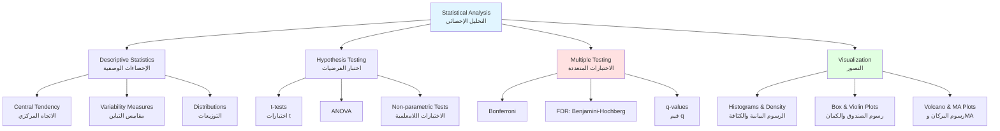
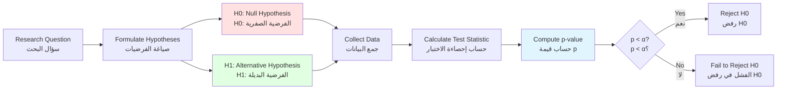

# الفصل 5: الإحصاء لتحليل البيانات البيولوجية
**فهم عدم اليقين، التباين، والدليل في علم الجينوم**

> **المفهوم الأساسي**: البيولوجيا متغيرة بطبيعتها. يساعدنا الإحصاء على فصل الإشارات البيولوجية المعنوية من الضوضاء العشوائية، مما يمكننا من استخلاص استنتاجات موثوقة من البيانات المشوشة.

## أهداف التعلم

بنهاية هذا الفصل، ستكون قادراً على:

1. **وصف التباين البيولوجي** والتمييز بينه وبين الضوضاء التقنية
2. **حساب الإحصاءات الوصفية** (المتوسط، الوسيط، التباين، الانحراف المعياري)
3. **تحديد التوزيعات الاحتمالية** الشائعة في البيانات البيولوجية
4. **إجراء اختبارات الفرضيات** (اختبارات t، ANOVA، الاختبارات اللامعلمية)
5. **التحكم في الاختبارات المتعددة** باستخدام طرق تصحيح FDR
6. **حساب القوة الإحصائية** وتحديد أحجام العينات
7. **إنشاء تصورات فعالة** للبيانات البيولوجية
8. **تحليل بيانات RNA-seq** للتعبير التفاضلي
9. **تفسير قيم p بشكل صحيح** وتجنب التفسيرات الخاطئة الشائعة
10. **التعرف على المزالق الإحصائية** (p-hacking، الازدواجية الزائفة)

---

## المتطلبات الأساسية

!!! info "المعرفة المطلوبة"
    - **الفصل 1**: فهم أساسي للتسلسلات البيولوجية
    - **الفصل 2**: برمجة Python (أو R)
    - **الفصل 3**: الوصول إلى قواعد البيانات لاسترجاع مجموعات البيانات
    - **الرياضيات**: مفاهيم أساسية في الجبر والاحتمالات

---

## نظرة عامة على الفصل



---

## 1. لماذا يهم الإحصاء في المعلوماتية الحيوية

### 1.1 تحدي التباين البيولوجي

**البيولوجيا مشوشة**. لا توجد خليتان أو كائنان أو تجربتان متطابقتان:

**التباين البيولوجي** (الاختلافات الحقيقية):
- التنوع الجيني بين الأفراد
- مراحل النمو ومراحل دورة الخلية
- عدم التجانس في البيئة الدقيقة
- التعبير الجيني العشوائي (الانفجار النسخي)

**التباين التقني** (ضوضاء القياس):
- تباين تحضير العينة
- تأثيرات الدفعة (أيام مختلفة، كواشف، مشغلون)
- معايرة وحساسية الأجهزة
- اختيارات التحليل الحسابي

!!! warning "تحدي علم الجينوم"
    عند اختبار 20,000 جين للتعبير التفاضلي:

    - عند α = 0.05، **توقع 1,000 إيجابية كاذبة** حتى لو لم يكن هناك شيء حقيقي
    - بدون تصحيح: معظم "الاكتشافات" هي ضوضاء
    - **الحل**: تصحيح الاختبارات المتعددة (التحكم في FDR)

### 1.2 السيناريوهات الواقعية

=== "تحليل RNA-seq"
    **المشكلة**: اختبار 20,000 جين للتعبير التفاضلي

    **بدون تصحيح**:
    - استخدام عتبة p < 0.05
    - العثور على 1,200 جين "معنوي"
    - ~1,000 هي إيجابيات كاذبة (5% × 20,000)

    **مع تصحيح FDR**:
    - تطبيق Benjamini-Hochberg عند FDR < 0.05
    - العثور على 150 جين معنوي
    - ~7-8 هي إيجابيات كاذبة (5% من 150)

    **الإحصاء ينقذك من مطاردة أكثر من 950 دليل كاذب**

=== "قياس البروتين الكمي"
    **البيانات**: وفرة البروتين في 5 نسخ بيولوجية

    ```
    التحكم:    [45, 123, 89, 245, 127]  المتوسط = 127.4
    العلاج:  [234, 198, 289, 256, 223] المتوسط = 240.0
    ```

    **الأسئلة**:
    - هل الفرق حقيقي أم تباين عشوائي؟
    - ما مدى ثقتنا؟
    - ما هو حجم التأثير؟

    **الإحصاء يحدد الثقة، وليس فقط المتوسطات**

=== "دراسات GWAS"
    **المشكلة**: اختبار مليون متغير جيني لارتباط المرض

    **العتبة القياسية**: p < 0.05 تعطي 50,000 إيجابية كاذبة

    **عتبة GWAS**: p < 5×10⁻⁸ تتحكم في الخطأ على مستوى الجينوم

    **الإحصاء يمنع نشر الهراء**

---

## 2. الإحصاءات الوصفية

### 2.1 مقاييس الاتجاه المركزي

**الاتجاه المركزي**: أين "وسط" البيانات؟

| المقياس | الصيغة | الأفضل لـ | الحساسية |
|---------|---------|----------|-------------|
| **المتوسط** | Σx / n | التوزيعات المتماثلة | حساس للقيم الشاذة |
| **الوسيط** | القيمة الوسطى | التوزيعات المنحرفة | مقاوم للقيم الشاذة |
| **المنوال** | القيمة الأكثر تكراراً | البيانات الفئوية | - |

=== "الحساب في Python"
    ```python
    import numpy as np
    import pandas as pd
    from scipy import stats

    # قيم التعبير الجيني
    expression = [45, 123, 89, 245, 127, 98, 156, 134, 112, 5000]  # القيمة الأخيرة قيمة شاذة

    # الاتجاه المركزي
    mean_val = np.mean(expression)
    median_val = np.median(expression)
    mode_val = stats.mode(expression, keepdims=True).mode[0]

    print(f"Mean: {mean_val:.1f}")      # 612.9 (متأثر بالقيمة الشاذة)
    print(f"Median: {median_val:.1f}")  # 120.0 (مقاوم)
    print(f"Mode: {mode_val}")

    # بدون القيمة الشاذة
    expression_clean = expression[:-1]
    print(f"Mean (no outlier): {np.mean(expression_clean):.1f}")  # 125.4
    ```

=== "الحساب في R"
    ```r
    # قيم التعبير الجيني
    expression <- c(45, 123, 89, 245, 127, 98, 156, 134, 112, 5000)

    # الاتجاه المركزي
    mean_val <- mean(expression)
    median_val <- median(expression)
    mode_val <- as.numeric(names(sort(table(expression), decreasing=TRUE)[1]))

    print(paste("Mean:", round(mean_val, 1)))      # 612.9
    print(paste("Median:", round(median_val, 1)))  # 120.0

    # بدون القيمة الشاذة
    expression_clean <- expression[-length(expression)]
    print(paste("Mean (no outlier):", round(mean(expression_clean), 1)))
    ```

**متى تستخدم أيهما**:
- **المتوسط**: بيانات موزعة بشكل طبيعي، بدون قيم شاذة متطرفة
- **الوسيط**: بيانات منحرفة، وجود قيم شاذة (أكثر مقاومة)
- **المنوال**: بيانات فئوية أو منفصلة

### 2.2 مقاييس التباين

**التباين**: ما مدى انتشار البيانات؟

| المقياس | الصيغة | التفسير |
|---------|---------|----------------|
| **المدى** | max - min | الانتشار الكلي |
| **التباين** | Σ(x - μ)² / n | متوسط الانحراف التربيعي |
| **الانحراف المعياري (SD)** | √التباين | متوسط الانحراف (نفس وحدات البيانات) |
| **معامل التباين (CV)** | SD / المتوسط × 100% | التباين النسبي (%) |

```python
import numpy as np

data = [45, 123, 89, 245, 127, 98, 156, 134, 112]

# مقاييس التباين
range_val = np.max(data) - np.min(data)
variance = np.var(data, ddof=1)  # ddof=1 لتباين العينة
std_dev = np.std(data, ddof=1)
cv = (std_dev / np.mean(data)) * 100

print(f"Range: {range_val}")
print(f"Variance: {variance:.2f}")
print(f"Standard Deviation: {std_dev:.2f}")
print(f"Coefficient of Variation: {cv:.1f}%")
```

**الخطأ المعياري للمتوسط (SEM)**: عدم اليقين في تقدير المتوسط

```python
sem = std_dev / np.sqrt(len(data))
print(f"SEM: {sem:.2f}")

# فترة الثقة 95% للمتوسط
from scipy import stats
ci_95 = stats.t.interval(0.95, len(data)-1, loc=np.mean(data), scale=sem)
print(f"95% CI: ({ci_95[0]:.1f}, {ci_95[1]:.1f})")
```

!!! tip "SD مقابل SEM"
    - **SD**: يصف التباين في البيانات
    - **SEM**: يصف عدم اليقين في تقدير المتوسط
    - **SEM دائماً أصغر من SD** (SEM = SD / √n)
    - استخدم SD لوصف البيانات، SEM للاستدلال على متوسط المجتمع

### 2.3 الأرباع والنسب المئوية

**الأرباع** تقسم البيانات إلى أربعة أجزاء متساوية:

- **Q1** (النسبة المئوية 25): 25% من البيانات تحت هذه القيمة
- **Q2** (النسبة المئوية 50): الوسيط
- **Q3** (النسبة المئوية 75): 75% من البيانات تحت هذه القيمة
- **IQR** (المدى بين الأرباع): Q3 - Q1 (منتصف 50% من البيانات)

```python
import numpy as np

data = [45, 123, 89, 245, 127, 98, 156, 134, 112, 178, 145, 167]

# الأرباع
q1 = np.percentile(data, 25)
q2 = np.percentile(data, 50)  # الوسيط
q3 = np.percentile(data, 75)
iqr = q3 - q1

print(f"Q1: {q1:.1f}")
print(f"Q2 (Median): {q2:.1f}")
print(f"Q3: {q3:.1f}")
print(f"IQR: {iqr:.1f}")

# كشف القيم الشاذة باستخدام طريقة IQR
lower_bound = q1 - 1.5 * iqr
upper_bound = q3 + 1.5 * iqr
outliers = [x for x in data if x < lower_bound or x > upper_bound]
print(f"Outliers: {outliers}")
```

---

## 3. التوزيعات الاحتمالية

### 3.1 التوزيع الطبيعي (الغاوسي)

**الأكثر شيوعاً في البيولوجيا**: العديد من القياسات البيولوجية تقريباً طبيعية

**الخصائص**:
- متماثل، على شكل جرس
- يحدده المتوسط (μ) والانحراف المعياري (σ)
- 68% ضمن ±1σ، 95% ضمن ±2σ، 99.7% ضمن ±3σ

```python
import numpy as np
import matplotlib.pyplot as plt
from scipy import stats

# توليد التوزيع الطبيعي
mu, sigma = 100, 15
x = np.linspace(mu - 4*sigma, mu + 4*sigma, 1000)
y = stats.norm.pdf(x, mu, sigma)

# الرسم
plt.figure(figsize=(10, 6))
plt.plot(x, y, linewidth=2)
plt.axvline(mu, color='r', linestyle='--', label=f'Mean = {mu}')
plt.axvline(mu - sigma, color='orange', linestyle='--', alpha=0.5)
plt.axvline(mu + sigma, color='orange', linestyle='--', alpha=0.5)
plt.fill_between(x, y, where=(x >= mu-sigma) & (x <= mu+sigma),
                 alpha=0.3, label='68% of data')
plt.xlabel('Value')
plt.ylabel('Probability Density')
plt.title('Normal Distribution')
plt.legend()
plt.grid(True, alpha=0.3)
plt.savefig('normal_distribution.png', dpi=150, bbox_inches='tight')
```

**اختبار الطبيعية**:

```python
from scipy import stats

# بيانات عينة
data = np.random.normal(100, 15, 100)

# اختبار Shapiro-Wilk (جيد للعينات الصغيرة)
statistic, p_value = stats.shapiro(data)
print(f"Shapiro-Wilk test: p = {p_value:.4f}")
if p_value > 0.05:
    print("Data appears normally distributed")
else:
    print("Data does not appear normally distributed")

# رسم Q-Q (تقييم بصري)
import scipy.stats as stats
stats.probplot(data, dist="norm", plot=plt)
plt.title("Q-Q Plot")
plt.grid(True)
plt.show()
```

### 3.2 التوزيعات لبيانات العد

**RNA-seq وعلم الجينوم** تتضمن بيانات العد (منفصلة، وليست مستمرة)

=== "توزيع بواسون"
    **استخدم عندما**: عد الأحداث النادرة والمستقلة

    **أمثلة**: عدد الطفرات لكل جينوم، أخطاء التسلسل

    **الخاصية**: التباين = المتوسط

    ```python
    from scipy import stats

    # توزيع بواسون (lambda = متوسط العد)
    lambda_val = 5
    x = np.arange(0, 20)
    pmf = stats.poisson.pmf(x, lambda_val)

    plt.figure(figsize=(10, 6))
    plt.bar(x, pmf)
    plt.xlabel('Count')
    plt.ylabel('Probability')
    plt.title(f'Poisson Distribution (λ = {lambda_val})')
    plt.grid(True, alpha=0.3)
    plt.show()
    ```

=== "ذو الحدين السالب"
    **استخدم عندما**: بيانات العد مع التشتت الزائد (التباين > المتوسط)

    **أمثلة**: عدد قراءات RNA-seq (التباين البيولوجي + التقني)

    **الخاصية**: التباين > المتوسط (أكثر مرونة من بواسون)

    ```python
    from scipy import stats

    # ذو الحدين السالب (n, p)
    n, p = 10, 0.5
    x = np.arange(0, 50)
    pmf = stats.nbinom.pmf(x, n, p)

    plt.figure(figsize=(10, 6))
    plt.bar(x, pmf)
    plt.xlabel('Count')
    plt.ylabel('Probability')
    plt.title(f'Negative Binomial Distribution (n={n}, p={p})')
    plt.grid(True, alpha=0.3)
    plt.show()
    ```

!!! warning "لا تستخدم اختبارات t على بيانات العد!"
    بيانات RNA-seq هي عدّات، وليست قياسات مستمرة:

    - ❌ **خطأ**: اختبار t (يفترض توزيع طبيعي)
    - ✅ **صحيح**: DESeq2، edgeR (نموذج العدّات مع ذي الحدين السالب)

---

## 4. اختبار الفرضيات

### 4.1 منطق اختبار الفرضيات



**المفاهيم الرئيسية**:

- **H0** (الفرضية الصفرية): لا يوجد فرق/تأثير (افتراض افتراضي)
- **H1** (الفرضية البديلة): يوجد فرق/تأثير
- **قيمة p**: احتمال ملاحظة بيانات بهذا التطرف **إذا كانت H0 صحيحة**
- **α** (مستوى الدلالة): عتبة رفض H0 (عادة 0.05)

!!! danger "تفسير قيمة P"
    **ما تعنيه قيمة p**:
    > "إذا لم يكن هناك حقاً أي فرق، سنرى بيانات بهذا التطرف p% من الوقت بالصدفة العشوائية"

    **ما لا تعنيه قيمة p**:
    - ❌ "احتمال أن تكون H0 صحيحة"
    - ❌ "احتمال الإيجابية الكاذبة"
    - ❌ "أهمية النتيجة"
    - ❌ "إثبات أي شيء"

### 4.2 اختبارات t

**استخدم عندما**: مقارنة متوسطات البيانات المستمرة، الموزعة بشكل طبيعي

=== "اختبار t للعينتين"
    **السؤال**: هل مستويات التعبير الجيني مختلفة بين حالتين؟

    ```python
    from scipy import stats
    import numpy as np

    # التعبير الجيني في حالتين
    control = [23, 45, 34, 67, 42, 38, 51, 29]
    treatment = [78, 91, 85, 102, 88, 95, 79, 84]

    # اختبار t للعينتين (بافتراض تباينات متساوية)
    t_stat, p_value = stats.ttest_ind(control, treatment)

    print(f"Control mean: {np.mean(control):.2f}")
    print(f"Treatment mean: {np.mean(treatment):.2f}")
    print(f"t-statistic: {t_stat:.3f}")
    print(f"p-value: {p_value:.4f}")

    if p_value < 0.05:
        print("Significant difference (p < 0.05)")
    else:
        print("No significant difference (p ≥ 0.05)")

    # حجم التأثير (Cohen's d)
    pooled_std = np.sqrt((np.var(control, ddof=1) + np.var(treatment, ddof=1)) / 2)
    cohens_d = (np.mean(treatment) - np.mean(control)) / pooled_std
    print(f"Effect size (Cohen's d): {cohens_d:.2f}")
    ```

=== "اختبار t المزدوج"
    **السؤال**: هل هناك تغيير قبل وبعد العلاج (نفس الموضوعات)؟

    ```python
    # التعبير الجيني قبل وبعد العلاج (عينات مزدوجة)
    before = [45, 67, 52, 78, 61, 54, 48, 59]
    after =  [52, 71, 58, 85, 68, 59, 53, 64]

    # اختبار t المزدوج
    t_stat, p_value = stats.ttest_rel(before, after)

    print(f"Mean change: {np.mean(np.array(after) - np.array(before)):.2f}")
    print(f"t-statistic: {t_stat:.3f}")
    print(f"p-value: {p_value:.4f}")
    ```

=== "اختبار Welch's t"
    **استخدم عندما**: التباينات غير متساوية بين المجموعات

    ```python
    # عندما تختلف التباينات (افتراضي أكثر أماناً)
    t_stat, p_value = stats.ttest_ind(control, treatment, equal_var=False)
    print(f"Welch's t-test p-value: {p_value:.4f}")
    ```

**الافتراضات**:
- البيانات موزعة بشكل طبيعي تقريباً
- العينات مستقلة (باستثناء اختبار t المزدوج)
- تباينات متساوية (لاختبار t القياسي، وليس Welch's)

### 4.3 ANOVA (تحليل التباين)

**استخدم عندما**: مقارنة المتوسطات عبر >2 مجموعات

```python
from scipy import stats

# التعبير الجيني في 4 أنسجة مختلفة
tissue1 = [45, 52, 48, 51, 46]
tissue2 = [78, 82, 75, 80, 77]
tissue3 = [34, 38, 32, 36, 35]
tissue4 = [91, 95, 89, 93, 90]

# ANOVA أحادي الاتجاه
f_stat, p_value = stats.f_oneway(tissue1, tissue2, tissue3, tissue4)

print(f"F-statistic: {f_stat:.3f}")
print(f"p-value: {p_value:.6f}")

if p_value < 0.05:
    print("At least one tissue is significantly different")

    # مقارنات زوجية بعد الحدث (Tukey HSD)
    from scipy.stats import tukey_hsd

    all_data = tissue1 + tissue2 + tissue3 + tissue4
    groups = (['T1']*5 + ['T2']*5 + ['T3']*5 + ['T4']*5)

    # ملاحظة: للإنتاج، استخدم statsmodels لـ Tukey HSD المناسب
    print("\nPerform pairwise t-tests with Bonferroni correction:")
    from itertools import combinations
    tissues = [tissue1, tissue2, tissue3, tissue4]
    names = ['T1', 'T2', 'T3', 'T4']
    n_comparisons = 6  # 4 اختر 2

    for (i, t1), (j, t2) in combinations(enumerate(tissues), 2):
        _, p = stats.ttest_ind(t1, t2)
        p_adj = p * n_comparisons  # Bonferroni
        print(f"{names[i]} vs {names[j]}: p = {p:.4f}, adjusted p = {min(p_adj, 1.0):.4f}")
```

### 4.4 الاختبارات اللامعلمية

**استخدم عندما**: تنتهك البيانات افتراض الطبيعية (منحرفة، قيم شاذة)

=== "اختبار Mann-Whitney U"
    **استخدم عندما**: مجموعتان مستقلتان، بيانات غير طبيعية

    ```python
    from scipy import stats

    # بيانات وفرة البروتين المنحرفة
    control = [12, 15, 18, 14, 156, 13, 17, 16]  # قيمة شاذة واحدة
    treatment = [45, 52, 48, 51, 234, 46, 50, 49]

    # اختبار Mann-Whitney U (بديل لامعلمي لاختبار t)
    u_stat, p_value = stats.mannwhitneyu(control, treatment, alternative='two-sided')

    print(f"Control median: {np.median(control):.1f}")
    print(f"Treatment median: {np.median(treatment):.1f}")
    print(f"U-statistic: {u_stat:.3f}")
    print(f"p-value: {p_value:.4f}")
    ```

=== "اختبار Wilcoxon Signed-Rank"
    **استخدم عندما**: عينات مزدوجة، بيانات غير طبيعية

    ```python
    # بيانات مزدوجة غير طبيعية
    before = [12, 15, 18, 156, 13, 17, 16, 19]
    after =  [45, 52, 48, 234, 46, 50, 49, 51]

    # اختبار Wilcoxon signed-rank
    w_stat, p_value = stats.wilcoxon(before, after)

    print(f"Median difference: {np.median(np.array(after) - np.array(before)):.1f}")
    print(f"W-statistic: {w_stat:.3f}")
    print(f"p-value: {p_value:.4f}")
    ```

=== "اختبار Kruskal-Wallis"
    **استخدم عندما**: >2 مجموعات مستقلة، بيانات غير طبيعية

    ```python
    # بديل لامعلمي لـ ANOVA
    h_stat, p_value = stats.kruskal(tissue1, tissue2, tissue3, tissue4)

    print(f"H-statistic: {h_stat:.3f}")
    print(f"p-value: {p_value:.6f}")
    ```

---

## 5. مشكلة الاختبارات المتعددة

### 5.1 لماذا تهم الاختبارات المتعددة

**المشكلة**: عند اختبار آلاف الفرضيات، تتراكم الإيجابيات الكاذبة

**مثال**: RNA-seq مع 20,000 جين

```python
import numpy as np

n_genes = 20000
alpha = 0.05

# الإيجابيات الكاذبة المتوقعة إذا كانت جميع الصفرات صحيحة
expected_fps = n_genes * alpha
print(f"Expected false positives: {expected_fps:.0f}")

# محاكاة الاختبار بدون اختلافات حقيقية
np.random.seed(42)
p_values = np.random.uniform(0, 1, n_genes)  # قيم p الصفرية موحدة

# بدون تصحيح
significant_uncorrected = sum(p_values < alpha)
print(f"Significant genes (uncorrected): {significant_uncorrected}")
print(f"False positive rate: {significant_uncorrected/n_genes*100:.1f}%")
```

### 5.2 طرق تصحيح الاختبارات المتعددة

=== "تصحيح Bonferroni"
    **الاستراتيجية**: قسم α على عدد الاختبارات

    **يتحكم في**: معدل الخطأ على مستوى العائلة (FWER) - احتمال ≥1 إيجابية كاذبة

    **محافظ جداً** - قد يفوت الإيجابيات الحقيقية

    ```python
    n_tests = 20000
    alpha_bonf = 0.05 / n_tests

    print(f"Bonferroni threshold: {alpha_bonf:.2e}")

    significant_bonf = sum(p_values < alpha_bonf)
    print(f"Significant genes (Bonferroni): {significant_bonf}")
    ```

=== "Benjamini-Hochberg (FDR)"
    **الاستراتيجية**: التحكم في معدل الاكتشاف الكاذب (نسبة الإيجابيات الكاذبة)

    **معيار لعلم الجينوم** - توازن جيد بين الحساسية والنوعية

    ```python
    from scipy.stats import false_discovery_control

    # تصحيح Benjamini-Hochberg FDR
    p_values_sorted = np.sort(p_values)
    n = len(p_values)
    fdr_level = 0.05

    # إجراء BH
    critical_values = np.arange(1, n+1) / n * fdr_level

    # ابحث عن أكبر i حيث p(i) <= (i/n)*alpha
    reject = p_values_sorted <= critical_values
    if any(reject):
        threshold = p_values_sorted[reject][-1]
    else:
        threshold = 0

    significant_fdr = sum(p_values <= threshold)
    print(f"BH threshold: {threshold:.4f}")
    print(f"Significant genes (FDR < 0.05): {significant_fdr}")

    # استخدام statsmodels
    from statsmodels.stats.multitest import multipletests
    reject, pvals_corrected, _, _ = multipletests(p_values, alpha=0.05, method='fdr_bh')
    print(f"Significant genes (statsmodels): {sum(reject)}")
    ```

=== "قيم q"
    **التفسير**: الحد الأدنى لـ FDR الذي ستكون هذه النتيجة معنوية عنده

    **بديهي**: "q < 0.05" يعني "على الأكثر 5% من النتائج بهذه الدلالة كاذبة"

    ```python
    # حساب قيمة q (مبسط)
    from scipy.interpolate import interp1d

    def calculate_qvalues(pvals):
        """حساب قيمة q المبسط"""
        pvals = np.array(pvals)
        n = len(pvals)

        # فرز قيم p
        sort_idx = np.argsort(pvals)
        pvals_sorted = pvals[sort_idx]

        # حساب قيم q
        qvals = np.zeros(n)
        prev_q = 0

        for i in range(n-1, -1, -1):
            q = min(pvals_sorted[i] * n / (i + 1), prev_q if i < n-1 else 1)
            qvals[i] = min(q, 1.0)
            prev_q = qvals[i]

        # استعادة الترتيب الأصلي
        qvals_original = np.zeros(n)
        qvals_original[sort_idx] = qvals

        return qvals_original

    qvals = calculate_qvalues(p_values)
    significant_q = sum(qvals < 0.05)
    print(f"Significant genes (q < 0.05): {significant_q}")
    ```

**جدول المقارنة**:

| الطريقة | يتحكم في | الصرامة | الأفضل لـ |
|--------|----------|------------|----------|
| **بدون تصحيح** | لا شيء | لا شيء | اختبار واحد فقط |
| **Bonferroni** | FWER | صارم جداً | اختبارات قليلة، تحتاج إلى يقين |
| **FDR (BH)** | معدل الاكتشاف الكاذب | معتدل | علم الجينوم (معيار) |
| **قيم q** | FDR | معتدل | تفسير سهل |

---

## 6. القوة الإحصائية وحجم العينة

### 6.1 فهم القوة

**القوة الإحصائية**: احتمال اكتشاف تأثير حقيقي عند وجوده

**العوامل المؤثرة على القوة**:

1. **حجم التأثير**: اختلافات أكبر → قوة أعلى
2. **حجم العينة**: المزيد من العينات → قوة أعلى
3. **التباين**: ضوضاء أقل → قوة أعلى
4. **مستوى الدلالة**: α أعلى → قوة أعلى (لكن المزيد من الإيجابيات الكاذبة)

```python
from statsmodels.stats.power import ttest_power

# حساب القوة لسيناريوهات مختلفة
effect_sizes = [0.2, 0.5, 0.8, 1.0, 1.5]  # Cohen's d
sample_sizes = [5, 10, 20, 50, 100]
alpha = 0.05

print("Power for two-sample t-test (α = 0.05):")
print("\n      Sample Size")
print("Effect", end="")
for n in sample_sizes:
    print(f"  n={n:3d}", end="")
print()

for effect in effect_sizes:
    print(f"d={effect:.1f}", end="  ")
    for n in sample_sizes:
        power = ttest_power(effect, n, alpha, alternative='two-sided')
        print(f"{power:.2f}  ", end="")
    print()
```

### 6.2 حساب حجم العينة

**قبل التجارب**: تحديد حجم العينة المطلوب للقوة المطلوبة

```python
from statsmodels.stats.power import tt_solve_power

# كم عدد العينات المطلوبة للكشف عن حجم التأثير = 0.8 مع قوة 80%؟
required_n = tt_solve_power(
    effect_size=0.8,
    alpha=0.05,
    power=0.80,
    alternative='two-sided'
)

print(f"Required sample size per group: {np.ceil(required_n):.0f}")

# لـ RNA-seq: المعلمات النموذجية
effect_size = 0.5  # تغيير log2 fold
desired_power = 0.80
alpha = 0.05

required_n_rnaseq = tt_solve_power(effect_size, alpha, desired_power, alternative='two-sided')
print(f"\nRNA-seq recommended n per group: {np.ceil(required_n_rnaseq):.0f}")
```

!!! tip "الدراسات ضعيفة القوة مهدرة"
    دراسة بقوة 20%:

    - احتمال 80% **لتفويت** تأثير حقيقي (سلبي كاذب)
    - تهدر الوقت والمال والموارد
    - تساهم في الأدبيات غير القابلة للتكرار

    **احسب دائماً حجم العينة المطلوب قبل التجارب!**

---

## 7. أفضل ممارسات التصور

### 7.1 استكشاف التوزيعات

=== "الرسم البياني"
    ```python
    import matplotlib.pyplot as plt
    import numpy as np

    # بيانات التعبير الجيني
    np.random.seed(42)
    expression = np.random.lognormal(mean=5, sigma=1.5, size=1000)

    plt.figure(figsize=(12, 5))

    # الرسم البياني
    plt.subplot(1, 2, 1)
    plt.hist(expression, bins=50, edgecolor='black', alpha=0.7)
    plt.xlabel('Expression Level')
    plt.ylabel('Frequency')
    plt.title('Histogram: Gene Expression Distribution')
    plt.grid(True, alpha=0.3)

    # محول اللوغاريتم
    plt.subplot(1, 2, 2)
    plt.hist(np.log10(expression), bins=50, edgecolor='black', alpha=0.7, color='orange')
    plt.xlabel('Log10(Expression Level)')
    plt.ylabel('Frequency')
    plt.title('Histogram: Log-Transformed (More Normal)')
    plt.grid(True, alpha=0.3)

    plt.tight_layout()
    plt.savefig('distribution_histogram.png', dpi=150, bbox_inches='tight')
    ```

=== "رسوم الصندوق والكمان"
    ```python
    import seaborn as sns
    import pandas as pd

    # التعبير عبر الحالات
    np.random.seed(42)
    data = {
        'Condition': ['Control']*50 + ['Treatment']*50,
        'Expression': list(np.random.normal(100, 20, 50)) +
                      list(np.random.normal(150, 25, 50))
    }
    df = pd.DataFrame(data)

    fig, axes = plt.subplots(1, 2, figsize=(12, 5))

    # رسم الصندوق
    sns.boxplot(data=df, x='Condition', y='Expression', ax=axes[0])
    axes[0].set_title('Box Plot')
    axes[0].grid(True, alpha=0.3)

    # رسم الكمان (يظهر التوزيع الكامل)
    sns.violinplot(data=df, x='Condition', y='Expression', ax=axes[1])
    axes[1].set_title('Violin Plot (Better)')
    axes[1].grid(True, alpha=0.3)

    plt.tight_layout()
    plt.savefig('boxplot_violinplot.png', dpi=150, bbox_inches='tight')
    ```

### 7.2 الرسوم الخاصة بـ RNA-seq

=== "رسم MA"
    **يظهر**: تغيير log fold مقابل متوسط التعبير

    ```python
    # بيانات RNA-seq محاكاة
    np.random.seed(42)
    n_genes = 10000

    mean_expr = np.random.uniform(1, 10000, n_genes)
    log_fc = np.random.normal(0, 0.5, n_genes)

    # إضافة بعض الجينات DE
    de_idx = np.random.choice(n_genes, 200, replace=False)
    log_fc[de_idx] += np.random.choice([-2, 2], 200)

    p_values = np.random.uniform(0, 1, n_genes)
    p_values[de_idx] = np.random.uniform(0, 0.001, 200)

    # رسم MA
    plt.figure(figsize=(10, 6))
    plt.scatter(mean_expr, log_fc, c='gray', alpha=0.3, s=10, label='Not significant')
    plt.scatter(mean_expr[p_values < 0.05], log_fc[p_values < 0.05],
                c='red', alpha=0.6, s=10, label='p < 0.05')
    plt.axhline(0, color='blue', linestyle='--', linewidth=2)
    plt.xlabel('Mean Expression (log scale)')
    plt.ylabel('Log2 Fold Change')
    plt.title('MA Plot: Differential Expression')
    plt.xscale('log')
    plt.legend()
    plt.grid(True, alpha=0.3)
    plt.savefig('ma_plot.png', dpi=150, bbox_inches='tight')
    ```

=== "رسم البركان"
    **يظهر**: تغيير log fold مقابل الدلالة

    ```python
    # رسم البركان
    neg_log_p = -np.log10(p_values + 1e-300)  # تجنب log(0)

    plt.figure(figsize=(10, 6))

    # تلوين حسب الدلالة وتغيير fold
    colors = ['gray'] * n_genes
    for i in range(n_genes):
        if p_values[i] < 0.05 and abs(log_fc[i]) > 1:
            colors[i] = 'red'
        elif p_values[i] < 0.05:
            colors[i] = 'orange'

    plt.scatter(log_fc, neg_log_p, c=colors, alpha=0.5, s=10)

    # خطوط العتبة
    plt.axhline(-np.log10(0.05), color='blue', linestyle='--',
                linewidth=2, label='p = 0.05')
    plt.axvline(-1, color='green', linestyle='--', linewidth=2)
    plt.axvline(1, color='green', linestyle='--', linewidth=2, label='FC = ±2')

    plt.xlabel('Log2 Fold Change')
    plt.ylabel('-Log10(p-value)')
    plt.title('Volcano Plot: Statistical and Biological Significance')
    plt.legend()
    plt.grid(True, alpha=0.3)
    plt.savefig('volcano_plot.png', dpi=150, bbox_inches='tight')
    ```

---

## 8. المزالق الإحصائية الشائعة

### 8.1 P-Hacking (التنقيب عن البيانات)

**ما هو**: التلاعب بالبيانات/التحليل حتى p < 0.05

**أمثلة**:
- اختبار 20 فرضية مختلفة، الإبلاغ عن "المعنوية" فقط
- إزالة "القيم الشاذة" لتحقيق الدلالة
- اختبار نقاط نهاية متعددة، انتقاء النتائج
- النظر إلى قيم p وإضافة عينات حتى تصبح معنوية

**لماذا هو سيء**: يضخم معدل الإيجابية الكاذبة بشكل كبير فوق 5%

**كيفية التجنب**:
- حدد التحليلات مسبقاً قبل رؤية البيانات
- أبلغ عن جميع الاختبارات المجراة
- استخدم تصحيح الاختبارات المتعددة
- سجل مسبقاً الدراسات (التجارب السريرية)

### 8.2 تجاهل أحجام التأثير

**المشكلة**: قيم p الصغيرة لا تعني نتائج مهمة

```python
# عينة كبيرة، تأثير صغير
np.random.seed(42)
control_large = np.random.normal(100, 15, 10000)
treatment_large = np.random.normal(101, 15, 10000)  # فقط 1% فرق

t_stat, p_value = stats.ttest_ind(control_large, treatment_large)
print(f"p-value: {p_value:.2e}")  # صغيرة جداً!
print(f"Mean difference: {np.mean(treatment_large) - np.mean(control_large):.2f}")
print(f"Effect size (Cohen's d): {(np.mean(treatment_large) - np.mean(control_large)) / np.std(control_large):.3f}")

# عينة صغيرة، تأثير كبير
control_small = np.random.normal(100, 15, 5)
treatment_small = np.random.normal(200, 15, 5)  # 100% فرق

t_stat2, p_value2 = stats.ttest_ind(control_small, treatment_small)
print(f"\np-value: {p_value2:.3f}")  # غير معنوي!
print(f"Mean difference: {np.mean(treatment_small) - np.mean(control_small):.2f}")
```

**أبلغ دائماً**:
- حجم التأثير (تغيير fold، Cohen's d، إلخ.)
- فترات الثقة
- السياق البيولوجي

### 8.3 الازدواجية الزائفة

**المشكلة**: معاملة النسخ التقنية كنسخ بيولوجية

```python
# خطأ: 3 فئران، 5 قياسات لكل منها، تحليل كـ n=15
biological_replicates = 3
technical_replicates = 5

# صحيح: متوسط النسخ التقنية أولاً
mouse1_tech = [98, 102, 100, 99, 101]
mouse2_tech = [145, 148, 146, 147, 149]
mouse3_tech = [97, 99, 98, 100, 96]

# متوسط النسخ التقنية
mouse1_avg = np.mean(mouse1_tech)
mouse2_avg = np.mean(mouse2_tech)
mouse3_avg = np.mean(mouse3_tech)

print(f"Biological n = {biological_replicates}")
print(f"Mouse averages: {[mouse1_avg, mouse2_avg, mouse3_avg]}")
```

### 8.4 التحيز في النشر ومشكلة درج الملفات

**المشكلة**: فقط النتائج "المعنوية" يتم نشرها

**التأثير**: الأدبيات تبالغ في تقدير أحجام التأثير والدلالة

**الحلول**:
- التسجيل المسبق للدراسات
- نشر النتائج الصفرية
- التحليلات التلوية
- دراسات التكرار

---

## 9. مثال عملي: التعبير التفاضلي لـ RNA-seq

### 9.1 تحليل RNA-seq المحاكى

```python
import numpy as np
import pandas as pd
from scipy import stats
import matplotlib.pyplot as plt
import seaborn as sns

# محاكاة بيانات عدد RNA-seq
np.random.seed(42)
n_genes = 5000
n_samples = 6  # 3 تحكم، 3 علاج

# توليد مستويات التعبير الأساسية
baseline = np.random.negative_binomial(n=10, p=0.5, size=n_genes)

# عينات التحكم
control_counts = np.random.poisson(baseline[:, np.newaxis], size=(n_genes, 3))

# عينات العلاج (200 جين منظم للأعلى 3 أضعاف، 200 منظم للأسفل 3 أضعاف)
treatment_baseline = baseline.copy()
up_genes = np.random.choice(n_genes, 200, replace=False)
down_genes = np.random.choice([i for i in range(n_genes) if i not in up_genes], 200, replace=False)
treatment_baseline[up_genes] *= 3
treatment_baseline[down_genes] //= 3

treatment_counts = np.random.poisson(treatment_baseline[:, np.newaxis], size=(n_genes, 3))

# دمج في dataframe
count_df = pd.DataFrame({
    'C1': control_counts[:, 0],
    'C2': control_counts[:, 1],
    'C3': control_counts[:, 2],
    'T1': treatment_counts[:, 0],
    'T2': treatment_counts[:, 1],
    'T3': treatment_counts[:, 2]
})
count_df.index = [f'Gene_{i}' for i in range(n_genes)]

print("RNA-seq Count Matrix (first 10 genes):")
print(count_df.head(10))
```

### 9.2 اختبار التعبير التفاضلي

```python
# نهج اختبار t البسيط (للتوضيح - استخدم DESeq2 في الممارسة!)
p_values = []
fold_changes = []

for gene in count_df.index:
    control_vals = count_df.loc[gene, ['C1', 'C2', 'C3']].values
    treatment_vals = count_df.loc[gene, ['T1', 'T2', 'T3']].values

    # اختبار t
    _, p = stats.ttest_ind(control_vals, treatment_vals)
    p_values.append(p)

    # تغيير Fold (أضف pseudocount لتجنب القسمة على صفر)
    fc = (np.mean(treatment_vals) + 1) / (np.mean(control_vals) + 1)
    fold_changes.append(np.log2(fc))

# إضافة إلى dataframe
count_df['pvalue'] = p_values
count_df['log2FC'] = fold_changes
count_df['mean_control'] = count_df[['C1', 'C2', 'C3']].mean(axis=1)
count_df['mean_treatment'] = count_df[['T1', 'T2', 'T3']].mean(axis=1)

# تطبيق تصحيح FDR
from statsmodels.stats.multitest import multipletests
_, count_df['padj'], _, _ = multipletests(count_df['pvalue'], method='fdr_bh')

# ملخص
print(f"\nTotal genes tested: {n_genes}")
print(f"Significant (p < 0.05, uncorrected): {sum(count_df['pvalue'] < 0.05)}")
print(f"Significant (FDR < 0.05): {sum(count_df['padj'] < 0.05)}")
print(f"Upregulated (FDR < 0.05, FC > 2): {sum((count_df['padj'] < 0.05) & (count_df['log2FC'] > 1))}")
print(f"Downregulated (FDR < 0.05, FC < 0.5): {sum((count_df['padj'] < 0.05) & (count_df['log2FC'] < -1))}")
```

### 9.3 التصور

```python
# رسم البركان
fig, axes = plt.subplots(1, 2, figsize=(14, 6))

# الرسم 1: قيم p غير مصححة
ax = axes[0]
sig_uncorrected = count_df['pvalue'] < 0.05
ax.scatter(count_df.loc[~sig_uncorrected, 'log2FC'],
           -np.log10(count_df.loc[~sig_uncorrected, 'pvalue']),
           c='gray', alpha=0.3, s=10, label='Not significant')
ax.scatter(count_df.loc[sig_uncorrected, 'log2FC'],
           -np.log10(count_df.loc[sig_uncorrected, 'pvalue']),
           c='red', alpha=0.6, s=10, label='p < 0.05')
ax.axhline(-np.log10(0.05), color='blue', linestyle='--', linewidth=2)
ax.axvline(-1, color='green', linestyle='--', linewidth=1)
ax.axvline(1, color='green', linestyle='--', linewidth=1)
ax.set_xlabel('Log2 Fold Change')
ax.set_ylabel('-Log10(p-value)')
ax.set_title('Without Multiple Testing Correction')
ax.legend()
ax.grid(True, alpha=0.3)

# الرسم 2: FDR-مصحح
ax = axes[1]
sig_fdr = count_df['padj'] < 0.05
ax.scatter(count_df.loc[~sig_fdr, 'log2FC'],
           -np.log10(count_df.loc[~sig_fdr, 'padj']),
           c='gray', alpha=0.3, s=10, label='Not significant')
ax.scatter(count_df.loc[sig_fdr, 'log2FC'],
           -np.log10(count_df.loc[sig_fdr, 'padj']),
           c='red', alpha=0.6, s=10, label='FDR < 0.05')
ax.axhline(-np.log10(0.05), color='blue', linestyle='--', linewidth=2)
ax.axvline(-1, color='green', linestyle='--', linewidth=1)
ax.axvline(1, color='green', linestyle='--', linewidth=1)
ax.set_xlabel('Log2 Fold Change')
ax.set_ylabel('-Log10(adjusted p-value)')
ax.set_title('With FDR Correction (Benjamini-Hochberg)')
ax.legend()
ax.grid(True, alpha=0.3)

plt.tight_layout()
plt.savefig('rnaseq_volcano_comparison.png', dpi=150, bbox_inches='tight')
plt.show()

print(f"\nFalse positive reduction: {sum(sig_uncorrected) - sum(sig_fdr)} genes")
```

---

## 10. قائمة التقييم الذاتي

اختبر فهمك:

- [ ] يمكنني حساب المتوسط، الوسيط، التباين، والانحراف المعياري
- [ ] أفهم الفرق بين SD و SEM
- [ ] يمكنني تحديد التوزيعات الاحتمالية المناسبة لأنواع البيانات المختلفة
- [ ] أعرف متى أستخدم اختبارات t مقابل الاختبارات اللامعلمية
- [ ] أفهم ما تعنيه قيمة p بالفعل (وما لا تعنيه)
- [ ] يمكنني تطبيق تصحيح الاختبارات المتعددة (Bonferroni، FDR)
- [ ] أعرف كيفية حساب القوة الإحصائية وأحجام العينات المطلوبة
- [ ] يمكنني إنشاء رسوم بيانية، رسوم صندوقية، ورسوم بركانية
- [ ] أفهم مشكلة الاختبارات المتعددة في علم الجينوم
- [ ] يمكنني التعرف على p-hacking والمزالق الإحصائية الأخرى
- [ ] أعرف الفرق بين الدلالة الإحصائية والبيولوجية
- [ ] يمكنني إجراء تحليل أساسي للتعبير التفاضلي لـ RNA-seq

---

## 11. موارد إضافية

### قراءات موصى بها

| المورد | التركيز | الرابط |
|----------|-------|-----|
| **Modern Statistics for Modern Biology** | إحصاءات المعلوماتية الحيوية (مجاني) | https://www.huber.embl.de/msmb/ |
| **StatQuest Videos** | شروحات بديهية | قناة YouTube |
| **Nature Methods: Points of Significance** | إحصاءات عملية | سلسلة مجلة Nature |
| **The Analysis of Biological Data** | أمثلة بيولوجية | كتاب Whitlock & Schluter |

### البرمجيات والحزم

**Python**:
```python
# الإحصاء الأساسي
import scipy.stats
import numpy as np
import pandas as pd

# التصور
import matplotlib.pyplot as plt
import seaborn as sns

# الاختبارات المتعددة
from statsmodels.stats.multitest import multipletests

# تحليل القوة
from statsmodels.stats.power import ttest_power
```

**R (البديل)**:
```r
# أفضل لتحليل RNA-seq
library(DESeq2)  # RNA-seq DE
library(edgeR)   # RNA-seq DE
library(ggplot2) # التصور
library(dplyr)   # معالجة البيانات
```

### المفاهيم الرئيسية للتذكر

!!! summary "ملخص الفصل 5"
    **التباين حتمي**: التباين البيولوجي والتقني يتطلب تفكيراً إحصائياً

    **قيم P ليست كل شيء**: أبلغ عن أحجام التأثير وفترات الثقة

    **الاختبارات المتعددة تقتل**: طبق دائماً تصحيح FDR للبيانات عالية الإنتاجية

    **القوة مهمة**: الدراسات ضعيفة القوة تهدر الموارد ولا تجد شيئاً

    **تصور أولاً**: انظر إلى بياناتك قبل تطبيق الاختبارات الإحصائية

---

## التنقل

[↑ العودة إلى فهرس المقرر](/ar/courses/foundation-of-bioinformatics/)

**الفصول ذات الصلة:**

- [الفصل 2: أساسيات البرمجة](/ar/courses/foundation-of-bioinformatics/module-2/) - Python للحوسبة الإحصائية
- [الفصل 3: قواعد البيانات البيولوجية](/ar/courses/foundation-of-bioinformatics/module-3/) - استرجاع البيانات للتحليل
- [الفصل 4: محاذاة التسلسل](/ar/courses/foundation-of-bioinformatics/module-4/) - قيم E والدلالة

---

🌐 [عرض هذا الفصل بالإنجليزية](/en/courses/foundation-of-bioinformatics/module-5/)

---

*آخر تحديث: 2026-01-28*
