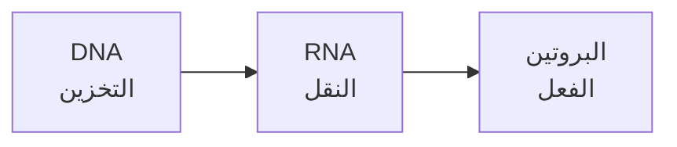
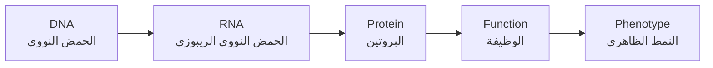
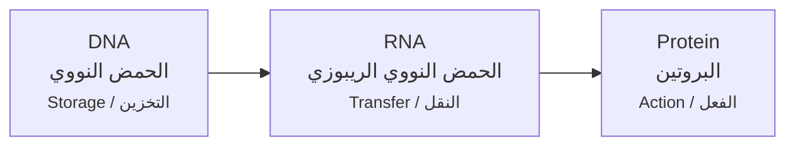
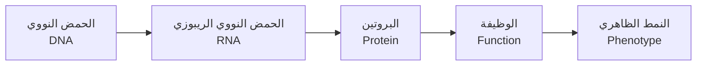

# Diagram Format Test - Stacked Bilingual Labels

## Current Arabic Version

---

## Option 1: Simple Two-Line Stacked (Recommended)

**Format:**
- Line 1: English scientific term
- Line 2: Arabic translation
- Clean, minimal, easy to read

---

## Option 2: With Function Labels

**Format:**
- Line 1: English term
- Line 2: Arabic translation  
- Line 3: Role/function (smaller text)

---

## Option 3: Arabic-First Order

**Format:**
- Line 1: Arabic translation (primary)
- Line 2: English scientific term (reference)

---

## Which do you prefer?

**My recommendation: Option 1** (simple, clean, follows scientific convention with English first)
