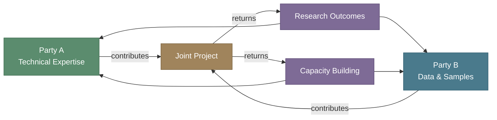
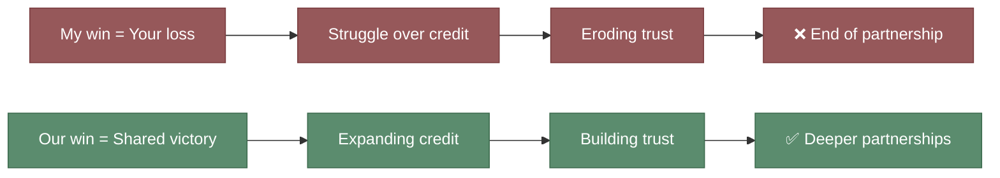
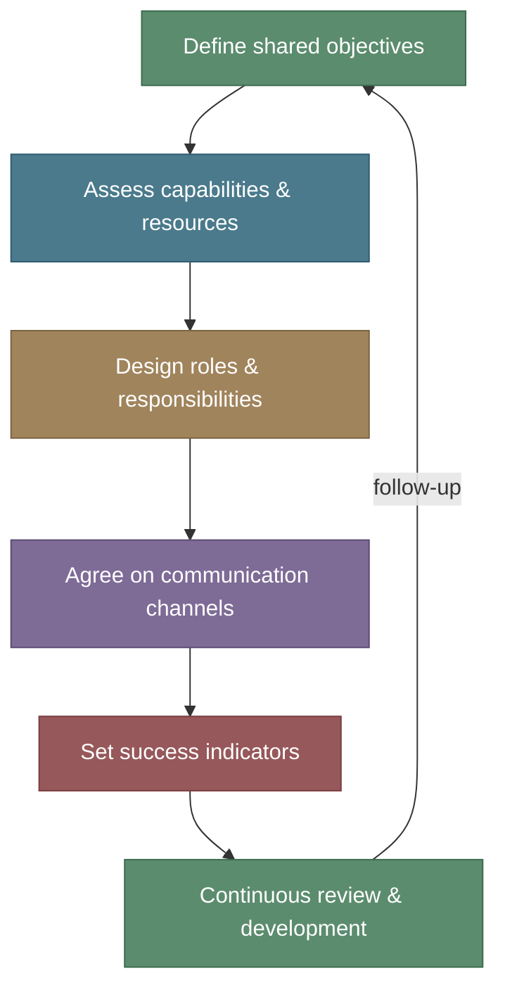
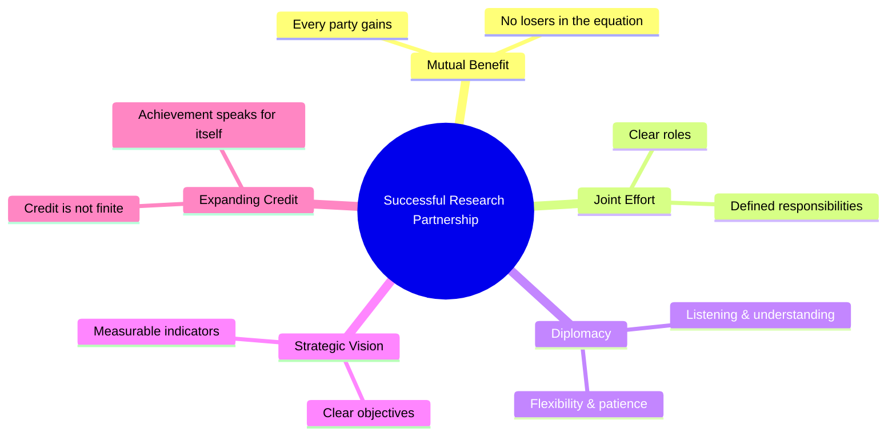

# A Brief Guide to the Art of Building Partnerships in Research Institutes

## Why Partnership, Not Competition?

In the name of God, and peace and blessings upon the teacher of all good to mankind.

In research institutes, success is often reduced to the number of published papers, secured grants, or praise received. But there is a deeper and more important question: **Can you build something lasting on your own?** The answer, more often than not — no. Major research achievements have never been the product of isolated individual effort; they have always been the fruit of deliberate partnerships built on mutual benefit and shared vision.

In this article, I share a practical model for building research partnerships — one that is not based on competition and control, but on **joint effort, mutual gain, and diplomacy in engagement.**

<!-- more -->

---

## Pillar One: Mutual Benefit Is the Foundation

Any partnership that does not deliver real value to both sides is destined to fail. The goal is not for one party to concede to the other, but for each party to find in the partnership what serves their research and institutional objectives.

!!! tip "The Simple Test"
    Before entering any partnership, ask yourself: **What does the other party gain?** If you cannot answer clearly, the partnership will not last. A successful partnership is one where each side feels they received more than they gave. And any partnership where you cannot say **no** may become a door to pressure and procrastination. Be wary of it.

---

## Pillar Two: Winning Does Not Mean the Other Side Loses — There Is Room for Everyone

Here lies a fundamental point that many overlook in research environments: **Success is not a zero-sum game.** Your win does not require your partner's loss. On the contrary — the more your partner succeeds, the greater the value and impact of the partnership.

!!! warning "The Common Trap"
    Some researchers approach partnerships with an "either me or them" mentality — who gets first authorship? Who is credited with the project? Who presents at the conference? This mindset kills partnerships before they begin, turning collaboration into a conflict without honesty or conviction.

The more mature approach is to ask: **How do we expand the circle of credit to include everyone?** Credit is not a pie that shrinks with every slice — it is an investment that multiplies through sharing. When you give your partner the recognition they deserve, you build trust that opens doors to bigger and deeper projects.

And here is a fundamental question as a Muslim researcher: is the goal of work the praise, or the beneficial work itself?

---

## Pillar Three: Know Your Engagement Style and Your Unique Personality

Not everyone builds partnerships the same way, and not every institution responds with the same approach. Knowing your engagement style — and understanding the other party's style — is a critical factor in the success of any collaboration.
What I mean here is emotional intelligence and the ability to understand the other party and what drives them — know the pain. This skill is not about exploiting the other side, but about understanding what you can offer with what you have.

!!! info "Engagement Styles in Research Partnerships"

    | Style | Description | Strength | Weakness |
    |-------|-------------|----------|----------|
    | **The Builder** | Focuses on shared outputs and gradual progress | Partnership sustainability | May be slow to start |
    | **The Strategist** | Links every partnership to clear institutional goals | Clarity of vision | May appear overly calculated |
    | **The Diplomat** | Excels at reconciling conflicting interests | Conflict resolution | May avoid decisive action |
    | **The Initiator** | Proposes ideas and drives projects forward | Energy and enthusiasm | May lose interest after launch |

    The key is not to be one type, but to **know when to use each style.** A mature partnership requires flexibility in moving between these styles depending on the phase and context.

---

## Pillar Four: The Goal Is Achievement, Not Show — Beware the Trap of Premature Celebration

Do not rush the harvest.

!!! quote "Golden Rule"
    **Chasing credit alone bears no fruit. Achieving the goals is the key.**

One of the biggest weaknesses in research partnerships is when the focus shifts from "What do we want to achieve?" to "Who gets the credit?" When visibility and self-promotion become the purpose, the partnership turns into a stage instead of a laboratory.

The effective researcher knows that:

- **Real achievement builds your reputation** — not the other way around. In fact, the reverse destroys reputation.
- **Results speak** — louder and clearer than any self-promotion, and they endure rather than fade.
- **A strong partnership network** — is the best long-term professional investment. People respect your principles and consistency, not your shifting colors.

!!! example "Practical Example"
    When you succeed in building a joint research platform between two institutions, the impact is not attributed to one person — it is attributed to the partnership itself. And that is more powerful and lasting than any individual achievement. Credit distributed fairly generates professional loyalty that lasts years.

---

## Pillar Five: Diplomacy and Strategic Vision

Building partnerships is not just agreeing on a joint paper — it is a **strategic project** that requires:

### Advance Planning

### Diplomacy in Practice

!!! tip "Essential Diplomatic Skills for Researchers"

    1. **Listen first** — Understand what your partner needs before presenting what you want. Those who listen understand; those who interrupt regret.
    2. **Flexibility in details, firmness in principles** — Compromise on small matters, but never compromise on research quality, ethics, or the higher values of the work.
    3. **Documentation** — Every verbal agreement must be put in writing. Not out of distrust, but for clarity and protection for everyone.
    4. **Managing expectations** — Be honest about what you can deliver and what you cannot. False promises are the shortest path to destroying a partnership and causing stress.
    5. **Patience** — Real partnerships are built over years, not weeks, and not always on your own terms.

---

## What Does This Mean for Research in Saudi Arabia?

We are living through an unprecedented research transformation in the Kingdom. Research institutions are expanding, grants are increasing, and ambitions are high — expectations and hopes even higher and more precious. But this expansion needs a **collaborative structure** no less important than the technical and specialized research infrastructure.

!!! question "Questions for Reflection"
    - How many Saudi research projects are built on genuine partnerships between local institutions — not just names on paper?
    - Do our institutions reward collaboration as much as they reward individual achievement?
    - Do we have clear mechanisms for managing research partnerships between universities, research centers, and the private sector?
    - Are promotions and incentives granted for successful research partnerships and effective research communities?

Effective research partnerships between Saudi institutions are not a luxury or a show — they are a **necessity for achieving Vision 2030's research goals.** No single institution, no matter how capable, can cover every discipline and need. Integration is the fundamental requirement — and the summit of success has room for all.

---

## Summary: The Successful Partnership Model

Building partnerships in research institutes is an art that combines science and diplomacy, ambition and realism, trust and documentation. You do not need to be perfect — you need to be **honest, professional, and flexible.**

**Shared credit does not diminish — it multiplies. And real achievement does not need promotion — it speaks for itself.**

---

## LinkedIn Summary

!!! note "Short Version for LinkedIn"

    **The Art of Building Partnerships in Research Institutes**

    After years of working in diverse research environments, I've reached a conviction: major achievements are not built through individual effort alone.

    My model for building partnerships rests on five pillars:

    🔹 **Mutual benefit** — any partnership that doesn't serve both sides will not last
    🔹 **Winning doesn't mean the other side loses** — success is not zero-sum
    🔹 **Know your style** — flexibility in engagement is the key to collaboration
    🔹 **Achievement, not show** — chasing credit alone bears no fruit
    🔹 **Diplomacy and vision** — partnerships are strategic projects, not passing agreements

    Shared credit does not diminish — it multiplies. And real achievement speaks for itself.

    📖 Full article: malarawi.sa/en/blog/building-research-partnerships/

    #ResearchPartnerships #ScientificCollaboration #Vision2030 #ResearchLeadership #ScienceDiplomacy
