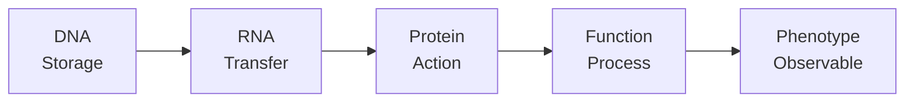

# Module 1: Biological Data
**From Molecules to Information**

> **Core Concept**: Before we can analyze biological data computationally, we must understand how physical biological reality becomes digital information—and what we gain and lose in this transformation.

---

## Module Overview

**Duration**: 2-3 weeks
**Prerequisites**: Basic molecular biology
**Programming Level**: None required - conceptual foundation

### Learning Objectives

By the end of this module, you will be able to:

1. ✓ Explain how biological molecules are abstracted into digital data
2. ✓ Distinguish between sequence, structure, expression, and interaction data types
3. ✓ Understand how experimental techniques produce different data representations
4. ✓ Recognize what information is preserved vs. lost in data representation
5. ✓ Assess the reliability and limitations of biological datasets
6. ✓ Connect biological questions to appropriate computational approaches

---

## Topics

### 🚀 Quick Start: A Concrete Example

**Let's start with something tangible before the theory.**

Imagine you have a drop of blood. Inside are millions of cells, each containing DNA:

!!! example "From Physical Reality to Digital Data"

    **Step 1: Physical Reality**
    ```
    A DNA molecule in your cell nucleus:
    - 3D double helix, twisting and folding
    - Wrapped around histone proteins
    - Chemically modified (methylation marks)
    - Constantly being read by molecular machinery
    - Part of chromosome 17 (BRCA1 gene location)
    ```

    **Step 2: The Journey**
    ```
    Blood sample → DNA extraction → Sequencing machine → Computer
    (Physical)     (Chemical)        (Optical signals)   (Digital file)
    ```

    **Step 3: What You Get as Data**
    ```
    A text file (FASTQ format):
    @ReadID_12345
    ATGGATTTATCTGCTCTTCGCGTTGAAGAAGTACAAAATGTCATTAATGC
    +
    IIIIIIIHHHHHHGGGGGFFFFFFFEEEEEDDDDDCCCCCBBBBBAAA@@
    ```

**What just happened?**

- ✅ **Gained**: A searchable, shareable, analyzable digital record
- ❌ **Lost**: 3D structure, protein context, chemical modifications, chromosomal location

**This is Module 1's core question**: What do we gain and lose when biology becomes data?

---

### 1. Biology as Information

#### 🧬 The Central Dogma as Information Flow



Each arrow represents:
- A physical/chemical process
- An information transformation
- A potential measurement point
- A data generation opportunity

!!! question "Question to Consider"
    If you're studying a disease, at which point in this flow should you measure?

---

#### 📊 Information vs. Data

| Information | Data |
|------------|------|
| The biological "truth" | Our measurement of truth |
| Actual DNA sequence | FASTQ file |
| True expression level | RNA-seq read counts |
| Real 3D structure | PDB coordinates |

!!! warning "Key Point"
    **Data is not truth—it's evidence with uncertainty**

---

### 2. The Measurement Problem

Every biological measurement involves:

```
Biological Reality → Experimental Technique → Raw Signal → Processing → Data
   (Unknown)          (Introduces bias)      (Noisy)    (Assumptions) (Representation)
```

#### Example: Sequencing a DNA Molecule

=== "Reality"
    ```
    Actual continuous DNA molecule
    ATGCGATCGTAGCTAGCT...
    ```
    - Molecule context known
    - 3D structure preserved
    - Epigenetic modifications present

=== "Technique"
    ```
    Illumina Sequencing
    ↓
    - Fragment DNA
    - Optical detection
    - Fluorescent measurements
    ```

=== "Data"
    ```
    FASTQ file
    @read1
    ATGCGATCGTAGCTAGCT
    +
    IIIHHHHGGGGFFFFEEE
    ```
    - Discrete text
    - Quality scores
    - Context lost

??? note "What Was Lost?"
    - ❌ Original molecule context (where was this in the genome?)
    - ❌ 3D structure (now linear text)
    - ❌ Epigenetic modifications (methylation not captured)
    - ❌ Temporal dynamics (when was this expressed?)

??? success "What Was Gained?"
    - ✓ Searchability (can use BLAST)
    - ✓ Comparability (can align to reference)
    - ✓ Reproducibility (can share digitally)
    - ✓ Computability (can analyze with algorithms)

---

### 3. Types of Biological Data

#### A. Sequence Data

**The Linear Abstraction of DNA/RNA/Protein**

##### 🧬 DNA Sequences

**Physical Reality:**
- Double helix (3D structure, dynamic)
- Chromatin organization (histones, loops, territories)
- Epigenetic modifications (methylation, acetylation)
- Protein associations

**Data Representation:**
```
ATGCGATCGTAGCTAGCTGATCGATCG
```

!!! example "Example"
    === "Human Genome"
        - 3.2 billion base pairs
        - ~20,000 protein-coding genes
        - Format: FASTA/FASTQ
        - Size: ~3 GB (uncompressed)

    === "Single Gene"
        ```
        >BRCA1 Human breast cancer 1 gene
        ATGGATTTATCTGCTCTTCGCGTTGAAGAAGTACAAAATGTCATTAATGCTATGCAGAAAATC
        TTAGAGTGTCCCATCTGTCTGGAGTTGATCAAGGAACCTGTCTCCACAAAGTGTGACCACACAT
        ```

##### 🧪 RNA Sequences

**Difference from DNA:**
- T → U (uracil instead of thymine)
- No introns after splicing
- Coding sequence only

```
Genomic DNA:  ATGCGT[----2000bp intron----]TCGATC
mRNA:         AUGCGU UCGAUC
```

##### 🔬 Protein Sequences

**20-letter alphabet:**
```
MKTAYIAKQRQISFVKSHFSRQLEERLGLIEVQAPILSRVGDGT
```

- Additional abstraction level
- Every 3 nucleotides → 1 amino acid
- 3D structure not visible in sequence

---

#### B. Structure Data

**Representing 3D Molecules**

##### PDB Format

```
ATOM      1  N   MET A   1      20.154  29.699   5.276  1.00 49.05           N
ATOM      2  CA  MET A   1      21.439  29.725   5.961  1.00 49.05           C
ATOM      3  C   MET A   1      21.441  28.969   7.279  1.00 49.05           C
```

Each line represents one atom:
- Atom number
- Atom type (N = Nitrogen)
- Residue (MET = Methionine)
- Chain identifier (A)
- X, Y, Z coordinates (Ångströms)
- B-factor (flexibility indicator)

##### Structure Determination Techniques

| Technique | Resolution | Notes |
|-----------|------------|-------|
| X-ray Crystallography | 1-3 Å | Requires crystal |
| Cryo-EM | 2-10 Å | No crystal needed |
| NMR | Lower | Solution, dynamic |
| AlphaFold | Varies* | Computational prediction (not experimental) |

*AlphaFold confidence and accuracy varies by protein region

---

#### C. Expression Data

**Measuring "How Much?"**

##### From Continuous Biology to Discrete Counts

**RNA-seq Example (typical workflow):**

```
Cell → RNA extraction → Library prep → Sequencing → Alignment → Count matrix
(~10⁵ mRNA molecules)  (~10⁶ in library)  (~10⁷ reads)  (~10⁶ aligned)
```

##### Count Matrix

```
         Sample1  Sample2  Sample3
Gene1       145      523      189
Gene2      2341     2156     2405
Gene3         0        1        0
Gene4       856      901      823
```

!!! warning "This is NOT 'Truth'"
    - Gene3 may be expressed but not detected (low sensitivity)
    - Gene2 counts may be inflated by multimapping reads
    - Technical vs. biological variation
    - Batch effects (different labs, days, technicians)

##### Data Normalization Forms

=== "Raw Counts"
    ```
    Gene A: 1450
    Gene B: 234
    ```
    - Simple, interpretable
    - But: not comparable between samples

=== "TPM (Transcripts Per Million)"
    ```
    TPM = (reads/gene_length) × 10⁶ / (sum of all reads/length)

    Gene A: 145.3 TPM
    Gene B: 23.8 TPM
    ```
    - Within-sample normalization
    - Accounts for gene length and sequencing depth

=== "Log-transformed"
    ```
    log₂(count + 1)

    Gene A: 10.5
    Gene B: 7.9
    ```
    - Suitable for statistical analysis
    - Changes interpretation: additive → multiplicative

---

#### D. Interaction Data

**Representing Relationships Between Biological Entities**

##### Protein-Protein Interactions

**Biological Reality:**
- Proteins form transient complexes
- Binding affinities vary (nM to mM)
- Context-dependent (cell type, conditions)
- Dynamic (on/off rates)

**Network Representation:**

```
ProteinA -- ProteinB
ProteinA -- ProteinC
ProteinB -- ProteinD
```

Represented as:

=== "Adjacency List"
    ```
    ProteinA: [ProteinB, ProteinC, ProteinD]
    ProteinB: [ProteinA, ProteinE]
    ProteinC: [ProteinA]
    ```

=== "Adjacency Matrix"
    ```
         A  B  C  D  E
    A    0  1  1  1  0
    B    1  0  0  0  1
    C    1  0  0  0  0
    ```

##### What We Keep

✓ Which proteins interact
✓ Network topology (hubs, modules)
✓ Pathway connectivity

##### What We Lose

❌ Binding strength/affinity
❌ Temporal dynamics
❌ Spatial organization
❌ Conditions under which interaction occurs

---

### 4. From Data to Biological Insight

#### 🎯 Matching Questions to Data Types

| Biological Question | Data Type Needed | Why |
|---------------------|------------------|-----|
| Is GeneX mutated in cancer? | DNA sequencing (tumor vs. normal) | To detect sequence changes |
| Is GeneX over-expressed in tumors? | RNA-seq or microarray | For quantitative gene expression |
| What proteins does GeneX interact with? | Protein-protein interaction data | To understand functional context |
| Where is GeneX protein located? | Imaging or localization data | Function depends on location |
| How does mutant GeneX differ structurally? | Protein structure (experimental/predicted) | For 3D view of mutation effects |

---

### 5. Data Quality Assessment

!!! danger "Real Data is Messy"

#### Example: Gene Expression Dataset

```
Gene      Sample1   Sample2   Sample3   Sample4
GeneA        145       523    189000       189
GeneB       2341      2156      2405      2301
GeneC          0         1         0         0
GeneD        856       901       823       -99
```

**Questions:**

1. What's wrong with GeneA in Sample3?
   → Likely error - outlier

2. Is GeneC expressed?
   → Zero counts - not detected or not expressed?

3. What does -99 mean for GeneD?
   → Missing value? Check metadata

4. Should you trust Sample1 if systematically different?
   → Batch effect?

---

## 📝 Exercises

### Exercise 1: Understanding Abstraction

Compare these representations of the same gene:

1. **Genomic DNA**: `ATGCGT[2000bp intron]TCGATC`
2. **mRNA**: `AUGCGUUCGAUC`
3. **Protein**: `MRKSD`

**Questions:**
- What biological processes occurred between each representation?
- When would you use each representation?
- What information is lost at each step?

### Exercise 2: Choosing Data Types

For each question, choose the most appropriate data type:

1. Identifying potential inhibitors for an enzyme
2. Finding differentially expressed genes in disease
3. Understanding evolution of a protein family
4. Predicting impact of a disease mutation

??? success "Solutions to Exercises"

    ### Exercise 1: Understanding Abstraction

    **Biological processes between representations:**

    1. **Genomic DNA → mRNA**:
       - **Transcription**: RNA polymerase reads DNA template
       - **Splicing**: Introns removed, exons joined
       - **Result**: Continuous coding sequence (no introns)

    2. **mRNA → Protein**:
       - **Translation**: Ribosome reads mRNA codons
       - **Each 3 nucleotides (codon) → 1 amino acid**
       - **Result**: Linear amino acid sequence

    **When to use each representation:**

    | Representation | Best Use Cases |
    |----------------|----------------|
    | **Genomic DNA** | • Studying mutations<br/>• Finding regulatory elements<br/>• Understanding gene structure |
    | **mRNA** | • Measuring gene expression<br/>• Studying alternative splicing<br/>• Analyzing transcript variants |
    | **Protein** | • Understanding function<br/>• Analyzing 3D structure<br/>• Drug target identification |

    **Information lost at each step:**

    - **DNA → mRNA**:
      - ❌ Introns and intergenic regions
      - ❌ Regulatory elements (promoters, enhancers)
      - ❌ Chromatin context
      - ❌ DNA modifications (methylation)

    - **mRNA → Protein**:
      - ❌ UTRs (untranslated regions)
      - ❌ Codon usage information
      - ❌ RNA secondary structure
      - ❌ Post-transcriptional modifications

    ---

    ### Exercise 2: Choosing Data Types

    **1. Identifying potential inhibitors for an enzyme**

    **Answer**: **Protein structure data** (PDB)

    **Rationale**:
    - Need 3D structure to identify binding sites
    - Structure-based drug design requires atomic coordinates
    - Can model inhibitor docking

    **2. Finding differentially expressed genes in disease**

    **Answer**: **Gene expression data** (RNA-seq or microarray)

    **Rationale**:
    - Need quantitative expression measurements
    - Compare diseased vs. healthy tissue
    - Statistical analysis of count data

    **3. Understanding evolution of a protein family**

    **Answer**: **Protein sequence data** (from multiple species)

    **Rationale**:
    - Need sequences from related organisms
    - Multiple sequence alignment reveals conservation
    - Phylogenetic analysis shows evolutionary relationships

    **4. Predicting impact of a disease mutation**

    **Answer**: **Combination of**:
    - **Protein structure** (to see mutation location)
    - **Sequence conservation** (across species)
    - **Variant databases** (dbSNP, ClinVar for known effects)

    **Rationale**:
    - Structure shows if mutation disrupts active site
    - Conservation indicates functional importance
    - Clinical data provides evidence of pathogenicity

---

## 📚 Readings

### Required

1. **Noble (2009)**: "A Quick Guide to Organizing Computational Biology Projects"
   *Focus*: How biological data is organized

2. **Markowetz (2017)**: "All biology is computational biology"
   *Focus*: Why computation is essential

### Supplementary

3. **Baggerly & Coombes (2009)**: Data quality and reproducibility (cautionary tale)

4. NCBI Data Model documentation

---

## ✅ Self-Assessment

After completing this module, you should be able to:

- [ ] Explain how a DNA molecule becomes a FASTA file
- [ ] Identify what's lost when representing a protein as a PDB file
- [ ] Distinguish between sequence, structure, and expression data
- [ ] Explain why different experimental techniques produce different data formats
- [ ] Assess reliability and limitations of a biological dataset
- [ ] Match biological questions to appropriate data types
- [ ] Understand that "data" is not "truth" but evidence with uncertainty

!!! tip "Not Confident?"
    Review relevant lectures or attend office hours

---

## 🔗 Connection to Future Modules

!!! info "Why This Module Matters"
    Before programming (Module 2), you must understand:
    - What biological data represents
    - How to think about data abstraction
    - What different data types can (and cannot) tell you

    This conceptual foundation enables you to:
    ✓ Choose appropriate analysis methods
    ✓ Interpret results correctly
    ✓ Recognize data quality issues
    ✓ Design computational experiments properly

**Next Module**: [Module 2: Programming](module-2.md) - Now that you understand *what* biological data is, you'll learn *how* to work with it computationally.

---

[↑ Course Index](index.md) | [Next: Module 2 →](module-2.md) | [🌐 View in Arabic](/ar/courses/foundation-of-bioinformatics/module-1/)
