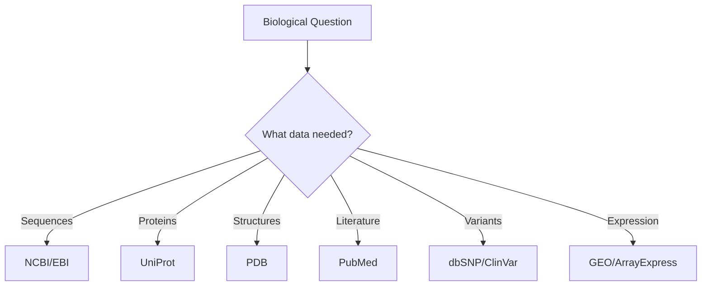

---
---

# Module 3: Biological Databases
**Accessing the World's Biological Knowledge**

> **Core Concept**: Most bioinformatics research begins with data retrieval. Public biological databases contain decades of accumulated knowledge—learning to access them programmatically is essential for reproducible research.

---

## Module Overview

**Duration**: 2 weeks
**Prerequisites**: Module 2 (Python and Biopython basics)
**Programming Level**: Intermediate Python with API usage

### Learning Objectives

By the end of this module, you will be able to:

1. ✓ Navigate major biological databases and understand their purposes
2. ✓ Use advanced search strategies to find relevant data
3. ✓ Retrieve data programmatically using APIs and Biopython
4. ✓ Understand database schemas and cross-references
5. ✓ Build automated data retrieval pipelines
6. ✓ Handle rate limits, errors, and data validation
7. ✓ Integrate data from multiple sources

---

## Topics

### 1. The Biological Database Landscape

#### 🌐 Why So Many Databases?

Biology is complex and multifaceted. Different databases serve different purposes:



!!! info "Database Categories"
    - **Primary databases**: Store original experimental data (GenBank, PDB)
    - **Secondary databases**: Derived/curated data (UniProt, Pfam)
    - **Specialized databases**: Focus on specific organisms, diseases, or data types

---

#### 📊 Major Database Providers

=== "NCBI (USA)"
    **National Center for Biotechnology Information**

    **Key Databases:**
    - GenBank: Nucleotide sequences
    - Protein: Protein sequences
    - PubMed: Biomedical literature
    - Gene: Gene-centered information
    - GEO: Gene expression data
    - SRA: Sequence Read Archive (raw sequencing)
    - dbSNP: Single nucleotide polymorphisms
    - ClinVar: Clinical variant interpretations

    **Unified Access:** Entrez system links all databases

=== "EBI (Europe)"
    **European Bioinformatics Institute**

    **Key Databases:**
    - ENA: European Nucleotide Archive
    - UniProt: Protein sequences and function
    - Ensembl: Genome annotations
    - ArrayExpress: Gene expression
    - InterPro: Protein families and domains
    - ChEMBL: Bioactive molecules

    **REST APIs:** Modern JSON-based access

=== "PDB (Worldwide)"
    **Protein Data Bank**

    **Focus:** 3D structural data

    **Contains:**
    - X-ray crystallography structures
    - Cryo-EM structures
    - NMR structures
    - Predicted structures (AlphaFold DB)

    **Access:** RCSB PDB (USA), PDBe (Europe), PDBj (Japan)

---

### 2. NCBI Database Ecosystem

#### 🔍 Entrez: The Universal Search System

**Entrez** connects all NCBI databases with a unified query language.

**Search Syntax Examples:**

```
# PubMed search
CRISPR[Title] AND 2023[PDAT]

# Gene search
BRCA1[Gene Name] AND "Homo sapiens"[Organism]

# Nucleotide search
1000:2000[Sequence Length] AND genomic[Filter]

# Protein search
hemoglobin[Protein Name] AND refseq[Filter]
```

!!! tip "Search Field Tags"
    - `[Title]` - Search in title only
    - `[Author]` - Author name
    - `[PDAT]` - Publication date
    - `[Organism]` - Species
    - `[Gene Name]` - Gene symbol
    - `[Filter]` - Database-specific filters

---

#### 📚 Key NCBI Databases

##### GenBank (Nucleotide Database)

**What it contains:**
- All publicly available DNA/RNA sequences
- 400+ million sequences
- Daily updates from researchers worldwide

**Example: Retrieve Sequences**

```python
from Bio import Entrez, SeqIO

Entrez.email = "your.email@example.com"

# Search for human BRCA1 mRNA
handle = Entrez.esearch(
    db="nucleotide",
    term="BRCA1[Gene] AND Homo sapiens[Organism] AND mRNA[Filter]",
    retmax=5
)
record = Entrez.read(handle)
handle.close()

print(f"Found {record['Count']} sequences")
print(f"IDs: {record['IdList']}")

# Fetch the first sequence
handle = Entrez.efetch(
    db="nucleotide",
    id=record['IdList'][0],
    rettype="gb",
    retmode="text"
)

seq_record = SeqIO.read(handle, "genbank")
handle.close()

print(f"Sequence ID: {seq_record.id}")
print(f"Description: {seq_record.description}")
print(f"Length: {len(seq_record.seq)} bp")
```

---

##### PubMed (Literature Database)

**What it contains:**
- 35+ million biomedical citations
- Abstracts for most articles
- Links to full text (when available)

**Example: Literature Search**

```python
from Bio import Entrez

Entrez.email = "your.email@example.com"

# Search for CRISPR review articles
handle = Entrez.esearch(
    db="pubmed",
    term="CRISPR[Title] AND Review[Publication Type] AND 2023[PDAT]",
    retmax=10,
    sort="relevance"
)
record = Entrez.read(handle)
handle.close()

pmids = record['IdList']
print(f"Found {len(pmids)} reviews")

# Fetch article details
handle = Entrez.efetch(
    db="pubmed",
    id=pmids,
    rettype="medline",
    retmode="text"
)

articles = handle.read()
handle.close()
print(articles)
```

---

##### Gene Database

**What it contains:**
- Gene-centered information
- Gene symbols, descriptions, locations
- Links to sequences, publications, pathways
- Gene expression data

**Example: Gene Information**

```python
from Bio import Entrez

Entrez.email = "your.email@example.com"

# Search for BRCA1 gene
handle = Entrez.esearch(
    db="gene",
    term="BRCA1[Gene Name] AND Homo sapiens[Organism]"
)
record = Entrez.read(handle)
handle.close()

gene_id = record['IdList'][0]

# Fetch detailed gene information
handle = Entrez.efetch(
    db="gene",
    id=gene_id,
    retmode="xml"
)

gene_data = Entrez.read(handle)
handle.close()

# Extract information
gene = gene_data[0]
print(f"Gene Symbol: {gene['Entrezgene_gene']['Gene-ref']['Gene-ref_locus']}")
print(f"Description: {gene['Entrezgene_gene']['Gene-ref']['Gene-ref_desc']}")
print(f"Chromosome: {gene.get('Entrezgene_chromosome', 'N/A')}")
```

---

##### GEO (Gene Expression Omnibus)

**What it contains:**
- Gene expression datasets
- Microarray data
- RNA-seq data
- ChIP-seq data

**Example: Browse GEO Dataset**

```python
from Bio import Entrez

Entrez.email = "your.email@example.com"

# Search for breast cancer RNA-seq datasets
handle = Entrez.esearch(
    db="gds",
    term="breast cancer[Title] AND RNA-seq[Filter]",
    retmax=5
)
record = Entrez.read(handle)
handle.close()

print(f"Found {record['Count']} datasets")
for gds_id in record['IdList']:
    print(f"GDS ID: {gds_id}")
```

!!! warning "Large Datasets"
    GEO datasets can be massive (gigabytes). Use web interface first to understand data structure before downloading programmatically.

---

### 3. UniProt: The Protein Knowledge Base

#### 🧬 UniProt Organization

UniProt is divided into two sections:

```
UniProt
├── Swiss-Prot (curated)
│   ├── Manually annotated
│   ├── High quality
│   └── ~570,000 entries
└── TrEMBL (automated)
    ├── Computationally annotated
    ├── Lower confidence
    └── ~240 million entries
```

---

#### 🔎 UniProt Search and Retrieval

**Web Interface Features:**
- Advanced query builder
- Filter by organism, evidence, annotation score
- Download in multiple formats (FASTA, XML, TSV)

**Example: Programmatic Access**

```python
import requests

def search_uniprot(query, format='fasta'):
    """
    Search UniProt and retrieve results.

    Args:
        query: UniProt query string
        format: Output format (fasta, tab, xml)

    Returns:
        Response text
    """
    url = "https://rest.uniprot.org/uniprotkb/search"

    params = {
        'query': query,
        'format': format,
        'size': 10  # Limit results
    }

    response = requests.get(url, params=params)

    if response.ok:
        return response.text
    else:
        raise Exception(f"UniProt request failed: {response.status_code}")

# Example: Search for human kinases
query = "organism_id:9606 AND (protein_name:kinase)"
results = search_uniprot(query, format='tab')
print(results)
```

---

#### 📋 UniProt Entry Structure

Each UniProt entry contains:

```
Entry Information:
├── Sequence
├── Function (GO terms, keywords)
├── Subcellular location
├── Protein-protein interactions
├── Post-translational modifications
├── Disease associations
├── Structural information
├── Cross-references (PDB, GenBank, etc.)
└── Literature citations
```

**Example: Fetch Specific Protein**

```python
import requests

def get_uniprot_entry(accession):
    """Get UniProt entry by accession number."""
    url = f"https://rest.uniprot.org/uniprotkb/{accession}.txt"

    response = requests.get(url)

    if response.ok:
        return response.text
    else:
        raise Exception(f"Entry {accession} not found")

# Example: Human p53 tumor suppressor
p53_data = get_uniprot_entry("P04637")
print(p53_data[:500])  # Print first 500 characters
```

---

### 4. PDB: Protein Structure Database

#### 🏗️ What PDB Contains

**Structural Data:**
- 200,000+ experimental structures
- X-ray crystallography (majority)
- Cryo-EM (growing rapidly)
- NMR structures
- AlphaFold predicted structures (separate database)

---

#### 🔍 PDB Search Strategies

=== "By Protein Name"
    ```python
    from Bio.PDB import PDBList

    pdbl = PDBList()

    # Download structure by ID
    pdbl.retrieve_pdb_file('1HHO', pdir='.', file_format='pdb')
    # 1HHO is hemoglobin structure
    ```

=== "By Sequence Similarity"
    ```python
    import requests

    def search_pdb_by_sequence(sequence):
        """Search PDB using BLAST sequence similarity."""
        url = "https://search.rcsb.org/rcsbsearch/v2/query"

        query = {
            "query": {
                "type": "terminal",
                "service": "sequence",
                "parameters": {
                    "evalue_cutoff": 0.1,
                    "identity_cutoff": 0.9,
                    "sequence_type": "protein",
                    "value": sequence
                }
            },
            "return_type": "entry"
        }

        response = requests.post(url, json=query)
        return response.json()

    # Example search
    seq = "MVLSPADKTNVKAAWGKVGAHAGEYGAEALERMFLSFPTT"
    results = search_pdb_by_sequence(seq)
    ```

=== "By Resolution"
    ```python
    import requests

    def search_high_resolution_structures(max_resolution=2.0):
        """Find high-resolution structures."""
        url = "https://search.rcsb.org/rcsbsearch/v2/query"

        query = {
            "query": {
                "type": "terminal",
                "service": "text",
                "parameters": {
                    "attribute": "rcsb_entry_info.resolution_combined",
                    "operator": "less_or_equal",
                    "value": max_resolution
                }
            },
            "return_type": "entry"
        }

        response = requests.post(url, json=query)
        return response.json()
    ```

---

#### 📐 Parsing PDB Files

```python
from Bio.PDB import PDBParser, PDBIO

# Parse PDB file
parser = PDBParser()
structure = parser.get_structure("protein", "1hho.pdb")

# Extract information
for model in structure:
    for chain in model:
        print(f"Chain {chain.id}:")
        residues = list(chain.get_residues())
        print(f"  Residues: {len(residues)}")

        # Count atom types
        atoms = list(chain.get_atoms())
        print(f"  Atoms: {len(atoms)}")

# Calculate center of mass
def center_of_mass(structure):
    """Calculate center of mass for structure."""
    coords = []
    for atom in structure.get_atoms():
        coords.append(atom.coord)

    import numpy as np
    coords = np.array(coords)
    return coords.mean(axis=0)

com = center_of_mass(structure)
print(f"Center of mass: {com}")
```

---

### 5. Data Integration Strategies

#### 🔗 Cross-Database Linking

Different databases reference each other through IDs:

```
GenBank Protein ID ─→ UniProt Accession ─→ PDB Structure ID
      ↓                      ↓                     ↓
   NP_000537              P04637                1TUP
   (p53 RefSeq)        (p53 Swiss-Prot)    (p53 structure)
```

**Example: Multi-Database Pipeline**

```python
from Bio import Entrez, SeqIO
import requests

Entrez.email = "your.email@example.com"

def gene_to_structure_pipeline(gene_name, organism):
    """
    Retrieve information from gene to structure.

    Pipeline:
    1. Find gene in NCBI Gene database
    2. Get protein sequence from GenBank
    3. Find UniProt entry
    4. Search for PDB structures
    """
    results = {}

    # Step 1: Find gene
    print(f"1. Searching for gene: {gene_name}")
    handle = Entrez.esearch(
        db="gene",
        term=f"{gene_name}[Gene Name] AND {organism}[Organism]"
    )
    gene_record = Entrez.read(handle)
    handle.close()

    if gene_record['IdList']:
        gene_id = gene_record['IdList'][0]
        results['gene_id'] = gene_id
        print(f"   Found Gene ID: {gene_id}")
    else:
        print("   Gene not found")
        return results

    # Step 2: Get protein sequence
    print("2. Retrieving protein sequence")
    handle = Entrez.elink(
        dbfrom="gene",
        db="protein",
        id=gene_id
    )
    link_record = Entrez.read(handle)
    handle.close()

    if link_record[0]['LinkSetDb']:
        protein_ids = [link['Id'] for link in link_record[0]['LinkSetDb'][0]['Link']]
        results['protein_ids'] = protein_ids[:3]  # First 3
        print(f"   Found {len(protein_ids)} protein sequences")

    # Step 3: Search UniProt (using gene name)
    print("3. Searching UniProt")
    query = f"gene:{gene_name} AND organism_name:{organism}"
    uniprot_url = "https://rest.uniprot.org/uniprotkb/search"

    response = requests.get(uniprot_url, params={'query': query, 'format': 'json', 'size': 1})

    if response.ok:
        data = response.json()
        if data['results']:
            uniprot_acc = data['results'][0]['primaryAccession']
            results['uniprot'] = uniprot_acc
            print(f"   Found UniProt: {uniprot_acc}")

    # Step 4: Search PDB
    print("4. Searching PDB structures")
    pdb_url = "https://search.rcsb.org/rcsbsearch/v2/query"

    pdb_query = {
        "query": {
            "type": "terminal",
            "service": "text",
            "parameters": {
                "attribute": "rcsb_entity_source_organism.rcsb_gene_name.value",
                "operator": "exact_match",
                "value": gene_name
            }
        },
        "return_type": "entry"
    }

    response = requests.post(pdb_url, json=pdb_query)
    if response.ok:
        pdb_data = response.json()
        if 'result_set' in pdb_data:
            pdb_ids = [hit['identifier'] for hit in pdb_data['result_set']]
            results['pdb_ids'] = pdb_ids[:5]  # First 5
            print(f"   Found {len(pdb_ids)} PDB structures")

    return results

# Example usage
results = gene_to_structure_pipeline("TP53", "Homo sapiens")
print("\n=== Pipeline Results ===")
for key, value in results.items():
    print(f"{key}: {value}")
```

---

### 6. Best Practices for Database Access

#### ⚡ Rate Limiting and Ethical Access

!!! danger "Critical Rules"
    1. **Set your email**: Always use `Entrez.email = "your@email.com"`
    2. **Respect rate limits**:
       - NCBI: 3 requests/second (10/sec with API key)
       - UniProt: No strict limit, but be reasonable
       - PDB: No strict limit
    3. **Don't hammer servers**: Add delays between requests
    4. **Cache results**: Don't re-download the same data

**Example: Rate-Limited Retrieval**

```python
from Bio import Entrez
import time

Entrez.email = "your.email@example.com"

def fetch_sequences_safely(id_list, delay=0.34):
    """
    Fetch sequences with rate limiting.

    Args:
        id_list: List of GenBank IDs
        delay: Seconds between requests (0.34 = ~3 req/sec)
    """
    sequences = []

    for i, seq_id in enumerate(id_list):
        print(f"Fetching {i+1}/{len(id_list)}: {seq_id}")

        try:
            handle = Entrez.efetch(
                db="nucleotide",
                id=seq_id,
                rettype="fasta",
                retmode="text"
            )
            sequences.append(handle.read())
            handle.close()

            # Rate limiting
            time.sleep(delay)

        except Exception as e:
            print(f"Error fetching {seq_id}: {e}")
            continue

    return sequences

# Example
ids = ["NM_007294", "NM_000546", "NM_001904"]
seqs = fetch_sequences_safely(ids)
```

---

#### 💾 Caching Downloaded Data

**Don't re-download unnecessarily:**

```python
import os
import pickle
from datetime import datetime, timedelta

def cached_database_query(query_func, cache_file, max_age_days=7):
    """
    Cache database query results.

    Args:
        query_func: Function that performs the query
        cache_file: Path to cache file
        max_age_days: Maximum cache age in days
    """
    # Check if cache exists and is fresh
    if os.path.exists(cache_file):
        cache_age = datetime.now() - datetime.fromtimestamp(
            os.path.getmtime(cache_file)
        )

        if cache_age < timedelta(days=max_age_days):
            print(f"Using cached data (age: {cache_age.days} days)")
            with open(cache_file, 'rb') as f:
                return pickle.load(f)

    # Cache miss or expired - query database
    print("Querying database...")
    result = query_func()

    # Save to cache
    with open(cache_file, 'wb') as f:
        pickle.dump(result, f)

    return result

# Example usage
def query_brca1():
    """Example query function."""
    from Bio import Entrez
    Entrez.email = "your.email@example.com"

    handle = Entrez.esearch(db="gene", term="BRCA1[Gene] AND human[Organism]")
    result = Entrez.read(handle)
    handle.close()
    return result

# Use cached version
data = cached_database_query(query_brca1, "brca1_cache.pkl", max_age_days=7)
```

---

#### 🛡️ Error Handling

**Networks fail. Plan for it:**

```python
from Bio import Entrez
import time

def robust_fetch(db, id, rettype, retmode, max_retries=3):
    """Fetch with automatic retries."""
    Entrez.email = "your.email@example.com"

    for attempt in range(max_retries):
        try:
            handle = Entrez.efetch(
                db=db,
                id=id,
                rettype=rettype,
                retmode=retmode
            )
            result = handle.read()
            handle.close()
            return result

        except Exception as e:
            print(f"Attempt {attempt + 1} failed: {e}")

            if attempt < max_retries - 1:
                wait_time = 2 ** attempt  # Exponential backoff
                print(f"Retrying in {wait_time} seconds...")
                time.sleep(wait_time)
            else:
                print("Max retries reached")
                raise

# Example
try:
    data = robust_fetch("nucleotide", "NM_007294", "fasta", "text")
    print("Success!")
except Exception as e:
    print(f"Failed to retrieve data: {e}")
```

---

## 📝 Exercises

### Exercise 1: Multi-Database Search

Write a function that:
1. Takes a gene symbol as input
2. Searches NCBI Gene database
3. Retrieves associated protein sequences
4. Finds relevant PubMed articles
5. Returns a summary dictionary

### Exercise 2: Batch Download Pipeline

Create a script that:
1. Reads a list of protein accessions from a file
2. Downloads each sequence from UniProt
3. Saves to a single FASTA file
4. Implements proper rate limiting
5. Handles errors gracefully

### Exercise 3: Cross-Reference Validation

Build a tool that:
1. Takes a UniProt accession
2. Verifies cross-references to GenBank and PDB
3. Reports which databases have data
4. Exports a summary table

---

## 📚 Readings

### Required

1. **NCBI Database Resources**
   *Focus*: Overview of NCBI ecosystem

2. **UniProt: A Worldwide Hub of Protein Knowledge** (2019)
   *Focus*: UniProt organization and data quality

### Supplementary

3. **PDB Data Archive** - Understanding structural data
4. **Database Integration Best Practices** - Data provenance

---

## ✅ Self-Assessment

After completing this module, you should be able to:

- [ ] Identify the appropriate database for a specific data type
- [ ] Construct advanced Entrez search queries
- [ ] Write Python scripts to retrieve data from NCBI, UniProt, and PDB
- [ ] Implement proper rate limiting and error handling
- [ ] Cache downloaded data to avoid redundant queries
- [ ] Build pipelines that integrate multiple databases
- [ ] Validate data quality and cross-references
- [ ] Understand database update cycles and versioning

!!! tip "Practice Project"
    Build a personal database query tool that combines your most-used searches into reusable functions.

---

## 🔗 Connection to Future Modules

!!! info "Why Databases Matter"
    **Module 4** (Sequence Alignment) requires:
    - Retrieved sequences for comparison
    - Multiple homologous sequences from databases
    - Reference sequences for validation

    **Module 5** (Statistics) requires:
    - Expression data from GEO
    - Sample metadata
    - Large datasets for analysis

**Next Module**: [Module 4: Sequence Alignment](module-4.md) - Now that you can retrieve biological data, you'll learn to compare sequences using computational algorithms.

---

[↑ Course Index](index.md) | [← Module 2](module-2.md) | [Next: Module 4 →](module-4.md) | [🌐 View in Arabic](/ar/courses/foundation-of-bioinformatics/module-3/)
