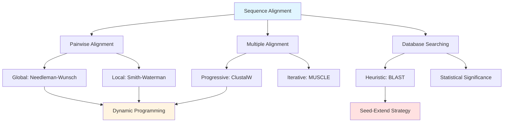
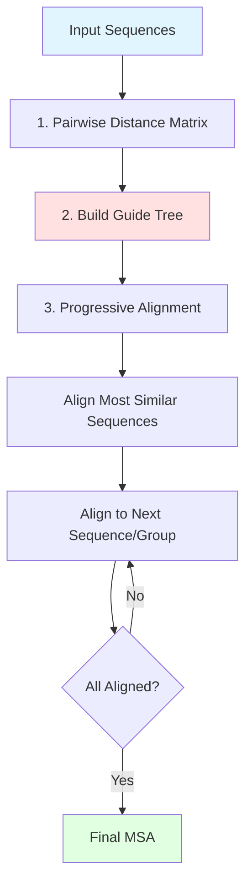

# Module 4: Sequence Alignment Algorithms
**Finding Similarity in Biological Sequences**

> **Core Concept**: Sequence alignment is the foundation of comparative genomics, allowing us to identify evolutionary relationships, predict protein function, and understand biological mechanisms through sequence similarity.

## Learning Objectives

By the end of this module, you will be able to:

1. **Understand alignment algorithms** and their theoretical foundations
2. **Apply dynamic programming** for optimal pairwise alignments
3. **Use BLAST and heuristic methods** for database searching
4. **Perform multiple sequence alignment** for evolutionary analysis
5. **Construct phylogenetic trees** from aligned sequences
6. **Analyze algorithm complexity** and choose appropriate methods
7. **Interpret alignment statistics** and significance scores

---

## Prerequisites

!!! info "Required Knowledge"
    - **Module 1**: Biological sequences and their properties
    - **Module 2**: Python programming and Biopython basics
    - **Module 3**: Biological database access
    - **Mathematics**: Basic understanding of matrices and recursion

---

## Module Overview



---

## 1. Pairwise Sequence Alignment

### 1.1 The Alignment Problem

**What is sequence alignment?**

Alignment arranges sequences to identify regions of similarity that may indicate:
- **Evolutionary relationships** (homology)
- **Functional relationships** (similar proteins often have similar functions)
- **Structural relationships** (conserved sequences often have conserved structures)

=== "DNA Alignment Example"
    ```
    Sequence 1: ACGTACGT
    Sequence 2: ACGTTCGT
                ||||*|||
                Match with 1 mismatch
    ```

=== "Protein Alignment Example"
    ```
    Sequence 1: MALWMRLLPL
    Sequence 2: MALW-RLLPL
                ****-*****
                Match with 1 gap
    ```

### 1.2 Scoring Schemes

**Components of an alignment score:**

1. **Match/Mismatch Scores**
   - Simple: +1 for match, -1 for mismatch
   - Substitution matrices: BLOSUM, PAM

2. **Gap Penalties**
   - Linear: penalty = gap_penalty × gap_length
   - Affine: penalty = gap_open + gap_extend × gap_length

!!! tip "Affine Gap Penalties"
    Affine penalties are biologically realistic because:
    - Opening a gap (insertion/deletion event) is rare
    - Extending an existing gap is more likely
    - Formula: `penalty = -d - (k-1)×e` where d=open, e=extend, k=gap length

### 1.3 Substitution Matrices

**BLOSUM (BLOcks SUbstitution Matrix)**

```python
from Bio.SubsMat import MatrixInfo

# Load BLOSUM62 matrix
blosum62 = MatrixInfo.blosum62

# Get score for aligning leucine (L) with isoleucine (I)
score = blosum62[('L', 'I')]
print(f"BLOSUM62 score for L-I: {score}")  # Output: 2

# Get score for aligning leucine (L) with aspartic acid (D)
score = blosum62.get(('L', 'D'), blosum62.get(('D', 'L')))
print(f"BLOSUM62 score for L-D: {score}")  # Output: -4
```

**Understanding BLOSUM numbers:**

- **BLOSUM62**: Based on alignments of sequences with ≥62% identity
- **BLOSUM80**: For more similar sequences (recent evolution)
- **BLOSUM45**: For more distant sequences (ancient evolution)

??? example "Creating a Simple Scoring Function"
    ```python
    def score_match(char1, char2, match=1, mismatch=-1):
        """Simple scoring function for nucleotides."""
        if char1 == char2:
            return match
        else:
            return mismatch

    def affine_gap_penalty(gap_length, gap_open=-5, gap_extend=-1):
        """Calculate affine gap penalty."""
        if gap_length == 0:
            return 0
        return gap_open + (gap_length - 1) * gap_extend

    # Example usage
    print(score_match('A', 'A'))  # 1
    print(score_match('A', 'T'))  # -1
    print(affine_gap_penalty(3))  # -5 + 2*(-1) = -7
    ```

---

## 2. Dynamic Programming Algorithms

### 2.1 Needleman-Wunsch: Global Alignment

The **Needleman-Wunsch algorithm** finds the optimal global alignment between two sequences.

**Algorithm Steps:**

1. **Initialize** scoring matrix
2. **Fill** matrix using recursion
3. **Traceback** to find optimal alignment

=== "Algorithm Pseudocode"
    ```
    1. Initialize first row and column with gap penalties
    2. For each cell (i,j):
       F(i,j) = max(
           F(i-1,j-1) + s(xi, yj),    # Match/mismatch
           F(i-1,j) + gap_penalty,     # Gap in sequence y
           F(i,j-1) + gap_penalty      # Gap in sequence x
       )
    3. Traceback from F(m,n) to F(0,0)
    ```

=== "Python Implementation"
    ```python
    import numpy as np

    def needleman_wunsch(seq1, seq2, match=1, mismatch=-1, gap=-2):
        """
        Needleman-Wunsch global alignment algorithm.

        Returns:
            score: Alignment score
            alignment1: Aligned sequence 1
            alignment2: Aligned sequence 2
        """
        m, n = len(seq1), len(seq2)

        # Initialize scoring matrix
        score_matrix = np.zeros((m + 1, n + 1))

        # Initialize first row and column
        for i in range(m + 1):
            score_matrix[i][0] = gap * i
        for j in range(n + 1):
            score_matrix[0][j] = gap * j

        # Fill the scoring matrix
        for i in range(1, m + 1):
            for j in range(1, n + 1):
                match_score = match if seq1[i-1] == seq2[j-1] else mismatch

                diagonal = score_matrix[i-1][j-1] + match_score
                up = score_matrix[i-1][j] + gap
                left = score_matrix[i][j-1] + gap

                score_matrix[i][j] = max(diagonal, up, left)

        # Traceback
        align1, align2 = '', ''
        i, j = m, n

        while i > 0 or j > 0:
            if i > 0 and j > 0:
                match_score = match if seq1[i-1] == seq2[j-1] else mismatch
                if score_matrix[i][j] == score_matrix[i-1][j-1] + match_score:
                    align1 = seq1[i-1] + align1
                    align2 = seq2[j-1] + align2
                    i -= 1
                    j -= 1
                    continue

            if i > 0 and score_matrix[i][j] == score_matrix[i-1][j] + gap:
                align1 = seq1[i-1] + align1
                align2 = '-' + align2
                i -= 1
            elif j > 0:
                align1 = '-' + align1
                align2 = seq2[j-1] + align2
                j -= 1

        return score_matrix[m][n], align1, align2

    # Example usage
    seq1 = "ACGTACGT"
    seq2 = "ACGTTCGT"
    score, align1, align2 = needleman_wunsch(seq1, seq2)

    print(f"Alignment Score: {score}")
    print(f"Seq1: {align1}")
    print(f"Seq2: {align2}")
    ```

=== "Using Biopython"
    ```python
    from Bio import pairwise2
    from Bio.pairwise2 import format_alignment

    seq1 = "ACGTACGT"
    seq2 = "ACGTTCGT"

    # Global alignment with default scoring
    alignments = pairwise2.align.globalxx(seq1, seq2)

    # Display best alignment
    print(format_alignment(*alignments[0]))

    # Global alignment with custom scoring
    # Parameters: match, mismatch, gap_open, gap_extend
    alignments = pairwise2.align.globalms(
        seq1, seq2,
        match=2,      # Match score
        mismatch=-1,  # Mismatch penalty
        open=-5,      # Gap open penalty
        extend=-1     # Gap extend penalty
    )

    for alignment in alignments[:3]:
        print(format_alignment(*alignment))
    ```

**Complexity Analysis:**

- **Time Complexity**: O(mn) where m, n are sequence lengths
- **Space Complexity**: O(mn) for the scoring matrix
- **Optimal**: Guarantees finding the best global alignment

!!! warning "Memory Requirements"
    For very long sequences (>10,000 bp), memory can become limiting:
    - Two sequences of 10,000 bp require ~100 MB
    - Two sequences of 100,000 bp require ~10 GB
    - Consider linear-space variants (Hirschberg's algorithm) for large sequences

### 2.2 Smith-Waterman: Local Alignment

The **Smith-Waterman algorithm** finds the optimal local alignment (best matching subsequence).

**Key Differences from Needleman-Wunsch:**

1. **Initialization**: First row and column are zeros
2. **Scoring**: Negative scores are set to zero
3. **Traceback**: Starts from the highest score, ends at zero

=== "Algorithm Modifications"
    ```
    Key changes:
    1. F(0,j) = 0 for all j
       F(i,0) = 0 for all i

    2. F(i,j) = max(
           0,                              # NEW: Allow zero
           F(i-1,j-1) + s(xi, yj),
           F(i-1,j) + gap_penalty,
           F(i,j-1) + gap_penalty
       )

    3. Traceback from max(F) to first zero
    ```

=== "Python Implementation"
    ```python
    def smith_waterman(seq1, seq2, match=2, mismatch=-1, gap=-1):
        """
        Smith-Waterman local alignment algorithm.

        Returns:
            score: Best local alignment score
            alignment1: Aligned subsequence 1
            alignment2: Aligned subsequence 2
        """
        m, n = len(seq1), len(seq2)
        score_matrix = np.zeros((m + 1, n + 1))

        max_score = 0
        max_pos = (0, 0)

        # Fill the scoring matrix
        for i in range(1, m + 1):
            for j in range(1, n + 1):
                match_score = match if seq1[i-1] == seq2[j-1] else mismatch

                diagonal = score_matrix[i-1][j-1] + match_score
                up = score_matrix[i-1][j] + gap
                left = score_matrix[i][j-1] + gap

                score_matrix[i][j] = max(0, diagonal, up, left)

                # Track maximum score position
                if score_matrix[i][j] > max_score:
                    max_score = score_matrix[i][j]
                    max_pos = (i, j)

        # Traceback from maximum score
        align1, align2 = '', ''
        i, j = max_pos

        while i > 0 and j > 0 and score_matrix[i][j] > 0:
            if i > 0 and j > 0:
                match_score = match if seq1[i-1] == seq2[j-1] else mismatch
                if score_matrix[i][j] == score_matrix[i-1][j-1] + match_score:
                    align1 = seq1[i-1] + align1
                    align2 = seq2[j-1] + align2
                    i -= 1
                    j -= 1
                    continue

            if i > 0 and score_matrix[i][j] == score_matrix[i-1][j] + gap:
                align1 = seq1[i-1] + align1
                align2 = '-' + align2
                i -= 1
            elif j > 0 and score_matrix[i][j] == score_matrix[i][j-1] + gap:
                align1 = '-' + align1
                align2 = seq2[j-1] + align2
                j -= 1
            else:
                break

        return max_score, align1, align2

    # Example: Finding conserved domain
    protein1 = "AACGTACGTWWWWDEFGHIKLMN"
    protein2 = "XXACGTACGTYYYYY"

    score, align1, align2 = smith_waterman(protein1, protein2)
    print(f"Local Alignment Score: {score}")
    print(f"Region 1: {align1}")
    print(f"Region 2: {align2}")
    ```

=== "Using Biopython"
    ```python
    from Bio import pairwise2

    protein1 = "AACGTACGTWWWWDEFGHIKLMN"
    protein2 = "XXACGTACGTYYYYY"

    # Local alignment
    alignments = pairwise2.align.localms(
        protein1, protein2,
        match=2,
        mismatch=-1,
        open=-5,
        extend=-1
    )

    print("Best local alignment:")
    print(format_alignment(*alignments[0]))
    ```

**When to Use Which Algorithm:**

| Use Case | Algorithm | Reason |
|----------|-----------|--------|
| Compare complete genes | Needleman-Wunsch | Need full-length alignment |
| Find conserved domains | Smith-Waterman | Only interested in similar regions |
| Align orthologous proteins | Needleman-Wunsch | Proteins are of similar length |
| Search for motifs | Smith-Waterman | Motif is short subsequence |
| Align coding sequences | Needleman-Wunsch | Compare entire coding region |

---

## 3. Heuristic Methods: BLAST

### 3.1 Why Heuristics?

**The Problem with Dynamic Programming:**

For database searching, dynamic programming is too slow:
- GenBank has >250 billion nucleotides
- Aligning a 1kb query against GenBank: ~250 billion × 1,000 = 10^14 operations
- Even at 1 billion ops/sec, this takes >1 day per query

**Solution: BLAST** (Basic Local Alignment Search Tool)

- **Sacrifices**: Guaranteed optimality
- **Gains**: 50-100× speed improvement
- **Strategy**: Seed-and-extend heuristic

### 3.2 BLAST Algorithm Overview


**BLAST Pipeline:**

1. **Seeding**: Break query into words (k-mers, typically k=3 for proteins, k=11 for DNA)
2. **Scanning**: Find exact matches in database (seeds)
3. **Extension**: Extend seeds in both directions
4. **Evaluation**: Calculate statistical significance (E-value)

=== "Word Generation (Seeding)"
    ```python
    def generate_seeds(sequence, word_size=3, threshold=11):
        """
        Generate BLAST seeds (high-scoring words).

        For proteins:
        - word_size: typically 3
        - threshold: minimum score for neighborhood words
        """
        from Bio.SubsMat import MatrixInfo
        blosum62 = MatrixInfo.blosum62

        seeds = []

        # Generate all k-mers from query
        for i in range(len(sequence) - word_size + 1):
            word = sequence[i:i+word_size]

            # Original word is always a seed
            seeds.append(word)

            # For BLAST, also include high-scoring neighbors
            # (simplified version - real BLAST is more complex)

        return seeds

    # Example
    query = "ACDEFGHIKLMNPQRSTVWY"
    seeds = generate_seeds(query, word_size=3)
    print(f"Generated {len(seeds)} seeds")
    print(f"First 5 seeds: {seeds[:5]}")
    ```

=== "Extension (Simplified)"
    ```python
    def extend_seed(seq1, seq2, seed_pos1, seed_pos2, threshold=30):
        """
        Extend a seed match in both directions.

        Extension continues while score remains above threshold.
        """
        from Bio.SubsMat import MatrixInfo
        blosum62 = MatrixInfo.blosum62

        # Extend right
        score = 0
        max_score = 0
        max_pos = 0

        i = seed_pos1
        j = seed_pos2

        while i < len(seq1) and j < len(seq2):
            pair = (seq1[i], seq2[j])
            score += blosum62.get(pair, blosum62.get(pair[::-1], -4))

            if score > max_score:
                max_score = score
                max_pos = i

            # Stop if score drops too far below maximum
            if score < max_score - threshold:
                break

            i += 1
            j += 1

        # Similar logic for extending left (omitted for brevity)

        return max_score, max_pos
    ```

=== "Using NCBI BLAST"
    ```python
    from Bio.Blast import NCBIWWW, NCBIXML
    from Bio import SeqIO

    # Read query sequence
    query_seq = SeqIO.read("query.fasta", "fasta")

    # Run BLAST search (this takes time - sends to NCBI server)
    result_handle = NCBIWWW.qblast(
        program="blastp",      # Protein BLAST
        database="nr",         # Non-redundant protein database
        sequence=query_seq.seq,
        expect=0.001,          # E-value threshold
        hitlist_size=50        # Maximum hits to return
    )

    # Save results
    with open("blast_results.xml", "w") as out:
        out.write(result_handle.read())
    result_handle.close()

    # Parse results
    with open("blast_results.xml") as result:
        blast_records = NCBIXML.parse(result)

        for blast_record in blast_records:
            print(f"Query: {blast_record.query}")
            print(f"Database: {blast_record.database}")
            print(f"Number of hits: {len(blast_record.alignments)}\n")

            for alignment in blast_record.alignments[:5]:
                for hsp in alignment.hsps:
                    if hsp.expect < 0.001:
                        print(f"Hit: {alignment.title}")
                        print(f"E-value: {hsp.expect}")
                        print(f"Score: {hsp.score}")
                        print(f"Identities: {hsp.identities}/{hsp.align_length}")
                        print(f"Query:  {hsp.query}")
                        print(f"Match:  {hsp.match}")
                        print(f"Subject: {hsp.sbjct}\n")
    ```

### 3.3 BLAST Variants

| Program | Query | Database | Use Case |
|---------|-------|----------|----------|
| **blastn** | Nucleotide | Nucleotide | DNA vs DNA (gene finding) |
| **blastp** | Protein | Protein | Protein vs protein (function) |
| **blastx** | Nucleotide (translated) | Protein | DNA query vs protein DB |
| **tblastn** | Protein | Nucleotide (translated) | Protein vs DNA DB |
| **tblastx** | Nucleotide (translated) | Nucleotide (translated) | DNA vs DNA (6 frames) |

??? example "Choosing the Right BLAST"
    **Scenario 1**: You have a new protein sequence and want to find similar proteins
    - **Use**: `blastp` against `nr` (non-redundant proteins)

    **Scenario 2**: You have DNA sequence, suspect it codes for a protein similar to known proteins
    - **Use**: `blastx` against `nr` (translates your DNA in all 6 frames)

    **Scenario 3**: You want to find where your protein might be encoded in a genome
    - **Use**: `tblastn` against genome database

    **Scenario 4**: You want to find similar genomic regions
    - **Use**: `blastn` for closely related, `tblastx` for distant relationships

### 3.4 Understanding E-values and Bit Scores

**E-value (Expect value)**: Number of alignments with this score expected by chance

!!! tip "E-value Interpretation"
    - **E < 10^-50**: Identical or nearly identical sequences
    - **E < 10^-10**: Highly similar, likely homologous
    - **E < 0.01**: Good match, possibly homologous
    - **E < 1**: Possible match, needs verification
    - **E > 10**: Likely random match

**Bit Score**: Normalized score independent of database size

```python
def calculate_bit_score(raw_score, lambda_param=0.267, K=0.0410):
    """
    Convert raw alignment score to bit score.

    Bit score = (λ × S - ln K) / ln 2

    where λ and K are Karlin-Altschul parameters
    """
    import math
    bit_score = (lambda_param * raw_score - math.log(K)) / math.log(2)
    return bit_score

def calculate_e_value(bit_score, query_length, db_size):
    """
    Calculate E-value from bit score.

    E-value = m × n × 2^(-S)

    where m = query length, n = database size, S = bit score
    """
    e_value = query_length * db_size * (2 ** (-bit_score))
    return e_value

# Example
raw_score = 150
query_len = 250
db_size = 10**9  # 1 billion residues

bit_score = calculate_bit_score(raw_score)
e_value = calculate_e_value(bit_score, query_len, db_size)

print(f"Raw Score: {raw_score}")
print(f"Bit Score: {bit_score:.1f}")
print(f"E-value: {e_value:.2e}")
```

---

## 4. Multiple Sequence Alignment (MSA)

### 4.1 Why Multiple Alignment?

**Applications:**

1. **Phylogenetic analysis**: Build evolutionary trees
2. **Conserved region identification**: Find functional domains
3. **Structure prediction**: Conserved regions often have conserved structure
4. **Motif discovery**: Identify binding sites or active sites

**Challenge**: Optimal MSA is NP-complete

- **3 sequences**: O(n³) - feasible
- **k sequences**: O(n^k) - intractable for k > 10

**Solution**: Progressive alignment heuristics (ClustalW, MUSCLE, MAFFT)

### 4.2 Progressive Alignment Strategy



=== "Using ClustalW"
    ```python
    from Bio.Align.Applications import ClustalwCommandline
    from Bio import AlignIO

    # Prepare input file with multiple sequences
    input_file = "sequences.fasta"
    output_file = "aligned.aln"

    # Run ClustalW
    clustalw_cmd = ClustalwCommandline(
        "clustalw2",
        infile=input_file
    )

    stdout, stderr = clustalw_cmd()

    # Read alignment
    alignment = AlignIO.read("sequences.aln", "clustal")

    print(f"Alignment length: {alignment.get_alignment_length()}")
    print(f"Number of sequences: {len(alignment)}")

    # Display alignment
    print(alignment)

    # Calculate conservation score
    from Bio.Align import AlignInfo
    summary = AlignInfo.SummaryInfo(alignment)
    consensus = summary.dumb_consensus(threshold=0.7)
    print(f"Consensus: {consensus}")
    ```

=== "Using MUSCLE"
    ```python
    from Bio.Align.Applications import MuscleCommandline
    from Bio import AlignIO

    # MUSCLE is faster and often more accurate than ClustalW
    muscle_cmd = MuscleCommandline(
        input="sequences.fasta",
        out="aligned_muscle.fasta"
    )

    stdout, stderr = muscle_cmd()

    # Read and display
    alignment = AlignIO.read("aligned_muscle.fasta", "fasta")
    print(alignment)
    ```

=== "Using MAFFT"
    ```python
    from Bio.Align.Applications import MafftCommandline

    # MAFFT is very fast for large alignments
    mafft_cmd = MafftCommandline(
        input="sequences.fasta"
    )

    stdout, stderr = mafft_cmd()

    # stdout contains the alignment
    with open("aligned_mafft.fasta", "w") as f:
        f.write(stdout)

    alignment = AlignIO.read("aligned_mafft.fasta", "fasta")
    print(alignment)
    ```

### 4.3 Alignment Quality Assessment

```python
def calculate_conservation_scores(alignment):
    """
    Calculate conservation score for each position.

    Returns list of scores (0-1) where 1 = perfectly conserved
    """
    scores = []
    length = alignment.get_alignment_length()
    num_seqs = len(alignment)

    for i in range(length):
        column = alignment[:, i]

        # Count most frequent character
        from collections import Counter
        counts = Counter(column)
        most_common_count = counts.most_common(1)[0][1]

        # Conservation = frequency of most common character
        conservation = most_common_count / num_seqs
        scores.append(conservation)

    return scores

def identify_conserved_regions(alignment, threshold=0.8, min_length=5):
    """
    Identify highly conserved regions in alignment.
    """
    scores = calculate_conservation_scores(alignment)

    regions = []
    in_region = False
    start = 0

    for i, score in enumerate(scores):
        if score >= threshold and not in_region:
            start = i
            in_region = True
        elif score < threshold and in_region:
            if i - start >= min_length:
                regions.append((start, i, sum(scores[start:i])/(i-start)))
            in_region = False

    return regions

# Example usage
alignment = AlignIO.read("aligned.fasta", "fasta")
conserved = identify_conserved_regions(alignment, threshold=0.8)

print("Conserved regions:")
for start, end, score in conserved:
    print(f"  Position {start}-{end}: {score:.2f} conservation")
```

---

## 5. Phylogenetic Analysis

### 5.1 From Alignment to Phylogeny

Once sequences are aligned, we can infer evolutionary relationships.

**Distance-Based Methods:**

1. **UPGMA** (Unweighted Pair Group Method with Arithmetic Mean)
   - Simple, assumes molecular clock
   - Fast but less accurate

2. **Neighbor-Joining**
   - More accurate than UPGMA
   - Doesn't assume molecular clock
   - Industry standard for distance methods

=== "Distance Matrix Calculation"
    ```python
    from Bio import Phylo
    from Bio.Phylo.TreeConstruction import DistanceCalculator, DistanceTreeConstructor
    from Bio import AlignIO

    # Load alignment
    alignment = AlignIO.read("aligned_proteins.fasta", "fasta")

    # Calculate distance matrix
    calculator = DistanceCalculator('blosum62')
    distance_matrix = calculator.get_distance(alignment)

    print("Distance Matrix:")
    print(distance_matrix)
    ```

=== "Build Neighbor-Joining Tree"
    ```python
    from Bio.Phylo.TreeConstruction import DistanceTreeConstructor

    # Construct tree using Neighbor-Joining
    constructor = DistanceTreeConstructor(calculator, 'nj')
    tree = constructor.build_tree(alignment)

    # Display tree in ASCII
    Phylo.draw_ascii(tree)

    # Save tree in Newick format
    Phylo.write(tree, "tree.nwk", "newick")

    # Visualize tree (requires matplotlib)
    import matplotlib.pyplot as plt
    fig = plt.figure(figsize=(10, 8))
    Phylo.draw(tree, do_show=False)
    plt.savefig("phylogenetic_tree.png", dpi=300, bbox_inches='tight')
    ```

=== "Build UPGMA Tree"
    ```python
    # UPGMA tree construction
    constructor_upgma = DistanceTreeConstructor(calculator, 'upgma')
    tree_upgma = constructor_upgma.build_tree(alignment)

    print("UPGMA Tree:")
    Phylo.draw_ascii(tree_upgma)
    ```

### 5.2 Bootstrap Analysis

**Bootstrap**: Assess confidence in tree topology

```python
def bootstrap_trees(alignment, num_replicates=100):
    """
    Generate bootstrap replicate trees.
    """
    from Bio.Phylo.TreeConstruction import DistanceCalculator, DistanceTreeConstructor
    import random

    calculator = DistanceCalculator('blosum62')
    constructor = DistanceTreeConstructor(calculator, 'nj')

    trees = []
    length = alignment.get_alignment_length()

    for _ in range(num_replicates):
        # Create bootstrap replicate by sampling columns with replacement
        columns = [random.randint(0, length-1) for _ in range(length)]

        # Create new alignment from sampled columns
        bootstrap_aln = alignment[:, columns[0]:columns[0]+1]
        for col in columns[1:]:
            bootstrap_aln += alignment[:, col:col+1]

        # Build tree
        tree = constructor.build_tree(bootstrap_aln)
        trees.append(tree)

    return trees

# Calculate bootstrap support
alignment = AlignIO.read("aligned.fasta", "fasta")
bootstrap_trees_list = bootstrap_trees(alignment, num_replicates=100)

# Real implementation would calculate support values for each branch
print(f"Generated {len(bootstrap_trees_list)} bootstrap trees")
```

---

## 6. Algorithm Complexity and Practical Considerations

### 6.1 Complexity Summary

| Algorithm | Time | Space | Guarantees Optimal? | Practical Limit |
|-----------|------|-------|---------------------|-----------------|
| Needleman-Wunsch | O(mn) | O(mn) | Yes (global) | ~10,000 bp |
| Smith-Waterman | O(mn) | O(mn) | Yes (local) | ~10,000 bp |
| BLAST | O(n) avg | O(n) | No | Entire databases |
| ClustalW | O(N²L²) | O(NL) | No | ~100 sequences |
| MUSCLE | O(N²L) | O(NL) | No | ~1,000 sequences |
| MAFFT | O(NL²) | O(NL) | No | ~10,000 sequences |

*N = number of sequences, L = sequence length, m,n = lengths of two sequences*

### 6.2 Choosing the Right Tool

??? example "Decision Tree for Sequence Analysis"
    **Step 1: What type of comparison?**

    - Two sequences → Pairwise alignment (Step 2)
    - Database search → BLAST (Step 3)
    - Multiple sequences → MSA (Step 4)

    **Step 2: Pairwise alignment**

    - Sequences <10,000 bp, need optimal → Dynamic programming
        - Compare full sequences → Needleman-Wunsch
        - Find local similarity → Smith-Waterman
    - Sequences >10,000 bp → Use BLAST with two sequences

    **Step 3: Database search**

    - Always use BLAST (or specialized tools like HMMs for domains)
    - Choose variant based on query/database types

    **Step 4: Multiple alignment**

    - <20 sequences → ClustalW or MUSCLE
    - 20-1000 sequences → MUSCLE
    - >1000 sequences → MAFFT

### 6.3 Best Practices

!!! tip "Optimization Strategies"
    **1. Pre-filter for database searches**
    ```python
    # Use low-complexity filter to reduce spurious matches
    from Bio.Blast import NCBIWWW

    result = NCBIWWW.qblast(
        "blastp", "nr", sequence,
        filter="L",  # Low complexity filter
        expect=0.001
    )
    ```

    **2. Use appropriate word size**
    - Distant homologs: Smaller word size (more sensitive, slower)
    - Close homologs: Larger word size (faster, less sensitive)

    **3. Adjust E-value threshold**
    - Conservative (few false positives): E < 10^-10
    - Exploratory (find distant homologs): E < 0.01

    **4. For MSA, remove redundant sequences**
    ```python
    def remove_redundant(sequences, identity_threshold=0.9):
        """Remove sequences with >threshold identity."""
        # Use CD-HIT or similar tools
        # This reduces computational time significantly
        pass
    ```

---

## 7. Practical Exercises

### Exercise 1: Pairwise Alignment

**Task**: Implement a simple global alignment function and compare with Biopython.

??? example "Solution Template"
    ```python
    # 1. Implement basic Needleman-Wunsch
    # 2. Test with: "ACGT" and "ACT"
    # 3. Compare with pairwise2.align.globalxx()
    # 4. Experiment with different scoring schemes

    def my_alignment(seq1, seq2):
        # Your implementation here
        pass

    # Test
    seq1 = "ACGT"
    seq2 = "ACT"
    my_result = my_alignment(seq1, seq2)

    from Bio import pairwise2
    bio_result = pairwise2.align.globalxx(seq1, seq2)

    # Compare results
    ```

### Exercise 2: BLAST Analysis

**Task**: Find homologs of human insulin and analyze E-values.

??? example "Solution Approach"
    ```python
    # 1. Get human insulin sequence (P01308)
    # 2. Run BLASTP against nr database
    # 3. Parse results and create E-value distribution
    # 4. Identify top 10 orthologs from different species
    # 5. Extract their sequences for MSA

    from Bio import Entrez, SeqIO
    from Bio.Blast import NCBIWWW, NCBIXML

    Entrez.email = "your.email@example.com"

    # Fetch insulin sequence
    handle = Entrez.efetch(db="protein", id="P01308", rettype="fasta")
    insulin = SeqIO.read(handle, "fasta")
    handle.close()

    # Run BLAST (takes several minutes)
    # result_handle = NCBIWWW.qblast("blastp", "nr", insulin.seq)

    # For exercise, use pre-downloaded results or small database
    ```

### Exercise 3: Multiple Alignment and Phylogeny

**Task**: Align cytochrome c from 10 species and build phylogenetic tree.

??? example "Solution Steps"
    ```python
    # 1. Download cytochrome c sequences from 10 vertebrate species
    # 2. Save to FASTA file
    # 3. Run MUSCLE alignment
    # 4. Build Neighbor-Joining tree
    # 5. Visualize tree
    # 6. Identify which species cluster together

    species_ids = {
        'Human': 'P99999',
        'Mouse': 'P62897',
        'Chicken': 'P18292',
        # Add more...
    }

    # Download sequences
    # Run MUSCLE
    # Build tree
    # Interpret results
    ```

### Exercise 4: Conservation Analysis

**Task**: Identify conserved regions in aligned immunoglobulin sequences.

??? example "Implementation"
    ```python
    # 1. Load immunoglobulin alignment (20+ sequences)
    # 2. Calculate conservation score per position
    # 3. Identify regions with >80% conservation
    # 4. Map these to known antibody CDRs (complementarity determining regions)
    # 5. Visualize conservation along sequence

    import matplotlib.pyplot as plt

    def plot_conservation(scores):
        plt.figure(figsize=(15, 4))
        plt.plot(scores)
        plt.axhline(y=0.8, color='r', linestyle='--', label='80% threshold')
        plt.xlabel('Position')
        plt.ylabel('Conservation Score')
        plt.title('Sequence Conservation Profile')
        plt.legend()
        plt.show()
    ```

---

## 8. Self-Assessment Checklist

Test your understanding:

- [ ] I can explain the difference between global and local alignment
- [ ] I understand how dynamic programming fills the scoring matrix
- [ ] I can calculate gap penalties using affine gap model
- [ ] I know when to use BLOSUM62 vs BLOSUM45
- [ ] I understand why BLAST is faster than Smith-Waterman
- [ ] I can interpret E-values and choose appropriate thresholds
- [ ] I know the difference between blastp, blastx, and tblastn
- [ ] I can run multiple sequence alignment using MUSCLE or ClustalW
- [ ] I understand how progressive alignment works
- [ ] I can build a phylogenetic tree from aligned sequences
- [ ] I know when to use distance-based vs character-based methods
- [ ] I can assess alignment quality and identify conserved regions
- [ ] I understand the time/space complexity of each algorithm
- [ ] I can choose the appropriate tool for a given task

---

## 9. Additional Resources

### Recommended Tools

| Tool | Purpose | URL |
|------|---------|-----|
| NCBI BLAST | Web-based sequence search | https://blast.ncbi.nlm.nih.gov/ |
| MUSCLE | Fast multiple alignment | https://www.ebi.ac.uk/Tools/msa/muscle/ |
| MAFFT | Large-scale MSA | https://mafft.cbrc.jp/alignment/software/ |
| Jalview | Alignment visualization | http://www.jalview.org/ |
| MEGA | Phylogenetic analysis | https://www.megasoftware.net/ |

### Further Reading

1. **Altschul et al. (1990)** - Original BLAST paper
2. **Needleman & Wunsch (1970)** - Global alignment algorithm
3. **Smith & Waterman (1981)** - Local alignment algorithm
4. **Edgar (2004)** - MUSCLE algorithm
5. **Katoh & Standley (2013)** - MAFFT strategies

### Key Concepts to Remember

!!! summary "Module 4 Summary"
    **Dynamic Programming**: Guarantees optimal alignment but O(mn) complexity

    **Heuristics (BLAST)**: Sacrifice optimality for speed using seed-extend strategy

    **Multiple Alignment**: Progressive methods (ClustalW, MUSCLE) for practical phylogenetics

    **Statistical Significance**: E-values measure likelihood of chance similarity

    **Tool Selection**: Balance between accuracy, speed, and sequence characteristics

---

## Navigation

[↑ Back to Course Index](/en/courses/foundation-of-bioinformatics/)

**Related Modules:**

- [Module 2: Programming Fundamentals](/en/courses/foundation-of-bioinformatics/module-2/) - Python and Biopython basics
- [Module 3: Biological Databases](/en/courses/foundation-of-bioinformatics/module-3/) - Database access for BLAST
- [Module 5: Statistical Analysis](/en/courses/foundation-of-bioinformatics/module-5/) - Statistics for E-values

---

🌐 [View this module in Arabic](/ar/courses/foundation-of-bioinformatics/module-4/)

---

*Last updated: 2026-01-28*
