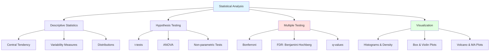
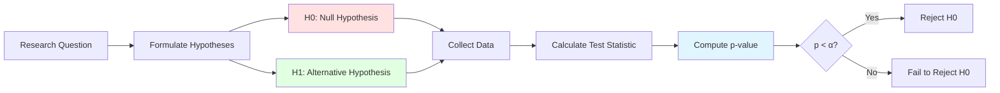

# Module 5: Statistics for Biological Data Analysis
**Understanding Uncertainty, Variability, and Evidence in Genomics**

> **Core Concept**: Biology is inherently variable. Statistics helps us separate meaningful biological signals from random noise, enabling us to make confident inferences from noisy data.

## Learning Objectives

By the end of this module, you will be able to:

1. **Describe biological variability** and distinguish it from technical noise
2. **Calculate descriptive statistics** (mean, median, variance, standard deviation)
3. **Identify probability distributions** common in biological data
4. **Perform hypothesis tests** (t-tests, ANOVA, non-parametric tests)
5. **Control multiple testing** using FDR correction methods
6. **Calculate statistical power** and determine sample sizes
7. **Create effective visualizations** for biological data
8. **Analyze RNA-seq data** for differential expression
9. **Interpret p-values correctly** and avoid common misinterpretations
10. **Recognize statistical pitfalls** (p-hacking, pseudoreplication)

---

## Prerequisites

!!! info "Required Knowledge"
    - **Module 1**: Basic understanding of biological sequences
    - **Module 2**: Python programming (or R)
    - **Module 3**: Database access for retrieving datasets
    - **Mathematics**: Basic algebra and probability concepts

---

## Module Overview



---

## 1. Why Statistics Matters in Bioinformatics

### 1.1 The Challenge of Biological Variability

**Biology is noisy**. No two cells, organisms, or experiments are identical:

**Biological Variation** (real differences):
- Genetic diversity between individuals
- Developmental stages and cell cycle phases
- Microenvironmental heterogeneity
- Stochastic gene expression (transcriptional bursting)

**Technical Variation** (measurement noise):
- Sample preparation variability
- Batch effects (different days, reagents, operators)
- Instrument calibration and sensitivity
- Computational analysis choices

!!! warning "The Genomics Challenge"
    When testing 20,000 genes for differential expression:

    - At α = 0.05, **expect 1,000 false positives** even if nothing is real
    - Without correction: most "discoveries" are noise
    - **Solution**: Multiple testing correction (FDR control)

### 1.2 Real-World Scenarios

=== "RNA-seq Analysis"
    **Problem**: Test 20,000 genes for differential expression

    **Without correction**:
    - Use p < 0.05 threshold
    - Find 1,200 "significant" genes
    - ~1,000 are false positives (5% × 20,000)

    **With FDR correction**:
    - Apply Benjamini-Hochberg at FDR < 0.05
    - Find 150 significant genes
    - ~7-8 are false positives (5% of 150)

    **Statistics saves you from chasing 950+ false leads**

=== "Protein Quantification"
    **Data**: Protein abundance in 5 biological replicates

    ```
    Control:    [45, 123, 89, 245, 127]  Mean = 127.4
    Treatment:  [234, 198, 289, 256, 223] Mean = 240.0
    ```

    **Questions**:
    - Is the difference real or random variation?
    - How confident can we be?
    - What's the effect size?

    **Statistics quantifies confidence, not just averages**

=== "GWAS Studies"
    **Problem**: Test 1 million genetic variants for disease association

    **Standard threshold**: p < 0.05 gives 50,000 false positives

    **GWAS threshold**: p < 5×10⁻⁸ controls genome-wide error

    **Statistics prevents publishing nonsense**

---

## 2. Descriptive Statistics

### 2.1 Measures of Central Tendency

**Central tendency**: Where is the "middle" of the data?

| Measure | Formula | Best For | Sensitivity |
|---------|---------|----------|-------------|
| **Mean** | Σx / n | Symmetric distributions | Sensitive to outliers |
| **Median** | Middle value | Skewed distributions | Robust to outliers |
| **Mode** | Most frequent value | Categorical data | - |

=== "Calculating in Python"
    ```python
    import numpy as np
    import pandas as pd
    from scipy import stats

    # Gene expression values
    expression = [45, 123, 89, 245, 127, 98, 156, 134, 112, 5000]  # Last value is outlier

    # Central tendency
    mean_val = np.mean(expression)
    median_val = np.median(expression)
    mode_val = stats.mode(expression, keepdims=True).mode[0]

    print(f"Mean: {mean_val:.1f}")      # 612.9 (affected by outlier)
    print(f"Median: {median_val:.1f}")  # 120.0 (robust)
    print(f"Mode: {mode_val}")

    # Without outlier
    expression_clean = expression[:-1]
    print(f"Mean (no outlier): {np.mean(expression_clean):.1f}")  # 125.4
    ```

=== "Calculating in R"
    ```r
    # Gene expression values
    expression <- c(45, 123, 89, 245, 127, 98, 156, 134, 112, 5000)

    # Central tendency
    mean_val <- mean(expression)
    median_val <- median(expression)
    mode_val <- as.numeric(names(sort(table(expression), decreasing=TRUE)[1]))

    print(paste("Mean:", round(mean_val, 1)))      # 612.9
    print(paste("Median:", round(median_val, 1)))  # 120.0

    # Without outlier
    expression_clean <- expression[-length(expression)]
    print(paste("Mean (no outlier):", round(mean(expression_clean), 1)))
    ```

**When to use which**:
- **Mean**: Normally distributed data, no extreme outliers
- **Median**: Skewed data, presence of outliers (more robust)
- **Mode**: Categorical or discrete data

### 2.2 Measures of Variability

**Variability**: How spread out is the data?

| Measure | Formula | Interpretation |
|---------|---------|----------------|
| **Range** | max - min | Total spread |
| **Variance** | Σ(x - μ)² / n | Average squared deviation |
| **Standard Deviation (SD)** | √variance | Average deviation (same units as data) |
| **Coefficient of Variation (CV)** | SD / mean × 100% | Relative variability (%) |

```python
import numpy as np

data = [45, 123, 89, 245, 127, 98, 156, 134, 112]

# Variability measures
range_val = np.max(data) - np.min(data)
variance = np.var(data, ddof=1)  # ddof=1 for sample variance
std_dev = np.std(data, ddof=1)
cv = (std_dev / np.mean(data)) * 100

print(f"Range: {range_val}")
print(f"Variance: {variance:.2f}")
print(f"Standard Deviation: {std_dev:.2f}")
print(f"Coefficient of Variation: {cv:.1f}%")
```

**Standard Error of the Mean (SEM)**: Uncertainty in the mean estimate

```python
sem = std_dev / np.sqrt(len(data))
print(f"SEM: {sem:.2f}")

# 95% Confidence Interval for the mean
from scipy import stats
ci_95 = stats.t.interval(0.95, len(data)-1, loc=np.mean(data), scale=sem)
print(f"95% CI: ({ci_95[0]:.1f}, {ci_95[1]:.1f})")
```

!!! tip "SD vs SEM"
    - **SD**: Describes variability in the data
    - **SEM**: Describes uncertainty in the mean estimate
    - **SEM is always smaller than SD** (SEM = SD / √n)
    - Use SD for describing data, SEM for inferring about population mean

### 2.3 Quartiles and Percentiles

**Quartiles** divide data into four equal parts:

- **Q1** (25th percentile): 25% of data below this value
- **Q2** (50th percentile): Median
- **Q3** (75th percentile): 75% of data below this value
- **IQR** (Interquartile Range): Q3 - Q1 (middle 50% of data)

```python
import numpy as np

data = [45, 123, 89, 245, 127, 98, 156, 134, 112, 178, 145, 167]

# Quartiles
q1 = np.percentile(data, 25)
q2 = np.percentile(data, 50)  # Median
q3 = np.percentile(data, 75)
iqr = q3 - q1

print(f"Q1: {q1:.1f}")
print(f"Q2 (Median): {q2:.1f}")
print(f"Q3: {q3:.1f}")
print(f"IQR: {iqr:.1f}")

# Outlier detection using IQR method
lower_bound = q1 - 1.5 * iqr
upper_bound = q3 + 1.5 * iqr
outliers = [x for x in data if x < lower_bound or x > upper_bound]
print(f"Outliers: {outliers}")
```

---

## 3. Probability Distributions

### 3.1 Normal (Gaussian) Distribution

**Most common in biology**: Many biological measurements are approximately normal

**Properties**:
- Symmetric, bell-shaped
- Defined by mean (μ) and standard deviation (σ)
- 68% within ±1σ, 95% within ±2σ, 99.7% within ±3σ

```python
import numpy as np
import matplotlib.pyplot as plt
from scipy import stats

# Generate normal distribution
mu, sigma = 100, 15
x = np.linspace(mu - 4*sigma, mu + 4*sigma, 1000)
y = stats.norm.pdf(x, mu, sigma)

# Plot
plt.figure(figsize=(10, 6))
plt.plot(x, y, linewidth=2)
plt.axvline(mu, color='r', linestyle='--', label=f'Mean = {mu}')
plt.axvline(mu - sigma, color='orange', linestyle='--', alpha=0.5)
plt.axvline(mu + sigma, color='orange', linestyle='--', alpha=0.5)
plt.fill_between(x, y, where=(x >= mu-sigma) & (x <= mu+sigma),
                 alpha=0.3, label='68% of data')
plt.xlabel('Value')
plt.ylabel('Probability Density')
plt.title('Normal Distribution')
plt.legend()
plt.grid(True, alpha=0.3)
plt.savefig('normal_distribution.png', dpi=150, bbox_inches='tight')
```

**Testing for normality**:

```python
from scipy import stats

# Sample data
data = np.random.normal(100, 15, 100)

# Shapiro-Wilk test (good for small samples)
statistic, p_value = stats.shapiro(data)
print(f"Shapiro-Wilk test: p = {p_value:.4f}")
if p_value > 0.05:
    print("Data appears normally distributed")
else:
    print("Data does not appear normally distributed")

# Q-Q plot (visual assessment)
import scipy.stats as stats
stats.probplot(data, dist="norm", plot=plt)
plt.title("Q-Q Plot")
plt.grid(True)
plt.show()
```

### 3.2 Distributions for Count Data

**RNA-seq and genomics** involve count data (discrete, not continuous)

=== "Poisson Distribution"
    **Use when**: Counting rare, independent events

    **Examples**: Number of mutations per genome, sequencing errors

    **Property**: Variance = Mean

    ```python
    from scipy import stats

    # Poisson distribution (lambda = mean count)
    lambda_val = 5
    x = np.arange(0, 20)
    pmf = stats.poisson.pmf(x, lambda_val)

    plt.figure(figsize=(10, 6))
    plt.bar(x, pmf)
    plt.xlabel('Count')
    plt.ylabel('Probability')
    plt.title(f'Poisson Distribution (λ = {lambda_val})')
    plt.grid(True, alpha=0.3)
    plt.show()
    ```

=== "Negative Binomial"
    **Use when**: Count data with overdispersion (variance > mean)

    **Examples**: RNA-seq read counts (biological + technical variability)

    **Property**: Variance > Mean (more flexible than Poisson)

    ```python
    from scipy import stats

    # Negative binomial (n, p)
    n, p = 10, 0.5
    x = np.arange(0, 50)
    pmf = stats.nbinom.pmf(x, n, p)

    plt.figure(figsize=(10, 6))
    plt.bar(x, pmf)
    plt.xlabel('Count')
    plt.ylabel('Probability')
    plt.title(f'Negative Binomial Distribution (n={n}, p={p})')
    plt.grid(True, alpha=0.3)
    plt.show()
    ```

!!! warning "Don't use t-tests on count data!"
    RNA-seq data are counts, not continuous measurements:

    - ❌ **Wrong**: t-test (assumes normal distribution)
    - ✅ **Correct**: DESeq2, edgeR (model counts with negative binomial)

---

## 4. Hypothesis Testing

### 4.1 The Logic of Hypothesis Testing



**Key concepts**:

- **H0** (Null Hypothesis): No difference/effect (default assumption)
- **H1** (Alternative Hypothesis): There is a difference/effect
- **p-value**: Probability of observing data this extreme **if H0 is true**
- **α** (Significance level): Threshold for rejecting H0 (typically 0.05)

!!! danger "P-value Interpretation"
    **What p-value means**:
    > "If there were truly no difference, we'd see data this extreme p% of the time by random chance"

    **What p-value DOES NOT mean**:
    - ❌ "Probability that H0 is true"
    - ❌ "Probability of a false positive"
    - ❌ "Importance of the finding"
    - ❌ "Proof of anything"

### 4.2 t-Tests

**Use when**: Comparing means of continuous, normally distributed data

=== "Two-Sample t-test"
    **Question**: Are gene expression levels different between two conditions?

    ```python
    from scipy import stats
    import numpy as np

    # Gene expression in two conditions
    control = [23, 45, 34, 67, 42, 38, 51, 29]
    treatment = [78, 91, 85, 102, 88, 95, 79, 84]

    # Two-sample t-test (assuming equal variances)
    t_stat, p_value = stats.ttest_ind(control, treatment)

    print(f"Control mean: {np.mean(control):.2f}")
    print(f"Treatment mean: {np.mean(treatment):.2f}")
    print(f"t-statistic: {t_stat:.3f}")
    print(f"p-value: {p_value:.4f}")

    if p_value < 0.05:
        print("Significant difference (p < 0.05)")
    else:
        print("No significant difference (p ≥ 0.05)")

    # Effect size (Cohen's d)
    pooled_std = np.sqrt((np.var(control, ddof=1) + np.var(treatment, ddof=1)) / 2)
    cohens_d = (np.mean(treatment) - np.mean(control)) / pooled_std
    print(f"Effect size (Cohen's d): {cohens_d:.2f}")
    ```

=== "Paired t-test"
    **Question**: Is there a change before vs. after treatment (same subjects)?

    ```python
    # Gene expression before and after treatment (paired samples)
    before = [45, 67, 52, 78, 61, 54, 48, 59]
    after =  [52, 71, 58, 85, 68, 59, 53, 64]

    # Paired t-test
    t_stat, p_value = stats.ttest_rel(before, after)

    print(f"Mean change: {np.mean(np.array(after) - np.array(before)):.2f}")
    print(f"t-statistic: {t_stat:.3f}")
    print(f"p-value: {p_value:.4f}")
    ```

=== "Welch's t-test"
    **Use when**: Variances are unequal between groups

    ```python
    # When variances differ (safer default)
    t_stat, p_value = stats.ttest_ind(control, treatment, equal_var=False)
    print(f"Welch's t-test p-value: {p_value:.4f}")
    ```

**Assumptions**:
- Data are approximately normally distributed
- Samples are independent (except paired t-test)
- Equal variances (for standard t-test, not Welch's)

### 4.3 ANOVA (Analysis of Variance)

**Use when**: Comparing means across >2 groups

```python
from scipy import stats

# Gene expression in 4 different tissues
tissue1 = [45, 52, 48, 51, 46]
tissue2 = [78, 82, 75, 80, 77]
tissue3 = [34, 38, 32, 36, 35]
tissue4 = [91, 95, 89, 93, 90]

# One-way ANOVA
f_stat, p_value = stats.f_oneway(tissue1, tissue2, tissue3, tissue4)

print(f"F-statistic: {f_stat:.3f}")
print(f"p-value: {p_value:.6f}")

if p_value < 0.05:
    print("At least one tissue is significantly different")

    # Post-hoc pairwise comparisons (Tukey HSD)
    from scipy.stats import tukey_hsd

    all_data = tissue1 + tissue2 + tissue3 + tissue4
    groups = (['T1']*5 + ['T2']*5 + ['T3']*5 + ['T4']*5)

    # Note: For production, use statsmodels for proper Tukey HSD
    print("\nPerform pairwise t-tests with Bonferroni correction:")
    from itertools import combinations
    tissues = [tissue1, tissue2, tissue3, tissue4]
    names = ['T1', 'T2', 'T3', 'T4']
    n_comparisons = 6  # 4 choose 2

    for (i, t1), (j, t2) in combinations(enumerate(tissues), 2):
        _, p = stats.ttest_ind(t1, t2)
        p_adj = p * n_comparisons  # Bonferroni
        print(f"{names[i]} vs {names[j]}: p = {p:.4f}, adjusted p = {min(p_adj, 1.0):.4f}")
```

### 4.4 Non-Parametric Tests

**Use when**: Data violate normality assumption (skewed, outliers)

=== "Mann-Whitney U Test"
    **Use when**: Two independent groups, non-normal data

    ```python
    from scipy import stats

    # Skewed protein abundance data
    control = [12, 15, 18, 14, 156, 13, 17, 16]  # One outlier
    treatment = [45, 52, 48, 51, 234, 46, 50, 49]

    # Mann-Whitney U test (non-parametric alternative to t-test)
    u_stat, p_value = stats.mannwhitneyu(control, treatment, alternative='two-sided')

    print(f"Control median: {np.median(control):.1f}")
    print(f"Treatment median: {np.median(treatment):.1f}")
    print(f"U-statistic: {u_stat:.3f}")
    print(f"p-value: {p_value:.4f}")
    ```

=== "Wilcoxon Signed-Rank Test"
    **Use when**: Paired samples, non-normal data

    ```python
    # Paired non-normal data
    before = [12, 15, 18, 156, 13, 17, 16, 19]
    after =  [45, 52, 48, 234, 46, 50, 49, 51]

    # Wilcoxon signed-rank test
    w_stat, p_value = stats.wilcoxon(before, after)

    print(f"Median difference: {np.median(np.array(after) - np.array(before)):.1f}")
    print(f"W-statistic: {w_stat:.3f}")
    print(f"p-value: {p_value:.4f}")
    ```

=== "Kruskal-Wallis Test"
    **Use when**: >2 independent groups, non-normal data

    ```python
    # Non-parametric alternative to ANOVA
    h_stat, p_value = stats.kruskal(tissue1, tissue2, tissue3, tissue4)

    print(f"H-statistic: {h_stat:.3f}")
    print(f"p-value: {p_value:.6f}")
    ```

---

## 5. The Multiple Testing Problem

### 5.1 Why Multiple Testing Matters

**The Problem**: When testing thousands of hypotheses, false positives accumulate

**Example**: RNA-seq with 20,000 genes

```python
import numpy as np

n_genes = 20000
alpha = 0.05

# Expected false positives if ALL nulls are true
expected_fps = n_genes * alpha
print(f"Expected false positives: {expected_fps:.0f}")

# Simulate testing with no true differences
np.random.seed(42)
p_values = np.random.uniform(0, 1, n_genes)  # Null p-values are uniform

# Without correction
significant_uncorrected = sum(p_values < alpha)
print(f"Significant genes (uncorrected): {significant_uncorrected}")
print(f"False positive rate: {significant_uncorrected/n_genes*100:.1f}%")
```

### 5.2 Multiple Testing Correction Methods

=== "Bonferroni Correction"
    **Strategy**: Divide α by number of tests

    **Controls**: Family-Wise Error Rate (FWER) - probability of ≥1 false positive

    **Very conservative** - may miss true positives

    ```python
    n_tests = 20000
    alpha_bonf = 0.05 / n_tests

    print(f"Bonferroni threshold: {alpha_bonf:.2e}")

    significant_bonf = sum(p_values < alpha_bonf)
    print(f"Significant genes (Bonferroni): {significant_bonf}")
    ```

=== "Benjamini-Hochberg (FDR)"
    **Strategy**: Control False Discovery Rate (proportion of false positives)

    **Standard for genomics** - good balance of sensitivity and specificity

    ```python
    from scipy.stats import false_discovery_control

    # Benjamini-Hochberg FDR correction
    p_values_sorted = np.sort(p_values)
    n = len(p_values)
    fdr_level = 0.05

    # BH procedure
    critical_values = np.arange(1, n+1) / n * fdr_level

    # Find largest i where p(i) <= (i/n)*alpha
    reject = p_values_sorted <= critical_values
    if any(reject):
        threshold = p_values_sorted[reject][-1]
    else:
        threshold = 0

    significant_fdr = sum(p_values <= threshold)
    print(f"BH threshold: {threshold:.4f}")
    print(f"Significant genes (FDR < 0.05): {significant_fdr}")

    # Using statsmodels
    from statsmodels.stats.multitest import multipletests
    reject, pvals_corrected, _, _ = multipletests(p_values, alpha=0.05, method='fdr_bh')
    print(f"Significant genes (statsmodels): {sum(reject)}")
    ```

=== "q-values"
    **Interpretation**: Minimum FDR at which this result would be significant

    **Intuitive**: "q < 0.05" means "at most 5% of results this significant are false"

    ```python
    # q-value calculation (simplified)
    from scipy.interpolate import interp1d

    def calculate_qvalues(pvals):
        """Simplified q-value calculation"""
        pvals = np.array(pvals)
        n = len(pvals)

        # Sort p-values
        sort_idx = np.argsort(pvals)
        pvals_sorted = pvals[sort_idx]

        # Calculate q-values
        qvals = np.zeros(n)
        prev_q = 0

        for i in range(n-1, -1, -1):
            q = min(pvals_sorted[i] * n / (i + 1), prev_q if i < n-1 else 1)
            qvals[i] = min(q, 1.0)
            prev_q = qvals[i]

        # Restore original order
        qvals_original = np.zeros(n)
        qvals_original[sort_idx] = qvals

        return qvals_original

    qvals = calculate_qvalues(p_values)
    significant_q = sum(qvals < 0.05)
    print(f"Significant genes (q < 0.05): {significant_q}")
    ```

**Comparison Table**:

| Method | Controls | Stringency | Best For |
|--------|----------|------------|----------|
| **No correction** | Nothing | None | Single test only |
| **Bonferroni** | FWER | Very strict | Few tests, need certainty |
| **FDR (BH)** | False Discovery Rate | Moderate | Genomics (standard) |
| **q-values** | FDR | Moderate | Easy interpretation |

---

## 6. Statistical Power and Sample Size

### 6.1 Understanding Power

**Statistical Power**: Probability of detecting a true effect when it exists

**Factors affecting power**:

1. **Effect size**: Larger differences → higher power
2. **Sample size**: More samples → higher power
3. **Variability**: Less noise → higher power
4. **Significance level**: Higher α → higher power (but more false positives)

```python
from statsmodels.stats.power import ttest_power

# Calculate power for different scenarios
effect_sizes = [0.2, 0.5, 0.8, 1.0, 1.5]  # Cohen's d
sample_sizes = [5, 10, 20, 50, 100]
alpha = 0.05

print("Power for two-sample t-test (α = 0.05):")
print("\n      Sample Size")
print("Effect", end="")
for n in sample_sizes:
    print(f"  n={n:3d}", end="")
print()

for effect in effect_sizes:
    print(f"d={effect:.1f}", end="  ")
    for n in sample_sizes:
        power = ttest_power(effect, n, alpha, alternative='two-sided')
        print(f"{power:.2f}  ", end="")
    print()
```

### 6.2 Sample Size Calculation

**Before experiments**: Determine required sample size for desired power

```python
from statsmodels.stats.power import tt_solve_power

# How many samples needed to detect effect size = 0.8 with 80% power?
required_n = tt_solve_power(
    effect_size=0.8,
    alpha=0.05,
    power=0.80,
    alternative='two-sided'
)

print(f"Required sample size per group: {np.ceil(required_n):.0f}")

# For RNA-seq: typical parameters
effect_size = 0.5  # log2 fold change
desired_power = 0.80
alpha = 0.05

required_n_rnaseq = tt_solve_power(effect_size, alpha, desired_power, alternative='two-sided')
print(f"\nRNA-seq recommended n per group: {np.ceil(required_n_rnaseq):.0f}")
```

!!! tip "Underpowered Studies Are Wasteful"
    A study with 20% power:

    - 80% chance of **missing** a real effect (false negative)
    - Wastes time, money, and resources
    - Contributes to irreproducible literature

    **Always calculate required sample size before experiments!**

---

## 7. Visualization Best Practices

### 7.1 Exploring Distributions

=== "Histogram"
    ```python
    import matplotlib.pyplot as plt
    import numpy as np

    # Gene expression data
    np.random.seed(42)
    expression = np.random.lognormal(mean=5, sigma=1.5, size=1000)

    plt.figure(figsize=(12, 5))

    # Histogram
    plt.subplot(1, 2, 1)
    plt.hist(expression, bins=50, edgecolor='black', alpha=0.7)
    plt.xlabel('Expression Level')
    plt.ylabel('Frequency')
    plt.title('Histogram: Gene Expression Distribution')
    plt.grid(True, alpha=0.3)

    # Log-transformed
    plt.subplot(1, 2, 2)
    plt.hist(np.log10(expression), bins=50, edgecolor='black', alpha=0.7, color='orange')
    plt.xlabel('Log10(Expression Level)')
    plt.ylabel('Frequency')
    plt.title('Histogram: Log-Transformed (More Normal)')
    plt.grid(True, alpha=0.3)

    plt.tight_layout()
    plt.savefig('distribution_histogram.png', dpi=150, bbox_inches='tight')
    ```

=== "Box and Violin Plots"
    ```python
    import seaborn as sns
    import pandas as pd

    # Expression across conditions
    np.random.seed(42)
    data = {
        'Condition': ['Control']*50 + ['Treatment']*50,
        'Expression': list(np.random.normal(100, 20, 50)) +
                      list(np.random.normal(150, 25, 50))
    }
    df = pd.DataFrame(data)

    fig, axes = plt.subplots(1, 2, figsize=(12, 5))

    # Box plot
    sns.boxplot(data=df, x='Condition', y='Expression', ax=axes[0])
    axes[0].set_title('Box Plot')
    axes[0].grid(True, alpha=0.3)

    # Violin plot (shows full distribution)
    sns.violinplot(data=df, x='Condition', y='Expression', ax=axes[1])
    axes[1].set_title('Violin Plot (Better)')
    axes[1].grid(True, alpha=0.3)

    plt.tight_layout()
    plt.savefig('boxplot_violinplot.png', dpi=150, bbox_inches='tight')
    ```

### 7.2 RNA-seq Specific Plots

=== "MA Plot"
    **Shows**: Log fold change vs. mean expression

    ```python
    # Simulated RNA-seq data
    np.random.seed(42)
    n_genes = 10000

    mean_expr = np.random.uniform(1, 10000, n_genes)
    log_fc = np.random.normal(0, 0.5, n_genes)

    # Add some DE genes
    de_idx = np.random.choice(n_genes, 200, replace=False)
    log_fc[de_idx] += np.random.choice([-2, 2], 200)

    p_values = np.random.uniform(0, 1, n_genes)
    p_values[de_idx] = np.random.uniform(0, 0.001, 200)

    # MA plot
    plt.figure(figsize=(10, 6))
    plt.scatter(mean_expr, log_fc, c='gray', alpha=0.3, s=10, label='Not significant')
    plt.scatter(mean_expr[p_values < 0.05], log_fc[p_values < 0.05],
                c='red', alpha=0.6, s=10, label='p < 0.05')
    plt.axhline(0, color='blue', linestyle='--', linewidth=2)
    plt.xlabel('Mean Expression (log scale)')
    plt.ylabel('Log2 Fold Change')
    plt.title('MA Plot: Differential Expression')
    plt.xscale('log')
    plt.legend()
    plt.grid(True, alpha=0.3)
    plt.savefig('ma_plot.png', dpi=150, bbox_inches='tight')
    ```

=== "Volcano Plot"
    **Shows**: Log fold change vs. significance

    ```python
    # Volcano plot
    neg_log_p = -np.log10(p_values + 1e-300)  # Avoid log(0)

    plt.figure(figsize=(10, 6))

    # Color by significance and fold change
    colors = ['gray'] * n_genes
    for i in range(n_genes):
        if p_values[i] < 0.05 and abs(log_fc[i]) > 1:
            colors[i] = 'red'
        elif p_values[i] < 0.05:
            colors[i] = 'orange'

    plt.scatter(log_fc, neg_log_p, c=colors, alpha=0.5, s=10)

    # Threshold lines
    plt.axhline(-np.log10(0.05), color='blue', linestyle='--',
                linewidth=2, label='p = 0.05')
    plt.axvline(-1, color='green', linestyle='--', linewidth=2)
    plt.axvline(1, color='green', linestyle='--', linewidth=2, label='FC = ±2')

    plt.xlabel('Log2 Fold Change')
    plt.ylabel('-Log10(p-value)')
    plt.title('Volcano Plot: Statistical and Biological Significance')
    plt.legend()
    plt.grid(True, alpha=0.3)
    plt.savefig('volcano_plot.png', dpi=150, bbox_inches='tight')
    ```

---

## 8. Common Statistical Pitfalls

### 8.1 P-Hacking (Data Dredging)

**What it is**: Manipulating data/analysis until p < 0.05

**Examples**:
- Testing 20 different hypotheses, reporting only the "significant" one
- Removing "outliers" to achieve significance
- Testing multiple endpoints, cherry-picking results
- Peeking at p-values and adding samples until significant

**Why it's bad**: Inflates false positive rate far above 5%

**How to avoid**:
- Pre-specify analyses before seeing data
- Report all tests performed
- Use multiple testing correction
- Pre-register studies (clinical trials)

### 8.2 Ignoring Effect Sizes

**The problem**: Small p-values don't mean important findings

```python
# Large sample, tiny effect
np.random.seed(42)
control_large = np.random.normal(100, 15, 10000)
treatment_large = np.random.normal(101, 15, 10000)  # Only 1% difference

t_stat, p_value = stats.ttest_ind(control_large, treatment_large)
print(f"p-value: {p_value:.2e}")  # Very small!
print(f"Mean difference: {np.mean(treatment_large) - np.mean(control_large):.2f}")
print(f"Effect size (Cohen's d): {(np.mean(treatment_large) - np.mean(control_large)) / np.std(control_large):.3f}")

# Small sample, large effect
control_small = np.random.normal(100, 15, 5)
treatment_small = np.random.normal(200, 15, 5)  # 100% difference

t_stat2, p_value2 = stats.ttest_ind(control_small, treatment_small)
print(f"\np-value: {p_value2:.3f}")  # Not significant!
print(f"Mean difference: {np.mean(treatment_small) - np.mean(control_small):.2f}")
```

**Always report**:
- Effect size (fold change, Cohen's d, etc.)
- Confidence intervals
- Biological context

### 8.3 Pseudoreplication

**The problem**: Treating technical replicates as biological replicates

```python
# WRONG: 3 mice, 5 measurements each, analyze as n=15
biological_replicates = 3
technical_replicates = 5

# Correct: Average technical replicates first
mouse1_tech = [98, 102, 100, 99, 101]
mouse2_tech = [145, 148, 146, 147, 149]
mouse3_tech = [97, 99, 98, 100, 96]

# Average technical replicates
mouse1_avg = np.mean(mouse1_tech)
mouse2_avg = np.mean(mouse2_tech)
mouse3_avg = np.mean(mouse3_tech)

print(f"Biological n = {biological_replicates}")
print(f"Mouse averages: {[mouse1_avg, mouse2_avg, mouse3_avg]}")
```

### 8.4 Publication Bias and File Drawer Problem

**The problem**: Only "significant" results get published

**Effect**: Literature overestimates effect sizes and significance

**Solutions**:
- Pre-registration of studies
- Publishing null results
- Meta-analyses
- Replication studies

---

## 9. Practical Example: RNA-seq Differential Expression

### 9.1 Simulated RNA-seq Analysis

```python
import numpy as np
import pandas as pd
from scipy import stats
import matplotlib.pyplot as plt
import seaborn as sns

# Simulate RNA-seq count data
np.random.seed(42)
n_genes = 5000
n_samples = 6  # 3 control, 3 treatment

# Generate baseline expression levels
baseline = np.random.negative_binomial(n=10, p=0.5, size=n_genes)

# Control samples
control_counts = np.random.poisson(baseline[:, np.newaxis], size=(n_genes, 3))

# Treatment samples (200 genes upregulated 3-fold, 200 downregulated 3-fold)
treatment_baseline = baseline.copy()
up_genes = np.random.choice(n_genes, 200, replace=False)
down_genes = np.random.choice([i for i in range(n_genes) if i not in up_genes], 200, replace=False)
treatment_baseline[up_genes] *= 3
treatment_baseline[down_genes] //= 3

treatment_counts = np.random.poisson(treatment_baseline[:, np.newaxis], size=(n_genes, 3))

# Combine into dataframe
count_df = pd.DataFrame({
    'C1': control_counts[:, 0],
    'C2': control_counts[:, 1],
    'C3': control_counts[:, 2],
    'T1': treatment_counts[:, 0],
    'T2': treatment_counts[:, 1],
    'T3': treatment_counts[:, 2]
})
count_df.index = [f'Gene_{i}' for i in range(n_genes)]

print("RNA-seq Count Matrix (first 10 genes):")
print(count_df.head(10))
```

### 9.2 Differential Expression Testing

```python
# Simple t-test approach (for demonstration - use DESeq2 in practice!)
p_values = []
fold_changes = []

for gene in count_df.index:
    control_vals = count_df.loc[gene, ['C1', 'C2', 'C3']].values
    treatment_vals = count_df.loc[gene, ['T1', 'T2', 'T3']].values

    # t-test
    _, p = stats.ttest_ind(control_vals, treatment_vals)
    p_values.append(p)

    # Fold change (add pseudocount to avoid division by zero)
    fc = (np.mean(treatment_vals) + 1) / (np.mean(control_vals) + 1)
    fold_changes.append(np.log2(fc))

# Add to dataframe
count_df['pvalue'] = p_values
count_df['log2FC'] = fold_changes
count_df['mean_control'] = count_df[['C1', 'C2', 'C3']].mean(axis=1)
count_df['mean_treatment'] = count_df[['T1', 'T2', 'T3']].mean(axis=1)

# Apply FDR correction
from statsmodels.stats.multitest import multipletests
_, count_df['padj'], _, _ = multipletests(count_df['pvalue'], method='fdr_bh')

# Summary
print(f"\nTotal genes tested: {n_genes}")
print(f"Significant (p < 0.05, uncorrected): {sum(count_df['pvalue'] < 0.05)}")
print(f"Significant (FDR < 0.05): {sum(count_df['padj'] < 0.05)}")
print(f"Upregulated (FDR < 0.05, FC > 2): {sum((count_df['padj'] < 0.05) & (count_df['log2FC'] > 1))}")
print(f"Downregulated (FDR < 0.05, FC < 0.5): {sum((count_df['padj'] < 0.05) & (count_df['log2FC'] < -1))}")
```

### 9.3 Visualization

```python
# Volcano plot
fig, axes = plt.subplots(1, 2, figsize=(14, 6))

# Plot 1: Uncorrected p-values
ax = axes[0]
sig_uncorrected = count_df['pvalue'] < 0.05
ax.scatter(count_df.loc[~sig_uncorrected, 'log2FC'],
           -np.log10(count_df.loc[~sig_uncorrected, 'pvalue']),
           c='gray', alpha=0.3, s=10, label='Not significant')
ax.scatter(count_df.loc[sig_uncorrected, 'log2FC'],
           -np.log10(count_df.loc[sig_uncorrected, 'pvalue']),
           c='red', alpha=0.6, s=10, label='p < 0.05')
ax.axhline(-np.log10(0.05), color='blue', linestyle='--', linewidth=2)
ax.axvline(-1, color='green', linestyle='--', linewidth=1)
ax.axvline(1, color='green', linestyle='--', linewidth=1)
ax.set_xlabel('Log2 Fold Change')
ax.set_ylabel('-Log10(p-value)')
ax.set_title('Without Multiple Testing Correction')
ax.legend()
ax.grid(True, alpha=0.3)

# Plot 2: FDR-corrected
ax = axes[1]
sig_fdr = count_df['padj'] < 0.05
ax.scatter(count_df.loc[~sig_fdr, 'log2FC'],
           -np.log10(count_df.loc[~sig_fdr, 'padj']),
           c='gray', alpha=0.3, s=10, label='Not significant')
ax.scatter(count_df.loc[sig_fdr, 'log2FC'],
           -np.log10(count_df.loc[sig_fdr, 'padj']),
           c='red', alpha=0.6, s=10, label='FDR < 0.05')
ax.axhline(-np.log10(0.05), color='blue', linestyle='--', linewidth=2)
ax.axvline(-1, color='green', linestyle='--', linewidth=1)
ax.axvline(1, color='green', linestyle='--', linewidth=1)
ax.set_xlabel('Log2 Fold Change')
ax.set_ylabel('-Log10(adjusted p-value)')
ax.set_title('With FDR Correction (Benjamini-Hochberg)')
ax.legend()
ax.grid(True, alpha=0.3)

plt.tight_layout()
plt.savefig('rnaseq_volcano_comparison.png', dpi=150, bbox_inches='tight')
plt.show()

print(f"\nFalse positive reduction: {sum(sig_uncorrected) - sum(sig_fdr)} genes")
```

---

## 10. Self-Assessment Checklist

Test your understanding:

- [ ] I can calculate mean, median, variance, and standard deviation
- [ ] I understand the difference between SD and SEM
- [ ] I can identify appropriate probability distributions for different data types
- [ ] I know when to use t-tests vs. non-parametric tests
- [ ] I understand what a p-value actually means (and doesn't mean)
- [ ] I can apply multiple testing correction (Bonferroni, FDR)
- [ ] I know how to calculate statistical power and required sample sizes
- [ ] I can create histograms, box plots, and volcano plots
- [ ] I understand the multiple testing problem in genomics
- [ ] I can recognize p-hacking and other statistical pitfalls
- [ ] I know the difference between statistical and biological significance
- [ ] I can perform basic RNA-seq differential expression analysis

---

## 11. Additional Resources

### Recommended Reading

| Resource | Focus | URL |
|----------|-------|-----|
| **Modern Statistics for Modern Biology** | Bioinformatics statistics (free) | https://www.huber.embl.de/msmb/ |
| **StatQuest Videos** | Intuitive explanations | YouTube channel |
| **Nature Methods: Points of Significance** | Practical statistics | Nature journal series |
| **The Analysis of Biological Data** | Biological examples | Whitlock & Schluter textbook |

### Software and Packages

**Python**:
```python
# Core statistics
import scipy.stats
import numpy as np
import pandas as pd

# Visualization
import matplotlib.pyplot as plt
import seaborn as sns

# Multiple testing
from statsmodels.stats.multitest import multipletests

# Power analysis
from statsmodels.stats.power import ttest_power
```

**R (Alternative)**:
```r
# Better for RNA-seq analysis
library(DESeq2)  # RNA-seq DE
library(edgeR)   # RNA-seq DE
library(ggplot2) # Visualization
library(dplyr)   # Data manipulation
```

### Key Concepts to Remember

!!! summary "Module 5 Summary"
    **Variability is Inevitable**: Biological and technical variation require statistical thinking

    **P-values Are Not Everything**: Report effect sizes and confidence intervals

    **Multiple Testing Kills**: Always apply FDR correction for high-throughput data

    **Power Matters**: Underpowered studies waste resources and find nothing

    **Visualize First**: Look at your data before applying statistical tests

---

## Navigation

[↑ Back to Course Index](/en/courses/foundation-of-bioinformatics/)

**Related Modules:**

- [Module 2: Programming Fundamentals](/en/courses/foundation-of-bioinformatics/module-2/) - Python for statistical computing
- [Module 3: Biological Databases](/en/courses/foundation-of-bioinformatics/module-3/) - Retrieving data for analysis
- [Module 4: Sequence Alignment](/en/courses/foundation-of-bioinformatics/module-4/) - E-values and significance

---

🌐 [View this module in Arabic](/ar/courses/foundation-of-bioinformatics/module-5/)

---

*Last updated: 2026-01-28*
