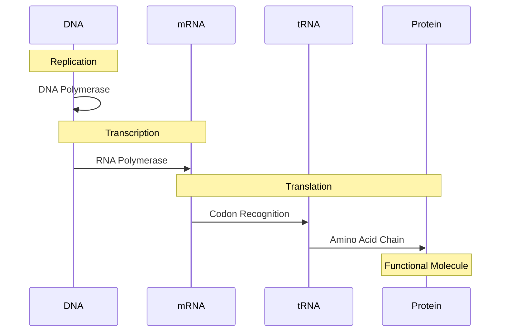
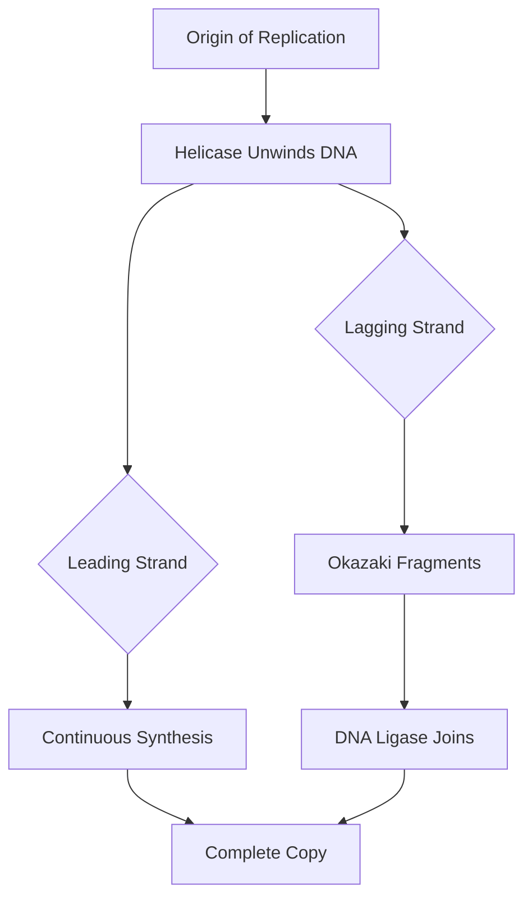
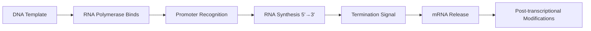

# Example Module: Central Dogma of Molecular Biology

This is a demonstration module showing rich content features for bioinformatics courses.

---

## Overview

The **Central Dogma** describes the flow of genetic information in biological systems.

!!! note "Learning Objectives"
    By the end of this module, you will:

    - Understand DNA replication, transcription, and translation
    - Identify key enzymes in each process
    - Apply computational tools to predict outcomes

---

## The Central Dogma Flow



---

## 1. DNA Replication

DNA replication is the process of copying genetic information.

### Key Enzymes

| Enzyme | Function | Direction |
|--------|----------|-----------|
| **Helicase** | Unwinds DNA double helix | 5' → 3' |
| **Primase** | Synthesizes RNA primers | 5' → 3' |
| **DNA Polymerase III** | Main replication enzyme | 5' → 3' |
| **DNA Ligase** | Joins Okazaki fragments | N/A |

### Replication Process



!!! tip "Remember"
    DNA replication is **semi-conservative**: each new DNA molecule contains one original and one newly synthesized strand.

---

## 2. Transcription

### Process Diagram



### Code Example: Finding Transcription Start Sites

```python title="find_promoters.py" linenums="1"
def find_tata_box(sequence, motif="TATAAA"):
    """
    Find TATA box positions in DNA sequence.
    TATA box is typically 25-30 bp upstream of TSS.
    """
    positions = []
    for i in range(len(sequence) - len(motif) + 1):
        if sequence[i:i+len(motif)] == motif:
            positions.append(i)
    return positions

# Example usage
dna = "ATGCGCTATAAAAATGCGATCG"
tata_positions = find_tata_box(dna)
print(f"TATA box found at positions: {tata_positions}")
```

**Output:**
```
TATA box found at positions: [6]
```

!!! example "Try It Yourself"
    Modify the code to search for other promoter elements like the CAAT box (GGCCAATCT).

---

## 3. Translation

### The Genetic Code

=== "Standard Codon Table"
    | Codon | AA | Codon | AA | Codon | AA |
    |-------|-------|-------|-------|-------|-------|
    | UUU | Phe (F) | UCU | Ser (S) | UAU | Tyr (Y) |
    | UUC | Phe (F) | UCC | Ser (S) | UAC | Tyr (Y) |
    | UUA | Leu (L) | UCA | Ser (S) | UAA | **Stop** |
    | UUG | Leu (L) | UCG | Ser (S) | UAG | **Stop** |
    | AUG | **Met (M)** | ACU | Thr (T) | AAU | Asn (N) |

=== "Properties"
    - **Universal**: Nearly identical across all organisms
    - **Degenerate**: Multiple codons for same amino acid
    - **Non-overlapping**: Read in triplets
    - **Start codon**: AUG (Methionine)
    - **Stop codons**: UAA, UAG, UGA

### Translation Implementation

```python title="translate.py" linenums="1" hl_lines="8 9"
# Genetic code dictionary
genetic_code = {
    'AUG': 'M', 'UUU': 'F', 'UUC': 'F', 'UUA': 'L', 'UUG': 'L',
    'UCU': 'S', 'UCC': 'S', 'UCA': 'S', 'UCG': 'S',
    'UAU': 'Y', 'UAC': 'Y', 'UAA': '*', 'UAG': '*', 'UGA': '*',
    # ... (complete table omitted for brevity)
}

def translate(mrna):
    """Translate mRNA sequence to protein."""
    protein = []
    for i in range(0, len(mrna) - 2, 3):
        codon = mrna[i:i+3]
        if codon in genetic_code:
            aa = genetic_code[codon]
            if aa == '*':  # Stop codon
                break
            protein.append(aa)
    return ''.join(protein)

# Example
mrna = "AUGUGUUAUUAA"
protein = translate(mrna)
print(f"Protein: {protein}")  # Output: MF*
```

---

## 4. Gene Expression Visualization

### Expression Levels Across Samples

```vegalite
{
  "$schema": "https://vega.github.io/schema/vega-lite/v5.json",
  "description": "Gene Expression in Different Tissues",
  "width": 500,
  "height": 300,
  "data": {
    "values": [
      {"tissue": "Brain", "gene": "BDNF", "expression": 450},
      {"tissue": "Brain", "gene": "GFAP", "expression": 380},
      {"tissue": "Liver", "gene": "BDNF", "expression": 120},
      {"tissue": "Liver", "gene": "GFAP", "expression": 80},
      {"tissue": "Muscle", "gene": "BDNF", "expression": 200},
      {"tissue": "Muscle", "gene": "GFAP", "expression": 50}
    ]
  },
  "mark": "bar",
  "encoding": {
    "x": {"field": "tissue", "type": "nominal", "title": "Tissue Type"},
    "y": {"field": "expression", "type": "quantitative", "title": "Expression (TPM)"},
    "color": {"field": "gene", "type": "nominal", "title": "Gene"},
    "xOffset": {"field": "gene"}
  }
}
```

---

## Exercise: Complete the Workflow

- [x] Understand DNA structure
- [x] Learn replication mechanism
- [ ] Implement transcription simulator
- [ ] Build codon translation tool
- [ ] Analyze gene expression data

!!! question "Practice Problem"
    Given the DNA sequence: `TACGCGATCGATCG`

    1. Transcribe to mRNA
    2. Translate to protein
    3. Identify the start and stop codons

    ??? success "Solution"
        **DNA:** TACGCGATCGATCG
        **mRNA:** AUGCGCUAGCUAGC
        **Protein:** M-R-*

        - Start codon: AUG (position 0)
        - Stop codon: UAG (position 6)

---

## External Resources

Explore these databases and tools:

- [NCBI GenBank](https://www.ncbi.nlm.nih.gov/genbank/) - Genetic sequence database
- [UniProt](https://www.uniprot.org/) - Protein sequence and annotation
- [Ensembl](https://www.ensembl.org/) - Genome browser
- [ExPASy Translate Tool](https://web.expasy.org/translate/) - Online translation tool

!!! info "Recommended Reading"
    Watson, J.D., & Crick, F.H. (1953). [Molecular structure of nucleic acids](https://www.nature.com/articles/171737a0). *Nature*, 171(4356), 737-738.

---

## Quick Reference

### Key Formulas

**GC Content:**
$$
GC\% = \frac{G + C}{A + T + G + C} \times 100
$$

**Shannon Entropy (Sequence Complexity):**
$$
H = -\sum_{i=1}^{4} p_i \log_2(p_i)
$$

where $p_i$ is the frequency of nucleotide $i$.

---

## Navigation

[← Previous Module](index.md) | [↑ Course Index](index.md) | [Next Module →](module-2.md)
