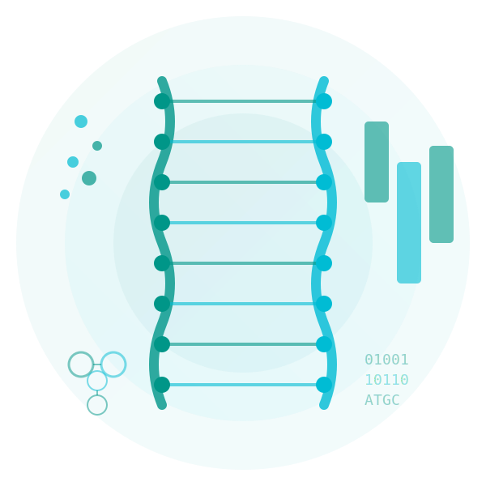

---
hide:
  - navigation
  - toc
---

  

    <h1 class="hero-title">المعلوماتية الحيوية وعلم البيانات الحيوي، البحث و التطوير</h1>
    

    مساحة للبحث، التقنية، و الأحياء بشكل رقمي يشمل،المعلوماتية الحيوية، البرمجة، قواعد البيانات،
      والخوارزميات في علم الأحياء الحسابي والحوسبة عالية الأداء
    

    <a href="courses/foundation-of-bioinformatics/" class="hero-cta">
      ابدأ التعلم ←
    </a>
  

  

    
  

  <h2 class="section-title">📝 آخر المنشورات</h2>

  

    

      <h3 class="blog-card-title">الاتصال والبيانات المفتوحة والحوسبة الفائقة - قوى البحث في العصر الحديث</h3>
      
٢٩ يناير ٢٠٢٦ • بحث علمي، بنية تحتية

      

        استقصاء علمي حول القوى الثلاث الدافعة للبحث في المستقبل: الاتصال، مبادئ FAIR للبيانات المفتوحة،
        والحوسبة الفائقة. كيف تعمل هذه القوى معاً لدفعنا نحو المستقبل؟ وما هي التحديات الثقافية الجديدة؟
      

      <a href="blog/posts/2026-01-29-connectivity-fair-hpc-future/" class="blog-card-link">
        اقرأ المزيد ←
      </a>
    

  

  

    <a href="blog/" class="md-button md-button--primary">
      عرض جميع المنشورات
    </a>
  

  <h2 class="section-title">🎓 الدورات المتاحة</h2>

  

    <h3>أساسيات المعلوماتية الحيوية</h3>
    

      دورة شاملة من 6 فصول تغطي المفاهيم الأساسية في المعلوماتية الحيوية
      من البيانات البيولوجية إلى التحليل الإحصائي للجينوم
    

    <ul class="course-modules">
      <li><strong>✅ الفصل 1:</strong> البيانات الحيوية - من الجزيئات إلى المعلومات (متاح الآن)</li>
      <li><strong>✅ الفصل 2:</strong> أساسيات Linux - بيئة العمل الأساسية (متاح الآن)</li>
      <li><strong>✅ الفصل 3:</strong> أساسيات البرمجة - Python للمعلوماتية الحيوية (متاح الآن)</li>
      <li><strong>🔜 الفصل 4:</strong> قواعد البيانات البيولوجية - الوصول البرمجي للبيانات (قريباً)</li>
      <li><strong>🔜 الفصل 5:</strong> محاذاة التسلسلات - خوارزميات المحاذاة (قريباً)</li>
      <li><strong>🔜 الفصل 6:</strong> الإحصاء - التحليل الإحصائي للجينوم (قريباً)</li>
    </ul>

    

      <a href="courses/foundation-of-bioinformatics/" class="md-button md-button--primary">
        ابدأ الدورة
      </a>
    

  

  

    <strong>عن الموقع</strong> 
    مستودع معرفة للمعلوماتية الحيوية والبيولوجيا الحسابية وأبحاث الحوسبة عالية الأداء
  

  

    Built with <a href="https://squidfunk.github.io/mkdocs-material/">MkDocs Material</a> •
    <a href="https://creativecommons.org/licenses/by/4.0/">CC BY 4.0</a>
  

