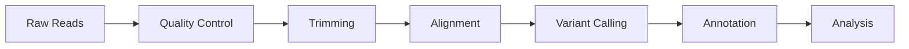
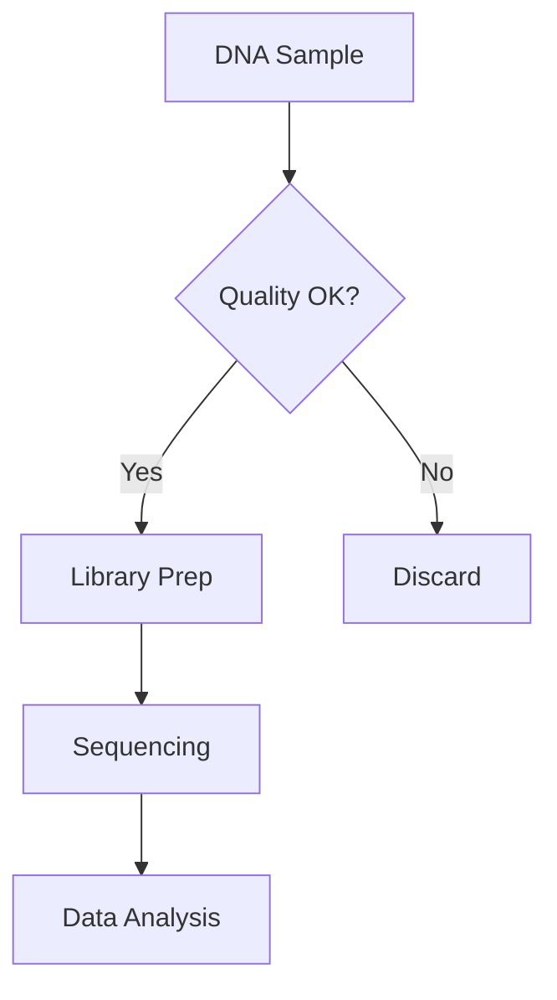
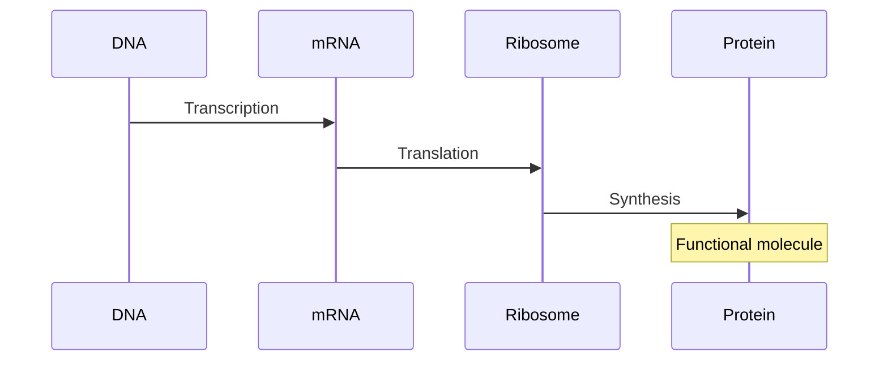
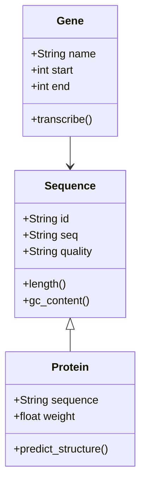
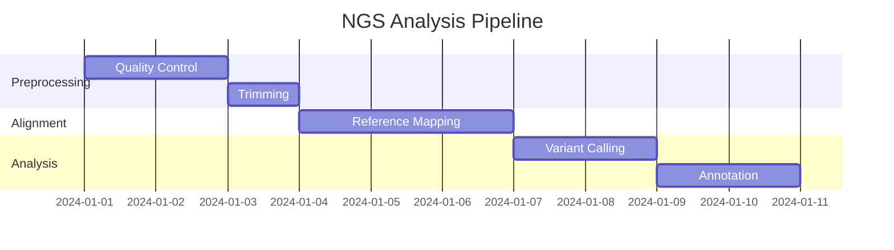
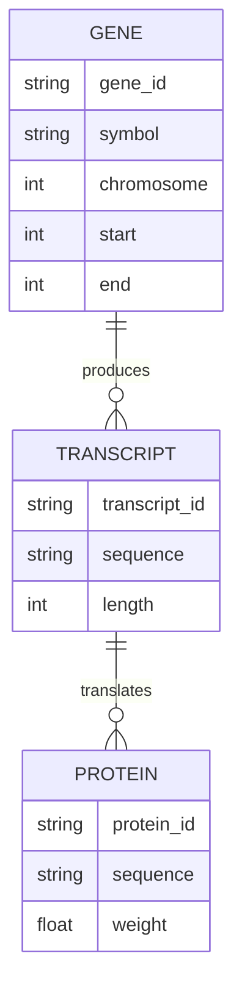
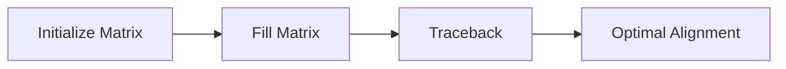

# Rich Content Guide for MkDocs Courses

This guide shows how to add rich, interactive content to your course modules.

---

## 🖼️ Images

### Local Images

Store images in `docs/images/` or alongside your course:

```markdown


```

**With caption (using img2fig or html):**

```html
<figure markdown>
  
  <figcaption>Figure 1: DNA double helix structure</figcaption>
</figure>
```

### External Images

```markdown

```

### Image with Lightbox (GLightbox - auto-enabled)

Any image automatically gets click-to-zoom functionality:

```markdown

```

Click the image to see it in full screen with zoom capability!

### Image Alignment

```markdown
<!-- Center image -->
<div align="center">
  
</div>

<!-- Image with specific size -->
{ width="200" }
```

---

## 🔗 Hyperlinks

### External Links

```markdown
Visit [NCBI](https://www.ncbi.nlm.nih.gov/) for genomic databases.

Learn more about [BLAST algorithms](https://blast.ncbi.nlm.nih.gov/Blast.cgi).
```

**With title attribute:**

```markdown
[UniProt](https://www.uniprot.org/ "Universal Protein Resource Database")
```

### Internal Course Links

```markdown
<!-- Link to another module -->
See [Module 2: Sequence Alignment](module-2.md) for details.

<!-- Link to specific section -->
Review [alignment algorithms](module-2.md#smith-waterman-algorithm).

<!-- Link to course index -->
Return to [Course Overview](index.md).
```

### Reference-Style Links

```markdown
Check out [NCBI][1] and [EBI][2] databases.

[1]: https://www.ncbi.nlm.nih.gov/
[2]: https://www.ebi.ac.uk/
```

### Auto-linking

URLs become clickable automatically:

```markdown
https://www.ncbi.nlm.nih.gov/
```

---

## 📊 Mermaid Diagrams

### Flowchart - Bioinformatics Workflow

````markdown

````

**Renders as:**


### Top-to-Bottom Flowchart

````markdown

````

### Sequence Diagram - Central Dogma

````markdown

````

**Renders as:**


### Class Diagram - Bioinformatics Objects

````markdown

````

### Timeline/Gantt Chart - Project Schedule

````markdown

````

### ER Diagram - Database Schema

````markdown

````

---

## 📈 Interactive Charts (Vega-Lite)

### Bar Chart - Gene Expression Levels

````markdown
```vegalite
{
  "$schema": "https://vega.github.io/schema/vega-lite/v5.json",
  "description": "Gene Expression Levels",
  "width": 400,
  "height": 300,
  "data": {
    "values": [
      {"gene": "BRCA1", "expression": 245},
      {"gene": "TP53", "expression": 189},
      {"gene": "EGFR", "expression": 312},
      {"gene": "MYC", "expression": 278},
      {"gene": "KRAS", "expression": 156}
    ]
  },
  "mark": "bar",
  "encoding": {
    "x": {"field": "gene", "type": "nominal", "title": "Gene"},
    "y": {"field": "expression", "type": "quantitative", "title": "Expression Level (FPKM)"},
    "color": {"value": "#0088cc"}
  }
}
```
````

### Line Chart - Sequencing Quality

````markdown
```vegalite
{
  "$schema": "https://vega.github.io/schema/vega-lite/v5.json",
  "description": "Quality Score Along Read",
  "width": 500,
  "height": 300,
  "data": {
    "values": [
      {"position": 1, "quality": 38},
      {"position": 10, "quality": 37},
      {"position": 20, "quality": 36},
      {"position": 30, "quality": 35},
      {"position": 40, "quality": 33},
      {"position": 50, "quality": 30}
    ]
  },
  "mark": {
    "type": "line",
    "point": true,
    "tooltip": true
  },
  "encoding": {
    "x": {"field": "position", "type": "quantitative", "title": "Base Position"},
    "y": {"field": "quality", "type": "quantitative", "title": "Phred Quality Score", "scale": {"domain": [0, 40]}}
  }
}
```
````

---

## 💡 Admonitions (Info Boxes)

### Basic Admonitions

```markdown
!!! note
    This is a note admonition with important information.

!!! tip
    Pro tip: Always check read quality before alignment!

!!! warning
    Deprecated: This method is outdated. Use STAR aligner instead.

!!! danger
    Critical: Never run this on production data without backup!
```

**Renders as:**

!!! note
    This is a note admonition with important information.

!!! tip
    Pro tip: Always check read quality before alignment!

### Collapsible Admonitions

```markdown
??? example "Click to expand example"
    Here's a detailed example that starts collapsed:

    ```bash
    fastqc sample_R1.fastq.gz
    ```

!!! example "Example: BLAST Search"
    Always expanded example with custom title
```

### Admonition Types

- `note` - Blue info box
- `abstract`, `summary`, `tldr` - Light blue
- `info`, `todo` - Cyan
- `tip`, `hint`, `important` - Green
- `success`, `check`, `done` - Green checkmark
- `question`, `help`, `faq` - Light green
- `warning`, `caution`, `attention` - Orange
- `failure`, `fail`, `missing` - Red
- `danger`, `error` - Red alert
- `bug` - Red bug icon
- `example` - Purple
- `quote`, `cite` - Gray quote

---

## 📝 Code Blocks

### Syntax Highlighted Code

````markdown
```python
# Calculate GC content
def gc_content(sequence):
    gc = sequence.count('G') + sequence.count('C')
    return (gc / len(sequence)) * 100

seq = "ATGCGATCGATCG"
print(f"GC%: {gc_content(seq):.2f}")
```
````

### With Line Numbers

````markdown
```python linenums="1"
def reverse_complement(seq):
    complement = {'A': 'T', 'T': 'A', 'G': 'C', 'C': 'G'}
    return ''.join(complement[base] for base in reversed(seq))
```
````

### Highlight Specific Lines

````markdown
```python hl_lines="2 3"
def transcribe(dna):
    # Replace T with U
    rna = dna.replace('T', 'U')
    return rna
```
````

### With Title

````markdown
```python title="sequence_tools.py"
def validate_sequence(seq):
    valid_bases = set('ATGC')
    return all(base in valid_bases for base in seq)
```
````

---

## 📊 Tables

### Basic Markdown Table

```markdown
| Codon | Amino Acid | Abbreviation |
|-------|------------|--------------|
| ATG   | Methionine | Met (M)      |
| TGG   | Tryptophan | Trp (W)      |
| TAA   | Stop       | *            |
| TAG   | Stop       | *            |
```

### Table from CSV (Table-Reader Plugin)

Create `docs/data/quality-metrics.csv`:

```csv
Sample,Reads,Q30,GC%
Sample1,25000000,92.5,48.2
Sample2,28000000,94.1,47.8
Sample3,22000000,90.3,49.1
```

Then in your markdown (remove spaces between braces):

```markdown
{ { read_csv('data/quality-metrics.csv') } }
```

**Live example:**

{{ read_csv('data/quality-metrics.csv') }}

---

## 🎯 Content Tabs

```markdown
=== "Python"
    ```python
    seq = "ATGC"
    print(len(seq))
    ```

=== "R"
    ```r
    seq <- "ATGC"
    print(nchar(seq))
    ```

=== "Bash"
    ```bash
    echo "ATGC" | wc -c
    ```
```

---

## 🔖 Task Lists

```markdown
- [x] Download raw FASTQ files
- [x] Run quality control (FastQC)
- [ ] Trim adapters
- [ ] Align to reference genome
- [ ] Call variants
- [ ] Annotate results
```

**Renders as:**

- [x] Download raw FASTQ files
- [x] Run quality control (FastQC)
- [ ] Trim adapters
- [ ] Align to reference genome
- [ ] Call variants
- [ ] Annotate results

---

## 🎨 Keyboard Keys

```markdown
Press ++ctrl+alt+delete++ to restart.

Use ++cmd+c++ to copy and ++cmd+v++ to paste.
```

---

## 📐 Math Equations (LaTeX)

### Inline Math

```markdown
The GC content is calculated as $\frac{G + C}{A + T + G + C} \times 100$
```

### Block Math

```markdown
$$
E = -\sum_{i=1}^{n} p_i \log_2(p_i)
$$
```

**Entropy formula for sequence complexity:**

$$
H = -\sum_{i=1}^{4} p_i \log_2(p_i)
$$

---

## 🎬 Embedded Videos

### YouTube

```markdown
<iframe width="560" height="315"
  src="https://www.youtube.com/embed/VIDEO_ID"
  frameborder="0" allowfullscreen>
</iframe>
```

---

## 🔗 Combining Elements

### Example: Complete Module Section

```markdown
## Smith-Waterman Algorithm

The Smith-Waterman algorithm is used for local sequence alignment.

!!! info "Algorithm Complexity"
    Time: O(mn), Space: O(mn) where m, n are sequence lengths

### Workflow



### Implementation

```python title="smith_waterman.py" linenums="1"
def smith_waterman(seq1, seq2, match=2, mismatch=-1, gap=-1):
    # Initialize scoring matrix
    rows = len(seq1) + 1
    cols = len(seq2) + 1
    matrix = [[0] * cols for _ in range(rows)]

    # Fill matrix (simplified)
    for i in range(1, rows):
        for j in range(1, cols):
            # Calculate scores...
            pass

    return matrix
```

### Further Reading

- [Original Paper](https://doi.org/10.1016/0022-2836(81)90087-5)
- [NCBI BLAST](https://blast.ncbi.nlm.nih.gov/)
- See [Module 3](module-3.md) for practical examples
```

---

## 🎨 Best Practices

1. **Images**: Use descriptive alt text for accessibility
2. **Links**: Make link text descriptive (not "click here")
3. **Diagrams**: Mermaid for workflows, Vega for data visualization
4. **Code**: Always specify language for syntax highlighting
5. **Admonitions**: Use sparingly for important callouts
6. **Tables**: CSV reader for large datasets, Markdown for small tables

---

## 📚 Resources

- [Material for MkDocs](https://squidfunk.github.io/mkdocs-material/)
- [Mermaid Documentation](https://mermaid.js.org/)
- [Vega-Lite Examples](https://vega.github.io/vega-lite/examples/)
- [Python Markdown Extensions](https://facelessuser.github.io/pymdown-extensions/)
